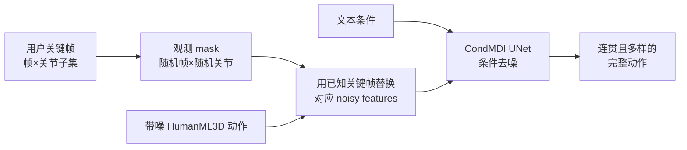
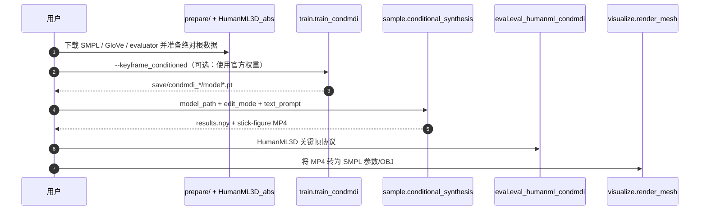

# Flexible Motion In-betweening with Diffusion Models（CondMDI）

**CondMDI**（*Flexible Motion In-betweening with Diffusion Models*，SIGGRAPH 2024，[arXiv:2405.11126](https://arxiv.org/abs/2405.11126)）由英属哥伦比亚大学、特拉维夫大学、西蒙菲莎大学与英伟达提出：把关键帧位置和值直接写入带噪动作，并显式拼接观测 mask，以一个模型完成文本条件下的稀疏、密集和部分关节动作补全。

## 一句话定义

**训练时随机遮住帧与关节、推理时把任意关键帧“钉”回去，让扩散模型在硬空间约束之间生成连贯且多样的过渡动作。**

## 英文缩写速查

| 缩写 | 英文全称 | 简要说明 |
|------|----------|----------|
| CondMDI | Conditional Motion Diffusion In-betweening | 本文统一关键帧补全模型 |
| MDI | Motion Diffusion In-betweening | 用扩散模型生成关键帧之间动作 |
| FID | Fréchet Inception Distance | 衡量生成动作分布与真实动作分布距离 |
| RecG | Reconstruction Guidance | 推理时按重建误差引导关键帧一致性 |
| VR | Virtual Reality | 头部与双手腕部分关键帧控制场景 |
| SMPL | Skinned Multi-Person Linear Model | 仓库可导出的参数化人体网格表示 |

## 为什么重要

- **约束布局不再固定：** 同一 checkpoint 可接任意数量、任意时刻、任意关节子集的关键帧。
- **把多解保留下来：** 给定相同关键帧仍能采样不同但连贯的中间动作，适合动画候选和参考动作数据增广。
- **给推理期控制一个基线：** 论文系统比较纯插补、插补 + RecG 与条件训练，说明“最终帧对得上”不等于过渡自然。
- **机器人侧是上游编辑器：** 输出仍是 HumanML3D 人体运动学轨迹；进入真机前需经过重定向与跟踪可行性验证。

## 核心信息

| 项 | 内容 |
|----|------|
| **机构** | 英属哥伦比亚大学（UBC）；特拉维夫大学（Tel Aviv University）；西蒙菲莎大学（SFU）；英伟达（NVIDIA） |
| **发表** | ACM SIGGRAPH 2024 |
| **数据/表示** | HumanML3D；沿用 GMD 的绝对根位置表示 |
| **条件** | 文本；任意帧关键姿态；root 轨迹；head + 双 wrist 等部分关节 |
| **骨干** | 1D UNet + AdaGN；1000 个扩散步；训练 1M iterations |
| **开源** | **已开源**（核查日 2026-07-28）：[官方仓库](https://github.com/setarehc/diffusion-motion-inbetweening)，MIT；含训练/推理/评测与 3 组权重 |

## 流程总览

## 核心机制（方法栈）

### 1）掩码条件训练

训练样本先随机抽取关键帧数量与位置，再随机抽取被观察关节；mask 同时编码“哪一帧、哪些 feature 已知”。这样推理时改变关键帧密度或只约束手腕，不需要重新训练专用模型。

### 2）条件写入

在每个去噪步，模型输入中的已观察位置由关键帧值替换，随后与 mask 拼接。相比只在损失中加权，这一做法让网络从训练期就学习“已知局部如何影响未知上下文”。

### 3）文本与空间联合

文本约束动作语义，关键帧约束时空几何；两者发生冲突时，模型只能在训练分布内折中，不能保证动力学可行或严格接触。

### 4）推理期替代方案

- **纯插补：** 每步覆盖已知值，关键帧误差极小，但相邻帧可能跳变。
- **插补 + RecG：** 用重建梯度改善衔接，但对 guidance weight 敏感。
- **CondMDI：** 条件在训练期进入网络，整体质量与局部一致性更均衡。

## 工程实践

| 项 | 内容 |
|----|------|
| **开源状态** | **已开源**（截至 **2026-07-28**）：见 [CondMDI 项目页](../../sources/sites/condmdi-project.md) 与 [仓归档](../../sources/repos/condmdi.md)（MIT） |
| **复现入口** | 准备 HumanML3D + 官方 checkpoint → `sample.conditional_synthesis`；训练 / 评测见时序图 |
| **选型提示** | 任意关键帧布局优先 CondMDI；若更看重单点约束精度可对照 OmniControl |
| **源码运行时序图** | 见下一节 |

## 源码运行时序图

最短复现路径是准备 HumanML3D 与官方 checkpoint 后运行 `sample.conditional_synthesis`；训练和评测分别走 `train.train_condmdi` 与 `eval.eval_humanml_condmdi`。

## 与其他工作对比

| 方法 | 控制注入 | 支持范围 | 主要取舍 |
|------|----------|----------|----------|
| [GMD](./paper-notebook-guided-motion-diffusion-for-controllable-human-m.md) | 推理时目标函数 + dense guidance | root 轨迹/关键点/避障 | 无需为每种目标重训，但两阶段且采样慢 |
| [OmniControl](./paper-notebook-omnicontrol-control-any-joint-at-any-time-for-hu.md) | analytic spatial + realism guidance | 任意关节/时刻 | 控制误差更低；迭代 guidance 代价高 |
| **CondMDI** | 训练时随机 mask 条件 | 任意帧与部分关节 | 简洁、推理较快；需条件训练 |
| [PhysDiff](./paper-notebook-physdiff-physics-guided-human-motion-diffusion-m.md) | 仿真物理投影 | 物理可行性而非关键帧 | 解决动力学伪影，不解决导演式约束 |

## 实验与评测

- **无关键帧参考：** HumanML3D 文本生成 FID **0.2538**、Top-3 R-Precision **0.6450**。
- **随机关键帧：** 从 1→5→20 个关键帧，平均关键帧误差 **0.3739→0.1789→0.0754**；约束更密时 FID 从 **0.1551→0.2253**，显示精确度与生成自由度存在取舍。
- **部分关节：** root trajectory / VR joints 的关键帧误差分别 **0.0525 / 0.0422**。
- **root 控制对照：** CondMDI FID **0.2474** 优于 OmniControl-on-all 的 **0.322**，但关键帧误差 **0.0525** 高于 OmniControl 的 **0.0367**；选型要明确更看重整体分布质量还是约束精度。
- **插补消融：** 每步强制覆盖虽把误差压到 **0.0034**，FID 却恶化到 **8.6204**，是“只看约束误差会误判”的直接证据。

## 结论

**CondMDI 的关键贡献不是新采样器，而是用随机帧×随机关节 mask 把灵活关键帧控制变成训练分布内条件。**

1. **需要任意关键帧布局时优先条件训练** — 比纯插补/重建引导更稳健。
2. **关键帧越密并非越好** — 误差下降但 FID 可能上升，应按编辑自由度选密度。
3. **部分关节 mask 是实用接口** — root、头和双手腕轨迹可直接表达导演式目标。
4. **人体运动学不等于机器人可执行** — 接 [PhyGile](./paper-phygile.md) 式 robot-native 生成，或重定向 + tracker 验证后再用于人形。
5. **复现资产完整** — 代码、权重、训练和评测入口均已公开，但依赖旧版 Python/CUDA 与受许可约束的人体资产。

## 局限与风险

- 论文仍报告轻微 foot skate；没有显式接触、扭矩、平衡或碰撞约束。
- 最长文本到动作窗口约 9.8 秒，长时域编辑需分段与边界处理。
- 评测集中在 HumanML3D；未给人形机器人重定向、跟踪成功率或真机结果。
- mask 能表达已知关节位置，但不能自动从场景/语言推断应放置哪些关键帧。
- SMPL、SMPL-X、HumanML3D 等依赖各自许可，MIT 代码许可不覆盖全部数据与人体模型资产。

## 与其他页面的关系

- 总方法：[Diffusion-based Motion Generation](../methods/diffusion-motion-generation.md)
- 后续可控谱系：[GMD](./paper-notebook-guided-motion-diffusion-for-controllable-human-m.md)、[OmniControl](./paper-notebook-omnicontrol-control-any-joint-at-any-time-for-hu.md)
- 物理化：[PhysDiff](./paper-notebook-physdiff-physics-guided-human-motion-diffusion-m.md)、[PhyGile](./paper-phygile.md)
- 生成式控制对照：[GPC](./paper-gpc-generative-pretrained-controllers.md)
- 数据集：[HumanML3D](./dataset-bfm-humanml3d.md)
- 学习路线：[动作生成纵深](../../roadmap/depth-motion-generation.md)

## 参考来源

- [Paper Notebooks 来源归档](../../sources/papers/humanoid_pnb_flexible-motion-in-betweening-with-diffusion-mod.md)
- [CondMDI 项目页归档](../../sources/sites/condmdi-project.md)
- [CondMDI 官方仓库归档](../../sources/repos/condmdi.md)
- 论文：<https://arxiv.org/abs/2405.11126>

## 推荐继续阅读

- [官方项目页](https://setarehc.github.io/CondMDI/)
- [机器人论文阅读笔记](https://imchong.github.io/Robot_Learning_Paper_Notebooks/papers/14_Human_Motion/Flexible_Motion_In-betweening_with_Diffusion_Models/Flexible_Motion_In-betweening_with_Diffusion_Models.html)
