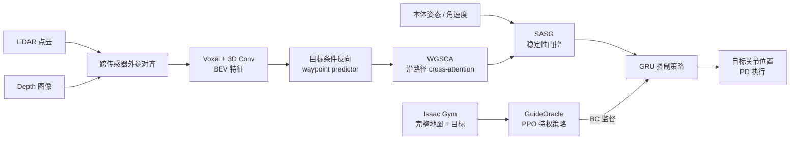

# FocusNav：路径意图与稳定性感知的人形局部导航

**FocusNav**（*Spatial Selective Attention with Waypoint Guidance for Humanoid Local Navigation*，[arXiv:2601.12790](https://arxiv.org/abs/2601.12790)）由上海交通大学与上海创智学院提出：在 Unitree G1 上把多模态几何感知、无碰撞路径点和关节策略端到端连接，并根据实时稳定性切换“看远路”或“看脚下”。

## 一句话定义

**FocusNav 用 WGSCA 让注意力沿预测 waypoint 看远，用 SASG 在机身失稳时切断远端干扰、只保留近端落脚信息，从而统一动态避障与复杂地形稳定行走。**

## 英文缩写速查

| 缩写 | 英文全称 | 简要说明 |
|------|----------|----------|
| WGSCA | Waypoint-Guided Spatial Cross-Attention | 以路径点 token 查询 BEV，抽取沿轨迹环境特征 |
| SASG | Stability-Aware Selective Gating | 根据本体稳定度开关远端 waypoint 特征 |
| BEV | Bird's-Eye View | LiDAR 与深度点云融合后的俯视几何表示 |
| PPO | Proximal Policy Optimization | 训练特权 GuideOracle 的强化学习算法 |
| BC | Behavior Cloning | FocusNav 模仿 GuideOracle 关节动作的主要损失 |
| FOV | Field of View | LiDAR 与深度相机互补覆盖的感知视场 |

## 为什么重要

- **导航与稳定不是两个独立目标：** 人形在楼梯、坡面和移动障碍中，激进避障可能直接导致跌倒；FocusNav 把稳定性变成感知范围的控制信号。
- **减少无关环境干扰：** waypoint 让高维 BEV 不再全局平均，而是只提取计划路径附近的可通行性与障碍。
- **动作直接到关节目标：** 不以固定 `cmd_vel` 跟踪作为唯一接口，策略可以为避障和落脚主动改变步态。
- **给 [导航纵深](../../roadmap/depth-navigation.md) Stage 3 提供一条“导航–locomotion 联训”分支，与中层轨迹生成法形成互补。**

## 核心信息

| 字段 | 内容 |
|------|------|
| 机构 | 上海交通大学（Shanghai Jiao Tong University）；上海创智学院（Shanghai Innovation Institute） |
| 平台 | Unitree G1（29 DoF）；Livox MID-360 LiDAR；RealSense D435i |
| 训练 | Isaac Gym；4× RTX 4090；GuideOracle 用 PPO，视觉策略用 BC + 辅助损失 |
| 部署定位 | Fast-LIO 相对定位 |
| 输出 | 电机目标关节位置，经 PD 控制转换为力矩 |
| 项目页 / 代码 | **未开源**（截至 2026-07-28；论文与 arXiv 页面未给官方项目页、仓库、权重或数据入口） |

## 流程总览

## 核心机制（方法栈）

### 1. GuideOracle 特权教师

教师直接读取仿真 elevation / traversability map、目标与完整本体状态，用 PPO 学局部目标跟踪。训练地形包含楼梯、坡面、缝隙、密集柱体和随机移动机器人；目标若落在不可通行区，会沿机器人–目标连线投影到最近可达位置。

### 2. LiDAR–深度融合 BEV

MID-360 看得远但脚下有盲区，D435i 覆盖近端地形。两者经外参统一到世界坐标、体素化、VoxelNet 式编码、3D 卷积和 z 轴 max-pooling，形成空间对齐 BEV；辅助 traversability prediction 约束表示保持可通行信息。

### 3. 反向 waypoint 预测

自回归解码器从目标向机器人当前位置 **反向** 生成路径点。目标作为强锚点，减少正向滚动累积误差；路径点 latent 随后直接作为 WGSCA query，而非仅作为独立规划输出。

### 4. WGSCA 与空间位置编码

waypoint token 查询 BEV patch，二者都投影到同一坐标系并加正弦位置编码。近端 query 关注落脚区域，远端 query 关注计划路径上的障碍，过滤路径外背景。

### 5. SASG 稳定性门控

由 base roll/pitch、角速度等构造 \(S\in[0,1]\)，MLP + Gumbel-Softmax 输出二值 gate。稳定时汇总整条轨迹特征；失稳时仅保留第一个近端 embedding。GRU 维持历史记忆，缓解临时“只看脚下”造成的全局意图丢失。

## 与其他工作对比

| 方法 | 感知–控制接口 | 多模态路线 | 稳定性处理 | 目标层级 |
|------|---------------|------------|------------|----------|
| Gallant | BEV 直接拼本体状态 | 无显式 waypoint attention | 策略隐式学习 | 局部坐标目标 |
| PGCA | 本体状态 query BEV | 无 | 本体 query 间接调制 | 局部坐标目标 |
| [EgoNav](./paper-notebook-egonav.md) | 多条 6-DoF 轨迹→独立 locomotion | 扩散多模态 | 下游控制器负责 | 目前 goal-free |
| **FocusNav** | **BEV→waypoint→关节动作** | 单条反向 waypoint 链 | **SASG 显式缩短感知范围** | 预定义局部目标 |

## 工程实践与开源状态

| 项 | 实施要点 |
|----|----------|
| 传感器标定 | LiDAR / depth 必须精确外参对齐；否则 waypoint 与 BEV attention 的空间位置编码失真 |
| 训练顺序 | 先训可稳定到达目标的 GuideOracle，再以 BC + traversability / waypoint / gating 辅助损失联训视觉策略 |
| 关键监控 | SR、traverse rate、collision frequency、稳定度需并列；只降碰撞可能掩盖“停着不走” |
| 调参取舍 | SASG 提升完成率但可能临时忽略远端动态障碍；最难场景中 collision 略高于 WGSCA-only |
| 开源 | **未开源**；无官方项目页与代码，因此目前只能依据论文复刻架构，不能核对训练配置或模型权重 |

## 源码运行时序图

**不适用**：截至 **2026-07-28** 未找到官方可运行实现、README 或 checkpoint；论文只描述 Isaac Gym / PPO / BC 与真机硬件，无法绘制可验证的仓库运行入口。

## 实验与评测

- **仿真协议：** flat / unstructured × static / dynamic 四类；每个配置 3 seeds、每 seed 100 episodes。
- **最难动态非结构化：** FocusNav SR **87.02±1.15%**、traverse **89.17±2.99%**、collision frequency **4.56±0.21%**、stability **0.76±0.04**；Gallant SR 50.32%，PGCA 63.67%，WGSCA-only 74.15%。
- **静态非结构化：** FocusNav SR **91.15%**，高于 WGSCA-only 82.23%，说明门控主要在崎岖地形带来完成率收益。
- **真机：** 6 类组合环境，每类 15 trials；覆盖 16 cm 台阶、22° 坡面、静态箱体与动态行人。论文图报告 FocusNav 各场景领先，但未给图中每根柱的可机读精确数值。

## 结论

**FocusNav 说明人形局部导航的关键不是无限扩大感知，而是让感知范围随路径意图与稳定性动态收缩；代价是系统依赖特权教师、精确几何传感和未公开实现。**

1. **waypoint 不只用于规划** — 其 latent 可作为 attention query，让感知直接服务当前路径。
2. **稳定性应控制“看多远”** — 失稳时主动忽略远端目标，比继续激进避障更能避免跌倒。
3. **SASG 存在明确取舍** — 最难场景完成率提高，但 collision frequency 略高于 WGSCA-only。
4. **真机指标要同时看跌倒与碰撞** — 单一 SR 无法判断失败来自感知、路径还是步态。
5. **复现门槛目前较高** — 没有代码、权重和精确真机计数表。

## 局限与风险

- 主要关注前向区域，后退、侧移与身后障碍的全向感知不足。
- 需要预定义局部目标，不具备自然语言理解或长链语义规划；不能替代 [VLN](../tasks/vision-language-navigation.md) 层。
- 特权 GuideOracle 的 teacher–student 偏差可能把仿真地图和动力学假设带入学生。
- Gumbel 二值门控会突然丢弃远端动态障碍信息；真实密集人群中的安全边界需额外验证。
- 论文没有公开代码，真机结果主要是受控 arena，不等价于长时间开放世界自主导航。

## 与其他页面的关系

- [导航纵深路线 Stage 3](../../roadmap/depth-navigation.md) — 学习型人形局部导航节点
- [分层四足导航栈](../concepts/hierarchical-quadruped-navigation-stack.md) — FocusNav 将传统局部规划与低层执行进一步耦合
- [Locomotion](../tasks/locomotion.md) — SASG 直接处理人形稳定性与落脚风险
- [NavDP](./paper-notebook-navdp-learning-sim-to-real-navigation-diffusion.md) — 生成多条轨迹再 critic 选路，保持 locomotion 解耦
- [EgoNav](./paper-notebook-egonav.md) — 人类数据导航先验，不直接学习关节动作

## 参考来源

- [Paper Notebooks 原始归档](../../sources/papers/humanoid_pnb_focusnav.md)
- 论文：<https://arxiv.org/abs/2601.12790>

## 推荐继续阅读

- [FocusNav 深读笔记](https://imchong.github.io/Robot_Learning_Paper_Notebooks/papers/08_Navigation/FocusNav__Spatial_Selective_Attention_with_Waypoint_Guidance_for_Humanoid_Local/FocusNav__Spatial_Selective_Attention_with_Waypoint_Guidance_for_Humanoid_Local.html)
- [Fast-LIO](./fast-lio.md) — 真机相对定位依赖
