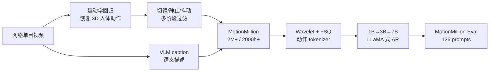
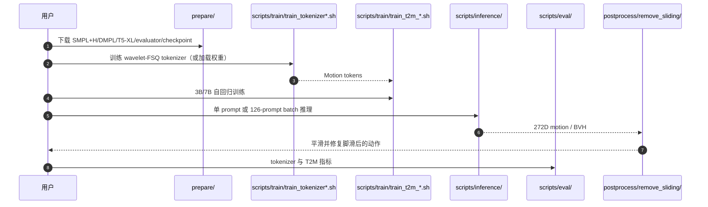

# Go to Zero：MotionMillion 与零样本动作生成

**Go to Zero**（*Towards Zero-shot Motion Generation with Million-scale Data*，ICCV 2025 Highlight，[arXiv:2507.07095](https://arxiv.org/abs/2507.07095)）把文本到动作的瓶颈从“小数据集上换模型”转向“网络视频自动标注 + 百万级语料 + 十亿级自回归模型 + 独立零样本评测”。

## 一句话定义

**先把网络视频编译成 200 万条文本–动作训练对，再用 FSQ 离散动作 token 和 7B LLaMA 式模型做下一 token 生成，以数据与参数 scaling 换取未见组合动作泛化。**

## 英文缩写速查

| 缩写 | 英文全称 | 简要说明 |
|------|----------|----------|
| T2M | Text-to-Motion | 从自然语言生成三维人体动作 |
| FSQ | Finite Scalar Quantization | 把连续动作编码为有限离散 token |
| VLM | Vision-Language Model | 为视频恢复的动作生成语义 caption |
| MPJPE | Mean Per-Joint Position Error | 衡量 tokenizer 动作重建误差 |
| FID | Fréchet Inception Distance | 衡量生成与真实动作分布距离 |
| OOD | Out-of-Distribution | 训练分布外文本或动作组合 |

## 为什么重要

- **数据规模跨一个量级：** MotionMillion 报告 **2000+ 小时、200 万序列**，对照 HumanML3D 的 28.6 小时/14616 clips。
- **零样本有独立考题：** MotionMillion-Eval 用 126 条工业风格复杂 prompt 做人工评测，不再把训练集同分布 retrieval 指标当泛化。
- **验证 scaling 的边界：** 1B→3B 显著改善 FID，3B→7B 的自动指标趋于饱和，但人工文本对齐继续增长。
- **机器人侧提供动作先验，不提供执行器：** 272D 人体动作仍需重定向、接触修正和跟踪验证。

## 核心信息

| 项 | 内容 |
|----|------|
| **机构** | 上海交通大学；香港中文大学（深圳）；复旦大学；香港科技大学；浙江大学；香港大学；上海人工智能实验室；华东师范大学 |
| **发表** | ICCV 2025 Highlight |
| **数据** | MotionMillion：200 万+ 序列、2000+ 小时、30 FPS、每段 >1 s、20+ 文本多样性标注 |
| **评测** | MotionMillion-Eval：126 条 OOD/组合 prompt；文本对齐、物理可信、动作平滑三维人工评分 |
| **模型** | wavelet + FSQ tokenizer；LLaMA 式自回归 Transformer，1B/3B/7B |
| **开源** | **已开源**（核查日 2026-07-28）：Apache-2.0 代码、3B/7B 权重、训练/推理/评测；数据集在 Hugging Face 发布 |

## 流程总览

## 核心机制（方法栈）

### 1）网络视频自动标注

对单目视频做人体检测/跟踪和运动学回归，恢复统一人体动作；再由 VLM 生成细粒度 caption。切镜、静止段、姿态抖动和低质量样本经过多阶段过滤，最终输出 30 FPS、至少 1 秒的文本–动作对。

### 2）272D 动作表示与 wavelet-FSQ

表示包含 root 平移/旋转速度、局部关节位置、速度和 6D rotation。连续序列先做 wavelet transform，再由 FSQ 离散；逆 wavelet 用于解码。该设计针对离散化引起的高频 jitter。

### 3）自回归 scaling

冻结/训练动作 tokenizer 后，把文本条件与 motion tokens 输入 LLaMA 式 Transformer，按 next-token prediction 生成序列。模型从 1B 扩到 7B；这条路线不是 MDM 式逐步扩散。

### 4）零样本评测

MotionMillion-Eval 覆盖长描述、复合动作、职业/艺术/战斗/体育/非人风格等未见指令，以人工比较弥补 FID/R-Precision 对复杂语义不敏感的问题。

## 工程实践

| 项 | 内容 |
|----|------|
| **开源状态** | **已开源**（截至 **2026-07-28**）：见 [MotionMillion 项目页](../../sources/sites/motionmillion-project.md) 与 [仓归档](../../sources/repos/motionmillion-codes.md)（Apache-2.0；含数据/权重） |
| **复现入口** | `prepare/` 下载资产 → 训 tokenizer / T2M 或加载权重 → `scripts/inference/`；零样本对照用 MotionMillion-Eval |
| **选型提示** | 复杂零样本语义优先本路线；短窗可控编辑仍看 CondMDI / OmniControl / GMD |
| **源码运行时序图** | 见下一节 |

## 源码运行时序图

快速验证可直接下载 3B/7B 权重后运行 `scripts/inference/single_inference/`；完整训练需要大显存多卡资源与独立人体模型资产。

## 与其他工作对比

| 路线 | 表示/生成 | 规模重点 | 物理执行 |
|------|-----------|----------|----------|
| **Go to Zero** | FSQ token + 自回归 Transformer | 2M clips + 7B | 无；人体运动学 + 后处理 |
| [GPC](./paper-gpc-generative-pretrained-controllers.md) | RL 学 FSQ 技能 + GPT 式控制 token | 600h+ 物理仿真动作 | 仿真角色闭环控制 |
| [Diffusion Motion Generation](../methods/diffusion-motion-generation.md) | 连续轨迹多步去噪/流匹配 | 条件控制与多模态 | 视 tracker/闭环而定 |
| [PhyGile](./paper-phygile.md) | robot-native 262D 扩散 | 文本→敏捷机器人动作 | GMT 仿真验证 + 真机 |

Go to Zero 与 GPC 都验证“动作 token + GPT scaling”，但前者是文本条件人体运动学生成，后者是物理角色控制器预训练；不能用同一套真机可执行性标准比较。

## 实验与评测

- **数据规模：** MotionMillion **2M / >2000 h**；Motion-X 81,084 / 144.2 h，HumanML3D 14,616 / 28.6 h。
- **tokenizer：** MotionMillion 上 MPJPE **45.5 mm**，对照 ScaMo FSQ **88.9 mm**；wavelet 把平均/最大 acceleration 从 **6.0/15.0** 降至 **4.0/12.0**（GT 2.0/9.0）。
- **模型 scaling：** 1B/3B/7B 的 FID 为 **31.3/10.8/10.3**，R@1 为 **0.74/0.79/0.79**；3B→7B 的自动指标增益很小。
- **人工评测：** 文本对齐得分随 1B→3B→7B 从 **170.3→238.6→261**；物理可信与平滑度几乎饱和，说明增加参数主要改善复杂语义跟随，不自动解决动力学。
- **评测解读：** 论文的“zero-shot”由未见 prompt 人评支持，不是机器人任务零样本部署，也不是严格证明训练视频中不存在语义近邻。

## 结论

**Go to Zero 最可信的结论是“数据规模先解锁语义组合泛化”，而不是“7B 参数自动带来物理可执行动作”。**

1. **先看 1B→3B** — FID 大幅下降；3B→7B 自动指标已接近平台期。
2. **复杂文本要看人工评测** — 7B 的主要收益体现在文本对齐，而非平滑/物理分数。
3. **数据引擎比单模型更可复用** — 视频回归、VLM caption、过滤与 MotionMillion-Eval 可服务其他生成骨干。
4. **人体动作进入机器人仍有鸿沟** — 需要重定向、接触/脚滑修正和 tracker；[PhyGile](./paper-phygile.md) 是 robot-native 对照。
5. **开放资产较完整但复现昂贵** — 代码、权重和数据已放出，7B 训练与人体资产准备仍是主要门槛。

## 局限与风险

- 网络视频的版权、人物隐私、caption 偏差与动作长尾覆盖需要按数据卡/许可逐项核查；Apache-2.0 仅覆盖代码。
- 运动学回归会把遮挡、相机运动和多人交互误差写入训练数据；多阶段过滤不能完全消除系统偏差。
- MotionMillion-Eval 只有 126 prompts 且依赖人工评分；统计覆盖仍有限。
- 论文模型生成人体 272D 表示，不输出机器人扭矩、接触力、平衡状态或碰撞保证。
- README 的依赖与大模型路径需要手工配置；完整 7B 训练不属于消费级单卡复现。

## 与其他页面的关系

- 离散生成式控制对照：[GPC](./paper-gpc-generative-pretrained-controllers.md)
- 连续生成总览：[Diffusion-based Motion Generation](../methods/diffusion-motion-generation.md)
- robot-native 物理化：[PhyGile](./paper-phygile.md)
- 数据前身：[HumanML3D](./dataset-bfm-humanml3d.md)、[Motion-X](./dataset-bfm-motion-x.md)
- 学习路线：[动作生成纵深](../../roadmap/depth-motion-generation.md)
- 分类父节点：[Human Motion 论文分类](../overview/paper-notebook-category-14-human-motion.md)

## 参考来源

- [Paper Notebooks 来源归档](../../sources/papers/humanoid_pnb_go-to-zero.md)
- [MotionMillion 项目页归档](../../sources/sites/motionmillion-project.md)
- [MotionMillion-Codes 仓库归档](../../sources/repos/motionmillion-codes.md)
- 论文：<https://arxiv.org/abs/2507.07095>

## 推荐继续阅读

- [官方项目页](https://vankouf.github.io/MotionMillion/)
- [MotionMillion 数据集](https://huggingface.co/datasets/InternRobotics/MotionMillion)
- [机器人论文阅读笔记](https://imchong.github.io/Humanoid_Robot_Learning_Paper_Notebooks/papers/14_Human_Motion/Go_to_Zero__Towards_Zero-shot_Motion_Generation_with_Million-scale_Data/Go_to_Zero__Towards_Zero-shot_Motion_Generation_with_Million-scale_Data.html)
