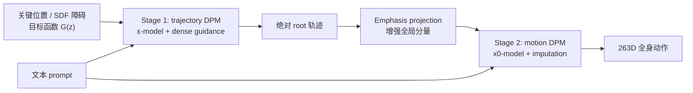
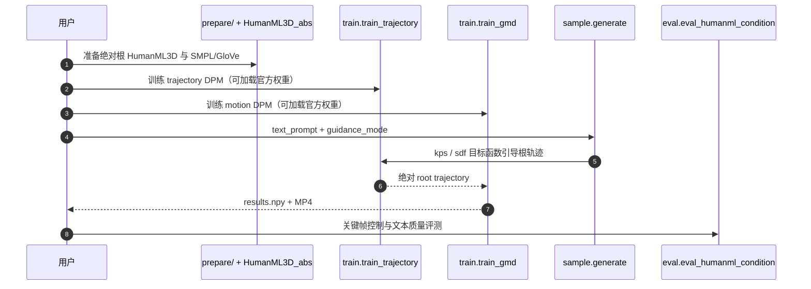

# GMD：Guided Motion Diffusion

**GMD**（*Guided Motion Diffusion for Controllable Human Motion Synthesis*，ICCV 2023，[arXiv:2305.12577](https://arxiv.org/abs/2305.12577)）由苏黎世联邦理工与 VISTEC 提出：先把稀疏空间目标变成根轨迹，再用强调全局信息的动作扩散模型合成局部姿态，从而同时接入文本、轨迹、关键位置与避障目标。

## 一句话定义

**用 emphasis projection 解决“263 维动作里全局位置只占极少数值”，再借 denoiser 的梯度传播把稀疏关键点变成时间上稠密的引导信号。**

## 英文缩写速查

| 缩写 | 英文全称 | 简要说明 |
|------|----------|----------|
| GMD | Guided Motion Diffusion | 本文空间可控人体动作扩散框架 |
| DPM | Diffusion Probabilistic Model | 轨迹与动作两阶段生成模型 |
| AdaGN | Adaptive Group Normalization | GMD UNet 的条件归一化层 |
| SDF | Signed Distance Field | 仓库避障目标的距离函数表示 |
| FID | Fréchet Inception Distance | 衡量生成动作分布质量 |
| DDPM | Denoising Diffusion Probabilistic Model | 训练与采样使用的 1000 步扩散形式 |

## 为什么重要

- **把动作放回世界坐标：** 文本描述“怎么动”，GMD 的轨迹/关键点/障碍目标描述“在哪里动”。
- **解释稀疏控制为什么失效：** 一帧 263 维中全局信息仅约 4 维，少数关键帧的梯度又容易在反向去噪中被当噪声抹掉。
- **目标函数可扩展：** 避障等条件可在推理时通过 classifier-style guidance 接入，不必为每种空间任务重训动作模型。
- **奠定后续谱系：** OmniControl 扩到任意关节，CondMDI 改为训练期 mask 条件；两者都直接回应 GMD 的限制。

## 核心信息

| 项 | 内容 |
|----|------|
| **机构** | 苏黎世联邦理工（ETH Zürich）；泰国维迪亚西里梅迪理工学院（VISTEC） |
| **发表** | ICCV 2023 |
| **数据** | HumanML3D：14,646 motions / 44,970 annotations |
| **表示** | 263D HumanML3D，根位置由相对坐标改为绝对坐标 |
| **模型** | trajectory DPM（ε-prediction）+ motion DPM（x0-prediction），UNet + AdaGN |
| **控制** | 文本；完整 root 轨迹；稀疏地面关键位置；SDF 圆形障碍 |
| **开源** | **已开源**（核查日 2026-07-28）：官方仓库含训练/推理/评测和轨迹/动作权重，`LICENSE` 为 MIT |

## 流程总览

## 核心机制（方法栈）

### 1）Emphasis projection

HumanML3D 每帧全局 root 只占少量维度，网络更容易为局部姿态牺牲轨迹。GMD 先将 trajectory 分量乘系数 \(c\)，再通过固定随机矩阵投影并重新归一化到单位方差，使全局/局部信息在网络表示中更均衡；这比简单放大 trajectory loss 更稳定。

### 2）投影空间插补

标准 inpainting 在原表示中替换根轨迹，无法直接与投影后的动作向量对齐。GMD 推导投影空间的 mask 与插补形式，使已知 trajectory 能在每个反向步写入 motion DPM。

### 3）Dense signal propagation

关键位置只落在少数帧时，直接梯度很稀疏。GMD 对 denoiser 预测的 clean trajectory 求目标函数梯度，再反传到 noisy input；由于 denoiser 使用时间上下文，单点目标自然传播到相邻帧。

### 4）两阶段与预测目标

Stage 1 的 ε-model 在低噪声末期更不容易压过 guidance；Stage 2 的 x0-model 更适合高质量动作重建。先求可控轨迹再生全身，降低单模型同时满足全局/局部的冲突。

## 工程实践

| 项 | 内容 |
|----|------|
| **开源状态** | **已开源**（截至 **2026-07-28**）：见 [GMD 项目页](../../sources/sites/gmd-project.md) 与 [仓归档](../../sources/repos/guided-motion-diffusion.md)（MIT） |
| **复现入口** | 准备绝对根 HumanML3D → 训/加载 trajectory + motion DPM → `sample.generate`；条件评测走 `eval.eval_humanml_condition` |
| **选型提示** | root 轨迹 / 避障等可微目标优先 GMD；任意关节关键帧看 OmniControl / CondMDI |
| **源码运行时序图** | 见下一节 |

## 源码运行时序图

仓库入口 `sample.generate` 通过 `--guidance_mode kps|sdf|trajectory` 切换任务；预定义关键点与障碍位于 `sample/keyframe_pattern.py`。

## 与其他工作对比

| 方法 | 主要控制对象 | 约束机制 | 是否需条件训练 |
|------|--------------|----------|----------------|
| **GMD** | root 地面轨迹/关键点/障碍 | 目标函数梯度 + dense propagation | 新目标通常无需 |
| [OmniControl](./paper-notebook-omnicontrol-control-any-joint-at-any-time-for-hu.md) | 任意关节 xyz | analytic spatial + realism guidance | 需训练 realism branch |
| [CondMDI](./paper-notebook-flexible-motion-in-betweening-with-diffusion-mod.md) | 任意帧/关节子集 | random-mask conditional diffusion | 需要 |
| [PhysDiff](./paper-notebook-physdiff-physics-guided-human-motion-diffusion-m.md) | 动力学可行性 | 仿真 imitation projection | 预训练 denoiser 无需重训 |

## 实验与评测

- **文本生成：** HumanML3D 上 GMD UNet FID **0.212**，投影版 **0.235**；对照 MDM **0.556**、PhysDiff **0.433**。R-Precision 并未同步领先，说明架构与语义对齐需分开看。
- **轨迹一致性：** emphasis projection 在完整轨迹插补中降低 foot skating，简单增大 trajectory loss 在高权重下反而不稳定。
- **关键帧控制：** 两阶段模型在允许轨迹调整时，把单阶段的 location error 降低一半以上；控制精度、轨迹多样性和 FID 随 guidance 自由度互相制约。
- **任务覆盖：** 论文/仓库演示文本 only、trajectory、5 个稀疏 keypoints 与圆形 SDF obstacle avoidance。
- **计算代价：** 两个 1000-step DPM 串行，采样明显慢于只跑一个动作模型；README 评测约需单 GPU 20 小时。

## 结论

**GMD 的核心价值是把“稀疏空间目标为何被扩散模型忽略”拆成表示稀疏与时间稀疏两个问题，并分别给出可复用解法。**

1. **全局轨迹占比太小时先改表示** — emphasis projection 比只改 loss weight 更稳。
2. **稀疏关键点需要跨帧信用分配** — 用 denoiser Jacobian 传播 guidance，而不是只改目标帧。
3. **两阶段换来可控性也带来延迟** — 在线机器人规划需要少步采样或其他加速。
4. **目标函数不是物理保证** — SDF 避障只约束几何位置，未约束接触、平衡与执行器。
5. **读后续工作要看控制粒度** — OmniControl 扩到任意关节，CondMDI 把关键帧转为训练期条件，PhysDiff 则处理物理可行性。

## 局限与风险

- 只原生控制 root 在地面的 xz 位置；手、脚、头等任意关节控制需 OmniControl/CondMDI 一类方法。
- 障碍物仅以易定义 SDF 的圆形区域演示，不是完整场景碰撞或人体–物体接触规划。
- 1000 步两阶段采样不适合直接放入高频机器人控制环。
- 输出是人体运动学序列；没有机器人关节限制、扭矩、接触稳定性或真机验证。
- 代码依赖 Python 3.7、旧版 CUDA 生态和多项独立许可的人体资产。

## 与其他页面的关系

- 方法总览：[Diffusion-based Motion Generation](../methods/diffusion-motion-generation.md)
- 控制粒度后继：[OmniControl](./paper-notebook-omnicontrol-control-any-joint-at-any-time-for-hu.md)
- 训练期关键帧条件：[CondMDI](./paper-notebook-flexible-motion-in-betweening-with-diffusion-mod.md)
- 物理投影：[PhysDiff](./paper-notebook-physdiff-physics-guided-human-motion-diffusion-m.md)
- 机器人原生生成：[PhyGile](./paper-phygile.md)
- token 生成式控制对照：[GPC](./paper-gpc-generative-pretrained-controllers.md)
- 学习路线：[动作生成纵深](../../roadmap/depth-motion-generation.md)

## 参考来源

- [Paper Notebooks 来源归档](../../sources/papers/humanoid_pnb_guided-motion-diffusion-for-controllable-human-m.md)
- [GMD 项目页归档](../../sources/sites/gmd-project.md)
- [GMD 官方仓库归档](../../sources/repos/guided-motion-diffusion.md)
- 论文：<https://arxiv.org/abs/2305.12577>

## 推荐继续阅读

- [官方项目页](https://korrawe.github.io/gmd-project/)
- [机器人论文阅读笔记](https://imchong.github.io/Robot_Learning_Paper_Notebooks/papers/14_Human_Motion/Guided_Motion_Diffusion_for_Controllable_Human_Motion_Synthesis/Guided_Motion_Diffusion_for_Controllable_Human_Motion_Synthesis.html)
