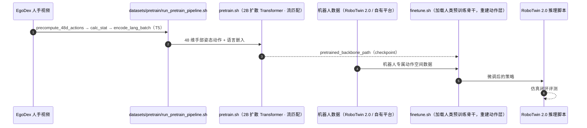

# H-RDT

**H-RDT: Human Manipulation Enhanced Bimanual Robotic Manipulation** 收录于 [Robot Learning Paper Notebooks](https://imchong.github.io/Robot_Learning_Paper_Notebooks/index.html)（分类：06_Manipulation），深读笔记已完成。本页编译自深读笔记与 arXiv 论文正文（实验数字、开源状态于 2026-09-28 核对），细节以论文 PDF 为准。

## 一句话定义

机器人操作模仿学习面临大规模高质量机器人演示稀缺的根本难题。近期机器人基础模型常在跨本体机器人数据上预训练以扩规模，但不同本体的形态与动作空间差异大，统一训练难。H-RDT（Human to Robotics Diffusion Transformer）用人类操作数据增强机器人操作：核心洞察是带配对 3D 手姿标注的大规模第一视角人类操作视频蕴含丰富行为先验，能惠及机器人策略学习。采用两阶段：① 在大规模第一视角人类操作数据上预训练；② 用模块化动作编/解码器在机器人专属数据上做跨本体微调。模型是 2B 参数的扩散 Transformer，用流匹配建模复杂动作分布。仿真/真机较从零训练分别 +13.9% / +40.5%，超过 Pi0 与 RDT 基线。

## 英文缩写速查

| 缩写 | 含义 |
|---|---|
| H-RDT | Human to Robotics Diffusion Transformer |
| Bimanual | 双臂 |
| 3D Hand Pose | 3D 手姿标注 |
| Cross-Embodiment | 跨本体 |
| Modular Encoder/Decoder | 模块化动作编/解码器 |
| Flow Matching | 流匹配 |

## 为什么重要

- **人类视频比跨本体机器人数据更易扩展**：用它作预训练先验是聪明的绕过数据稀缺之道；
- **模块化动作编/解码器**是跨本体微调的实用结构；
- **扩散 Transformer + 流匹配**是当前 VLA/操作模型的主流；
- 与 Being-H0、In-N-On 等"人类数据驱动操作"路线一致。

## 解决什么问题

机器人演示数据稀缺，跨本体统一训练难： - 直接跨本体机器人预训练受**形态/动作空间差异**限制； - 需要更**可扩展**的先验来源。

H-RDT 要：用**大规模人类操作视频（含 3D 手姿）**作行为先验，增强机器人双臂操作。

## 核心机制

1. **人类数据增强机器人操作**：人类视频 + 3D 手姿作行为先验；
2. **两阶段训练**：人类预训练 + 模块化跨本体微调；
3. **2B 扩散 Transformer + 流匹配**：建模复杂动作分布；
4. **显著提升**：仿真 +13.9%、真机 +40.5%，超 Pi0/RDT。

方法拆解（深读笔记小节）：洞察：人类视频 + 3D 手姿 = 行为先验；两阶段训练；架构：2B 扩散 Transformer + 流匹配；结果；🧭 整体流程（mermaid）。

## 核心信息

| 字段 | 内容 |
|------|------|
| 分类 | 06_Manipulation |
| 深读笔记 | <https://imchong.github.io/Robot_Learning_Paper_Notebooks/papers/06_Manipulation/H-RDT__Human_Manipulation_Enhanced_Bimanual_Robotic_Manipulation/H-RDT__Human_Manipulation_Enhanced_Bimanual_Robotic_Manipulation.html> |
| arXiv | <https://arxiv.org/abs/2507.23523> |
| 源码 | **已开源**：[HongzheBi/H_RDT](https://github.com/HongzheBi/H_RDT)（EgoDex 预训练、跨具身微调与 RoboTwin 2.0 推理脚本）；权重 [embodiedfoundation/H-RDT](https://huggingface.co/embodiedfoundation/H-RDT) |
| 作者 | Hongzhe Bi、Lingxuan Wu、Tianwei Lin、Hengkai Tan、Hang Su、Jun Zhu 等（清华 TSAIL / 地平线等） |
| 发表 | 2025 年 7 月 |
| 笔记阅读日期 | 2026-06-21 |

## 源码运行时序图

复现主路径：下载 Hugging Face 权重 → `finetune.sh`（`--mode=finetune`、`--pretrained_backbone_path`）→ RoboTwin 2.0 推理。

## 实验与评测

**设置**：预训练用 EgoDex 第一视角人手视频（48 维手部姿态动作）；微调与评测覆盖仿真 RoboTwin 2.0（Aloha-Agilex-1.0、双臂 Franka）和 3 个真机平台（双臂 ARX5、Aloha-Agilex-2.0 双 Piper、双 UR5 + UMI）。基线：RDT、π₀、同架构不做人类预训练（w/o human）。

| 场景 | RDT | π₀ | w/o human | **H-RDT** |
|------|----:|----:|----:|----:|
| RoboTwin 2.0 单任务（13 任务，Easy / Hard） | — | — | H-RDT −8.4% | **68.7% / 25.6%** |
| Aloha-Agilex-2.0 叠毛巾（完全成功，25 次） | 40% | — | 0% | **52%** |
| Aloha-Agilex-2.0 杯子放杯垫 | 28% | — | 20% | **64%** |
| 双臂 ARX5：113 个取放任务，每任务 1–5 条演示 | 16.0% | 31.2% | 17.6% | **41.6%** |
| 双 UR5 + UMI：外卖袋放置 4 子任务平均 | 29.0% | 31.0% | 16.0% | **58.0%** |

- 论文摘要给出的汇总：相对从零训练，仿真 +13.9%、真机 +40.5%。
- **收益集中在少样本真机**：113 任务 × 1–5 条演示时，π₀ 也难拟合，人类先验带来最明显提升（论文讨论节）。
- RoboTwin Hard 模式（光照、杂物、桌高 ±3 cm 随机化）下仍领先，但绝对成功率只有 25.6%。

## 与其他工作对比

| 工作 | 预训练数据 | 与 H-RDT 的差异 |
|------|------|------|
| [RDT-1B](./paper-rdt-1b.md) | 跨具身机器人数据 | 同为扩散 Transformer；H-RDT 把预训练源换成人手视频，并加模块化动作编 / 解码器 |
| [π₀](../methods/π0-policy.md) | 大规模机器人数据 + VLM | 少样本 113 任务上 31.2% vs 41.6% |
| [Humanoid Policy ~ Human Policy](./paper-notebook-humanoid-policy-human-policy.md) | 与任务对齐的 PH2D 人类数据 | 单阶段协同训练；H-RDT 是「人类预训练 → 机器人微调」两阶段 |
| [Being-H0](./paper-notebook-being-h0-vision-language-action-pretraining-from.md) | 人手视频 + 手部动作 token | 走 VLA 路线并量化手部动作；H-RDT 用流匹配直接回归连续动作 |

## 结论

**H-RDT 的关键取舍，是把预训练数据源从「跨本体机器人数据」换成「带 3D 手姿标注的第一视角人类视频」，再用模块化动作编/解码器把本体差异整个推迟到微调阶段处理。**

- 真正起作用的是两阶段分工：人类数据只负责提供行为先验，模块化编/解码器承接不同本体的形态与动作空间差异，而非靠统一训练硬扛。
- 关键指标是相对从零训练的增益——仿真 +13.9%、真机 +40.5%，并超过 Pi0 与 RDT 基线；真机增益远大于仿真，说明先验补的主要是真实数据稀缺。
- 适用边界在于依赖可规模化的、带配对 3D 手姿标注的人类操作视频，且目标是双臂操作；缺这类标注时该先验无从建立。
- 架构选型（2B 扩散 Transformer + 流匹配）走的是当前 VLA/操作模型主流，本身不是差异化来源，差异化在数据源与跨本体接口。
- 与 Being-H0、In-N-On 等「人类数据驱动操作」路线同属一簇，本页的区分点是显式的「人类预训练 → 跨本体微调」两段式。
- 真机分项数字支撑这一判断：113 任务少样本 41.6%（π₀ 31.2%、w/o human 17.6%），UMI 外卖袋任务 58.0%（w/o human 16.0%）。

## 局限与风险

- **依赖带 3D 手部姿态标注的人类视频**：EgoDex 这类配对标注数据是先验来源，没有时无法复用该流程。
- **只验证机械臂 + 夹爪 / 双臂平台**：评测平台均为双臂夹爪系统，灵巧手与人形未覆盖；「人手 48 维姿态 → 夹爪动作」的映射由微调阶段重新学习的动作层承担。
- **Hard 模式绝对值偏低**：RoboTwin 2.0 Hard 单任务平均 25.6%，域随机化下仍远未可靠。
- **论文未单列局限节**；以上边界来自实验设置本身。
- **复现门槛**：预训练需 EgoDex 全量数据与 T5-XXL 语言编码器；README 的微调路径以 RoboTwin 2.0 为例，其他机器人需自行在 `datasets/dataset.py` 注册。

## 与其他页面的关系

- 分类父节点：[paper-notebook-category-06-manipulation](../overview/paper-notebook-category-06-manipulation.md)
- 总索引：[humanoid-paper-notebooks-index.md](../overview/humanoid-paper-notebooks-index.md)
- 任务语境：双臂操作：[bimanual-manipulation](../tasks/bimanual-manipulation.md)
- 基座 RDT（跨机器人数据预训练）：[paper-rdt-1b](./paper-rdt-1b.md)
- 预训练数据 EgoDex：[paper-notebook-egodex-learning-dexterous-manipulation-from-larg](./paper-notebook-egodex-learning-dexterous-manipulation-from-larg.md)
- 仿真评测基准 RoboTwin 2.0：[robotwin](./robotwin.md)
- 对比基线 π₀：[π0-policy](../methods/π0-policy.md)

## 参考来源

- [humanoid_pnb_h-rdt.md](../../sources/papers/humanoid_pnb_h-rdt.md)
- 深读笔记：<https://imchong.github.io/Robot_Learning_Paper_Notebooks/papers/06_Manipulation/H-RDT__Human_Manipulation_Enhanced_Bimanual_Robotic_Manipulation/H-RDT__Human_Manipulation_Enhanced_Bimanual_Robotic_Manipulation.html>
- 论文：<https://arxiv.org/abs/2507.23523>
- 论文正文（Table 1–5、RoboTwin 2.0 结果）：<https://arxiv.org/html/2507.23523>
- 官方代码：<https://github.com/HongzheBi/H_RDT>

## 推荐继续阅读

- [机器人论文阅读笔记：H-RDT](https://imchong.github.io/Robot_Learning_Paper_Notebooks/papers/06_Manipulation/H-RDT__Human_Manipulation_Enhanced_Bimanual_Robotic_Manipulation/H-RDT__Human_Manipulation_Enhanced_Bimanual_Robotic_Manipulation.html)
- 项目页：<https://embodiedfoundation.github.io/hrdt>
- 模型权重：<https://huggingface.co/embodiedfoundation/H-RDT>
