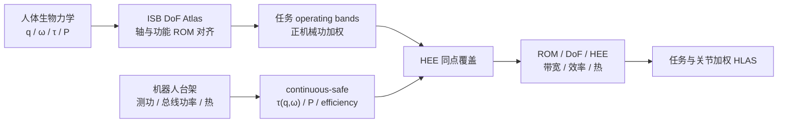

# Human-Level Actuation for Humanoids：可复测的人级驱动标尺

**Human-Level Actuation for Humanoids**（[arXiv:2511.06796](https://arxiv.org/abs/2511.06796)）由 Teragon Research 的 Sunbeam 提出，是评测框架与测量协议，不是新执行器。

## 一句话定义

**先用 DoF Atlas 对齐人和机器人的关节轴，再在任务真实发生的同一姿态—转速点检查扭矩与功率是否同时覆盖 HEE，最后把工作空间、带宽、效率和热持续性聚合成 HLAS。**

## 英文缩写速查

| 缩写 | 英文全称 | 简要说明 |
|------|----------|----------|
| HLAS | Human-Level Actuation Score | 六个物理因子聚合的人级驱动评分 |
| HEE | Human-Equivalence Envelope | 同一姿态与转速下的人类扭矩—功率需求包络 |
| DoF | Degree of Freedom | Atlas 中需对齐且独立可控的关节自由度 |
| ISB | International Society of Biomechanics | 关节坐标系与轴方向的规范来源 |
| ROM | Range of Motion | 评分使用任务相关功能活动范围 |
| QDD | Quasi-Direct Drive | 高背驱与高带宽、热压力较高的架构 |
| SEA | Series Elastic Actuator | 柔顺抗冲击但带宽/损耗需计入的架构 |

## 为什么重要

- **阻止单点刷分：** 高堵转力矩与高空载速度若不在同一 \((q,\omega)\) 点出现，不能拼成“人级功率”。
- **把任务写进规格：** 行走推蹬、上楼支撑、举升与快速手部动作对应不同关节和工作区。
- **把热与控制算进驱动：** 冷机峰值不代表持续能力；高减速比静态力矩也不代表接触带宽。
- **评分可分解：** HLAS 是总分，但仍能回溯到任务、关节和六个因子，便于指导设计。

## 核心信息

| 项 | 内容 |
|----|------|
| **机构** | Teragon Research |
| **参考人** | 75 kg 标准参考；人体数据按体重归一后缩放 |
| **Atlas** | 106 个转动 DoF + 4 个平移 DoF；实际示例聚焦髋、膝、踝、肩、肘、腕 |
| **任务** | 平地走、跑、上楼、重复举升、够取、手部快速动作等 |
| **输出** | 关节/任务级六因子分数、总 HLAS 与诊断分解 |
| **开源** | **未开源 / 无项目页**（截至 2026-07-28）；公式、表格和协议只在论文中 |

## 评测流程总览

## 核心机制（方法栈）

### 1）DoF Atlas

采用 ISB 对齐的右手坐标系，区分主动、被动和日常功能 ROM。机器人只因任务真正需要的轴和区间缺失而扣分，不因缺少极端被动姿态而被不合理惩罚。

### 2）HEE 同时性条件

对关节 \(j\)、任务 \(t\) 的 operating band \(R_{j,t}\)，只在人体产生正机械功的 \((q,\omega)\) 上比较。机器人必须在同一点同时满足人体扭矩与功率，覆盖度再按人体正功加权；这样不能拿低速峰值扭矩和高速空载转速拼表。

### 3）HLAS 六因子

工作空间由 ROM coverage 与 DoF availability 表示；动态/能量能力由 HEE、torque-mode bandwidth、task-weighted efficiency、thermal sustainability 表示。预注册任务权重 \(w_t\) 和关节权重 \(u_{j,t}\)，最后聚合并保留分解。

## 源码运行时序图

**不适用。** 论文提供公式、人体参考表和实验协议，但没有官方软件、数据包或 CLI；该工作应按台架流程执行而非运行代码仓库。

## 工程实践

| 步骤 | 测量 | 防刷分条件 |
|------|------|------------|
| 坐标对齐 | 关节轴、符号、safe ROM、轴耦合 | 小幅独立激励验证每个 DoF |
| 热浸泡 | 在任务 duty 下预热 | 温升率限制为 <0.5 °C/s |
| 连续安全图 | 测功机扫描 \(q,\omega,\tau\) | 无电流饱和、温度不超限 |
| 带宽 | 代表性反射惯量下 torque sine sweep | 报 -3 dB 与 phase，不只报电流环 |
| 效率 | DC bus 输入对机械正功 | 按任务驻留分布加权 |
| 热持续 | 重复任务到 derate | 报 time-to-derate 与冷却假设 |
| 聚合 | 预注册任务/关节权重 | 同时发布总分和分项 |

## 与其他工作对比

| 指标 | 峰值规格表 | TN/TI 曲线 | HLAS / HEE |
|------|------------|------------|------------|
| 姿态相关 | 通常无 | 常省略 | 显式 \(q\) |
| 扭矩与速度同点 | 不保证 | TN 可表达 | 强制同点且要求功率 |
| 任务权重 | 无 | 无 | 正功 operating band |
| 带宽/效率/热 | 分散或缺失 | 部分 | 六因子统一聚合 |
| 可诊断性 | 单点易比较但易误导 | 电机/模组设计友好 | 任务—关节—因子分解 |

## 实验与评测

- 论文汇总 75 kg 人体任务包络：平地走踝推蹬约 **90–143 N·m、190–260 W**；上楼踝推进约 **105–135 N·m、225–260 W**。
- 跑步踝/髋正功可达约 **300–525 W**；手/腕快速开合约 **4–6 Hz**，投掷肩内旋约 **113–134 rad/s**，说明“人级”跨越完全不同的速率域。
- 论文给出 synthetic multi-joint robot 的完整 HLAS 计算示例，用来展示 gearing 对 HEE、带宽与效率的冲突。
- 这不是多台商用人形的实测排行榜；worked example 验证计算链条，不验证该协议的跨实验室重复性。

## 结论

**HLAS 最重要的贡献是规定“何时、何姿态、何转速、持续多久”才算人级，而不是再发明一个脱离测量条件的总分。**

1. **规格从任务反推** — 先选 operating bands，再定关节目标。
2. **连续安全图优于峰值点** — 冷机 burst 不能代表持续工作。
3. **高减速比不能只靠静态力矩获胜** — 带宽、效率与背驱会在分项中暴露。
4. **总分必须伴随分解** — 不同任务权重下，机器人排名可能反转。
5. **当前证据是协议级** — 缺公开工具与跨平台实测，不应把 HLAS 当既成行业标准。

## 局限与风险

- 人体基准由不同研究、样本和测量协议编译，跨来源误差会进入 HEE。
- 任务/关节权重仍包含价值判断；必须预注册并发布敏感性分析。
- 接触冲击、传动寿命、噪声、成本和维护性未完全进入单一分数。
- 论文无代码与机器可读 atlas，独立实现容易在坐标、插值和归一化上分叉。

## 与其他页面的关系

- 路线入口：[力矩控制电机设计纵深](../../roadmap/depth-torque-motor-design.md)
- 物理曲线：[Motor Torque-Speed](../concepts/motor-torque-speed-curve.md)、[Motor Torque-Current](../concepts/motor-torque-current-curve.md)
- 台架：[Motor Dynamometer](../concepts/motor-dynamometer.md)
- 架构对照：[QDD / Blue](./paper-notebook-quasi-direct-drive-for-low-cost-compliant-roboti.md)
- 选型地图：[Humanoid Actuator 102](../overview/humanoid-actuator-102-technology-map.md)
- 驱动链：[执行器驱动链选型闭环](../queries/actuator-drive-chain-selection-loop.md) — 用实测曲线验收策略输出侧
- 评测方法：[具身大模型评测基准选型闭环](../queries/embodied-eval-benchmark-selection-loop.md) — HLAS 是硬件能力评测分支

## 参考来源

- [论文与深读笔记归档](../../sources/papers/humanoid_pnb_human-level-actuation-for-humanoids.md)
- 论文：<https://arxiv.org/abs/2511.06796>

## 推荐继续阅读

- [机器人论文阅读笔记：Human-Level Actuation for Humanoids](https://imchong.github.io/Humanoid_Robot_Learning_Paper_Notebooks/papers/12_Hardware_Design/Human-Level_Actuation_for_Humanoids/Human-Level_Actuation_for_Humanoids.html)
- [International Society of Biomechanics](https://isbweb.org/)
