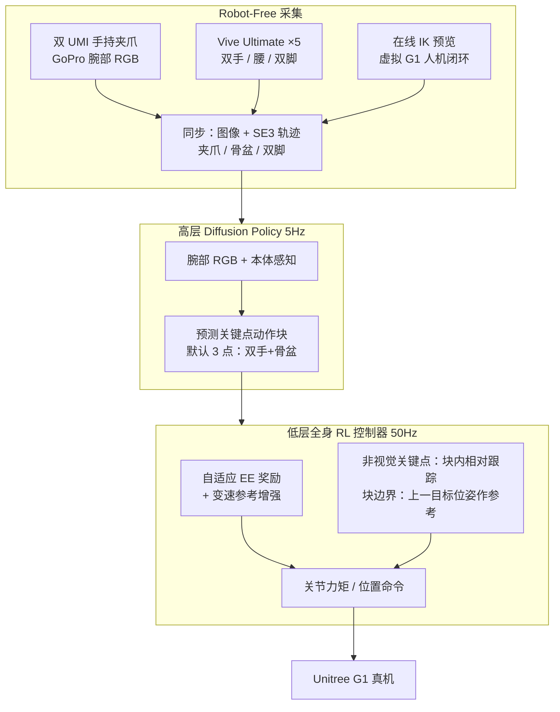

# HuMI（Humanoid Manipulation Interface）

**HuMI**（*Humanoid Manipulation Interface: Humanoid Whole-Body Manipulation from Robot-Free Demonstrations*，arXiv:2602.06643，[项目页](https://humanoid-manipulation-interface.github.io)）提出首个面向人形 **全身操作** 的 **无机器人示范** 框架：在 [UMI](https://umi-gripper.github.io/) 手持夹爪之上叠加 **HTC Vive Ultimate** 全身独立追踪，同步记录 **骨盆、双手、双脚** 与腕部视觉；通过 **在线 IK 预览** 让人类示教者在 **不缩放轨迹** 的前提下调整至 **Unitree G1** 运动学可行域，再由 **分层 visuomotor 管线**（扩散高层 + 操作中心全身 RL 低层）迁移到真机。论文在求婚跪地、拔剑、投掷、行走清扫、深蹲拾瓶等任务上验证，相对 [TWIST2](./paper-twist2.md) 遥操作实现约 **3×** 采集吞吐，未见环境/物体泛化成功率 **70%**。

> 本页同时服务 [Humanoid Robot Learning Paper Notebooks](https://imchong.github.io/Humanoid_Robot_Learning_Paper_Notebooks/index.html) 分类 **04_Loco-Manipulation_and_WBC** 的策展索引；方法细节以 arXiv 与项目页为准。

## 英文缩写速查

| 缩写 | 英文全称 | 简要说明 |
|------|----------|----------|
| HuMI | Humanoid Manipulation Interface | 本文提出的无机器人人形全身操作采集与学习框架 |
| UMI | Universal Manipulation Interface | 手持夹爪 + 腕部相机的便携无机器人示教接口 |
| WBC | Whole-Body Control | 协调全身关节满足平衡与跟踪的低层执行 |
| IK | Inverse Kinematics | 由任务空间目标求解关节角；采集阶段用于人机闭环预览 |
| EE | End-Effector | 末端执行器，本文主要指双手夹爪 TCP |
| RL | Reinforcement Learning | 仿真中训练全身跟踪低层控制器 |
| G1 | Unitree G1 Humanoid | 论文目标平台（约 130 cm 身高） |
| SE(3) | Special Euclidean Group | 刚体位姿（3D 平移 + 3D 旋转）表示 |
| Sim2Real | Simulation to Real | 低层控制器经仿真 RL 后部署真机 |

## 为什么重要

- **首个无机器人人形全身操作全栈**：把 UMI 范式从固定基座臂/四足扩展到 **骨盆+脚+双手** 的全身协调，填补「仅录末端不足以指定蹲/跪/迈步」的空白。
- **不缩放轨迹 + 人机闭环 IK**：相对传统 motion retargeting 的 **身高缩放**，HuMI 坚持 **原始人体位姿** 以保留 **人–物空间对齐**（物体不可缩放），用 **实时虚拟 G1 预览** 让示教者自行修正不可行动作——消融显示去掉预览后求婚任务 **85%→10%**。
- **操作中心全身控制器**：针对人形跟踪 **4–6 cm** 残差导致的高层 action chunk 断裂，提出 **自适应末端奖励**、**变速增强** 与 **目标位姿/相对关键点** 两类策略接口，使投掷、清扫等动态/长程任务可闭环执行。
- **采集效率证据扎实**：15 min 拔剑任务 **62 vs 28** 条（TWIST2），接受率 **96.7% vs 64.3%**；深跪求婚 TWIST2 **零** 可用示范而 HuMI **50** 条——量化「无机器人」对 **高关节度全身动作** 的数据飞轮价值。
- **与 BifrostUMI / HALOMI 形成对照谱系**：HuMI 显式记录 **骨盆+脚**、用 **Vive 独立追踪** 与 **IK 预览**；[BifrostUMI](./paper-bifrost-umi.md) 用 Pico + **SKR 缩放**；[HALOMI](./paper-halomi-humanoid-loco-manipulation.md) 只录 **头手**、下身交给 BFM-Zero 流形控制器。

## 流程总览

## 核心机制（归纳）

### 1）便携采集栈

| 模态 | 硬件 | 用途 |
|------|------|------|
| 双手轨迹 + 夹爪 + 腕部 RGB | UMI 式 3D 打印夹爪 + GoPro | 与 UMI 对齐的操作/视觉监督 |
| 骨盆 + 双脚位姿 | HTC Vive Ultimate Tracker ×5 | 全身运动指定；**无基站** 可野外部署 |
| 运动学预览 | 在线 IK + 虚拟 G1 可视化 | 示教阶段保证轨迹 **不缩放** 且 **G1 可行** |

- **为何不用 Pico**：论文指出头显依赖方案在 **深蹲/地面交互** 遮挡下追踪退化；Vive Ultimate 为 **独立自追踪**。
- **为何不录头**：G1 **无主动颈**；与 [HALOMI](./paper-halomi-humanoid-loco-manipulation.md) 主动感知路线形成对比。

### 2）分层 visuomotor 控制

- **高层（5 Hz）**：[Diffusion Policy](../methods/diffusion-policy.md) 由机载可复现观测（腕部图 + 本体）生成 **receding-horizon 关键点轨迹块**；默认 **3 关键点**（双手 + 骨盆），可扩展至 **5 关键点**（加双脚）用于长程 loco-manipulation。
- **低层（50 Hz）**：仿真 RL **全身跟踪控制器**，输入高层关键点目标 + IMU/关节状态，输出关节控制；训练数据来自采集阶段 **全身 IK 解** 作为参考动作。
- **与 UMI-on-Legs 的差异**：同样强调 manipulation-centric WBC，但 HuMI 面向 **双足人形** 且显式处理 **chunk 边界不连续** 与 **盲关键点漂移**。

### 3）操作中心全身 RL 低层

| 机制 | 动机 | 要点 |
|------|------|------|
| 自适应 EE 奖励 | 全身协调 vs 末端精度权衡 | 参考 EE 速度动态调节容差；基座高速时关闭 EE 项保稳定 |
| 变速增强 | 固定速度参考来不及消误差 | episode 内随机慢放参考，利于学习 **毫米级** 双手协调（拔剑 85%→50% 消融） |
| 上一 **目标** 作 chunk 参考 | 执行滞后导致 chunk 边界折返 | 投掷任务 75%→40%；对齐 IL 训练假设与 RL 跟踪目标 |
| 盲关键点 **相对** 跟踪 | 骨盆/脚无视觉锚定，绝对位姿漂移 >5 cm | 清扫任务绝对骨盆跟踪 **75%→0%** |

### 4）实验任务与指标（摘要）

| 任务 | 类型 | 成功率（域内） | 备注 |
|------|------|----------------|------|
| 求婚跪地拾戒指 | 全身协调 + 地面精抓 | 85%（17/20） | 去掉 IK 预览 → 10% |
| 拔剑 | 双手精密协调 | 85%，EE 误差 15.7 mm | 去掉变速增强 → 50% |
| 投掷玩具 | 动态全身 | 75% | 去掉目标位姿参考 → 40% |
| 行走桌边清扫 | Loco-manipulation | 75% | 仅 EE 接口 → 60%；绝对骨盆 → 0% |
| 深蹲拾瓶（泛化） | 野外场景/物体 | 70%（14/20） | 350 条 × 7 环境训练 |

**采集效率（15 min，拔剑）**：HuMI **62** 条、接受率 **96.7%**；TWIST2 **28** 条、**64.3%**；每条可用示范耗时约 **30%**。

## 常见误区或局限

- **不是「缩放式重定向」**：与 [BifrostUMI](./paper-bifrost-umi.md) SKR 或舞蹈类 retargeting 不同，HuMI **刻意不缩放** 人体轨迹；可行性靠 **示教阶段 IK 预览** 而非离线几何变换。
- **仍依赖专用追踪硬件**：Vive Ultimate 需要环境纹理与光照；不是纯视觉 SLAM 方案。
- **低层控制器非通用**：论文承认当前 WBC 按任务训练配置统一但 **未做到跨任务通用底座**。
- **代码未开源（截至 2026-07-19）**：[项目页](https://humanoid-manipulation-interface.github.io) 无 GitHub 链接；复现需等待官方发布或自建 UMI+Vive+IK 栈。
- **仅 G1 验证**：框架声称可扩展至其他人形，但全身 IK 预览与控制器均绑定 G1 运动学。

## 工程实践

- **开源状态**：截至 **2026-07-19**，项目页仅提供论文 PDF 与 BibTeX，**未列出** 训练/部署代码或权重（见 [sources/sites/humanoid-manipulation-interface-project.md](../../sources/sites/humanoid-manipulation-interface-project.md)）。
- **硬件清单（复现起点）**：UMI 夹爪 + GoPro；Vive Ultimate Tracker ×5；SteamVR 自追踪环境；G1 + 机载相机部署。
- **与遥操作选型**：若任务含 **深跪/投掷** 等 TWIST2 难以遥操作的动作，优先评估 HuMI 类 **无机器人** 路线；若强调 **部署期动作与采集完全一致**，真机遥操作仍具优势。

## 与其他工作对比

| 维度 | HuMI（本文） | BifrostUMI | HALOMI | TWIST2 |
|------|-------------|------------|--------|--------|
| 采集硬件 | UMI 夹爪 + Vive ×5 | Pico + UMI 夹爪 | Pika + 头盔 ego + Vive 头手 | 便携真机遥操作 |
| 下身参考 | 骨盆 + 脚（显式） | 骨盆 + 脚（SKR 缩放） | 无（WBC 推断） | 真机关节一致 |
| 轨迹处理 | 不缩放 + IK 预览 | SKR 仅缩骨盆–脚高 | ego 对齐 + 控制器感知适配 | N/A |
| 高层策略 | Diffusion Policy | Diffusion Policy | π₀.₅ VLA | 分层 visuomotor |
| 低层 | 操作中心 RL WBC | 通用 WBC + mink IK | BFM-Zero 流形 RL | 仿真 RL 跟踪 |
| 采集需真机 | 否 | 否 | 否 | 是 |

## 核心信息

| 字段 | 内容 |
|------|------|
| 机构 | 清华大学、上海期智研究院（Shanghai Qi Zhi Institute）、千寻智能（Spirit.AI）、上海交通大学 |
| 作者 | Ruiqian Nai, Boyuan Zheng, Junming Zhao, Haodong Zhu, Sicong Dai, Zunhao Chen, Yihang Hu, Yingdong Hu, Tong Zhang, Chuan Wen, Yang Gao（*Equal contribution） |
| arXiv | <https://arxiv.org/abs/2602.06643> |
| 项目页 | <https://humanoid-manipulation-interface.github.io> |
| 平台 | Unitree G1 |
| Paper Notebooks 分类 | 04_Loco-Manipulation_and_WBC |
| 深读笔记 | <https://imchong.github.io/Humanoid_Robot_Learning_Paper_Notebooks/papers/04_Loco-Manipulation_and_WBC/Humanoid_Manipulation_Interface__Humanoid_Whole-Body_Manipulation_from_Robot-Fre/Humanoid_Manipulation_Interface__Humanoid_Whole-Body_Manipulation_from_Robot-Fre.html> |

## 关联页面

- [Loco-Manipulation](../tasks/loco-manipulation.md) — 行走清扫与全身协调任务
- [Teleoperation](../tasks/teleoperation.md) — 无机器人 vs TWIST2 真机采集谱系
- [Diffusion Policy](../methods/diffusion-policy.md) — 高层策略范式
- [Whole-Body Control](../concepts/whole-body-control.md) — 低层执行与跟踪误差
- [Motion Retargeting](../concepts/motion-retargeting.md) — 不缩放 + IK 预览 vs 缩放式重定向
- [BifrostUMI](./paper-bifrost-umi.md) — Pico + SKR 的无机器人全身对照
- [HALOMI](./paper-halomi-humanoid-loco-manipulation.md) — 稀疏头手 + 主动感知对照
- [TWIST2](./paper-twist2.md) — 采集效率 baseline
- [Unitree G1](./unitree-g1.md) — 实验平台

## 实验与评测

- 域内四项能力任务各 **20 rollouts**；泛化深蹲拾瓶 **20 rollouts**（7 环境训练）；采集效率与 TWIST2 对比见 §VI。完整消融与失败模式图见 arXiv PDF。

## 参考来源

- [humi_arxiv_2602_06643.md](../../sources/papers/humi_arxiv_2602_06643.md)
- [humanoid-manipulation-interface-project.md](../../sources/sites/humanoid-manipulation-interface-project.md)
- [humanoid_pnb_humanoid-manipulation-interface.md](../../sources/papers/humanoid_pnb_humanoid-manipulation-interface.md)
- Nai et al., *Humanoid Manipulation Interface: Humanoid Whole-Body Manipulation from Robot-Free Demonstrations*, arXiv:2602.06643, 2026. <https://arxiv.org/abs/2602.06643>

## 推荐继续阅读

- [HuMI 项目主页](https://humanoid-manipulation-interface.github.io)
- Chi et al., *Universal Manipulation Interface* — <https://arxiv.org/abs/2402.10329>
- Ha et al., *UMI on Legs* — manipulation-centric WBC 先例
- Ze et al., *TWIST2* — 论文采集效率对照 baseline
