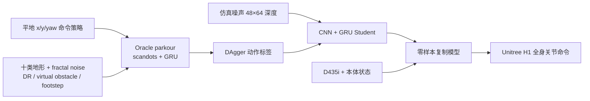

# Humanoid Parkour Learning：无动作先验的视觉全身跑酷

**Humanoid Parkour Learning**（[arXiv:2406.10759](https://arxiv.org/abs/2406.10759)，CoRL 2024）由上海创智学院、上海科技大学与清华大学提出，在 Unitree H1 上验证。

## 一句话定义

**从平地转向策略出发，在十类程序地形上训练看特权 scandots 的 GRU oracle，再用多 GPU DAgger 把它蒸馏成只看 48×64 机载深度图的单一全身策略并零样本上 H1。**

## 英文缩写速查

| 缩写 | 英文全称 | 简要说明 |
|------|----------|----------|
| RL | Reinforcement Learning | 从平地走到十类跑酷技能的训练方法 |
| DAgger | Dataset Aggregation | 在学生访问状态上由 oracle 重标动作 |
| GRU | Gated Recurrent Unit | oracle / student 的状态估计与时序记忆 |
| CNN | Convolutional Neural Network | 把 48×64 深度图编码为 32 维地形表示 |
| MPC | Model Predictive Control | Unitree H1 内置盲走基线 |
| DDS | Data Distribution Service | 双进程推理与电机通信中间件 |

## 为什么重要

- **单策略自主选技能：** 跳台、跨沟、楼梯、斜坡、hurdle 与粗糙地面不靠人工切 controller。
- **不依赖 MoCap：** gait 来自 fractal-noise 课程与任务/正则/安全 reward，而非动作参考或单独抬脚奖励。
- **揭示蒸馏吞吐瓶颈：** 人形视觉 DAgger 需要 4 GPU collector/trainer 并行；单 GPU 24 h 的数据量少两个数量级。
- **保留上身接口：** 手臂输出可被覆盖，为感知跑酷下肢与移动操作上肢组合留出工程入口。

## 核心信息

| 项 | 内容 |
|----|------|
| **机构** | 上海创智学院；上海科技大学；清华大学 |
| **平台** | Unitree H1；Isaac Gym 训练；RealSense D435i |
| **地形** | 10 类、每类 3 个递增子轨道；jump、leap、stairs、hurdle、slope、wave、tilted ramp 等 |
| **观测** | oracle：11×19 scandots；student：48×64 depth；本体历史与 joystick 转向命令 |
| **部署** | 12-core Intel i7 上视觉编码器/策略双 Python 进程，经 Cyclone DDS + ROS 2 通信 |
| **开源** | **未开源**（截至 2026-07-28）；四足前作 `ZiwenZhuang/parkour` 不是本文 H1 实现 |

## 流程总览

## 核心机制（方法栈）

### 1）平地到跑酷课程

先用 x/y/yaw 命令训练可转向平地步态；fractal height noise 迫使机器人自然抬脚。随后扩展到十类地形，scandots MLP 把 \(11\times19\) 地形采样编码成 32 维 embedding，GRU 同时估计基座线速度。

### 2）跑酷特定约束

Virtual obstacle penetration 惩罚防止身体或脚擦过障碍边缘；楼梯使用中部推荐落脚点奖励提升离散落足精度。作者因此并非完全“无 shaped reward”，而是无动作参考、无通用 feet-air-time 奖励。

### 3）视觉 DAgger 蒸馏

Student 用 CNN 替换 scandots encoder，并继承 oracle 的 GRU/MLP 权重。三个 collector 生成 student rollout 并让 oracle 标注，一个 trainer 用 L1 action loss 更新；仿真深度注入噪声，真机侧用 RealSense filter 做反向对齐。

## 源码运行时序图

**不适用。** 官方项目页未给 Humanoid Parkour Learning 的仓库、权重或部署入口；不能把论文中的 Isaac Gym、collector/trainer 与 ROS 2 双进程映射到公开目录。

## 工程实践

| 阶段 | 关键设置 | 验收 |
|------|----------|------|
| 平地 | fractal noise + x/y/yaw command | 转向不交叉腿、平地不拖脚 |
| Oracle | 4096 env、PPO、十类递增地形 | 每类 14.4 m 全轨道成功率 |
| 蒸馏 | 4×3090；1 trainer + 3 collectors | transition 吞吐、student fall rate |
| 深度 | 仿真噪声与 RealSense filter 对齐 | hole/dropout/延迟下成功率 |
| 部署 | 视觉和 policy 分进程 | message age、控制 jitter、CPU 负载 |
| 上身覆盖 | 替换 arm action 时维持下肢策略 | 质心扰动、手臂负载、碰撞 |

## 与其他工作对比

| 工作 | 机器人 | 技能结构 | 动作先验 | 主要特色 |
|------|--------|----------|----------|----------|
| Humanoid Parkour | H1 | 单一视觉全身策略 | 无 | fractal gait + 多 GPU DAgger |
| [ANYmal Parkour](./paper-notebook-anymal-parkour-robust-perceptive-locomotion.md) | ANYmal D | 高层选五个低层策略 | 无 | 多传感器 3D 重建与显式选技 |
| [Extreme Parkour](./extreme-parkour.md) | Go1 | 单一视觉策略 | 无 | clearance + heading 双蒸馏，代码公开 |
| [PHP](./paper-hrl-stack-22-perceptive_humanoid_parkour.md) | G1 | motion matching 轨迹 → 单一深度策略 | 有人类技能库 | 长程人形技能链 |

## 实验与评测

- 真机能力包括跳上 **0.42 m** 平台、跨越 **0.8 m** gap、野外跑 **1.8 m/s**；室内外每项配置做 10 次试验，并优于 blind policy 与 H1 内置 MPC。
- 4 GPU、24 h 蒸馏在 jump up / leap / stairs up / hurdle 的仿真成功率为 **85% / 80% / 100% / 95%**；单 GPU 为 **40% / 45% / 65% / 25%**。
- 从随机 student 开始的对应成功率仅 **0% / 0% / 5% / 10%**，说明继承 oracle 权重是必要条件。
- 单 GPU 24 h 只收集约 **4.147×10⁶** transitions，4 GPU 版本约 **432×10⁶**，主要差异是采样吞吐而非算法名义变化。

## 结论

**本文最可迁移的结论是：无动作参考的人形跑酷可行，但视觉蒸馏必须继承强 oracle，并用足够数据吞吐覆盖 student 真正访问的危险状态。**

1. **先训转向再训障碍** — 否则直线跑酷策略无法接高层导航。
2. **fractal noise 是 gait 课程，不是万能感知替代品** — 困难障碍仍依赖深度。
3. **DAgger 初始化和吞吐同等关键** — 从零 student 与单 GPU 都明显失败。
4. **reward 并非完全无先验** — virtual obstacle 与楼梯落脚监督仍注入几何知识。
5. **真机数字强但复现性弱** — 代码、模型与 H1 接口均未公开。

## 局限与风险

- 训练场景是直线三段轨道；虽有 joystick 转向，尚未证明开放环境长程导航。
- 深度仅面向无需表示机器人上方障碍的地形，钻洞/顶棚类任务覆盖不足。
- 多 GPU DAgger 成本高，且论文实现依赖旧 Isaac Gym。
- 真机失败统计按小样本任务配置给出，缺长期跌落、结构冲击和热持续数据。

## 与其他页面的关系

- 路线入口：[感知越障纵深](../../roadmap/depth-perceptive-locomotion.md)
- 训练范式：[Privileged Training](../concepts/privileged-training.md)、[DAgger](../methods/dagger.md)
- 四足对照：[Extreme Parkour](./extreme-parkour.md)、[ANYmal Parkour](./paper-notebook-anymal-parkour-robust-perceptive-locomotion.md)
- 后续鲁棒深度对照：[Now You See That](./paper-now-you-see-that-humanoid-vision-locomotion.md)
- 单阶段 raw-depth 对照（以本文为 X2 重实现基线）：[CReF](./paper-cref.md)
- 动作先验长程路线：[PHP](./paper-hrl-stack-22-perceptive_humanoid_parkour.md)
- 端到端未来监督（无 scandots 教师）：[ParkourFormer](./paper-parkourformer.md)

## 参考来源

- [论文与深读笔记归档](../../sources/papers/humanoid_pnb_humanoid-parkour-learning.md)
- [官方项目页与开源核查](../../sources/sites/humanoid-parkour-learning.md)
- 论文：<https://arxiv.org/abs/2406.10759>

## 推荐继续阅读

- [Humanoid Parkour Learning 官方项目页](https://humanoid4parkour.github.io/)
- [机器人论文阅读笔记：Humanoid Parkour Learning](https://imchong.github.io/Humanoid_Robot_Learning_Paper_Notebooks/papers/03_High_Impact_Selection/Humanoid_Parkour_Learning/Humanoid_Parkour_Learning.html)
