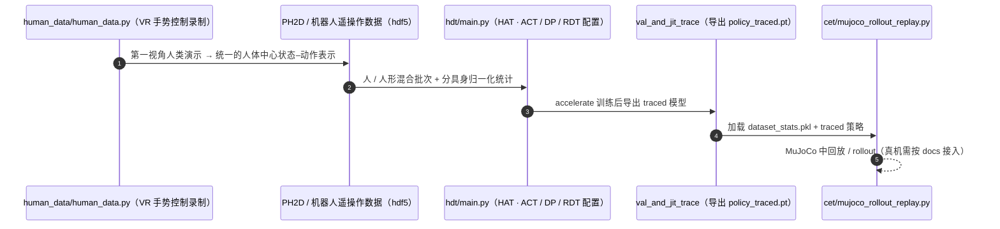

# Humanoid Policy ~ Human Policy

**Humanoid Policy ~ Human Policy** 收录于 [Robot Learning Paper Notebooks](https://imchong.github.io/Robot_Learning_Paper_Notebooks/index.html)（分类：06_Manipulation），深读笔记已完成。本页编译自深读笔记与 arXiv 论文正文（实验数字、开源状态于 2026-09-28 核对），细节以论文 PDF 为准。

## 一句话定义

用多样数据训练人形操作策略能增强鲁棒与跨任务/跨平台泛化。但只从机器人演示学很费力——需昂贵遥操作、难规模化。本文研究一种更可扩展的数据源：第一视角人类演示，作为机器人学习的跨本体训练数据。工作从数据采集与建模两方面弥合具身差距：① 引入与人形任务对齐的第一视角人类数据集 PH2D；② 提出 Human Action Transformer（HAT），统一人类与人形的状态-动作表示，并具备可微重定向能力；再与机器人数据协同训练。相比只用机器人数据，人类数据显著提升泛化与鲁棒，且大幅提高数据采集效率。

## 英文缩写速查

| 缩写 | 含义 |
|---|---|
| Cross-Embodiment | 跨本体（人↔人形） |
| PH2D | 与人形任务对齐的第一视角人类数据集 |
| HAT | Human Action Transformer |
| Unified State-Action | 统一状态-动作表示 |
| Differentiable Retargeting | 可微重定向 |
| Co-training | 协同训练（人类 + 机器人数据） |

## 为什么重要

- **"人形策略≈人类策略"是有力的跨本体假设**：统一表示让人类数据直接可用；
- **可微重定向**把"人→人形"做成可学模块，优于手工重定向；
- **协同训练**兼得人类规模与机器人对齐；
- 与 H-RDT、Being-H0、In-N-On 共同构成"人类数据驱动人形操作"的方法簇（作者群高度重叠）。

## 解决什么问题

只用机器人演示训练人形操作**费力难扩展**： - 遥操作贵； - 想用**第一视角人类数据**，但有**具身差距**（状态/动作空间不同）。

论文要：用**第一视角人类演示**作跨本体数据，弥合具身差距、提升人形操作。

## 核心机制

1. **第一视角人类数据作跨本体训练源**：可扩展、采集高效；
2. **PH2D 数据集**：与人形任务对齐；
3. **HAT 统一状态-动作 + 可微重定向**：端到端弥合具身差距；
4. **协同训练显著增益**：泛化与鲁棒提升。

方法拆解（深读笔记小节）：PH2D：与人形任务对齐的人类数据集；HAT：统一状态-动作 + 可微重定向；与机器人数据协同训练；结果；🧭 整体流程（mermaid）。

## 核心信息

| 字段 | 内容 |
|------|------|
| 分类 | 06_Manipulation |
| 深读笔记 | <https://imchong.github.io/Robot_Learning_Paper_Notebooks/papers/06_Manipulation/Humanoid_Policy__Human_Policy/Humanoid_Policy__Human_Policy.html> |
| arXiv | <https://arxiv.org/abs/2503.13441> |
| 源码 | **已开源**：[RogerQi/human-policy](https://github.com/RogerQi/human-policy)（HAT 训练框架 `hdt/`、MuJoCo 回放 / rollout `cet/`、人类数据采集 `human_data/`）；数据集 [PH2D](https://huggingface.co/datasets/RogerQi/PH2D) 在 Hugging Face |
| 作者 | Ri-Zhao Qiu、Shiqi Yang、Xuxin Cheng、Tairan He、Ryan Hoque、Guanya Shi、Xiaolong Wang 等（UCSD / CMU 等） |
| 发表 | 2025 年 3 月 |
| 笔记阅读日期 | 2026-06-21 |

## 源码运行时序图

复现主路径：`data/recordings/download_data.sh` 下载 PH2D → `main.py --model_cfg_path configs/models/act_resnet.yaml` 训练 → `--val_and_jit_trace` 导出 → `cet/` 中 rollout。

## 实验与评测

**设置**：人形 A 为 Unitree H1（大部分机器人数据），人形 B 为电机配置不同的 H1-2（测跨人形少样本迁移）；人类数据用 VR 头显手部追踪采集（PH2D）。4 个灵巧操作任务，每个任务分 I.D.（与机器人数据场景接近）与 O.O.D.（只在人类数据里出现过的背景 / 纹理 / 摆放）。

| 方法 | 人类数据 | 分具身归一化 | Passing I.D. / O.O.D. | 横向抓取 | 竖向抓取 | 倾倒 | 总计 I.D. / O.O.D. |
|------|:--:|:--:|------|------|------|------|------|
| ACT | ✗ | — | 19/20 · 36/60 | 8/10 · 7/30 | 7/20 · 15/70 | 8/10 · 1/10 | 42/60 · 59/170 |
| HAT | ✓ | ✗ | 17/20 · 51/60 | 9/10 · 11/30 | 14/20 · 30/70 | 5/10 · 5/10 | 45/60 · 97/170 |
| **HAT** | ✓ | ✓ | 20/20 · 52/60 | 8/10 · 12/30 | 13/20 · 29/70 | 8/10 · 8/10 | **49/60 · 101/170** |

- **I.D. 基本不变，O.O.D. 近乎翻倍**：人类数据主要改善背景、物体摆放、外观三类泛化（O.O.D. 59→101/170）。
- **单位时间采样效率**：同样 20 分钟，「30 条机器人 + 120 条人类」优于「60 条机器人」（竖向抓取任务）。
- **少样本跨人形**：H1-2 上与 PH2D 协同训练，在少量演示区间始终优于单独训练。
- **状态–动作设计消融**：不对人类动作做减速插值 → 预测速度忽快忽慢、执行不稳；人与人形用不同状态表示 → 策略学到区分具身的捷径，O.O.D. 显著变差。

## 与其他工作对比

| 工作 | 人类数据用法 | 与 HAT 的差异 |
|------|------|------|
| ACT（仅机器人数据） | 不用 | I.D. 相当，O.O.D. 明显落后（59 vs 101/170） |
| [H-RDT](./paper-notebook-h-rdt-human-manipulation-enhanced-bimanual-robot.md) | 大规模人类视频预训练 → 机器人微调 | 两阶段；HAT 是同一批次混合协同训练、不需要替代监督 |
| [In-N-On](./paper-notebook-in-n-on-scaling-egocentric-manipulation-with-in.md) | 野外 + 场内第一视角人数据分层使用 | 把 PH2D 式「与任务对齐」的数据和野外数据组合起来规模化 |
| [EgoMimic](./paper-ego-03-egomimic.md) | 人 / 机器人数据协同训练 | 面向双臂夹爪机器人；HAT 面向带灵巧手的人形 |

## 结论

**这篇工作把「人形策略 ≈ 人类策略」当成可操作的假设：只要状态-动作表示统一、重定向可微，第一视角人类演示就能当跨本体训练数据直接用。**

- 真正起作用的是 HAT：统一人类与人形的状态-动作表示，并把「人→人形」的重定向做成可学的可微模块，替代手工重定向。
- 数据侧的关键是 PH2D 与人形任务**对齐**，而非单纯的数据量——对齐性决定了这批人类数据是否真的可用。
- 收益来自协同训练：人类数据带来规模与采集效率，机器人数据保证本体对齐，二者缺一不可；论文的对照面是「只用机器人数据」。
- 适用边界是遥操作成本高、且人类与人形动作空间可映射的操作类任务；具身差距过大时统一表示这一前提本身就会松动。
- 与 H-RDT、Being-H0、In-N-On 同属「人类数据驱动人形操作」方法簇（作者群高度重叠），本页的区分点是可微重定向 + 统一状态-动作表示。
- 量化上看收益集中在分布外：I.D. 42→49/60 变化不大，O.O.D. 59→101/170 近乎翻倍；不对人类动作减速、或人与人形用不同状态表示，都会把这部分收益吃掉。

## 局限与风险

- **策略架构较简单**：论文重点在具身差距，未训练语言条件的大模型（作者列为下一步）。
- **依赖 VR 手部追踪 SDK**：面向 VR 训练的手部关键点在重度遮挡动作下会失效，限制可采集的动作类型。
- **只验证带灵巧手的人形**：Unitree H1 / H1-2 + 灵巧手；其他形态（夹爪、非人形）未验证。
- **I.D. 收益有限**：场景与机器人数据接近时，加不加人类数据结果相近——价值集中在 O.O.D.。
- **复现门槛**：训练需 ≥24 GB 显存；人类数据采集依赖 ZED 头戴支架与 OpenTV 子模块。

## 与其他页面的关系

- 分类父节点：[paper-notebook-category-06-manipulation](../overview/paper-notebook-category-06-manipulation.md)
- 总索引：[humanoid-paper-notebooks-index.md](../overview/humanoid-paper-notebooks-index.md)
- 任务语境：[manipulation](../tasks/manipulation.md)
- HAT 的 ACT 类动作块骨架：[action-chunking](../methods/action-chunking.md)
- 人类数据作为可扩展数据源：[data-flywheel](../concepts/data-flywheel.md)
- 人类数据预训练双臂策略：[paper-notebook-h-rdt-human-manipulation-enhanced-bimanual-robot](./paper-notebook-h-rdt-human-manipulation-enhanced-bimanual-robot.md)
- 第一视角人数据规模化：[paper-notebook-in-n-on-scaling-egocentric-manipulation-with-in](./paper-notebook-in-n-on-scaling-egocentric-manipulation-with-in.md)

## 参考来源

- [humanoid_pnb_humanoid-policy.md](../../sources/papers/humanoid_pnb_humanoid-policy.md)
- 深读笔记：<https://imchong.github.io/Robot_Learning_Paper_Notebooks/papers/06_Manipulation/Humanoid_Policy__Human_Policy/Humanoid_Policy__Human_Policy.html>
- 论文：<https://arxiv.org/abs/2503.13441>
- 论文正文（Table 2、消融与局限节）：<https://arxiv.org/html/2503.13441>
- 官方代码：<https://github.com/RogerQi/human-policy>

## 推荐继续阅读

- [机器人论文阅读笔记：Humanoid Policy ~ Human Policy](https://imchong.github.io/Robot_Learning_Paper_Notebooks/papers/06_Manipulation/Humanoid_Policy__Human_Policy/Humanoid_Policy__Human_Policy.html)
- 项目页：<https://human-as-robot.github.io/>
- PH2D 数据集：<https://huggingface.co/datasets/RogerQi/PH2D>
