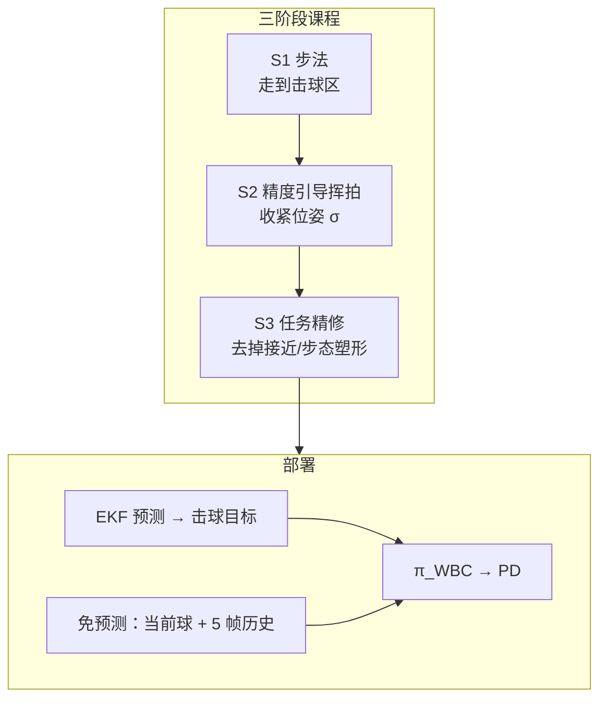

# Humanoid Whole-Body Badminton via Multi-Stage Reinforcement Learning

**Humanoid Whole-Body Badminton via Multi-Stage Reinforcement Learning**（[arXiv:2511.11218](https://arxiv.org/abs/2511.11218)）给出 **无动作先验、无专家示范** 的统一全身羽毛球控制器：三阶段课程让腿臂共同服务击球；部署可用 **EKF 轨迹预测** 或 **免预测** 短历史球位变体。作者称 **首个真机人形羽毛球** 系统（Phybot C1，1.28 m / 21 DoF）。收录于 [Humanoid Robot Learning Paper Notebooks](https://imchong.github.io/Humanoid_Robot_Learning_Paper_Notebooks/index.html)（分类：04_Loco-Manipulation_and_WBC）。在本库 [人形足球纵深 Stage 5](../../roadmap/depth-humanoid-soccer.md) 中作为 **竞技体育技能谱系** 对照。

## 一句话定义

**不靠 MoCap 教挥拍——先学走到击球区，再学准点挥拍，最后拿掉步态塑形专心打中球；部署时可显式预测球路，也可只看最近几帧球位隐式推断时机。**

## 英文缩写速查

| 缩写 | 英文全称 | 简要说明 |
|------|----------|----------|
| RL | Reinforcement Learning | PPO 训练统一全身策略 |
| PPO | Proximal Policy Optimization | Isaac Gym 并行优化 |
| EKF | Extended Kalman Filter | 羽毛球轨迹估计与预测 |
| WBC | Whole-Body Control | 腿臂统一服务击球目标 |
| MoCap | Motion Capture | 真机基座位姿与球位；训练不用专家动作 |
| DR | Domain Randomization | Stage 3 开启以巩固鲁棒 |
| PD | Proportional-Derivative | 500 Hz 底层关节跟踪 |

## 为什么重要

- **动态快速物体交互试金石：** 发球到击球常 <1 s，挥拍 >5 m/s，出球可达 **19.1 m/s**，比静态 loco-manipulation 更苛刻。
- **课程替代动作先验：** 与 [LHBS](./paper-notebook-learning-human-like-badminton-skills-for-humanoi.md)（Imitation-to-Interaction + AMP）形成对照——本文强调 **从零发现** 节能挥拍。
- **免预测变体几乎打平：** 暗示策略可吸收球路规律，简化部署调参。
- **足球纵深的谱系邻居：** 方法论上与「步法 + 击球时机」共享，服务 Stage 5 方向 D。

## 核心信息

| 项 | 内容 |
|----|------|
| **平台** | Phybot C1（1.28 m，30 kg，21 DoF）；全尺寸球拍固连前臂 |
| **栈** | Isaac Gym PPO · 策略 50 Hz · PD 500 Hz · 非对称 actor–critic |
| **感知（真机）** | FZMotion MoCap 基座 + 球尖位置；EKF 或短历史球位 |
| **开源** | **宣称将开源 / 待发布**（截至 **2026-07-28**）：GitHub 组织仓仅项目站，「All code will be released soon」；Code 按钮链回项目页，**无可运行训练入口** |

## 流程总览

## 核心机制（方法栈）

### 1）三阶段奖励课程

- **S1：** 区域接近 + 步态/朝向塑形，先学会稳定换位。
- **S2：** 在击球时刻激活稀疏 hit 奖励（位置×姿态耦合 + 挥拍速度）；σ 从松到紧调度。
- **S3：** 去掉接近主奖励与多项步态塑形，保留 hit + 安全正则，打开 DR/噪声；击球奖励再升 3–5%，能耗/力矩约降 20%。

### 2）观测与非对称 critic

- Actor：可部署本体 + 击球目标（或球历史）+ 长短历史关节/动作。
- Critic：特权无噪声状态与预知下一击目标，稳住多球 episode 价值估计。

### 3）EKF vs 免预测

- 目标已知管线：EKF 输出 $\{p^*_{ee}, q^*_{ee}, t^*\}$。
- 免预测：actor 只看当前球位 + 5 帧历史；critic 仍保留特权目标。

## 源码运行时序图

**不适用（截至 2026-07-28）。** 官方 GitHub 仓声明代码即将发布，当前仅托管项目页；无训练/推理可运行入口可对齐。发布后应补 `sources/repos/` 与本图。

## 与其他工作对比

| 维度 | 本文（Multi-Stage RL） | LHBS | HITTER（乒乓球） |
|------|------------------------|------|------------------|
| **运动先验** | **无** | MoCap → AMP | 依赖示范参考 |
| **统一全身** | 单策略，无独立基座位姿命令 | 四阶段模仿到交互 | 分层规划 + 全身控制 |
| **预测** | EKF 或免预测 | 任务相关 | 模型规划 |
| **开源** | 待发布 | 见 LHBS 页 | — |

## 实验与评测

- **仿真双机对打：** 最长 **21** 连拍（位置误差 <0.10 m、姿态 <0.2 rad 判成功）。
- **真机：** 出球最高 **19.1 m/s**（目标已知均值 11.1；免预测峰值 18.1 / 均值 8.2）；回球落点平均约 **4 m**；拦截区约 98×50 cm @ 1.4–1.7 m 高度。
- **虚拟目标挥拍误差：** 目标已知均值 **23.2 mm** vs 免预测 **54.0 mm**（20 次）。
- **人机对打：** 可维持少量回合；长多球仍受限拦截工作区。

## 结论

**无先验的三阶段全身 RL 已能把人形羽毛球推到真机可打，但长回合与大工作区仍是下一步。**

1. **课程顺序硬约束** — 跳过 S1 或 S2 易发散；S3 负责打破平台期。
2. **腿不是「走到点」** — 去掉独立基座命令，迫使步法与挥拍共优化。
3. **免预测可作部署简化选项** — 峰值球速接近，但挥拍精度更差。
4. **读 19.1 m/s 时看条件** — MoCap 基座位姿 + 受控发球/对打，不等于机载纯视觉闭环。
5. **与足球纵深关系** — 借用「步法+击球时机」方法论，不替代足球 Stage 3 技能主线。

## 局限与风险

- **代码未发布**，复现依赖论文超参表；以项目页为准跟进。
- 真机依赖外部 MoCap 基座位姿；机载视觉定位未闭环。
- 有效拦截带偏窄，限制长多球人机对打。

## 与其他页面的关系

- 羽毛球姊妹：[LHBS](./paper-notebook-learning-human-like-badminton-skills-for-humanoi.md)
- 任务：[loco-manipulation](../tasks/loco-manipulation.md)
- 乒乓球方法：[PhysicsPingPong / table-tennis](../methods/table-tennis-strategy-skill-learning.md)
- 纵深：[人形足球 Stage 5](../../roadmap/depth-humanoid-soccer.md)、[人形拳击纵深](../../roadmap/depth-humanoid-boxing.md)
- 分类父节点：[paper-notebook-category-04](../overview/paper-notebook-category-04-loco-manipulation-and-wbc.md)

## 参考来源

- [humanoid_pnb_humanoid-whole-body-badminton-via-multi-stage-re.md](../../sources/papers/humanoid_pnb_humanoid-whole-body-badminton-via-multi-stage-re.md)
- [humanoid-badminton-multi-stage-rl.md](../../sources/sites/humanoid-badminton-multi-stage-rl.md)
- 论文：<https://arxiv.org/abs/2511.11218>
- 深读笔记：<https://imchong.github.io/Humanoid_Robot_Learning_Paper_Notebooks/papers/04_Loco-Manipulation_and_WBC/Humanoid_Whole-Body_Badminton_via_Multi-Stage_Reinforcement_Learning/Humanoid_Whole-Body_Badminton_via_Multi-Stage_Reinforcement_Learning.html>

## 推荐继续阅读

- 项目页：<https://humanoid-badminton.github.io/Humanoid-Whole-Body-Badminton-via-Multi-Stage-Reinforcement-Learning/>
- [LHBS：拟人羽毛球 Imitation-to-Interaction](./paper-notebook-learning-human-like-badminton-skills-for-humanoi.md)
