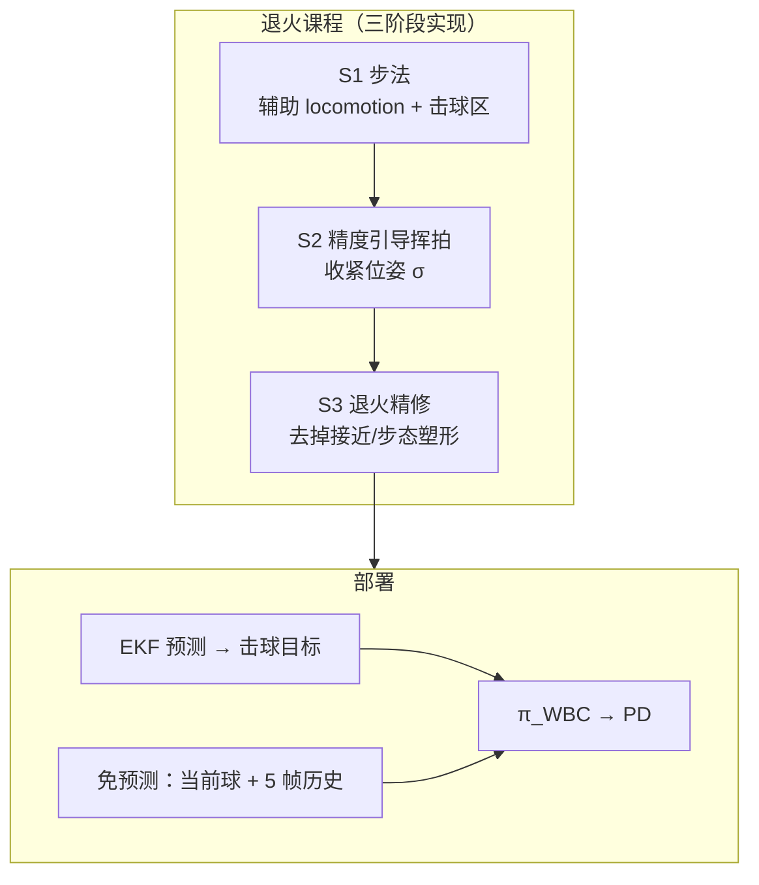
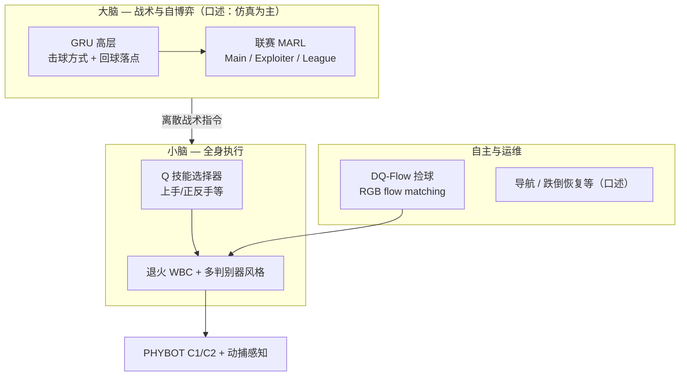

# Humanoid Whole-Body Badminton via an Annealed Reinforcement Learning Curriculum

**Humanoid Whole-Body Badminton via an Annealed Reinforcement Learning Curriculum**（[arXiv:2511.11218](https://arxiv.org/abs/2511.11218)，v4 2026-09-14；项目页标题仍用 *Multi-Stage Reinforcement Learning*）由 **Chenhao Liu、Leyun Jiang、Ningyuan Tian、Yibo Wang、Kairan Yao、Jinchen Fu、Xiaoyu Ren**（Phybot）提出 **无动作先验、无专家示范** 的统一全身羽毛球控制器：**退火课程** 先用辅助 locomotion 目标稳学习，再逐步去掉以聚焦击球；腿臂统一步法 + 挥拍。部署可用 **EKF 轨迹预测** 或 **免预测** 短历史球位变体。仿真 **双机器人连续 21 拍**；真机 **人机对打** 与机喂球，出球最高 **19.1 m/s**。收录于 [Robot Learning Paper Notebooks](https://imchong.github.io/Robot_Learning_Paper_Notebooks/index.html)（分类：04_Loco-Manipulation_and_WBC）。在本库 [人形足球纵深 Stage 5](../../roadmap/depth-humanoid-soccer.md) 中作为 **竞技体育技能谱系** 对照。

## 一句话定义

**不靠 MoCap 教挥拍——用退火课程先靠辅助 locomotion 奖励稳住全身，再逐步拿掉塑形项聚焦稀疏击球；部署时可 EKF 预测球路，也可只看最近几帧球位隐式推断时机。**

## 英文缩写速查

| 缩写 | 英文全称 | 简要说明 |
|------|----------|----------|
| RL | Reinforcement Learning | PPO 训练统一全身策略 |
| PPO | Proximal Policy Optimization | Isaac Gym 并行优化 |
| EKF | Extended Kalman Filter | 羽毛球轨迹估计与预测 |
| WBC | Whole-Body Control | 腿臂统一服务击球目标 |
| MoCap | Motion Capture | 真机基座位姿与球位；训练不用专家动作 |
| DR | Domain Randomization | 课程末段开启以巩固鲁棒 |
| PD | Proportional-Derivative | 500 Hz 底层关节跟踪 |

## 为什么重要

- **动态快速物体交互试金石：** 发球到击球常 <1 s，挥拍 >5 m/s，出球可达 **19.1 m/s**，比静态 loco-manipulation 更苛刻。
- **退火课程替代动作先验：** 与 [LHBS](./paper-notebook-learning-human-like-badminton-skills-for-humanoi.md)（Imitation-to-Interaction + AMP）形成对照——本文强调 **从零发现** 步法 + 挥拍共优化。
- **四足期刊对照：** [ETH ANYmal 羽毛球（Science Robotics adu3922）](./paper-coordinated-badminton-skills-anymal.md) — **机载 visuomotor RL**，与人形 MoCap/EKF 线不同形态。
- **免预测变体几乎打平：** 暗示策略可吸收球路规律，简化部署调参。
- **足球纵深的谱系邻居：** 方法论上与「步法 + 击球时机」共享，服务 Stage 5 方向 D。

## 核心信息

| 项 | 内容 |
|----|------|
| **作者** | Chenhao Liu, Leyun Jiang, Ningyuan Tian, Yibo Wang, Kairan Yao, Jinchen Fu, Xiaoyu Ren（arXiv v4；**不含** Junzhe He） |
| **机构** | Beijing Phybot Technology Co., Ltd |
| **平台** | 论文主平台 **Phybot C1**（1.28 m，30 kg，21 DoF）；IROS 2026 口述演示 **PHYBOT C2**（1.35 m，约 4.4×4.4 m 场地覆盖）；全尺寸球拍固连前臂 |
| **栈** | Isaac Gym PPO · 策略 50 Hz · PD 500 Hz · 非对称 actor–critic |
| **感知（真机）** | FZMotion MoCap 基座 + 球尖位置；EKF 或短历史球位 |
| **开源** | **宣称将开源 / 待发布**（截至 **2026-09-27**）：GitHub 组织仓仅项目站，「All code will be released soon」；Code 按钮链回项目页，**无可运行训练入口** |

## 流程总览

```mermaid
flowchart TB
  subgraph train [退火课程（三阶段实现）]
    s1["S1 步法<br/>辅助 locomotion + 击球区"]
    s2["S2 精度引导挥拍<br/>收紧位姿 σ"]
    s3["S3 退火精修<br/>去掉接近/步态塑形"]
    s1 --> s2 --> s3
  end
  subgraph deploy [部署]
    ekf["EKF 预测 → 击球目标"]
    pf["免预测：当前球 + 5 帧历史"]
    pi["π_WBC → PD"]
    ekf --> pi
    pf --> pi
  end
  s3 --> deploy
```

### 分层栈（论文小脑 + IROS 2026 口述扩展）

> 下列 **高层战术、技能选择器、DQ-Flow** 来自 [IROS 2026 Workshop 工业口述](../../sources/blogs/wechat_ai_tech_review_phybot_badminton_iros_2026_2026-09-29.md)，与 arXiv 正文 **可能未完全一一对应**；复现与引文请以论文与项目页为准。

```mermaid
flowchart TB
  subgraph brain [大脑 — 战术与自博弈（口述：仿真为主）]
    gru["GRU 高层<br/>击球方式 + 回球落点"]
    league["联赛 MARL<br/>Main / Exploiter / League"]
    gru --> league
  end
  subgraph cerebellum [小脑 — 全身执行]
    sel["Q 技能选择器<br/>上手/正反手等"]
    wbc["退火 WBC + 多判别器风格"]
    sel --> wbc
  end
  subgraph auto [自主与运维]
    dq["DQ-Flow 捡球<br/>RGB flow matching"]
    nav["导航 / 跌倒恢复等（口述）"]
  end
  brain -->|"离散战术指令"| cerebellum
  dq --> wbc
  wbc --> hw["PHYBOT C1/C2 + 动捕感知"]
```

## 核心机制（方法栈）

### 1）退火奖励课程（论文三阶段实现）

- **S1：** 区域接近 + 步态/朝向塑形，先学会稳定换位（辅助 locomotion 目标占主导）。
- **S2：** 在击球时刻激活稀疏 hit 奖励（位置×姿态耦合 + 挥拍速度）；σ 从松到紧调度。
- **S3：** 去掉接近主奖励与多项步态塑形，保留 hit + 安全正则，打开 DR/噪声；击球奖励再升 3–5%，能耗/力矩约降 20%。

### 2）观测与非对称 critic

- Actor：可部署本体 + 击球目标（或球历史）+ 长短历史关节/动作。
- Critic：特权无噪声状态与预知下一击目标，稳住多球 episode 价值估计。

### 3）EKF vs 免预测

- 目标已知管线：EKF 输出 $\{p^*_{ee}, q^*_{ee}, t^*\}$。
- 免预测：actor 只看当前球位 + 5 帧历史；critic 仍保留特权目标。

### 4）风格判别器 + 学习型技能选择器（IROS 2026 口述）

- 在退火 WBC 之上收集 **多风格参考**，用 **多个判别器** 分别约束上手、下手正/反手等；便于后续加新击球风格。
- **技能选择器：** 估计各候选技能的任务效用 $Q$（文内定义为 **击中奖励 × 落点奖励**），对当前来球选效用最高者；口述对比显示无选择器时回合更易过早结束。
- **与高层战术分工：** 选择器 **不建模对手**，仅按来球/区域选低层技能；**对手位姿与速度** 进入后续 **GRU 高层 MARL**（仿真）。

### 5）GRU 高层 + 联赛式自博弈（IROS 2026 口述）

- 高层观测量含机器人/击球/对手状态与历史决策；**GRU** 输出 **击球方式** 与 **回球落点** 两个离散决策，交给 **固定的** 低层 WBC 执行（职责：低层答「怎么打」，高层答「打哪种、打向哪」）。
- 训练 framing：**零和 MARL** + **PFSP** 优先练仍难胜的历史对手；并设 **Main Agent / Main Exploiter / League Exploiter** 缓解策略循环支配。
- **状态（2026-09-27 口述）：** 战术自博弈 **主要在仿真**；真机验证为下一步。同一框架口述 **约一周** 迁到乒乓球、足球。

### 6）DQ-Flow 与商场部署（IROS 2026 口述）

- **DQ-Flow：** 短时 RGB + 本体 → **flow matching** 生成全身运动参考；训练期 **深度查询** 辅助几何表征，**部署不需深度**；下肢/躯干 RL 跟踪、上肢/夹爪跟踪生成目标；与 WBC **异步时间对齐交接**。
- 捡球另线：仿真特权教师 + **退火 DAgger** 蒸馏到夹爪 RGB 学生。
- **快闪场馆：** 商场内与不同用户人机对打；口述强调通信、感知噪声与长期可靠性等系统问题。

## 源码运行时序图

**不适用（截至 2026-09-27）。** 官方 GitHub 仓声明代码即将发布，当前仅托管项目页；无训练/推理可运行入口可对齐。发布后应补 `sources/repos/` 与本图。

## 与其他工作对比

| 维度 | 本文（Annealed RL） | LHBS | HITTER（乒乓球） |
|------|------------------------|------|------------------|
| **运动先验** | **无** | MoCap → AMP | 依赖示范参考 |
| **统一全身** | 单策略，无独立基座位姿命令 | 四阶段模仿到交互 | 分层规划 + 全身控制 |
| **预测** | EKF 或免预测 | 任务相关 | 模型规划 |
| **开源** | 待发布 | 见 LHBS 页 | — |

## 实验与评测

- **仿真双机对打（论文）：** 最长 **21** 连拍（位置误差 <0.10 m、姿态 <0.2 rad 判成功）。
- **真机（论文）：** 出球最高 **19.1 m/s**（目标已知均值 11.1；免预测峰值 18.1 / 均值 8.2）；回球落点平均约 **4 m**；拦截区约 98×50 cm @ 1.4–1.7 m 高度。
- **虚拟目标挥拍误差（论文）：** 目标已知均值 **23.2 mm** vs 免预测 **54.0 mm**（20 次）。
- **人机对打（IROS 2026 口述，C2）：** 单回合 **40+ 拍**；杀球球速口述可达 **20+ m/s**；感知为 **8 相机动捕**（200 Hz 级），**非** 端侧相机闭环。
- **仿真物理（口述）：** 含 **空气动力学/阻力**；Sim2Real 口述为 **零样本**（域随机化 + 噪声）。

## 结论

**退火全身 RL 小脑已支撑真机长回合人机羽毛球；工业口述的下一步是高层战术真机闭环与硬件力矩/峰值速度上限。**

1. **课程顺序硬约束** — 跳过 S1 或 S2 易发散；S3 负责打破平台期。
2. **腿不是「走到点」** — 去掉独立基座命令，迫使步法与挥拍共优化。
3. **技能选择器值得单独验收** — 口述将其与「无选择器早停」对比；与高层 GRU 战术是不同层级。
4. **分层是产品路径** — 固定低层 WBC + 可迭代高层战术/自博弈，并口述跨乒乓球、足球迁移。
5. **读 19.1 m/s / 40 拍时看条件** — 动捕基座与球位；杀球 20+ m/s 口述仍依赖同类外部感知。
6. **工程与算法并列** — 延迟、控制、硬件迭代与策略同等影响竞技上限（口述 Q&A）。

## 局限与风险

- **代码未发布**，复现依赖论文超参表；以项目页为准跟进。
- 真机依赖外部 **动捕**（8 相机口径）；**机载视觉闭环未** 作为当前主部署路径。
- 论文拦截带仍偏窄；口述 40+ 拍与 C2 更大场地覆盖 **需与论文 C1 指标分开读**。
- **高层联赛 MARL / DQ-Flow** 以口述与演示为主，**缺少** 与 arXiv 同级的公开评测表；引文战术结果请标「仿真/口述」。

## 与其他页面的关系

- 羽毛球姊妹：[LHBS](./paper-notebook-learning-human-like-badminton-skills-for-humanoi.md) · [ETH ANYmal 四足（Sci. Rob.）](./paper-coordinated-badminton-skills-anymal.md)
- 任务：[loco-manipulation](../tasks/loco-manipulation.md)
- 乒乓球方法：[PhysicsPingPong / table-tennis](../methods/table-tennis-strategy-skill-learning.md)
- 纵深：[人形足球 Stage 5](../../roadmap/depth-humanoid-soccer.md)、[人形拳击纵深](../../roadmap/depth-humanoid-boxing.md)
- 分类父节点：[paper-notebook-category-04](../overview/paper-notebook-category-04-loco-manipulation-and-wbc.md)

## 参考来源

- [humanoid_whole_body_badminton_annealed_rl_arxiv_2511_11218.md](../../sources/papers/humanoid_whole_body_badminton_annealed_rl_arxiv_2511_11218.md)
- [humanoid_pnb_humanoid-whole-body-badminton-via-multi-stage-re.md](../../sources/papers/humanoid_pnb_humanoid-whole-body-badminton-via-multi-stage-re.md)
- [humanoid-badminton-multi-stage-rl.md](../../sources/sites/humanoid-badminton-multi-stage-rl.md)
- [wechat_ai_tech_review_phybot_badminton_iros_2026_2026-09-29.md](../../sources/blogs/wechat_ai_tech_review_phybot_badminton_iros_2026_2026-09-29.md)（IROS 2026 Workshop 口述精编）
- 论文：<https://arxiv.org/abs/2511.11218>
- 深读笔记：<https://imchong.github.io/Robot_Learning_Paper_Notebooks/papers/04_Loco-Manipulation_and_WBC/Humanoid_Whole-Body_Badminton_via_Multi-Stage_Reinforcement_Learning/Humanoid_Whole-Body_Badminton_via_Multi-Stage_Reinforcement_Learning.html>

## 推荐继续阅读

- 项目页：<https://humanoid-badminton.github.io/Humanoid-Whole-Body-Badminton-via-Multi-Stage-Reinforcement-Learning/>
- [LHBS：拟人羽毛球 Imitation-to-Interaction](./paper-notebook-learning-human-like-badminton-skills-for-humanoi.md)
