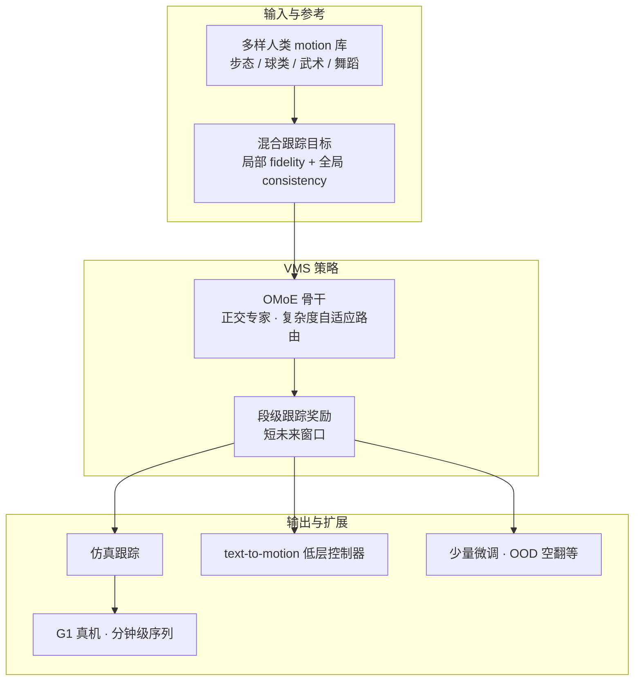

# KungfuBot 2（VMS — Versatile Motion Skills）

**KungfuBot 2**（*Learning Versatile Motion Skills for Humanoid Whole-Body Control*，ICRA 2026，arXiv:[2509.16638](https://arxiv.org/abs/2509.16638)，[项目页](https://kungfubot2-humanoid.github.io/)，实现见 [PBHC](https://github.com/TeleHuman/PBHC) general motion tracking）由 **TeleAI**、**SJTU**、**ECUST** 提出 **VMS** 统一全身控制器：在 **单一策略** 内学习多样动态行为，并在 **分钟级长序列** 上保持准确模仿与稳定。

## 一句话定义

VMS 用 **局部保真 + 全局轨迹一致** 的混合跟踪目标、**正交混合专家 OMoE** 与 **段级未来窗口奖励**，让单策略覆盖步态、球类、踢腿、武术与长舞蹈序列，并在仿真/真机优于 ExBody2、GMT，还可对接 text-to-motion 高层规划。

## 英文缩写速查

| 缩写 | 英文全称 | 简要说明 |
|------|----------|----------|
| VMS | Versatile Motion Skills | 本文统一全身控制器框架名 |
| OMoE | Orthogonal Mixture-of-Experts | 正交化专家子空间，促进技能专业化与组合 |
| MoE | Mixture of Experts | 多专家路由；OMoE 对其正交约束扩展 |
| WBT | Whole-Body Tracking | 全身运动模仿任务 |
| GMT | General Motion Tracking | 领域通用称呼；本文对比基线之一 |
| BC | Behavior Cloning | 与 RL 跟踪互补的模仿范式（本文非主路径） |
| G1 | Unitree G1 Humanoid | 真机验证平台 |
| PBHC | Physics-Based Humanoid Control | 官方代码库，含 v1/v2 训练栈 |

## 为什么重要

- **单策略多技能：** 走路、正步、跑步、羽毛球、多样踢腿、武术、长舞蹈/武术序列共用 **一个控制器**——迈向 general-purpose humanoid 低层 WBC。
- **长时域稳健：** 按时长分组评测显示基线随序列变长退化，VMS **维持低误差**——对舞台表演、套路武术等 **分钟级** 任务关键。
- **混合跟踪解决漂移与失衡：** 纯全局跟踪在急转跑动累积误差；逐步匹配在侧踢/急转易失稳；**段级短未来窗口** 兼顾风格与稳定性。
- **可扩展为通用底座：** 项目页展示 **text-to-motion** 指令跟踪与 **少量微调** 适应空翻等 OOD 技能——适合作为高层 VLA/规划器的低层执行器。

## 核心信息

| 字段 | 内容 |
|------|------|
| 机构 | 中国电信人工智能（TeleAI）；上海交通大学（SJTU）；华东理工大学（ECUST） |
| 会议 | ICRA 2026 |
| 框架名 | VMS（Versatile Motion Skills） |
| 代码 | <https://github.com/TeleHuman/PBHC>（2025-10 general motion tracking） |
| 对比基线 | ExBody2、GMT 等 |

## 流程总览

## 核心机制（归纳）

### 1）Hybrid Tracking Objective

- **局部：** 关节/身体部位姿态与速度保真。
- **全局：** 根轨迹/位移一致性，避免仅跟踪根速度带来的 **全局漂移**。
- 可视化对比：快速跑动急转时纯全局失败；侧踢时逐步匹配失稳；VMS 段级窗口 **平滑过渡且保风格**。

### 2）OMoE（Orthogonal Mixture-of-Experts）

- 相对标准 MoE/MLP：**更低跟踪误差、更好泛化**。
- 正交约束使各专家学习 **区分技能子空间**；重复步态（走路）激活少数专家，多变舞蹈激活更多专家——体现 **按需组合**。

### 3）Segment-Level Tracking Reward

- 放松逐步刚性对齐，在短 **未来时间窗** 内评估跟踪质量。
- 对 **全局位移误差** 与 **瞬时失衡** 更鲁棒，支撑长序列。

## 实验与真机

- **主指标：** 局部与全局误差均优于 ExBody2、GMT；同时控制根位置漂移。
- **长序列：** 按时长分桶，基线随时长退化，VMS 稳健。
- **真机：** 风格化 locomotion、羽毛球/抛球/挥拍、多样踢腿、武术、Charleston/自由舞/长武术套路等（见 [项目页](https://kungfubot2-humanoid.github.io/)）。
- **下游：** 自然语言 text-to-motion；极限 OOD 技能少量微调。

## 常见误区

1. **VMS ≠ KungfuBot v1 小改：** v1 侧重 **高动态单技能 + 自适应容差课程**；v2 是 **多技能架构（OMoE + 混合目标 + 段奖励）** 问题设定不同。
2. **仓库分支：** 读 PBHC 时注意 2025-10 后 **general motion tracking** 对应 v2；v1 方法与 checkpoint 仍在同库但配置不同。
3. **与 loco-manip 161 综述条目一致：** 教师-学生/特权信息训练脉络与 [loco_manip_161 摘录](../../sources/papers/loco_manip_161_survey_013_kungfubot2.md) 相符，但实体页以项目页/论文为准。

## 与其他页面的关系

- **前作：** [KungfuBot v1](./paper-notebook-kungfubot-physics-based-humanoid-whole-body-cont.md) — 高动态武术 + 自适应课程
- **姊妹：** [KungFuAthleteBot](./paper-kungfuathlete-humanoid-martial-arts-tracking.md) — 数据集 + recovery
- **方法：** [imitation-learning](../methods/imitation-learning.md)、[reinforcement-learning](../methods/reinforcement-learning.md)
- **概念：** [whole-body-control](../concepts/whole-body-control.md)、[sim2real](../concepts/sim2real.md)
- **代码：** [pbhc.md](../../sources/repos/pbhc.md)

## 参考来源

- [kungfubot2_vms_icra2026.md](../../sources/papers/kungfubot2_vms_icra2026.md) — 项目页+论文策展
- [pbhc.md](../../sources/repos/pbhc.md) — PBHC 官方仓库
- [humanoid_pnb_kungfubot-2.md](../../sources/papers/humanoid_pnb_kungfubot-2.md) — Paper Notebooks 索引锚点

## 推荐继续阅读

- KungfuBot2 项目页：<https://kungfubot2-humanoid.github.io/>
- PBHC 仓库：<https://github.com/TeleHuman/PBHC>
- 论文 PDF：<https://arxiv.org/abs/2509.16638>
