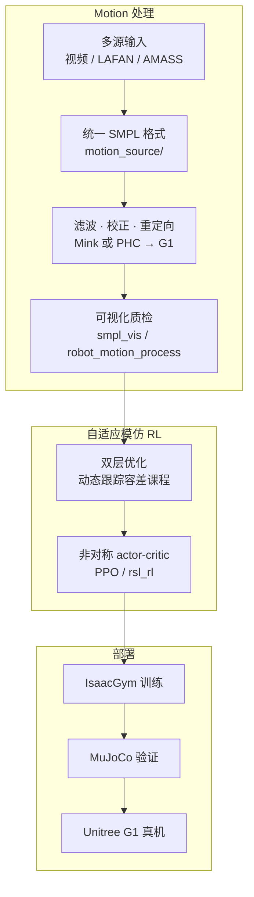

# KungfuBot（Physics-Based Highly-Dynamic WBT）

**KungfuBot**（*Physics-Based Humanoid Whole-Body Control for Learning Highly-Dynamic Skills*，NeurIPS 2025，arXiv:[2506.12851](https://arxiv.org/abs/2506.12851)，[项目页](https://kungfubot.github.io/)，[PBHC](https://github.com/TeleHuman/PBHC)）由 **中国电信人工智能（TeleAI）**、**上海交通大学（SJTU）** 等提出：在 physics-based 框架下，让人形通过模仿人类 **高动态** 行为（武术、舞蹈）获得稳定全身控制，并 **成功部署于 Unitree G1**。

## 一句话定义

KungfuBot 用「提取—滤波—校正—重定向」的物理约束 motion 管线清洗参考轨迹，再以 **根据跟踪误差动态调节容差的双层优化课程** 训练 **非对称 actor-critic** 策略，使 G1 在真机稳定执行踢腿、旋子、太极等高难 WBT。

## 英文缩写速查

| 缩写 | 英文全称 | 简要说明 |
|------|----------|----------|
| PBHC | Physics-Based Humanoid Control | TeleHuman 官方代码库名（实现 KungfuBot 系列） |
| WBT | Whole-Body Tracking | 全身关节/根轨迹模仿类 RL 任务 |
| SMPL | Skinned Multi-Person Linear Model | 统一人体 motion 表示；PBHC 管线中间格式 |
| RL | Reinforcement Learning | IsaacGym + PPO（rsl_rl）训练模仿策略 |
| CoM | Center of Mass | 质心；motion 处理与奖励中用于物理约束 |
| G1 | Unitree G1 Humanoid | 论文真机平台 |
| WBC | Whole-Body Control | 协调全身关节完成动态技能的控制层 |
| Sim2Real | Simulation to Real | IsaacGym 训练 → MuJoCo 验证 → G1 部署 |

## 为什么重要

- **突破低速跟踪天花板：** 相较仅能跟踪平滑慢速动作的基线，在 **高动态武术/舞蹈** 上显著降低跟踪误差，且 **可真机部署**（非仅仿真 oracle）。
- **自适应课程而非手工调参：** 将跟踪精度容差写成 **双层优化**，按当前误差自动调节——比固定 tracking factor 在各动作上更稳健（项目页消融）。
- **可复现端到端栈：** [PBHC](https://github.com/TeleHuman/PBHC) 公开 motion 处理（GVHMR/Mink/PHC）+ IsaacGym 训练 + MuJoCo/真机接口，1000+ stars 社区基准。
- **谱系入口：** 同团队 [KungfuBot 2](./paper-notebook-kungfubot-2.md) 扩展为 **VMS 多技能长序列**；[KungFuAthleteBot](./paper-kungfuathlete-humanoid-martial-arts-tracking.md) 从 **运动员数据集 + recovery** 角度互补。

## 核心信息

| 字段 | 内容 |
|------|------|
| 机构 | 中国电信人工智能（TeleAI）；上海交通大学（SJTU）；华东理工大学（ECUST）；哈尔滨工业大学（HIT）；上海科技大学（ShanghaiTech） |
| 会议 | NeurIPS 2025 |
| 平台 | Unitree G1；IsaacGym 训练，MuJoCo sim2sim |
| 代码 | <https://github.com/TeleHuman/PBHC> |
| 许可 | CC BY-NC 4.0（禁止商业演示） |

## 流程总览

## 核心机制（归纳）

### 1）多阶段 Motion 处理

- **目标：** 在重定向前尽可能满足 **物理可行性**（支撑相、脚滑抑制、动态一致性）。
- **PBHC 实现：** 视频经 GVHMR；可选用 MaskedMimic/Mink 或 PHC 重定向；IPMAN 相关滤波；输出 G1 关节轨迹供 RL。

### 2）自适应 Motion Tracking（Bi-Level Curriculum）

- 将「可接受的跟踪偏差」作为 **可学习/可优化变量**，随 **当前 episode 跟踪误差** 调整——难动作自动放宽、易动作收紧。
- **对比固定 factor：** 项目页显示自适应机制在各 motion 上接近最优；固定 variant 对不同动作表现分化明显。

### 3）非对称 Actor-Critic

- Critic 可使用 **特权信息**（如完整参考、接触）；Actor 仅 **部署可得观测**——与后续 KungfuBot2 教师-学生脉络一致，但 v1 侧重 **单技能高动态** 而非多专家泛化。

## 实验与真机

- **仿真：** 多难度 motion 集上 PBHC **一致优于** 可部署基线，接近 oracle；Tai Chi 等 sim-to-real 根轨迹形态对齐（真机根位姿不可测，实验固定原点）。
- **真机（G1）：** Jump/roundhouse/side/front/back kick、360° spin、舞蹈、李小龙 pose、组合拳、马步、太极、stretch leg 等（见 [项目页](https://kungfubot.github.io/) 视频）。

## 常见误区

1. **PBHC ≠ 仅论文代码：** 2025-10 起同一仓库已支持 KungfuBot2 **general motion tracking**——读 README 时区分 v1 论文方法与 v2 VMS 模块。
2. **不是纯 BC：** 核心是 **physics-based RL 模仿** + 课程，而非行为克隆直接回归关节角。
3. **与 KungFuAthlete 不同重点：** 后者强调 **运动员级数据集统计 + tracking∪recovery**；KungfuBot v1 强调 **单技能高动态 + 自适应容差**。

## 与其他页面的关系

- **续作：** [KungfuBot 2 / VMS](./paper-notebook-kungfubot-2.md) — 单策略多技能、OMoE、段级奖励、长序列
- **姊妹：** [KungFuAthleteBot](./paper-kungfuathlete-humanoid-martial-arts-tracking.md) — 武术数据集 + 跌倒恢复
- **概念：** [motion-retargeting](../concepts/motion-retargeting.md)、[curriculum-learning](../concepts/curriculum-learning.md)、[sim2real](../concepts/sim2real.md)
- **平台：** [Unitree G1](./unitree-g1.md)
- **代码：** [pbhc.md](../../sources/repos/pbhc.md)

## 参考来源

- [kungfubot_pbhc_neurips2025.md](../../sources/papers/kungfubot_pbhc_neurips2025.md) — 项目页+论文策展
- [pbhc.md](../../sources/repos/pbhc.md) — 官方仓库与模块说明
- [humanoid_pnb_kungfubot-physics-based-humanoid-whole-body-cont.md](../../sources/papers/humanoid_pnb_kungfubot-physics-based-humanoid-whole-body-cont.md) — Paper Notebooks 索引锚点

## 推荐继续阅读

- KungfuBot 项目页：<https://kungfubot.github.io/>
- PBHC 仓库：<https://github.com/TeleHuman/PBHC>
- OpenReview：<https://openreview.net/forum?id=LCPoXt0pzm>
