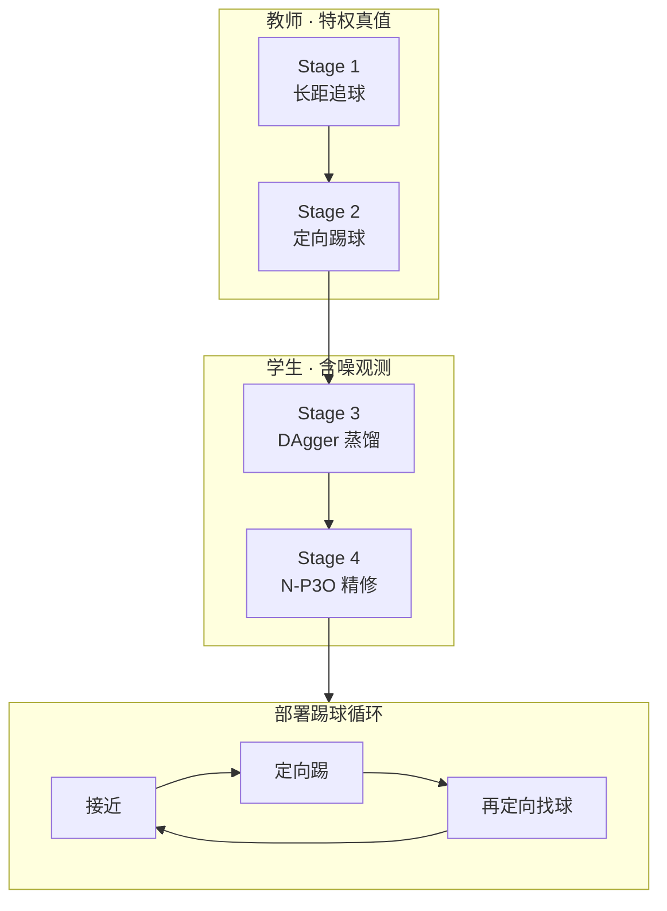
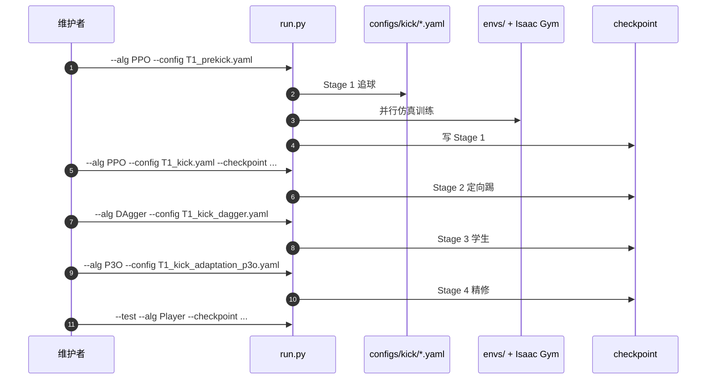

# Learning Agile Striker Skills for Humanoid Soccer Robots

**Learning Agile Striker Skills for Humanoid Soccer Robots from Noisy Sensory Input**（[arXiv:2512.06571](https://arxiv.org/abs/2512.06571)，ICRA 2026，[代码](https://github.com/Daffan/humanoid-soccer)）由 **UT Austin LARG / AMRL · Sony AI** 提出：面向 **连续踢球循环**（长距追球 → 定向摆腿 → 再定向找球），用四阶段教师–学生管线在 **含噪球/门估计** 下部署到 **Booster T1**。收录于 [Robot Learning Paper Notebooks](https://imchong.github.io/Robot_Learning_Paper_Notebooks/index.html)（分类：04_Loco-Manipulation_and_WBC）。

## 一句话定义

**特权教师先学会追球和定向踢球，再用真实噪声模型蒸馏给学生，最后用约束 RL（N-P3O）把抖动和不安全急转压下去，形成可连续射门的含噪感知策略。**

## 英文缩写速查

| 缩写 | 英文全称 | 简要说明 |
|------|----------|----------|
| RL | Reinforcement Learning | 教师/学生阶段的主学习范式 |
| PPO | Proximal Policy Optimization | Stage 1–2 教师优化；消融基线 |
| DAgger | Dataset Aggregation | Stage 3 特权教师 → 含噪学生蒸馏 |
| N-P3O | Constrained RL（文中 P3O 变体） | Stage 4 在正则代价约束下精修任务回报 |
| SR | Success Rate | 球过门线（门柱间）试验占比 |
| DR | Domain Randomization | 推搡、球质量/摩擦、关节动力学扰动 |
| T1 | Booster T1 Humanoid | 1.18 m / 23 DoF 真机平台 |
| YOLO | You Only Look Once | 真机 RGB-D 球检测（YOLOv8） |

## 为什么重要

- **把「敏捷踢球」定为全身 visuomotor 基准：** 快速摆腿 + 单脚支撑 + 感知噪声同时成立，比纯 locomotion 更挑策略。
- **噪声模型写进训练：** 速度相关噪声、延迟/异步更新、遮挡丢帧——对齐机载检测真实故障模式。
- **约束 RL 解决不均匀 credit：** 触球前高即时回报时段，固定正则系数易导致抖腿与急转；N-P3O 显著降能耗并提 SR。
- **可复现：** 项目页 + [Daffan/humanoid-soccer](https://github.com/Daffan/humanoid-soccer)（基于 Booster Gym）。

## 核心信息

| 项 | 内容 |
|----|------|
| **机构** | 德州大学奥斯汀分校（UT Austin）；索尼（Sony AI） |
| **平台** | Booster T1；策略 50 Hz 关节位置目标 |
| **传感（真机）** | ZED 2i + YOLOv8 球检测；腿惯导里程计估门位 |
| **计算** | 机载 NVIDIA AGX Orin |
| **开源** | **已开源**（截至 **2026-07-28**）：[Daffan/humanoid-soccer](https://github.com/Daffan/humanoid-soccer)；项目页 [humanoidsoccer.github.io](https://humanoidsoccer.github.io) |

## 流程总览

## 核心机制（方法栈）

### 1）Stage 1–2：特权教师课程

- 教师观测含真值球/门、球速与球物理参数；追球命令始终对齐机–球向量。
- Stage 2 在推搡与漏踢恢复随机化下学定向踢球，最大化朝门方向球速。

### 2）Stage 3：含噪蒸馏

- DAgger 把教师压到仅含噪球/门位置的学生。
- 噪声三件套：**速度相关噪声**、**延迟/异步**、**遮挡丢帧**。

### 3）Stage 4：约束精修

- 最大化任务回报，同时约束正则代价（N-P3O），缓解触球前时段的不均匀惩罚。
- 消融：N-P3O **79.5%** SR / **108.6 J/s** vs PPO 固定正则 **64.8%** / **255.8 J/s**；adaptation 前学生仅 **52.3%** SR。

## 源码运行时序图

复现路径：Isaac Gym Preview 4 + Booster Gym 依赖 → `python run.py` 按 Stage 1→4 配置链式训练；`--test` 加载 Player 评测。

## 与其他工作对比

| 维度 | Agile Striker | PAiD | Vision-Driven Reactive Soccer |
|------|---------------|------|-------------------------------|
| **核心切口** | 含噪感知下连续踢球 | 拟人 MoCap 渐进融合 | AMP + 虚拟感知 + 主动看球 |
| **蒸馏** | 四阶段教师–学生 + N-P3O | 无教师蒸馏叙事 | encoder-decoder 恢复特权态 |
| **平台** | Booster T1 | Unitree G1 | Booster 平台（项目致谢） |
| **真机 SR** | **66.7%**（5 球位） | 高成功率连踢（工作区叙事） | 项目页强调 RoboCup 连贯性 |

## 实验与评测

- **仿真：** 9×9 球位网格 × 50 trials；平均 SR **79.5%**、kick accuracy **0.956**、最大球速 **4.13 m/s**。
- **真机：** Kid-Size 场；机位距门 **6.5 m**；五球位各 3 trials，总 SR **66.7%**（中心 3/3）。
- **消融：** 约束 RL 与 online adaptation 均为必要；adaptation 后接近特权教师 **81.1%** SR。

## 结论

**在含噪球/门估计下要做到连续敏捷踢球，关键不在「再堆一个奖励」，而在噪声对齐的蒸馏 + 约束精修。**

1. **踢球循环三相位** — 接近、摆腿、再定向找球要同一策略贯通。
2. **噪声模型要对齐检测故障** — 速度噪声、延迟、丢帧缺一会掉真机。
3. **Stage 4 不可省** — 蒸馏后 52.3% → 精修后 79.5%，能耗腰斩。
4. **N-P3O 换平滑** — 相对 PPO 固定正则，SR 升且能耗降一半以上。
5. **局限** — 追球步态仍重度依赖行走奖励工程；换到差异大的运动技能需另寻运动先验路线。

## 局限与风险

- 长距追球奖励从行走任务改造，换任务时迁移性存疑（作者自述）。
- 真机评测规模较小（每球位 3 trials）；读 66.7% 时注意置信区间。
- 仓库 LICENSE SPDX `NOASSERTION`，以根目录声明为准。

## 与其他页面的关系

- 任务：[Humanoid Soccer](../tasks/humanoid-soccer.md)
- 选型：[技能学习方法选型](../queries/humanoid-soccer-skill-learning-method-selection.md)
- 对照：[PAiD](./paper-notebook-learning-soccer-skills-for-humanoid-robots.md)、[Vision-Driven Reactive Soccer](./paper-hrl-stack-26-learning_vision_driven_reactive_socc.md)
- 分类父节点：[paper-notebook-category-04](../overview/paper-notebook-category-04-loco-manipulation-and-wbc.md)

## 参考来源

- [humanoid_pnb_learning-agile-striker-skills-for-humanoid-socce.md](../../sources/papers/humanoid_pnb_learning-agile-striker-skills-for-humanoid-socce.md)
- [humanoidsoccer-agile-striker.md](../../sources/sites/humanoidsoccer-agile-striker.md)
- [humanoid-soccer-agile-striker.md](../../sources/repos/humanoid-soccer-agile-striker.md)
- 论文：<https://arxiv.org/abs/2512.06571>
- 深读笔记：<https://imchong.github.io/Robot_Learning_Paper_Notebooks/papers/04_Loco-Manipulation_and_WBC/Learning_Agile_Striker_Skills_for_Humanoid_Soccer_Robots_from_Noisy_Sensory_Input/Learning_Agile_Striker_Skills_for_Humanoid_Soccer_Robots_from_Noisy_Sensory_Input.html>

## 推荐继续阅读

- 项目页：<https://humanoidsoccer.github.io>
- [人形足球纵深路线 Stage 3](../../roadmap/depth-humanoid-soccer.md)
