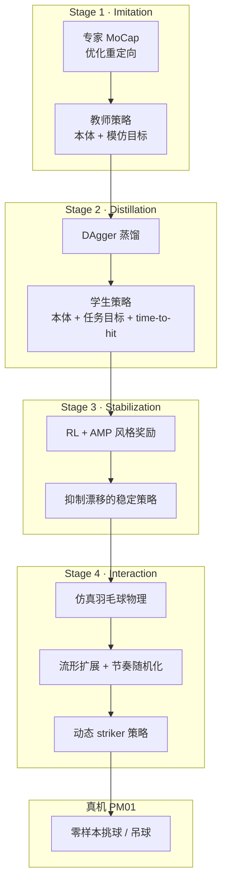

# LHBS：人形拟人羽毛球技能学习

**LHBS**（*Learning Human-Like Badminton Skills for Humanoid Robots*，arXiv:2602.08370）由香港大学与 EngineAI 提出，收录于 [Humanoid Robot Learning Paper Notebooks](https://imchong.github.io/Humanoid_Robot_Learning_Paper_Notebooks/index.html)（分类：04_Loco-Manipulation_and_WBC）。核心命题：把人形从 **运动模仿者（mimic）** 渐进培养成 **能击球的 striker**，在保持拟人风格的同时完成 **时序关键、物理一致的羽毛球拦截**。

## 一句话定义

**用 Imitation-to-Interaction 四阶段管线（MoCap 教师模仿 → DAgger 目标条件蒸馏 → AMP 风格稳定 → 羽毛球物理交互 + 流形扩展），在 EngineAI PM01 上实现首个零样本 sim2real 的拟人羽毛球击球技能（正/反手挑球、吊球等）。**

## 英文缩写速查

| 缩写 | 英文全称 | 简要说明 |
|------|----------|----------|
| LHBS | Learning Human-Like Badminton Skills | 本文方法/论文简称 |
| AMP | Adversarial Motion Prior | Stage 3 用判别器注入 **风格奖励**，抑制动力学漂移 |
| DAgger | Dataset Aggregation | Stage 2 将教师蒸馏到紧凑观测的学生策略 |
| SR | Success Rate | 成功拦截并触球的回合比例 |
| MSE | Mean Squared Error | 空间跟踪/击球精度误差 |
| IBR | In-Bounds Reward | 回球质量（含过网等约束） |
| WBC | Whole-Body Control | 爆发全身协调完成击球与恢复 |
| Sim2Real | Simulation to Real | 本文报告 **零样本** 真机迁移 |

## 为什么重要

- **模仿 ≠ 能打球：** 近年人形运动模仿很强，但羽毛球要求 **功能性击球** 与 **拟人风格** 同时成立；LHBS 显式把「像人」与「打得着」拆成可训练的渐进阶段。
- **稀疏演示 → 稠密交互：** MoCap 击球点极少；**流形扩展（manifold expansion）** 把离散击球样本推广到稠密时空流形，是 Stage 4 能泛化动态拦截的关键。
- **真机稀缺结果：** 作者称 **首个** 拟人羽毛球技能 **零样本 sim2real**；PM01 受控试验正手挑球 **90%**、反手挑球 **70%** SR（各 10 次）。
- **与 LATENT 互补：** 同为人形 **球类竞技** 路线，LATENT 解决不完美网球 MoCap + latent 修正；LHBS 解决 **物理击球交互** 与 AMP 稳定，可对照阅读 [LATENT](./paper-notebook-latent.md)。

## 流程总览

## 核心机制（归纳）

### 1）运动数据处理与重定向

- 采集专家羽毛球动作，经 **优化式重定向** 映射到 PM01 动力学可行空间。
- Stage 1 教师用 **本体感知 + 模仿目标**（含未来参考轨迹）学习鲁棒跟踪。

### 2）目标条件蒸馏（Stage 2）

- **DAgger** 将教师能力压缩到 **精简观测**：本体、**击球/恢复目标状态**、**time-to-hit**。
- 去掉对未来完整运动轨迹的依赖，为下游 RL 与真机部署减负。

### 3）AMP 风格稳定（Stage 3）

- 在蒸馏策略上继续 RL，加入 **AMP 判别器风格奖励**，最小化跟踪误差。
- 消融 **w/o Stab.**：SR 相近但 **MSE 明显变差**（0.0094 vs 0.0062 easy），说明对抗先验主要稳住 **空间精度**。

### 4）交互驱动精炼（Stage 4）

- **流形扩展：** 把稀疏 MoCap 击球点泛化为稠密 **interaction volume**，覆盖不同来球时空。
- **羽毛球物理仿真** + **节奏随机化**，学习 lift / drop shot 等多样技能。
- 消融 **w/o Interact.**：SR 跌至 ~0.38，证明仅靠模仿无法完成动态拦截。

## 常见误区

1. **≠ 纯 MoCap 跟踪：** 四阶段终点是 **物理击球交互**；停在 Stage 1–2 只是「像人挥拍」，未必触球成功。
2. **AMP 不是全程唯一监督：** Stage 1 是模仿跟踪，Stage 3 才引入 AMP；与 **E2E-AMP** 基线（SR 0.86/0.74 easy/hard）相比，分阶段管线更稳。
3. **E2E-AMP 的 IBR 偶高不代表更好：** 作者指出其 **幸存者偏差**——低 SR 下只打到易回界球，IBR 数字可能误导。
4. **零样本 ≠ 无动捕：** 真机评测用 FZMotion 提供基座与球位 **ground truth**；工程上仍需感知/状态估计闭环，读部署时要区分 **训练迁移** 与 **实验状态来源**。

## 实验与评测

- **仿真（Isaac Lab）：** 物理 200 Hz、策略 50 Hz；easy/hard 双难度 Lift 任务。
- **指标：** SR（触球可靠性）、MSE（空间精度）、IBR（回球质量）。
- **主结果（Ours）：** SR 0.9516/0.9153，MSE 0.0062/0.0108（easy/hard）；全面优于 w/o Stab.、E2E-AMP、w/o Interact.、ASE/VQ 基线。
- **真机（PM01）：** 正手挑球 **90%**、反手挑球 **70%** SR（各 10 trials）；项目页与论文 Fig. 1 展示触球瞬间。

## 与其他页面的关系

- 分类父节点：[paper-notebook-category-04-loco-manipulation-and-wbc](../overview/paper-notebook-category-04-loco-manipulation-and-wbc.md)
- 球类姊妹：[LATENT](./paper-notebook-latent.md)（网球）、[Whole-Body Badminton](./paper-notebook-humanoid-whole-body-badminton-via-multi-stage-re.md)（另一羽毛球多阶段 RL 条目）
- 方法：[amp-reward.md](../methods/amp-reward.md)
- 任务：[loco-manipulation.md](../tasks/loco-manipulation.md)
- 概念：[sim2real.md](../concepts/sim2real.md)

## 参考来源

- [lhbs_learning_human_like_badminton_skills_arxiv_2602_08370.md](../../sources/papers/lhbs_learning_human_like_badminton_skills_arxiv_2602_08370.md)
- [humanoid_pnb_learning-human-like-badminton-skills-for-humanoi.md](../../sources/papers/humanoid_pnb_learning-human-like-badminton-skills-for-humanoi.md)
- 项目页：<https://astrorix.github.io/LHBS/>
- 论文：<https://arxiv.org/abs/2602.08370>
- 深读笔记：<https://imchong.github.io/Humanoid_Robot_Learning_Paper_Notebooks/papers/04_Loco-Manipulation_and_WBC/Learning_Human-Like_Badminton_Skills_for_Humanoid_Robots/Learning_Human-Like_Badminton_Skills_for_Humanoid_Robots.html>

## 推荐继续阅读

- [LATENT：不完美网球 MoCap 的人形网球技能](./paper-notebook-latent.md)
- [AMP 风格奖励机制](../methods/amp-reward.md)
- [arXiv HTML 全文](https://arxiv.org/html/2602.08370v1)
