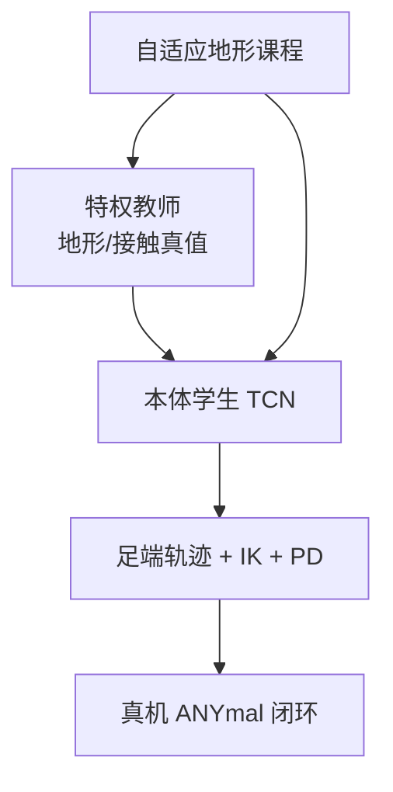

# Challenging Terrain Locomotion（复杂地形四足）

**Learning Quadrupedal Locomotion over Challenging Terrain**（Science Robotics 2020，[DOI](https://doi.org/10.1126/scirobotics.abc5986)；预印本常见为 [arXiv:2010.11251](https://arxiv.org/abs/2010.11251)）证明：只依赖本体感知、在仿真中训练的 RL 控制器，也可以零样本迁移到泥地、雪地、碎石、植被和流水等真实复杂地形上的 ANYmal。HMI 编号 **P008**。

## 一句话定义

用特权教师、本体历史学生与自适应地形课程，把「接触后才能可靠观测的地面属性」压进可部署的盲走策略。

## 英文缩写速查

| 缩写 | 英文全称 | 简要说明 |
|------|----------|----------|
| RL | Reinforcement Learning | 策略学习主线 |
| TCN | Temporal Convolutional Network | 学生用历史本体构造表征 |
| DAgger | Dataset Aggregation | 学生轨迹上请教师标注 |
| Sim2Real | Simulation to Real | 零样本野外部署 |
| PD | Proportional–Derivative | 关节目标执行 |

## 为什么重要

- **反直觉但工程正确**：摩擦、松软、塌陷很难由远距离视觉测准；接触后的高速本体反馈往往更可靠。
- **三件套缺一不可**：特权教师、学生蒸馏、自适应课程共同决定数据是否落在能力边界。
- **后续感知 loco 的对照基线**：与 [Robust Perceptive Locomotion](./paper-robust-perceptive-locomotion-wild.md) 对照时，可分清「盲走适应」与「带噪地图信念」两条线。

## 核心原理

1. **特权教师**：仿真中可见地形、接触与环境参数，学会跨越分布。
2. **本体学生**：仅见命令与 IMU/关节历史（论文 TCN 窗口约 2 s），同时模仿教师动作与环境 latent。
3. **自适应课程**：粒子式保留通过率约 0.5–0.9 的地形参数区，训练信号集中在能力边界。

控制输出是相位/足端残差等结构化动作，再经轨迹生成与 IK 到关节 PD——不是无结构端到端力矩策略。

## 工程实践

| 检查项 | 建议 |
|--------|------|
| 部署观测 | 只留命令 + 本体历史；删除特权与奖励 |
| 能力边界 | 盲走覆盖接触后适应，不替代沟壑边缘等需提前外感知的任务 |
| 平台 | 论文证据主要在 ANYmal 家族 |

## 源码运行时序图

**不适用**（经典系统论文；本库不以单一官方训练仓作为复现入口）。机制细节见深读笔记。

## 实验与评测读法

- 关注零样本自然环境种类与两代 ANYmal 迁移，而非单一室内地形刷分。
- 结论应写成「本体闭环负责接触后适应」，不要写成「视觉无用」。

## 结论

**这是盲走复杂地形的里程碑：把特权信息蒸馏进本体历史，用课程盯住能力边界。**

- 外感知与本体适应应分工，而不是互相替代。
- 结构化步态骨架 + 学习残差降低了端到端力矩的难度。
- 评测要分清「能适应脚下变化」与「能提前选路」。
- HMI / Paper Notebooks 均可作为入口，细节以原文与深读笔记为准。

## 局限与风险

- 需要提前绕障或落脚选择的任务仍要视觉/地图。
- 课程与特权定义绑定仿真器能力，换平台需重做 SysID/PD 经验模型。
- 索引页旧 stub 状态已升格；数值以 PDF 为准。

## 关联页面

- [Privileged Training](../concepts/privileged-training.md)
- [ANYmal](./anymal.md)
- [Robust Perceptive Locomotion](./paper-robust-perceptive-locomotion-wild.md)
- [HMI 论文导读](../queries/hmi-papers-coverage.md)
- [Paper Notebooks 高影响分类](../overview/paper-notebook-category-03-high-impact-selection.md)

## 参考来源

- [humanoid_pnb_learning-quadrupedal-locomotion-over-challenging.md](../../sources/papers/humanoid_pnb_learning-quadrupedal-locomotion-over-challenging.md)
- [humanoid-motion-intelligence.md](../../sources/repos/humanoid-motion-intelligence.md)

## 推荐继续阅读

- [Science Robotics DOI](https://doi.org/10.1126/scirobotics.abc5986)
- [arXiv:2010.11251](https://arxiv.org/abs/2010.11251)
- [深读笔记](https://imchong.github.io/Humanoid_Robot_Learning_Paper_Notebooks/papers/03_High_Impact_Selection/Learning_Quadrupedal_Locomotion_over_Challenging_Terrain/Learning_Quadrupedal_Locomotion_over_Challenging_Terrain.html)
- [HMI P008](https://github.com/RealXiaoze/humanoid-motion-intelligence/blob/main/%E8%AE%BA%E6%96%87%E4%B8%8E%E9%A1%B9%E7%9B%AE/%E8%AE%BA%E6%96%87%E9%80%90%E7%AF%87%E8%A7%A3%E8%AF%BB/P008.md)
