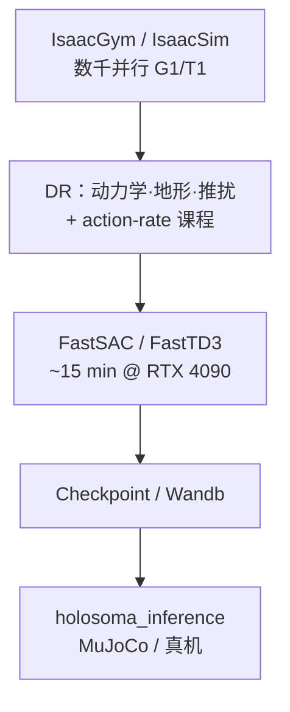
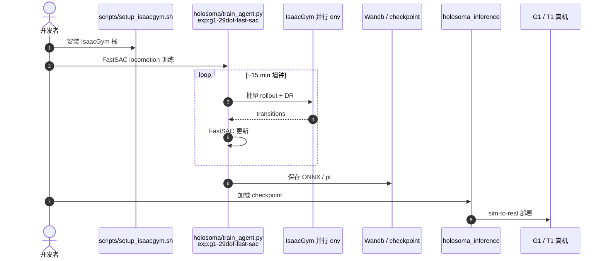

# Learning Sim-to-Real Humanoid Locomotion in 15 Minutes

**Learning Sim-to-Real Humanoid Locomotion in 15 Minutes**（[arXiv:2512.01996](https://arxiv.org/abs/2512.01996)，Amazon FAR）提出面向 **Unitree G1 / Booster T1** 的 **FastSAC / FastTD3** 人形 sim-to-real 配方：在 **单张 RTX 4090**、**数千并行环境** 下，用 **极简奖励 + 强域随机化**（动力学、粗糙地形、推扰、action-rate 课程）把 **全关节速度跟踪** 训练墙钟压到 **约 15 分钟**，并完成真机迁移；项目页演示 **WBT**（box lifting、dancing 等）。**官方实现已开源**于 [Holosoma](./holosoma.md)（[amazon-far/holosoma](https://github.com/amazon-far/holosoma)）。

## 一句话定义

**把 off-policy 人形 RL 的迭代单位从「天/小时」改成「分钟」：FastSAC/FastTD3 大规模并行调参 + 强 DR，单卡 15 分钟出可部署 G1/T1 行走策略。**

## 英文缩写速查

| 缩写 | 英文全称 | 简要说明 |
|------|----------|----------|
| FastSAC | Fast Soft Actor-Critic | 面向大规模并行仿真调参的 SAC 变体 |
| FastTD3 | Fast Twin Delayed DDPG | 面向大规模并行仿真调参的 TD3 变体 |
| RL | Reinforcement Learning | 通过与环境交互最大化长期回报来学习策略 |
| DR | Domain Randomization | 训练时随机化仿真参数以提升 sim-to-real |
| WBT | Whole-Body Tracking | 全身参考动作/技能跟踪任务 |
| Sim2Real | Simulation to Real | 仿真策略迁移真机 |
| G1 | Unitree G1 Humanoid | 论文与项目页主要真机平台之一 |
| T1 | Booster T1 Humanoid | 论文与项目页另一真机平台 |

## 为什么重要

- **墙钟革命：** 让人形 sim-to-real **日常可迭代**（15 min 级），降低算法/奖励/DR 试错的组织成本。
- **Holosoma 生态锚点：** 项目页与论文共用 **Holosoma** 开源栈（训练 + 推理 + 重定向），后续 [LooperMuscle](./paper-loopermuscle.md)、[FDDC](./paper-fddc.md) 等多在此基座上扩展。
- **FlashSAC 前驱：** [FlashSAC](../methods/flashsac.md) 在同一 off-policy 墙钟脉络上用 **更大网络 + 范数约束** 换渐近性能；本文是 **~0.2M 小网络极速路线**。

## 核心信息

| 项 | 内容 |
|----|------|
| **机构** | Amazon FAR（Frontier AI & Robotics） |
| **项目页** | <https://younggyo.me/fastsac-humanoid/> |
| **论文** | <https://arxiv.org/abs/2512.01996> |
| **代码** | **已开源** — [amazon-far/holosoma](https://github.com/amazon-far/holosoma)（Apache-2.0） |
| **硬件** | 训练：单张 RTX 4090；真机：G1、T1 |
| **训练墙钟** | Locomotion **~15 min**（项目页视频均为 15 min checkpoint） |

## 核心原理

### 配方三要素

1. **Off-policy 大规模并行：** FastSAC / FastTD3 针对 **数千 env** 重新调参（相对经典 SAC/TD3 更稳、更快 wall-clock）。
2. **极简奖励：** 速度跟踪 + 少量正则（含 **action-rate 课程**），避免复杂 shaping 拖慢收敛。
3. **强域随机化：** 动力学、粗糙地形、推扰等 **端到端** 与策略同训，支撑 zero-shot sim-to-real。

### 流程总览

## 源码运行时序图

官方实现见 [Holosoma](https://github.com/amazon-far/holosoma)（归档 [sources/repos/holosoma.md](../../sources/repos/holosoma.md)）：

## 工程实践

| 项 | 建议 |
|----|------|
| **入口** | `exp:g1-29dof-fast-sac`（G1）；T1 见 Holosoma 配置族 |
| **对照** | 同仓 **PPO** 基线可用，但墙钟通常显著更长 |
| **延伸** | WBT、OmniRetarget 重定向见 Holosoma 三子包文档 |
| **后继** | 要渐近性能 → [FlashSAC](../methods/flashsac.md)；要 WBT 质量/墙钟平衡 → [LooperMuscle](./paper-loopermuscle.md) |

## 局限与风险

- **小网络上限：** FastSAC/FastTD3 配方优先 **速度**；极限性能由 FlashSAC 等 scaling 路线承接。
- **仿真器依赖：** IsaacGym/IsaacSim 安装与 GPU 驱动仍是环境门槛。
- **15 min 非万能：** 复杂 WBT/接触丰富技能仍需更长训练或架构改动（见项目页 WBT 演示 vs locomotion 训练时长说明）。

## 实验与评测

- **主结果口径：** 单张 **RTX 4090** + 数千并行环境，**约 15 分钟墙钟** 训出 G1 / Booster T1 的 **全关节速度跟踪** 策略并完成 zero-shot 真机迁移；项目页视频均取自 **15 min checkpoint**。
- **迁移证据：** 真机 G1 与 T1 行走；同一配方加速 **WBT**（box lifting、dancing 等）演示。
- **该读的不是「15 分钟」这个数：** 它绑定 **本体 + 任务（速度跟踪）+ 单卡 4090 + 数千 env** 这一组配置；换任务（如接触丰富操作）或换硬件预算，墙钟不可迁移。
- **可复核性：** 官方实现已开源于 [Holosoma](./holosoma.md)（Apache-2.0），训练与推理入口完整，是这批 sim2real 配方里少数可被第三方 **重跑而非转述** 的；逐项数值仍 **以 [原文](https://arxiv.org/abs/2512.01996) 为准**。

## 与其他工作对比

| 维度 | 本文 FastSAC/FastTD3 配方 | 经典 PPO 人形 locomotion 配方 | 未针对并行调参的 SAC/TD3 |
|------|----------------------------|-------------------------------|---------------------------|
| 算法族 | **off-policy**，为数千 env 重新调参 | on-policy | off-policy，默认超参 |
| 墙钟量级 | ~15 min（单卡 4090） | 小时～天 | 通常更慢且不稳 |
| 奖励设计 | **极简**（速度跟踪 + 少量正则 + action-rate 课程） | 多项 shaping | 视实现而定 |
| sim2real 手段 | 强 DR（动力学/地形/推扰）端到端同训 | 强 DR + 课程 | 视实现而定 |

- **「off-policy 在人形上不好用」这条经验被改写的原因是调参而非算法：** 本文的增量在 **把 SAC/TD3 迁到数千并行环境的超参 regime**，不是提出新目标函数；PPO 与 SAC 的一般取舍见 [PPO vs SAC](../comparisons/ppo-vs-sac.md)。
- **极简奖励是配方的一部分，不是省事：** 复杂 shaping 会拖慢收敛并与强 DR 互相打架；想把本配方搬到新任务时，**先砍奖励项再谈提速**。
- **横比注意：** 与 [FDDC](./paper-fddc.md) 等同批 sim2real 工作放在一起时，墙钟只有在 **同硬件、同 env 数、同任务** 下才可比。

## 结论

**这篇工作把 sim-to-real 人形 RL 的瓶颈从算法渐近性能改成工程迭代频率：15 分钟一版策略，让 DR/奖励/并行规模实验成为日常操作。**

- 关键杠杆是 **FastSAC/FastTD3 × 数千并行 × 极简奖励 × 强 DR** 的组合，而非单一 trick。
- 真机证据覆盖 **G1/T1** 行走、侧走、转向与推扰恢复（项目页视频均来自 15 min checkpoint）。
- **Holosoma 已开源**，是复现与扩展的单一入口（locomotion、WBT、重定向同仓）。
- 与 FlashSAC 的关系：本文是 **小网络极速前驱**；FlashSAC 用更大模型与稳定机制换 **渐近性能 + 仍保持分钟– tens of minutes 墙钟**。
- Paper Notebooks 深读笔记仍适合补 **消融与超参** 细节；量化表格以 arXiv PDF 为准。

## 关联页面

- [Holosoma（实体）](./holosoma.md)
- [FlashSAC（方法）](../methods/flashsac.md)
- [Humanoid Locomotion（任务）](../tasks/humanoid-locomotion.md)
- [Sim2Real（概念）](../concepts/sim2real.md)
- [FDDC](./paper-fddc.md) — asymmetric FastSAC 单腿平衡（arXiv:2608.00500）

## 参考来源

- [fastsac-humanoid-amazon-far.md](../../sources/sites/fastsac-humanoid-amazon-far.md) — 项目页 ingest（2026-09-21）
- [humanoid_pnb_learning-sim-to-real-humanoid-locomotion-in-15-m.md](../../sources/papers/humanoid_pnb_learning-sim-to-real-humanoid-locomotion-in-15-m.md)
- [holosoma.md](../../sources/repos/holosoma.md) — 官方开源仓
- 项目页：<https://younggyo.me/fastsac-humanoid/>
- 论文：<https://arxiv.org/abs/2512.01996>

## 推荐继续阅读

- [Holosoma GitHub README](https://github.com/amazon-far/holosoma) — 训练/部署命令
- [FlashSAC 项目页](https://holiday-robot.github.io/FlashSAC/) — 后继 scaling off-policy
- Paper Notebooks 深读：<https://imchong.github.io/Robot_Learning_Paper_Notebooks/papers/03_High_Impact_Selection/Learning_Sim-to-Real_Humanoid_Locomotion_in_15_Minutes/Learning_Sim-to-Real_Humanoid_Locomotion_in_15_Minutes.html>
