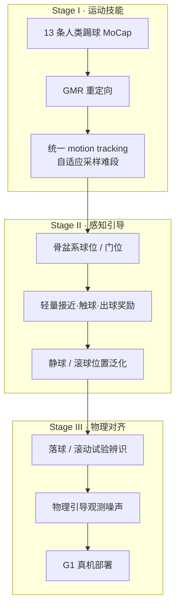
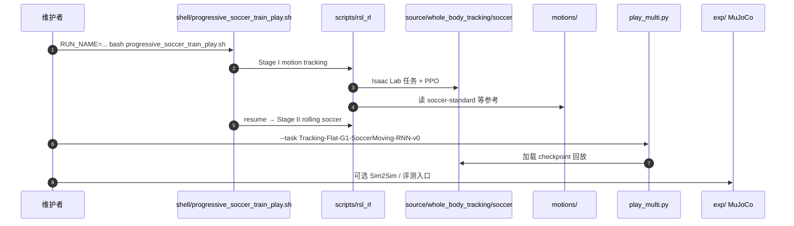

# PAiD：Learning Soccer Skills for Humanoid Robots

**PAiD**（*Perception-Action integrated Decision-making*，*Learning Soccer Skills for Humanoid Robots: A Progressive Perception-Action Framework*，[arXiv:2602.05310](https://arxiv.org/abs/2602.05310)，[代码](https://github.com/TeleHuman/HumanoidSoccer)）由 **中国电信人工智能研究院（TeleAI）· 上海科技大学 · 浙江大学 · 上海交通大学** 提出：把人形踢球从端到端奖励冲突中拆出，用 **三阶段渐进** 先学拟人踢球先验，再融第一视角球/门位置，最后用接触动力学对齐 + 感知噪声完成 **Unitree G1** 真机部署。收录于 [Robot Learning Paper Notebooks](https://imchong.github.io/Robot_Learning_Paper_Notebooks/index.html)（分类：04_Loco-Manipulation_and_WBC）。

## 一句话定义

**先在无感知噪声下用人类踢球 MoCap 学稳全身协调，再加轻量任务奖励把技能泛化到任意静/滚球，最后用球接触物理对齐与观测噪声把策略搬到 G1 真机。**

## 英文缩写速查

| 缩写 | 英文全称 | 简要说明 |
|------|----------|----------|
| PAiD | Perception-Action integrated Decision-making | 本文三阶段感知–动作渐进框架 |
| RL | Reinforcement Learning | 用 PPO 优化跟踪与踢球回报 |
| PPO | Proximal Policy Optimization | 本文策略优化算法（RSL-RL） |
| GMR | General Motion Retargeting | 人类踢球 MoCap → G1 参考 |
| LSTM | Long Short-Term Memory | Stage II 对滚动球做时序聚合 |
| DR | Domain Randomization | Sim2Real 动力学与观测扰动 |
| CMA-ES | Covariance Matrix Adaptation Evolution Strategy | 球接触参数系统辨识 |
| Sim2Real | Simulation to Real | 物理对齐 + 噪声建模后的真机迁移 |
| G1 | Unitree G1 Humanoid | 本文仿真与真机平台 |

## 为什么重要

- **把「怎么踢」和「踢哪里」拆开：** 模块化流水线有表征断层，端到端又有 locomotion / 触球 / 恢复的奖励冲突；PAiD 用阶段隔离稳住拟人踢球先验。
- **人形足球技能选型的一条主线：** 与 [RoboNaldo](./paper-robonaldo-humanoid-soccer-shooting.md)（motion scaffold + 点级瞄准）并列，见 [技能学习选型](../queries/humanoid-soccer-skill-learning-method-selection.md)。
- **可复现开源：** 项目页 Code → [TeleHuman/HumanoidSoccer](https://github.com/TeleHuman/HumanoidSoccer)（Isaac Lab + RSL-RL + 踢球 MoCap）。
- **真机数字可读：** 仿真有效工作区静球 **91.3%** SR、滚动 **71.9%**；真机硬地/草地随机球位与滚动球演示，最长 **11** 连踢成功。

## 核心信息

| 项 | 内容 |
|----|------|
| **机构** | 中国电信人工智能研究院（TeleAI）；上海科技大学；浙江大学；上海交通大学 |
| **平台** | Unitree G1；策略输出关节 PD 目标 |
| **栈** | Isaac Lab · RSL-RL PPO · BeyondMimic 风格跟踪 · LSTM 策略（Stage II） |
| **数据** | 13 条人类踢球 MoCap（标准 + 球星风格），GMR 重定向 |
| **开源** | **已开源**（截至 **2026-07-28**）：[TeleHuman/HumanoidSoccer](https://github.com/TeleHuman/HumanoidSoccer)；项目页 [soccer-humanoid.github.io](https://soccer-humanoid.github.io/) |

## 流程总览

## 核心机制（方法栈）

### 1）Stage I：无感知噪声的踢球先验

- BeyondMimic 风格 yaw 对齐跟踪；**失败直方图**在 motion × phase 上自适应采样难段。
- 地形随机化并入 Stage I，减轻 Stage II 对地面专项奖励的依赖。
- 奖励以 tracking + 正则为主，**不引入球任务项**，避免早期冲突。

### 2）Stage II：轻量感知–动作融合

- 观测增加骨盆系 $\mathbf{g}_{ball}$、$\mathbf{g}_{goal}$；球位在名义触球点附近弧形扰动，并给小球初速。
- **关闭 anchor 位置跟踪**，保留姿态/身体跟踪作风格先验；加接近、正确脚首次接触、侧踢先验、触球后速度方向/平面球速塑形。
- LSTM 聚合历史，隐式短视界预测滚动球。

### 3）Stage III：物理感知 Sim2Real

- 硬地 / 草皮分别做落球与滚动试验，用 **CMA-ES** 对齐仿真球 restitution / friction。
- 观测侧加入面向球定位的物理引导噪声，而非无结构大范围 DR。
- 真机球位由 **视觉 + 雷达** 融合持续提供。

## 源码运行时序图

复现路径：Isaac Lab **v2.1.1** → `pip install -e source/whole_body_tracking` → `bash shell/progressive_soccer_train_play.sh`；踢球 MoCap 已随 `motions/` 发布。

## 与其他工作对比

| 维度 | PAiD（本文） | RoboNaldo | Agile Striker |
|------|--------------|-----------|---------------|
| **阶段语义** | 跟踪 → 感知融合 → 物理对齐 | 跟踪 → 任意球 → 来球时机 | 追球 → 定向踢 → 蒸馏 → 约束精修 |
| **瞄准叙事** | goal-region / 成功率 | **点级误差** + 高球速 | 球–门配置成功率 |
| **平台** | Unitree G1 | Unitree G1 | Booster T1 |
| **开源** | TeleHuman/HumanoidSoccer | OpenDriveLab/RoboNaldo | Daffan/humanoid-soccer |

## 实验与评测

- **仿真工作区** $[0.5,2.0]\times[-1.0,1.0]$ m：静球 SR **91.3%**、精度 **0.9689**；滚动拦截 **71.9%** / **0.8892**（Table IV），优于 AMP / Pure RL / Single-Stage。
- **真机：** 距门约 5 m、门宽 2 m × 高 1.5 m；硬地/草地各约 30 次静球试验，滚动各约 10 次；最长 **11** 连踢成功；角落大转体位成功率偏低。
- **消融（Table V）：** 接触动力学辨识与观测噪声单独都有收益，**两者合用**真机最好。

## 结论

**PAiD 用「先验 → 感知 → 物理对齐」三阶段，把人形踢球从端到端奖励冲突里拆出来，并在 G1 上给出可复现的高成功率闭环节拍。**

1. **先踢像样再看球** — Stage I 隔离感知噪声，专攻拟人全身协调。
2. **任务奖励要少而门控** — Stage II 只加接近/触球/出球塑形，并冻结触球后接近项。
3. **球物理比盲目 DR 更关键** — 落球/滚动辨识 + 观测噪声合用，真机增益最大。
4. **读数字时看工作区** — 91.3% 对应文中有效球位矩形；角落与大转体位是已知弱点。
5. **与 RoboNaldo 选型** — 要风格化踢球与开源 G1 管线选 PAiD；要点级瞄准与高冲量选 RoboNaldo。

## 局限与风险

- 目标采样为门前矩形区域，**非联赛级对抗战术**；队友/对手需外包给战术栈（见 [ARTEMIS](./paper-notebook-a-hierarchical-model-based-system-for-high-perfo.md)）。
- 真机依赖视觉–雷达球定位质量；极端光照与遮挡会放大 Stage II 噪声假设外误差。
- 仓库许可 SPDX 为 `NOASSERTION`，复现时以 README / 根目录声明为准。

## 与其他页面的关系

- 方法摘要：[PAiD Framework](../methods/paid-framework.md)
- 任务：[Humanoid Soccer](../tasks/humanoid-soccer.md)
- 选型：[人形足球技能学习方法选型](../queries/humanoid-soccer-skill-learning-method-selection.md)
- 对照：[RoboNaldo](./paper-robonaldo-humanoid-soccer-shooting.md)、[Agile Striker](./paper-notebook-learning-agile-striker-skills-for-humanoid-socce.md)
- 分类父节点：[paper-notebook-category-04](../overview/paper-notebook-category-04-loco-manipulation-and-wbc.md)

## 参考来源

- [humanoid_pnb_learning-soccer-skills-for-humanoid-robots.md](../../sources/papers/humanoid_pnb_learning-soccer-skills-for-humanoid-robots.md)
- [soccer-humanoid-paid.md](../../sources/sites/soccer-humanoid-paid.md) — 项目页核查
- [humanoid_soccer.md](../../sources/repos/humanoid_soccer.md) — 官方仓
- 论文：<https://arxiv.org/abs/2602.05310>
- 深读笔记：<https://imchong.github.io/Robot_Learning_Paper_Notebooks/papers/04_Loco-Manipulation_and_WBC/Learning_Soccer_Skills_for_Humanoid_Robots____A_Progressive_Perception-Action_Fr/Learning_Soccer_Skills_for_Humanoid_Robots____A_Progressive_Perception-Action_Fr.html>

## 推荐继续阅读

- 项目页：<https://soccer-humanoid.github.io/>
- [RoboNaldo（点级射门对照）](./paper-robonaldo-humanoid-soccer-shooting.md)
- [人形足球纵深路线 Stage 3](../../roadmap/depth-humanoid-soccer.md)
