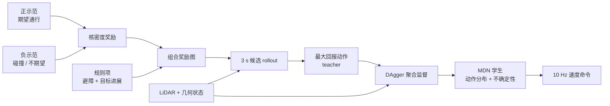

# PioneeR：从正负示范与规则学习社交导航

**PioneeR**（*Learning Social Navigation from Positive and Negative Demonstrations and Rule-Based Specifications*，[arXiv:2510.12215](https://arxiv.org/abs/2510.12215)，ICRA 2026）把“人希望机器人怎么走”与“机器人绝不能撞人”分开建模：正负示范形成密度奖励，避障 / 到达形成规则项，前瞻 teacher 选动作后再蒸馏到实时学生。

## 一句话定义

**PioneeR 用正示范标出可接受行为、负示范压低危险区域、显式规则守住避障与目标，再把 3 秒前瞻 teacher 蒸馏成带不确定性估计的 10 Hz MDN 社交导航策略。**

## 英文缩写速查

| 缩写 | 英文全称 | 简要说明 |
|------|----------|----------|
| MDN | Mixture Density Network | 学生策略；输出速度高斯混合与预测不确定性 |
| DAgger | Dataset Aggregation | 学生执行、teacher 在线标注的迭代蒸馏协议 |
| RKHS | Reproducing Kernel Hilbert Space | 密度奖励的核函数表示与正则化空间 |
| SR | Success Rate | 未碰撞且到达目标的任务成功率 |
| TT | Total Time | 完成导航所需总时间 |
| CVaR | Conditional Value at Risk | 风险自适应安全基线 CVaR-BF 的风险度量 |

## 为什么重要

- **负示范明确告诉模型“不要这样走”：** 对擦肩、抢行、穿人群等少见但高风险行为，比只拟合成功轨迹更直接。
- **学习与规则分工清楚：** 密度奖励承载场景偏好，规则项持续约束障碍距离与目标进展，减少纯学习奖励投机。
- **计算重的 teacher 不必上车：** sampling lookahead 利用未来状态做高质量监督，MDN 学生只用当前 LiDAR 观测实时推理。
- **不确定性可触发 fallback：** risky frame 上 epistemic / aleatoric uncertainty 都更高，可用于减速、让行或切回规则控制。

## 核心信息

| 字段 | 内容 |
|------|------|
| 机构 | 高丽大学（Korea University）；延世大学（Yonsei University）；卡内基梅隆大学（Carnegie Mellon University）；Mobinn；加拿大女王大学（Queen's University） |
| 发表 | ICRA 2026 |
| 机器人模型 | 平面 unicycle；动作 \(u=[v,\omega]\) |
| 观测 | 3D LiDAR 转 2D scan + 最近障碍几何描述 |
| 控制频率 | 10 Hz；lookahead \(T=3\) s、\(\Delta t=0.3\) s |
| 项目页 / 代码 | [PioneeR 项目页](https://chanwookim971024.github.io/PioneeR/) 有视频与方法说明；截至 **2026-07-28 未列 GitHub、权重或数据下载** |

## 流程总览

## 核心机制（方法栈）

### 1. 正负示范密度奖励

示范样本位于 state–action 空间 \((x,y,\theta,v,\omega)\)，并附 fidelity \(\gamma\)。核模型在 RKHS 中拟合 density-based reward：正样本提升附近回报，负样本压低危险行为区域；\(\lambda\) 与 \(\beta\) 分别约束函数平滑度和系数规模。

### 2. 规则目标融合

组合回报包含 \(r_{\text{density}}\)、\(r_{\text{goal}}\) 与 \(r_{\text{obstacle}}\)。随终点接近目标，权重从示范偏好逐步转向 goal progress；障碍项保持恒定优先，避免只因示范稀疏就穿过人体附近。

### 3. Sampling-based lookahead teacher

teacher 枚举线速度 0.1–0.8 m/s 与 15 个角速度（\([-0.4\pi,0.4\pi]\)），向前模拟 3 s 并选累计回报最高动作。指数滑动平均系数 0.5 减少命令跳变。teacher 使用未来 rollout 的特权信息，因此质量高但不适合直接部署。

### 4. 不确定性感知蒸馏

DAgger 从 50 expert episodes 起步，再执行 10 rounds × 50 episodes。两层 128-unit MDN 输出 10 个高斯分量；总方差分解为 aleatoric 与 epistemic 部分。学生学习 teacher 动作似然，而非单点 MSE，保留社交交互中的多解性。

## 与其他工作对比

| 方法 | 社交知识来源 | 显式安全 | 前瞻 / 部署 | 不确定性 |
|------|--------------|----------|-------------|----------|
| CrowdNav++ | RL + 交互图 | 奖励塑形 | 在线策略 | 无本文式 MDN 分解 |
| CVaR-BF | 手工风险模型 | CVaR + barrier function | 在线优化 | 显式风险 |
| [iCrowdNav](./paper-icrowdnav.md) | RGB-D BEV + 姿态意图 RL | 奖励 / 碰撞约束 | PPO 真机零样本 | 无 |
| **PioneeR** | **正负示范密度** | **避障 + goal 规则项** | **lookahead teacher→MDN** | **aleatoric + epistemic** |

## 工程实践与开源状态

| 项 | 实施要点 |
|----|----------|
| 负样本采集 | 不应让真机实际撞人；论文用键盘遥操作 / 仿真记录不期望行为 |
| teacher | 10 Hz、3 s rollout；动作格点规模会直接决定计算成本与行为分辨率 |
| 学生 fallback | 可用最小人机距离和 epistemic threshold 触发减速 / 规则控制，但论文未给认证阈值 |
| 评价 | SR、TT、PL 与最小人机距离应并列；高 SR 不自动等于舒适或遵守文化规范 |
| 开源 | **未开源**：项目页只有视频和文字；没有可下载实现，MDN / kernel / real-robot 接口需自行复刻 |

## 源码运行时序图

**不适用**：截至 **2026-07-28**，官方 PioneeR 项目页未列代码、权重、数据集或 README 运行入口；不能把搜索到的 SAN-FAPL / SoNIC 等其他社交导航仓库误认成本文实现。

## 实验与评测

- **静态解释实验：** 446 正 / 337 负样本；加入负示范后压低人体附近 reward，再加规则后同时保持 clearance 与 goal progress。
- **电梯仿真 teacher：** HR-RL 场景 SR **99.4%**、TT 12.24 s、PL 3.74 m；HL-RR 为 **99.6%**、12.94 s、3.88 m，明显高于 CVaR-BF（71–73%）与 CrowdNav++（65–79%）。
- **消融：** 去 density reward 的成功率降幅最大；去 obstacle prior 会更快但更易失败，去 goal prior 则耗时增加。
- **蒸馏：** MDN 在 HR-RL / HL-RR 的 SR 为 **98.0% / 100.0%**，MLP 为 95.8% / 98.8%；MDN 路径也更短。
- **不确定性：** 两场景 risky frames 的 epistemic 与 aleatoric 均高于 safe frames。
- **真机：** 四轮移动机器人以 10 Hz 在真人电梯共乘中展示单策略多场景与多人交互，但论文未提供真机 SR / 样本量统计。

## 结论

**PioneeR 最值得复用的是“偏好由正负示范学、安全底线由规则守、计算由 teacher 做、部署由不确定性学生承接”的分工，而不是把 99% 仿真 SR 直接外推到开放人群。**

1. **负示范影响最大** — 它给 reward 划出不可接受区域，而不是只增加成功轨迹密度。
2. **规则项不可省** — obstacle 与 goal prior 分别控制安全余量和效率。
3. **teacher–student 是实时折中** — 3 s rollout 只用于监督，10 Hz MDN 才是部署策略。
4. **不确定性应接安全动作** — 估计值本身不保证安全，必须定义减速 / 停车 / fallback。
5. **真机证据仍是可行性展示** — 缺少规模化真人评测和跨文化社交规范验证。

## 局限与风险

- 人类运动由 social-force model 模拟，不能覆盖犹豫、结伴、突然折返等真实行为。
- fidelity 形式支持连续 \([-1,1]\)，实验却只用二元正 / 负标签，无法表达“勉强可接受”的灰区。
- 负示范中的“碰撞”主要表达安全，不足以覆盖礼让、个人空间、右行规则等细粒度规范。
- MDN 不确定性是统计信号，不是 formal guarantee；需与 [控制屏障函数](../concepts/control-barrier-function.md) 等独立安全层结合。
- 无代码 / 数据；仿真超 99% SR 与少量真机 demo 之间存在明显证据跨度。

## 与其他页面的关系

- [导航纵深路线 Stage 5](../../roadmap/depth-navigation.md) — 社会导航进阶节点
- [iCrowdNav](./paper-icrowdnav.md) — 感知人体姿态与意图的 RL 对照
- [模仿学习](../methods/imitation-learning.md) 与 [行为克隆](../methods/behavior-cloning.md) — 正负示范及 teacher–student 蒸馏基础
- [控制屏障函数](../concepts/control-barrier-function.md) — 可与 MDN fallback 组合的形式化安全层
- [EgoNav](./paper-notebook-egonav.md) — 人类行走数据中涌现社交避让，但没有本文的显式负示范 / 规则分解

## 参考来源

- [Paper Notebooks 原始归档](../../sources/papers/humanoid_pnb_learning-social-navigation-from-positive-and-neg.md)
- [PioneeR 官方项目页核查](../../sources/sites/pioneer-social-navigation.md)
- 论文：<https://arxiv.org/abs/2510.12215>

## 推荐继续阅读

- [PioneeR 深读笔记](https://imchong.github.io/Humanoid_Robot_Learning_Paper_Notebooks/papers/08_Navigation/Learning_Social_Navigation_from_Positive_and_Negative_Demonstrations_and_Rule-Based_Specifications/Learning_Social_Navigation_from_Positive_and_Negative_Demonstrations_and_Rule-Based_Specifications.html)
- [Core Challenges of Social Robot Navigation](https://doi.org/10.1145/3583741) — 社会导航问题定义与评测边界
