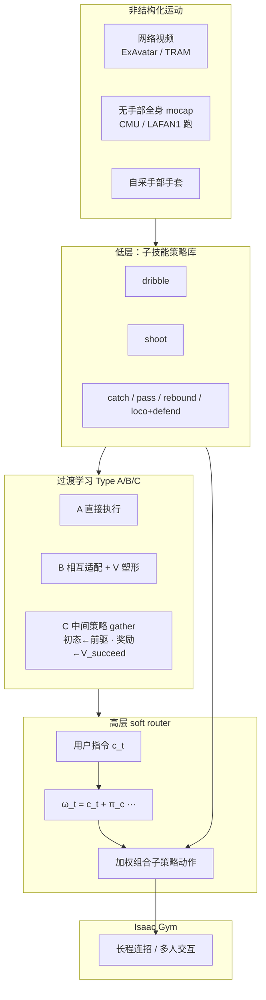
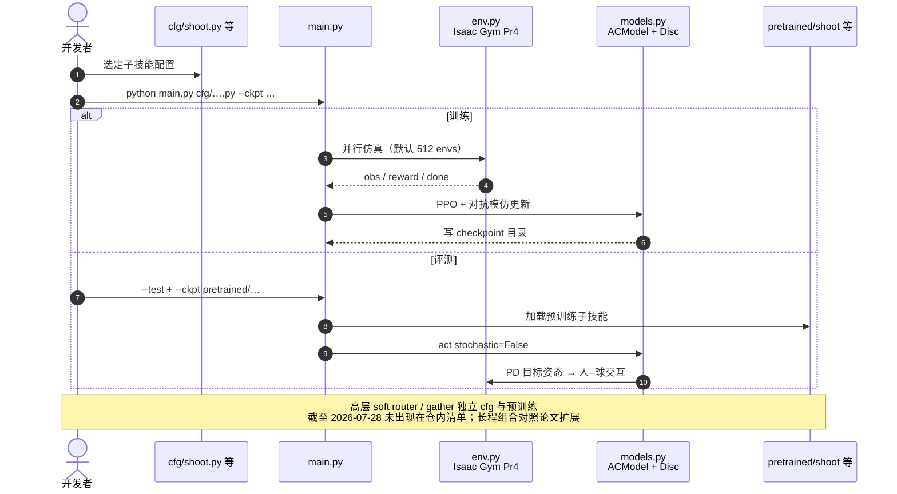

# Learning to Ball（Composing Policies for Long-Horizon Basketball Moves）

**Learning to Ball**（arXiv:[2509.22442](https://arxiv.org/abs/2509.22442)，**ACM TOG / SIGGRAPH Asia 2025**；[项目页](https://pei-xu.github.io/basketball)，[代码](https://github.com/xupei0610/basketball)）提出面向多阶段长程任务的 **策略组合框架**：先独立训好目标明确的子技能，再为状态不相容的阶段训练 **中间策略**，并用 **高层 soft router** 按实时指令软性加权切换。本页编译自 arXiv、项目页与官方仓；姊妹仓库深读笔记见 [参考来源](#参考来源)。

## 一句话定义

把篮球里「运球 / 投篮 / 上篮 / 跑动 / 转身 / 捡球」等差异极大、各自训好的子技能，用 **策略组合框架 + 高层 soft router** 拼起来——关键是接管「目标说不清」的过渡段，让物理仿真角色连贯打出 shoot-off-the-dribble、catch-and-shoot、board-and-bang 等多阶段长程连招。

## 英文缩写速查

| 缩写 | 英文全称 | 简要说明 |
|------|----------|----------|
| Soft Router | Soft Routing Policy | 高层控制器，对子策略动作做加权组合而非硬切 |
| PPO | Proximal Policy Optimization | 子技能与高层训练的主干 on-policy RL 算法 |
| ICCGAN | （作者前作）GAN-like Imitation | 对抗模仿框架，支撑从非结构化运动学子技能 |
| AdaptNet | Policy Adaptation Network | 潜空间适配预训练策略以覆盖新初态 |
| HLC | High-Level Controller | 广义高层；本文具体为 soft router（相对 SkillMimic 离散 HLC） |
| HOI | Human–Object Interaction | 人–球交互；本文不依赖球轨迹参考 |
| RSI | Reference State Initialization | 对照族常用技巧；本文 Type C 用前驱 rollout 作初态 |

## 为什么重要

- **长程瓶颈在过渡，不在单招：** MoE / skill chaining 在子策略状态几乎不相交、或起终点难定义时失效；篮球 gather 是典型 ill-defined 中间态。
- **三类过渡可系统选型：** Direct Execution → Mutual Adaptation → Intermediate Policy，工程上可按难度选配方。
- **非结构化数据可训交互技能：** 视频估计 + 无手部 mocap + 自采手部 + 普通跑步混合，**无需球轨迹**。
- **定量证据硬：** shoot-off-the-dribble 接球率 98.3%、命中率 91.8%；相对直接切换 / 顺序链式基线数量级提升。
- **与 SkillMimic 形成选型对：** 本文是 **多专家 + soft router**；[SkillMimic](./paper-notebook-skillmimic-learning-basketball-interaction-skill.md) 是 **统一 HOI 模仿 + 离散 HLC**。

## 核心信息

| 字段 | 内容 |
|------|------|
| 分类 | 13_Physics-Based_Animation |
| 机构 | 斯坦福大学（Stanford）；加州大学河滨分校（UC Riverside）；罗布乐思（Roblox）；克莱姆森大学（Clemson） |
| Venue | ACM TOG Vol. 44 No. 6 / SIGGRAPH Asia 2025 |
| 深读笔记 | <https://imchong.github.io/Humanoid_Robot_Learning_Paper_Notebooks/papers/13_Physics-Based_Animation/Learning_to_Ball__Composing_Policies_for_Long-Horizon_Basketball_Moves/Learning_to_Ball__Composing_Policies_for_Long-Horizon_Basketball_Moves.html> |
| arXiv | <https://arxiv.org/abs/2509.22442> |
| 项目页 | <https://pei-xu.github.io/basketball> |
| 代码 | <https://github.com/xupei0610/basketball>（MIT） |

## 流程总览

## 核心机制（归纳）

### 1. 子技能：非结构化对抗模仿

- 骨干：**PPO + ICCGAN 族对抗模仿** + [Composite Motion Learning](./paper-notebook-composite-motion-learning-with-task-control.md) 多目标权重。
- 身体分组（运球）：下肢 / 上肢 / **双手（含腕）** 分开，便于用「仅手部」数据。
- 任务奖励：导航速度跟踪、运球合法接触、投篮进框等；违规（非法触球、持球走步）给强负奖励。
- **不跟踪固定全身+球轨迹**，故可实时摇杆控速与任意方向急停跳投。

### 2. Type C：中间策略 + 同步适配

以 dribble → gather → shoot 为例：

1. 前驱 **dribble** rollout 的随机状态 → gather 初态分布；
2. gather 奖励含后继 **\(\bar{V}_{\text{shoot}}\)**（PopArt 归一），把角色推到「投篮策略可能成功」的状态；
3. 同步用 gather 的「好状态」经 [AdaptNet](./paper-notebook-adaptnet-policy-adaptation-for-physics-based-cha.md) 适配 shoot，并回写更新的 value。

Type B 是简化版（无新中间策略）；Type A 直接切换。

### 3. Soft router

- 输入：状态、目标、参考命令 \(\mathbf{c}_t\)（运球 / gather / 投篮 one-hot）。
- 输出：相对 \(\mathbf{c}_t\) 的偏移，得到权重 \(\boldsymbol{\omega}_t\)，对子策略确定性动作线性组合。
- 训练奖励鼓励 **单一主导专家**，过渡段允许轻微混合；相对 hard router 与纯启发式阈值阈值更稳。
- 训后可蒸馏为单网络以降推理成本。

## 源码运行时序图

官方仓 [xupei0610/basketball](https://github.com/xupei0610/basketball)（归档见 [sources/repos/learning-to-ball.md](../../sources/repos/learning-to-ball.md)）公开发布面以 **子技能训练/评测** 为主：

- **最短复现路径：** 安装 Isaac Gym Pr4 → conda 装 `requirements.txt` → `python main.py cfg/shoot.py --ckpt pretrained/shoot --test`（可换其他子技能）。
- **完整长程组合：** 需按论文 Type C + soft router 流程自行扩展训练；公开仓已覆盖原始子技能底座。

## 工程实践

| 项 | 建议 |
|----|------|
| 开源边界 | **已开源** MIT 训练/评测 + 子技能预训练；**soft router / gather 独立发布条目未见** |
| 依赖 | 必须自行取得 **Isaac Gym Preview 4**；PyTorch **2.1.2** |
| 先跑通 | 先 `--test` 各 `pretrained/*`，再 `cfg/*.py` 复训 |
| 过渡选型 | 状态重叠用 Type A；终态偏移用 Type B；动力学/接触不相容用 Type C |
| 路由 | 优先 soft router + 参考命令引导；避免一上来 hard router 探索 |
| 对照实验 | 与 [SkillMimic](./paper-notebook-skillmimic-learning-basketball-interaction-skill.md) 比「多专家组合 vs 统一模仿」 |

## 实验与评测

- **主任务：** shoot-off-the-dribble（接球率 + 命中率）；场地环带 2.5–7.5 m 网格，每格多速度/方向试验。
- **基线：** DirectExecution（~0.7% 接球 / ~1.3% 命中）、NoAdapt、SequentialChaining（~12.7% 命中）；本文 **98.3% / 91.8%**。
- **方向鲁棒：** 面向 / 背向 / 左右正交接近篮筐，命中约 90–95%。
- **消融：** value 塑形对 gather 关键；同步适配抬升命中；无高层启发式切换 86.0% / 67.4%；soft ≫ hard router。
- **定性：** catch-and-shoot、pass-off-dribble、rebound→dribble、2v2 实时对战；传球–接球可双智能体共适配。

## 结论

**Learning to Ball 把「长程篮球连招」收成可选型的过渡配方（A/B/C）+ soft router 组合；仿真动画证据充分，真机 humanoid 部署不在本文主线。**

1. **先拆目标明确的子技能，再攻过渡** — 别把 gather 和 shoot 糊成单阶段硬训。
2. **ill-defined 中间态用后继 \(V\) 塑形** — 配合同步 AdaptNet，比随机初态链式更稳。
3. **soft router 优于硬切与 hard router** — 参考命令引导探索，主导专家约束保动作自然。
4. **无球轨迹也能学交互** — 任务奖励 + 部分可观测模仿降低数据门槛。
5. **复现从子技能预训练走** — Isaac Gym + `main.py --test`；完整 soft router 管线需对照论文扩展。
6. **选型对照** — 要「统一模仿技能库 + 离散 HLC」看 [SkillMimic](./paper-notebook-skillmimic-learning-basketball-interaction-skill.md)；要复合运动多目标底子看 [Composite Motion Learning](./paper-notebook-composite-motion-learning-with-task-control.md)。

## 常见误区或局限

- **定位是物理动画，不是真机篮球：** 未做 Sim2Real / 真机部署；范式可借鉴，勿当部署菜谱。
- **运动质量受参考数据限制：** 运球常偏高位、篮板垂直起跳弱（论文自述）。
- **公开仓以子技能为主：** 勿假设 `pretrained/` 已含完整 soft router 长程策略。
- **依赖 Isaac Gym 闭源预览包：** 环境门槛高于纯 MuJoCo pip 栈。

## 与其他页面的关系

- 分类父节点：[paper-notebook-category-13-physics-based-animation](../overview/paper-notebook-category-13-physics-based-animation.md)
- 分层控制背景：[Hierarchical Reinforcement Learning](../methods/hierarchical-reinforcement-learning.md)
- 模仿学习总览：[Imitation Learning](../methods/imitation-learning.md)
- 方法前作：[Composite Motion Learning with Task Control](./paper-notebook-composite-motion-learning-with-task-control.md)
- 策略适配：[AdaptNet](./paper-notebook-adaptnet-policy-adaptation-for-physics-based-cha.md)
- 篮球统一模仿对照：[SkillMimic](./paper-notebook-skillmimic-learning-basketball-interaction-skill.md)

## 参考来源

- [learning_to_ball_arxiv_2509_22442.md](../../sources/papers/learning_to_ball_arxiv_2509_22442.md) — arXiv 一手策展摘录
- [humanoid_pnb_learning-to-ball.md](../../sources/papers/humanoid_pnb_learning-to-ball.md) — Paper Notebooks 深读笔记锚点
- [learning-to-ball.md](../../sources/repos/learning-to-ball.md) — GitHub 仓库归档
- [pei-xu-basketball-github-io.md](../../sources/sites/pei-xu-basketball-github-io.md) — 项目页归档
- Xu et al., ACM TOG / SIGGRAPH Asia 2025. <https://arxiv.org/abs/2509.22442>

## 推荐继续阅读

- [项目主页（含连招与多人视频）](https://pei-xu.github.io/basketball)
- [官方代码 xupei0610/basketball](https://github.com/xupei0610/basketball)
- [机器人论文阅读笔记：Learning to Ball](https://imchong.github.io/Humanoid_Robot_Learning_Paper_Notebooks/papers/13_Physics-Based_Animation/Learning_to_Ball__Composing_Policies_for_Long-Horizon_Basketball_Moves/Learning_to_Ball__Composing_Policies_for_Long-Horizon_Basketball_Moves.html)
- [SkillMimic（统一 HOI 模仿对照）](./paper-notebook-skillmimic-learning-basketball-interaction-skill.md)
- [Composite Motion Learning with Task Control](https://pei-xu.github.io/CompositeMotion)
