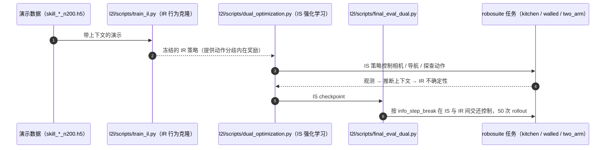

# Learning to Look

**Learning to Look: Seeking Information for Decision Making via Policy Factorization** 收录于 [Robot Learning Paper Notebooks](https://imchong.github.io/Robot_Learning_Paper_Notebooks/index.html)（分类：06_Manipulation），深读笔记已完成。本页编译自深读笔记与 arXiv 论文正文（实验数字、开源状态于 2026-09-28 核对），细节以论文 PDF 为准。

## 一句话定义

许多操作任务需要主动或交互式探索才能成功——智能体要主动寻找每一阶段所需的信息（如移动机器人的头去找操作相关信息；或多机器人里一个侦察机器人为另一个找信息）。本文把这类任务刻画为一种新问题：因子化上下文马尔可夫决策过程（factorized Contextual MDP），并提出 DISaM ——一个双策略解法：① 信息寻求策略（information-seeking）探索环境找到相关上下文信息；② 信息接收策略（information-receiving）利用上下文达成操作目标。这种因子化让两策略可分开训练（用接收策略给寻求策略提供奖励）。测试时，双智能体按操作策略对"下一步最佳动作"的不确定性来平衡探索与利用。在五个需信息寻求的操作任务（仿真 + 真机）上，DISaM 大幅优于已有方法。

## 英文缩写速查

| 缩写 | 含义 |
|---|---|
| DISaM | 双策略（信息寻求 + 接收）框架 |
| Factorized Contextual MDP | 因子化上下文 MDP |
| Information-Seeking | 信息寻求策略（探索） |
| Information-Receiving | 信息接收策略（利用） |
| Exploration/Exploitation | 探索 / 利用平衡 |
| Uncertainty | 操作策略对动作的不确定性 |

## 为什么重要

- **"找信息"与"用信息"解耦**是处理主动探索任务的优雅归纳偏置；
- **不确定性驱动的探索/利用平衡**是可迁移的测试时机制；
- 与 ViA、Learning to Look Around 的"主动视觉"互补（这里更偏决策层）；
- 对人形（转头/移动找信息）直接相关。

## 解决什么问题

许多操作要**先找信息再决策**： - 需**主动探索**（如转头找物体）； - 把"寻求信息"与"利用信息"混在一个策略里难学； - 测试时如何**平衡探索与利用**？

论文要：把任务**因子化**，分别学**寻求**与**接收**策略，并在测试时合理切换。

## 核心机制

1. **因子化上下文 MDP**：刻画"需主动找信息"的操作任务；
2. **DISaM 双策略**：信息寻求 + 信息接收，可分开训练；
3. **跨策略奖励**：用接收策略给寻求策略提供奖励；
4. **不确定性驱动探索/利用平衡**：五任务大幅优于基线。

方法拆解（深读笔记小节）：因子化上下文 MDP；DISaM 双策略；测试时按不确定性平衡探索/利用；结果；🧭 整体流程（mermaid）。

## 核心信息

| 字段 | 内容 |
|------|------|
| 分类 | 06_Manipulation |
| 深读笔记 | <https://imchong.github.io/Robot_Learning_Paper_Notebooks/papers/06_Manipulation/Learning_to_Look__Seeking_Information_for_Decision_Making_via_Policy_Factorization/Learning_to_Look__Seeking_Information_for_Decision_Making_via_Policy_Factorization.html> |
| arXiv | <https://arxiv.org/abs/2410.18964> |
| 源码 | **已开源（仿真部分）**：[UT-Austin-RobIn/l2l](https://github.com/UT-Austin-RobIn/l2l)（robosuite 上 kitchen / walled / two_arm 三个仿真任务的 IR 模仿学习、IS 强化学习与评测脚本，附数据与预训练权重）；真机 Tiago 部署未在 README 中给出 |
| 作者 | Shivin Dass、Jiaheng Hu、Ben Abbatematteo、Peter Stone、Roberto Martín-Martín（UT Austin） |
| 发表 | 2024 年 10 月 |
| 笔记阅读日期 | 2026-06-21 |

## 源码运行时序图

仓库任务名与论文不同：kitchen = Cooking、walled = Walls、two_arm = Assembly。

## 实验与评测

**设置**：5 个任务，仿真 3 个（Cooking：按食客偏好 / 时钟 / 上菜区备菜；Walls：须绕墙看到隐藏方块再取放；Assembly：从抽屉里读说明再装螺母），真机 2 个（Tiago 机器人：Button 按按钮看电视决定下一食材、Teatime 看时间选饮品）。仿真中 IR 动作空间是技能、IS 动作是相机平移 / 俯仰（Walls 另有导航、Assembly 另有操作技能）；真机 IR 为 transformer 视觉运动策略（TeleMoMa 采集演示），IS 用仿真 + 真机混合训练。评测：仿真 3 seed × 50 次，真机 1 seed × 10 次。

基线：DISaM (reward)（用人工阶段奖励代替内在奖励）、Full RL（PPO 联合优化 IR + IS）、Random Cam（随机游走 + 同样的不确定性交还机制）、Sampled Context（随机上下文）。

- **总体**：5 个任务上 DISaM 均显著优于基线，多阶段长时程任务（Cooking、Walls、Teatime）差距最大；逐阶段结果在附录 A.5（论文正文以柱状图给出，未列数值表）。
- **失败模式**：Full RL 很少调用 IS 策略，上下文恢复不足；Random Cam 表现尚可，但动作空间大时找信息慢。
- **内在奖励消融**：把 IS 的奖励换成稀疏的真实阶段奖励，成功率明显下降——以 IR 行为克隆损失的动作分歧作内在奖励是关键。
- **语言上下文**：用 CLIP 句向量代替 one-hot 上下文，Cooking 只小幅下降，Walls 降幅中等，但仍优于基线。

## 与其他工作对比

| 工作 | 「何时看、看哪里」的决定方式 | 与 DISaM 的差异 |
|------|------|------|
| Full RL（论文基线） | 单一 RL 目标联合学习 | 很少主动找信息，长时程任务表现差 |
| [Vision in Action](./paper-notebook-vision-in-action-learning-active-perception-from.md) | 模仿人类头动 | 感知动作来自人类演示；DISaM 用 IR 策略的不确定性决定交还控制 |
| [EgoMI](./paper-notebook-egomi-learning-active-vision-and-whole-body-mani.md) | 模仿头动 + SPARKS 关键帧记忆 | 有记忆；DISaM 的 IS 智能体无记忆（论文自列局限） |
| [Learning to Look Around](./paper-notebook-learning-to-look-around-enhancing-teleoperation.md) | 遥操作者头部驱动相机 | 面向人在环遥操作，不学习自主信息寻求 |

## 结论

**DISaM 的主张不是「让机器人多看两眼」，而是把「找信息」与「用信息」拆成两个可分开训练的策略，再用操作策略自身的不确定性在测试时决定该继续探索还是该动手。**

- 真正起作用的是因子化：因子化上下文 MDP 把上下文从任务中剥离出来，接收策略反过来为寻求策略提供奖励，绕开了单一策略同时学探索与操作的耦合难题。
- 测试时的不确定性门控是最可迁移的部分——它不绑定具体任务，只依赖操作策略对「下一步最佳动作」的不确定性，比手工划分探索阶段更通用。
- 适用边界是「所缺信息可通过主动观察获得」的任务（转头找操作相关信息、侦察机器人为同伴找信息）；若信息根本不在可观测空间内，因子化的前提就不成立。
- 最关键的消融是奖励来源：用 IR 策略的动作分歧作内在奖励，明显强于人工阶段奖励；联合优化的 Full RL 则几乎不去主动找信息。
- 与本页提到的 ViA、Learning to Look Around 等主动视觉工作对照：那些偏感知层的「看哪里」，本页的落点在决策层的「何时停止找、开始做」。

## 局限与风险

- **IS 智能体无观测历史 / 记忆**：难以处理长时序依赖或需要观察他人动作的信息收集。
- **要求两个智能体的动作空间尽量不重叠**：否则彼此抵消；这排除了底盘移动同时带动相机与末端的移动操作场景。
- **长时程训练慢**：内在奖励已加密，但 Walls 等长时程任务仍需很长训练时间，作者建议加入探索奖励。
- **数值只给图**：正文以柱状图报告，读者需看图或附录获取具体成功率。
- **开源边界**：只覆盖三个仿真任务；真机 Tiago 流程未开源。

## 与其他页面的关系

- 分类父节点：[paper-notebook-category-06-manipulation](../overview/paper-notebook-category-06-manipulation.md)
- 总索引：[humanoid-paper-notebooks-index.md](../overview/humanoid-paper-notebooks-index.md)
- IR 策略的行为克隆：[behavior-cloning](../methods/behavior-cloning.md)
- IS 策略与 Full RL 基线所用 PPO：[ppo](../methods/ppo.md)
- 真机平台 Tiago：[painode-167-palroboticstiago](./painode-167-palroboticstiago.md)
- 感知层主动视觉对照：[paper-notebook-vision-in-action-learning-active-perception-from](./paper-notebook-vision-in-action-learning-active-perception-from.md)
- 带记忆的主动视觉对照：[paper-notebook-egomi-learning-active-vision-and-whole-body-mani](./paper-notebook-egomi-learning-active-vision-and-whole-body-mani.md)
- [机器人视觉感知栈选型闭环](../queries/robot-perception-stack-selection-loop.md) — 部分可观下的主动信息获取在感知栈选型中的位置

## 参考来源

- [humanoid_pnb_learning-to-look.md](../../sources/papers/humanoid_pnb_learning-to-look.md)
- 深读笔记：<https://imchong.github.io/Robot_Learning_Paper_Notebooks/papers/06_Manipulation/Learning_to_Look__Seeking_Information_for_Decision_Making_via_Policy_Factorization/Learning_to_Look__Seeking_Information_for_Decision_Making_via_Policy_Factorization.html>
- 论文：<https://arxiv.org/abs/2410.18964>
- 论文正文（实验与局限节）：<https://arxiv.org/html/2410.18964>
- 官方代码：<https://github.com/UT-Austin-RobIn/l2l>

## 推荐继续阅读

- [机器人论文阅读笔记：Learning to Look](https://imchong.github.io/Robot_Learning_Paper_Notebooks/papers/06_Manipulation/Learning_to_Look__Seeking_Information_for_Decision_Making_via_Policy_Factorization/Learning_to_Look__Seeking_Information_for_Decision_Making_via_Policy_Factorization.html)
- 项目页：<https://robin-lab.cs.utexas.edu/learning2look/>
