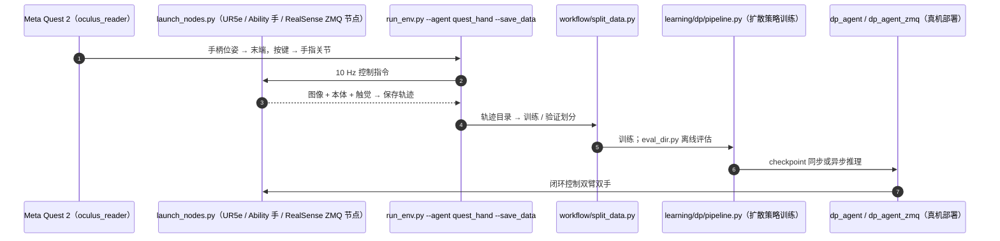

# Learning Visuotactile Skills with Two Multifingered Hands

**Learning Visuotactile Skills with Two Multifingered Hands** 收录于 [Robot Learning Paper Notebooks](https://imchong.github.io/Robot_Learning_Paper_Notebooks/index.html)（分类：06_Manipulation），深读笔记已完成。本页编译自深读笔记与 arXiv 论文正文（实验数字、开源状态于 2026-09-28 核对），细节以论文 PDF 为准。

## 一句话定义

为复刻人类的灵巧、感知体验与动作模式，本文用一套带多指手与视触觉数据的双手系统，从人类演示学习。为解决采集训练数据的硬件难题，作者开发了低成本遥操作系统 HATO（用现成部件搭建，高效采集双手数据），并把义肢手（prosthetic hands）改装、加装触觉传感器。在需多指灵巧的长时程、高精度操作任务上做模仿学习，并通过消融研究考察数据规模、感知模态（视觉/触觉）重要性、视觉预处理的影响。结果证明：结合视觉与触觉反馈能让机器人从人类演示学到复杂双手操作技能，推进多指灵巧控制的可行性。

## 英文缩写速查

| 缩写 | 含义 |
|---|---|
| Visuotactile | 视触觉（视觉 + 触觉） |
| Multifingered | 多指（灵巧手） |
| HATO | 本文低成本双手遥操作系统 |
| Prosthetic Hand | 义肢手（改装 + 触觉传感器） |
| Imitation Learning | 模仿学习 |
| Ablation | 消融研究 |

## 为什么重要

- **触觉对多指灵巧操作的贡献被消融量化**，为"该不该上触觉"提供证据；
- **低成本硬件（义肢手 + 现成件）**降低双手灵巧研究门槛；
- 对人形双手操作直接相关；
- 与"人形视触觉数据集"等触觉工作共同强调触觉模态。

## 解决什么问题

双手多指**视触觉**操作难采数据、难学： - 多指手 + 触觉传感**硬件贵、难搭**； - 缺**低成本**采集系统； - 不清楚**触觉/视觉/数据规模**各自的贡献。

论文要：低成本双手视触觉系统 + 从人类演示学复杂操作，并厘清各模态贡献。

## 核心机制

1. **HATO 低成本双手遥操作系统**：现成部件 + 触觉义肢手；
2. **视触觉模仿学习**：长时程高精度多指任务；
3. **系统消融**：数据规模、视觉/触觉模态、视觉预处理；
4. **视觉+触觉协同**：学到复杂双手操作技能。

方法拆解（深读笔记小节）：HATO 低成本双手遥操作 + 触觉义肢手；视触觉模仿学习；消融研究；结论；🧭 整体流程（mermaid）。

## 核心信息

| 字段 | 内容 |
|------|------|
| 分类 | 06_Manipulation |
| 深读笔记 | <https://imchong.github.io/Robot_Learning_Paper_Notebooks/papers/06_Manipulation/Learning_Visuotactile_Skills_with_Two_Multifingered_Hands/Learning_Visuotactile_Skills_with_Two_Multifingered_Hands.html> |
| arXiv | <https://arxiv.org/abs/2404.16823> |
| 源码 | **已开源**：[toruowo/hato](https://github.com/toruowo/hato)（Meta Quest 2 遥操作与数据采集、双 UR5e + Ability 手硬件节点、扩散策略训练 / 离线评测 / 真机部署） |
| 作者 | Toru Lin、Yu Zhang、Qiyang Li、Haozhi Qi、Brent Yi、Sergey Levine、Jitendra Malik（UC Berkeley） |
| 发表 | 2024 年 4 月 |
| 笔记阅读日期 | 2026-06-21 |

## 源码运行时序图

## 实验与评测

**平台**：两台 UR5e + 两只改装的 Psyonic Ability 义肢手（加装触觉传感器）；Meta Quest 2 手柄位姿映射末端，握把 / 摇杆映射手指关节。策略为扩散策略，输入视觉（多相机）、本体与触觉。

| 任务 | 演示数 | 输入 | 成功率 |
|------|------|------|------|
| 滑溜物体交接 | 100 | 视觉 + 本体 | 10/10 |
| 大积木叠塔 | 100 | 视觉 + 本体 + 触觉 | 10/10 |
| 倒酒（瓶内装珠子） | 300 | 视觉 + 本体 | 9/10 |
| 用锅铲盛牛排（长时程） | 300 | 视觉 + 本体 + 触觉 | 5/10（双手拿起 10/10） |

模态与相机消融：

| 消融 | 结果 |
|------|------|
| 叠塔·少见初始化：完整 / 去触觉 / 去视觉 | 10/10 / 4/10 / 0/10（常见初始化均为 10/10） |
| 盛牛排：完整 / 去触觉 / 去视觉 / 仅末端状态 | 成功 5/10 / 0/10 / 0/10 / 0/10；去触觉仍能拿起但完不成 |
| 盛牛排相机：完整 / 加深度 / 仅腕部 / 仅第三视角 | 成功 10/10 / 1/10 / 1/10 / 0/10 |

- **数据规模**：更多演示持续降低预测误差，叠塔约 75 条、倒酒约 200 条、盛牛排约 100 条后饱和。
- 加深度图不带来提升，反而在盛牛排上明显变差；三路 RGB 相机缺一不可。

## 与其他工作对比

| 工作 | 硬件 / 感知 | 与 HATO 的差异 |
|------|------|------|
| 平行夹爪方案 | 夹爪 + 视觉 | 论文认为多指手接触面积大，滑溜物体交接与倒酒更容易 |
| [A Humanoid Visual-Tactile-Action Dataset](./paper-notebook-a-humanoid-visual-tactile-action-dataset-for-con.md) | 人形 + 视触觉数据集 | 侧重数据集发布；HATO 侧重低成本采集系统与模态消融 |
| [Bunny-VisionPro](./paper-notebook-bunny-visionpro-real-time-bimanual-dexterous-tel.md) | Vision Pro 手部追踪双手遥操作 | 用手部追踪直接映射灵巧手；HATO 用 VR 手柄 + 按键映射手指 |
| [Humanoid Transformer with Touch Dreaming](../methods/humanoid-transformer-touch-dreaming.md) | 人形触觉预测 | 学习预测触觉；HATO 直接把触觉作为策略输入 |

## 结论

**这篇工作把双手多指视触觉操作的门槛，从「买得起昂贵硬件」降到「现成部件加改装义肢手」，并用系统消融回答了触觉到底值不值得上这个问题。**

- 起作用的是硬件与数据两端：HATO 低成本遥操作系统用现成部件搭建，配上改装并加装触觉传感器的义肢手，高效采集双手演示才成为可能。
- 学习侧的结论是视觉与触觉协同——在需多指灵巧的长时程、高精度任务上，两种反馈结合才能从人类演示学到复杂双手技能。
- 消融同时覆盖数据规模、感知模态与视觉预处理三个维度，这比单纯「我们也上了触觉」更有价值，为后续系统提供了取舍依据。
- 适用边界：结论产生于模仿学习范式下的人类演示数据，本页不涉及无演示或纯自主探索的设定。
- 消融把「触觉值不值」讲得很具体：叠塔在少见初始化下去触觉从 10/10 掉到 4/10；盛牛排去触觉仍能拿起工具但成功 0/10，而加深度图反而从 10/10 掉到 1/10。

## 局限与风险

- **遥操作无触觉反馈**：操作者感受不到接触力，作者认为加入触觉回传能提升数据质量。
- **策略从零训练、无预训练**：对场景外观变化敏感，泛化性有限（论文讨论节）。
- **手指控制粒度粗**：VR 手柄的握把 / 摇杆映射手指关节，难以表达细粒度的指间动作。
- **长时程任务仍不稳**：盛牛排成功率 5/10，且去掉任何一种模态都会失败。
- **复现门槛**：需两台 UR5e、改装的 Ability 手与触觉传感器，硬件成本虽低于同类系统但仍不小。

## 与其他页面的关系

- 分类父节点：[paper-notebook-category-06-manipulation](../overview/paper-notebook-category-06-manipulation.md)
- 总索引：[humanoid-paper-notebooks-index.md](../overview/humanoid-paper-notebooks-index.md)
- 任务语境：双臂操作：[bimanual-manipulation](../tasks/bimanual-manipulation.md)
- 视触觉融合：[visuo-tactile-fusion](../concepts/visuo-tactile-fusion.md)
- 触觉感知：[tactile-sensing](../concepts/tactile-sensing.md)
- 策略骨架 Diffusion Policy：[paper-diffusion-policy](./paper-diffusion-policy.md)
- 人形视触觉数据集：[paper-notebook-a-humanoid-visual-tactile-action-dataset-for-con](./paper-notebook-a-humanoid-visual-tactile-action-dataset-for-con.md)

## 参考来源

- [humanoid_pnb_learning-visuotactile-skills-with-two-multifinge.md](../../sources/papers/humanoid_pnb_learning-visuotactile-skills-with-two-multifinge.md)
- 深读笔记：<https://imchong.github.io/Robot_Learning_Paper_Notebooks/papers/06_Manipulation/Learning_Visuotactile_Skills_with_Two_Multifingered_Hands/Learning_Visuotactile_Skills_with_Two_Multifingered_Hands.html>
- 论文：<https://arxiv.org/abs/2404.16823>
- 论文正文（Table I–IV、数据规模与讨论节）：<https://arxiv.org/html/2404.16823>
- 官方代码：<https://github.com/toruowo/hato>

## 推荐继续阅读

- [机器人论文阅读笔记：Learning Visuotactile Skills with Two Multifingered Hands](https://imchong.github.io/Robot_Learning_Paper_Notebooks/papers/06_Manipulation/Learning_Visuotactile_Skills_with_Two_Multifingered_Hands/Learning_Visuotactile_Skills_with_Two_Multifingered_Hands.html)
- 项目页：<https://toruowo.github.io/hato/>
