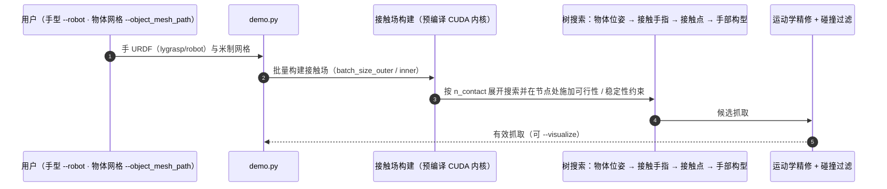

# Lightning Grasp

**Lightning Grasp: High Performance Procedural Grasp Synthesis with Contact Fields** 收录于 [Robot Learning Paper Notebooks](https://imchong.github.io/Robot_Learning_Paper_Notebooks/index.html)（分类：06_Manipulation），深读笔记已完成。本页编译自深读笔记与 arXiv 论文正文（实验数字、开源状态于 2026-09-28 核对），细节以论文 PDF 为准。

## 一句话定义

多年研究后，灵巧手的实时多样抓取合成仍是机器人与计算机图形学的未解核心难题。本文提出一个程序化算法，相比 SOTA 取得数量级（orders-of-magnitude）的提速，并能为不规则物体生成抓取。关键创新是：用一个简单高效的数据结构——「接触场（Contact Field）」，把复杂几何计算与搜索过程解耦。由此实现快速抓取合成，无需精心调的能量函数与敏感的初始化，并能在不规则、工具类物体上无监督生成。代码开源。

## 英文缩写速查

| 缩写 | 含义 |
|---|---|
| Grasp Synthesis | 抓取合成，生成可行抓取姿态 |
| Procedural | 程序化（基于规则/搜索而非学习） |
| Contact Field | 接触场，解耦几何计算与搜索的数据结构 |
| Energy Function | 能量函数（本文不需精调） |
| Dexterous Hand | 灵巧手（多指） |
| Tool-like Object | 工具类不规则物体 |

## 为什么重要

- **"解耦昂贵计算与搜索"是提速的通用思路**：用合适数据结构换速度；
- **程序化方法**在抓取上仍极具竞争力，不必事事学习；
- **实时多样抓取**对灵巧操作（含人形双手）是基础能力；
- 开源利于作为抓取模块嫁接到更大系统。

## 解决什么问题

灵巧手**实时多样抓取合成**难： - 现有方法**慢**，难实时； - 依赖**精调能量函数**与**敏感初始化**； - 对**不规则/工具类物体**支持差。

Lightning Grasp 要：**快几个数量级**、**免精调**、能处理不规则物体的抓取合成。

## 核心机制

1. **接触场数据结构**：解耦几何计算与搜索，数量级提速；
2. **程序化抓取合成**：免精调能量函数与敏感初始化；
3. **不规则/工具类物体无监督生成**：泛化性好；
4. **开源**：可复现的高性能抓取合成。

方法拆解（深读笔记小节）：接触场（Contact Field）解耦几何与搜索；程序化搜索（免能量函数/初始化）；不规则/工具类物体、无监督；结果；🧭 整体流程（mermaid）。

## 核心信息

| 字段 | 内容 |
|------|------|
| 分类 | 06_Manipulation |
| 深读笔记 | <https://imchong.github.io/Robot_Learning_Paper_Notebooks/papers/06_Manipulation/Lightning_Grasp__High_Performance_Procedural_Grasp_Synthesis_with_Contact_Fields/Lightning_Grasp__High_Performance_Procedural_Grasp_Synthesis_with_Contact_Fields.html> |
| arXiv | <https://arxiv.org/abs/2511.07418> |
| 作者 | Zhao-Heng Yin、Pieter Abbeel（UC Berkeley） |
| 发表 | 2025 年 11 月 |
| 源码 | **部分开源**：[zhaohengyin/lightning-grasp](https://github.com/zhaohengyin/lightning-grasp)（Python 流程 + 预编译 CUDA 内核，支持自定义手 URDF；README 称 CUDA C++ 源码将在后续版本发布，2026-04 已加入 mimic joint 支持） |
| 笔记阅读日期 | 2026-06-21 |

## 源码运行时序图

## 实验与评测

**设置**：Shadow（22 DoF）、LEAP（16 DoF）、Allegro（16 DoF）、DClaw（9 DoF）四种手；YCB 与网上开源 3D 物体，覆盖胶囊等微小物体、苹果等规则物体、杯子与工具等非凸物体。指标为摊销后的**有效样本数 / 秒（SPS）**，单卡 A100。

| 手 | 胶囊 | 苹果 | 勺 | 杯 | 剪刀 | 螺丝刀 | 钳 | 锤 | 截尾均值 |
|------|---:|---:|---:|---:|---:|---:|---:|---:|---:|
| Allegro | 1296 | 1579 | 956 | 1090 | 989 | 1021 | 1545 | 944 | **1091** |
| LEAP | 3306 | 729 | 408 | 282 | 139 | 357 | 403 | 343 | 420 |
| Shadow | 1060 | 288 | 329 | 182 | 416 | 895 | 745 | 679 | 559 |

- 基线 SPS 至少低 10 倍，表中未列；所有配置 6 秒内完成。单次前向剖析显示在 TITAN X 上也比 A100 上的基线快数百倍。
- **不同手的差异**：Allegro 有效样本最多；LEAP 电机布局笨重、自碰撞多；Shadow 五指高 DoF 易出现手指交叉碰撞；DClaw 指尖非凸且自由度低，碰撞多、可行解少。作者据此认为算法也可用来评估灵巧手硬件设计。
- **难例**：杯子等强非凸物体的有效 SPS 明显下降——局部凸假设下的运动学优化能消除接触点附近的碰撞，但仍会出现全局穿透（图 11）。
- 论文主结果以可视化为主，未报告真机抓取成功率。

## 与其他工作对比

| 路线 | 做法 | 与 Lightning Grasp 的差异 |
|------|------|------|
| 能量函数优化类抓取合成 | 设计并调参能量函数，从初始化出发优化 | 需精调能量与初始化；Lightning Grasp 用接触场做树搜索，免调参且快 10 倍以上 |
| 学习式抓取生成 | 在大规模抓取数据上训练生成模型 | 需要数据；Lightning Grasp 可反过来为其离线生成数据（多遍生成） |
| [Arm-Aware DexGrasp](./paper-arm-aware-dexgrasp.md) | 推理时加入手臂约束 | 关注手臂可达性；Lightning Grasp 只做手–物体抓取合成 |
| [AnyGrasp](./anygrasp.md) | 平行夹爪抓取检测 | 面向夹爪与感知；Lightning Grasp 面向多指手的解析合成 |

## 结论

**Lightning Grasp 的价值不在于又一个学习式抓取模型，而在于证明「换一个数据结构」就能让程序化抓取合成快出数量级，并顺带甩掉能量函数精调与初始化敏感这两个老包袱。**

- 起作用的机制是接触场（Contact Field）：把昂贵的几何计算与搜索过程解耦，既是提速来源，也是可迁移到其他问题的通用思路。
- 收益是复合的——数量级提速之外，免精调能量函数、免敏感初始化，意味着上手成本与调参风险同时下降。
- 适用范围延伸到不规则与工具类物体，且为无监督生成，不需要为新物体准备标注。
- 定位上它说明程序化方法在抓取问题上仍具竞争力，不必事事交给学习。
- 工程落地友好：代码已发布（CUDA 内核目前为预编译二进制），A100 上 Allegro 截尾均值约 1091 个有效抓取 / 秒，可作为抓取模块或离线数据生成器嫁接进更大的灵巧操作系统。

## 局限与风险

- **非凸物体效率下降**：杯子类物体会产生全局穿透，需要新的剪枝数据结构（论文列为开放问题）。
- **只做合成、不含执行**：未报告真机抓取成功率，也不处理抓取后的操作与动力学稳定性以外的因素。
- **需要 NVIDIA GPU + CUDA 12**：发布的是预编译 CUDA 内核，CUDA C++ 源码尚未开放，定制内核受限。
- **物体网格需米制单位**；新手型需按 README 配置模型。

## 与其他页面的关系

- 分类父节点：[paper-notebook-category-06-manipulation](../overview/paper-notebook-category-06-manipulation.md)
- 总索引：[humanoid-paper-notebooks-index.md](../overview/humanoid-paper-notebooks-index.md)
- 抓取位姿估计：[grasp-pose-estimation](../methods/grasp-pose-estimation.md)
- 灵巧手运动学：[dexterous-kinematics](../concepts/dexterous-kinematics.md)
- 评测用 Allegro Hand（产出率最高）：[allegro-hand](./allegro-hand.md)
- 评测用 Shadow Hand：[shadow-hand](./shadow-hand.md)
- 灵巧抓取合成的另一路线：[paper-arm-aware-dexgrasp](./paper-arm-aware-dexgrasp.md)

## 参考来源

- [humanoid_pnb_lightning-grasp.md](../../sources/papers/humanoid_pnb_lightning-grasp.md)
- 深读笔记：<https://imchong.github.io/Robot_Learning_Paper_Notebooks/papers/06_Manipulation/Lightning_Grasp__High_Performance_Procedural_Grasp_Synthesis_with_Contact_Fields/Lightning_Grasp__High_Performance_Procedural_Grasp_Synthesis_with_Contact_Fields.html>
- 论文：<https://arxiv.org/abs/2511.07418>
- 论文正文（Table 1、结果与难例分析）：<https://arxiv.org/html/2511.07418>
- 官方代码：<https://github.com/zhaohengyin/lightning-grasp>

## 推荐继续阅读

- [机器人论文阅读笔记：Lightning Grasp](https://imchong.github.io/Robot_Learning_Paper_Notebooks/papers/06_Manipulation/Lightning_Grasp__High_Performance_Procedural_Grasp_Synthesis_with_Contact_Fields/Lightning_Grasp__High_Performance_Procedural_Grasp_Synthesis_with_Contact_Fields.html)
