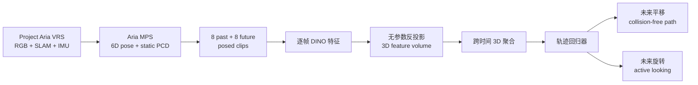

# LookOut：真实世界第一视角 6-DoF 导航预测

**LookOut**（*Real-World Humanoid Egocentric Navigation*，[arXiv:2508.14466](https://arxiv.org/abs/2508.14466)，ICCV 2025）由斯坦福大学提出：从一段带位姿的头戴相机视频预测未来头部平移与旋转，以同一监督同时学习“往哪走”和“为看清而往哪转头”。

## 一句话定义

**LookOut 把短时人形导航写成未来 6-DoF 头部轨迹回归：DINO 特征被反投影到 3D 并跨时间聚合，平移学习无碰撞路径，旋转学习过街前看车等主动信息采集。**

## 英文缩写速查

| 缩写 | 英文全称 | 简要说明 |
|------|----------|----------|
| AND | Aria Navigation Dataset | 4 小时真实第一视角导航数据集 |
| DoF | Degrees of Freedom | 头部 3D 平移 + 3D 旋转共 6 自由度 |
| MPS | Machine Perception Services | Project Aria 的位姿、点云等离线处理服务 |
| SLAM | Simultaneous Localization and Mapping | 为训练提供 posed video 与静态场景点云 |
| PCD | Point Cloud | 可选深度 / Aria MPS 生成的三维障碍表示 |
| BEV | Bird's-Eye View | 论文用于展示头部平移轨迹的俯视可视化 |

## 为什么重要

- **把“看”纳入导航动作：** 只预测平面路线无法表达过街前左右看、低头检查栏杆等主动感知行为。
- **数据采集轻量：** Project Aria 眼镜替代机器人遥操作，能在人群、街区、公园等真实动态环境收集示范。
- **语义与几何统一：** DINO 特征在 3D canonical frame 中聚合，既利用类别语义，又保留障碍空间关系。
- **连接 [主动感知（FLAP）](./paper-flap-fov-active-perception-3d-navigation.md) 与人形 locomotion：** 6-DoF 头部轨迹可转成速度或头部控制目标，但本文本身不含完整真机闭环。

## 核心信息

| 字段 | 内容 |
|------|------|
| 机构 | 斯坦福大学（Stanford University） |
| 发表 | ICCV 2025 |
| 输入 / 输出 | 8 个历史 posed RGB frames → 8 个未来 6-DoF 头部位姿；clips 覆盖约 4.5 s |
| AND | 4 h、274k RGB frames、36k clips、18 个室内外密集地点、20 fps |
| 训练 | AdamW、700k steps、batch 4；单 RTX A6000 约 4 天 |
| 项目页 / 开源 | [LookOut 项目页](https://sites.google.com/stanford.edu/lookout)；提供 **Data** 申请入口，**未列代码仓库或模型权重**（2026-07-28） |

## 流程总览

## 核心机制（方法栈）

### 1. 任务与 canonical frame

输入是带相机位姿的 egocentric RGB 序列，输出当前头部坐标系下的未来头部 pose。canonical frame 与地面平行、朝当前 heading，避免模型记忆绝对地图；旋转用连续 6D rotation representation，损失为平移与旋转 L1 之和。

### 2. DINO 特征反投影

对 canonical 3D grid 中每个坐标，通过相机内外参找到图像子像素并双线性采样 DINO feature，得到逐帧 3D feature volume。该操作没有学习参数，让 2D 语义沿几何射线进入 3D。

### 3. 时序 3D 聚合

各帧 volume 已对齐到同一 canonical frame，再沿时间融合。静态结构会在多帧重复出现，移动行人与车辆则留下时间变化；模型据此共同推断障碍和人类示范中的避让行为。

### 4. 6-DoF 联合回归

平移目标对应可执行路线，旋转目标捕捉转头。相比只预测 xy waypoint，头部 orientation 让模型学习信息采集动作；但 deterministic L1 在左右都可绕时会回归均值。

### 5. AND 数据链

Aria 同时记录 RGB、双目 SLAM、eye tracking、IMU、barometer 与 GPS；本文主要用 RGB、MPS pose 与 scene point cloud。VRS 经 MPS 和去畸变后，以 6-frame stride / dilation 切 clip；动态点在 SLAM static PCD 中被过滤，动态碰撞评测需另用单目深度 + 语义分割估算。

## 与其他工作对比

| 方法 | 人类数据 | 输出 | 多模态 | 真机闭环 |
|------|----------|------|--------|----------|
| EgoCast | egocentric 活动 | 全身未来 pose | 单轨迹 | 否 |
| [EgoNav](./paper-notebook-egonav.md) | 5 h 胸前 RGB-D | 未来 5 s 多条 6-DoF 轨迹 | 扩散 | Unitree G1 |
| **LookOut** | **4 h 头戴 RGB** | **单条头部 6-DoF 轨迹** | **L1 回归** | **未验证** |
| [FocusNav](./paper-notebook-focusnav.md) | 仿真特权 teacher | 关节目标 | 单一路径点链 | Unitree G1 |

## 工程实践与开源状态

| 项 | 实施要点 |
|----|----------|
| 采集 | Aria cameras 20 fps；需先去畸变并通过 MPS 得到时间同步 pose / point cloud |
| 隐私 | 遵循 Project Aria research guidelines，并对视频人脸去标识化 |
| 训练 | 3D volume 显存开销高；论文 batch 仅 4、A6000 训练约 4 天 |
| 部署接口 | 可将预测平移转换为 base velocity、旋转转换为头部 / 视线目标；论文没有给实时频率或低层控制器 |
| 开源 | **部分开放**：项目页有 Data 链接 / 申请，未列代码、权重和许可证；不能称“代码已开源” |

## 源码运行时序图

**不适用**：截至 **2026-07-28**，项目页只有 arXiv 与 Data 入口，没有官方代码仓库或可识别训练 / 推理 README；AND 可申请不等于 LookOut 实现可运行。

## 实验与评测

- **held-out unseen environments：** LookOut 的 translation L1 **0.17**、rotation L1 **0.16**；EgoCast 为 0.34 / 0.63。
- **无碰撞率：** 静态 / 动态平均 **85.6% / 90.2%**；EgoCast 为 84.2% / 86.2%（按 15/25/35 cm 多阈值汇总）。
- **关键消融：** 去 DINO 后 L1 变为 0.35 / 0.67、static / dynamic collision avg 84.5% / 85.3%；只做 2D fusion 为 0.26 / 0.44。
- **额外传感器：** RGB+Depth 把 dynamic collision avg 提到 91.4%，但本文主线仍强调单目 RGB 可用。
- **定性行为：** waiting / slowing、rerouting、过街转头；项目页视频是 rolling prediction，不是人形机器人闭环部署。

## 结论

**LookOut 的核心价值是把头部旋转纳入真实第一视角导航监督，并给出可扩展 AND 数据链；其模型仍是离线单轨迹预测器，不应被描述成已部署的人形导航系统。**

1. **6-DoF 比平面 waypoint 多一层主动感知监督** — 旋转直接记录人类为何转头观察。
2. **3D 对齐是主要性能来源** — 去 DINO 或只做 2D fusion 都明显退化。
3. **数据集比代码更开放** — AND 有申请入口，模型实现与权重没有公开。
4. **collision metric 要分静态 / 动态** — 静态来自 SLAM PCD，动态来自估计深度与分割，误差来源不同。
5. **部署仍需补齐** — 实时推理、目标条件、滚动选路和低层人形控制均未在论文闭环证明。

## 局限与风险

- L1 回归无法表示左右绕行等多峰未来，论文明确给出均值轨迹失败案例。
- 未见过的细小障碍会漏检；例如训练没有 rail 时，模型不会学会低头检查。
- 输入要求 posed video；若在线 SLAM 漂移，3D unprojection 与轨迹监督都会错位。
- 论文定量评测是离线 forecasting，不等价于 collision-free robot execution。
- AND 涉及公共空间视频，实际复用需核查申请、隐私与许可边界。

## 与其他页面的关系

- [导航纵深路线 Stage 3 / 5](../../roadmap/depth-navigation.md) — 人形第一视角导航与主动感知节点
- [主动感知（FLAP）](./paper-flap-fov-active-perception-3d-navigation.md) — 头部旋转是“为看见而行动”的监督形式
- [EgoNav](./paper-notebook-egonav.md) — 在 LookOut 的人类数据范式上进一步做多模态扩散与 G1 闭环
- [FocusNav](./paper-notebook-focusnav.md) — 几何 BEV 到关节控制的真机局部导航对照
- [3D 空间 VQA](../concepts/3d-spatial-vqa.md) — 同样依赖语义–几何接地，但目标是预测动作轨迹而非回答问题

## 参考来源

- [Paper Notebooks 原始归档](../../sources/papers/humanoid_pnb_lookout.md)
- [LookOut 官方项目页核查](../../sources/sites/lookout.md)
- 论文：<https://arxiv.org/abs/2508.14466>

## 推荐继续阅读

- [LookOut 深读笔记](https://imchong.github.io/Robot_Learning_Paper_Notebooks/papers/08_Navigation/LookOut__Real-World_Humanoid_Egocentric_Navigation/LookOut__Real-World_Humanoid_Egocentric_Navigation.html)
- [ICCV 2025 Open Access 论文](https://openaccess.thecvf.com/content/ICCV2025/html/Pan_LookOut_Real-World_Humanoid_Egocentric_Navigation_ICCV_2025_paper.html)
