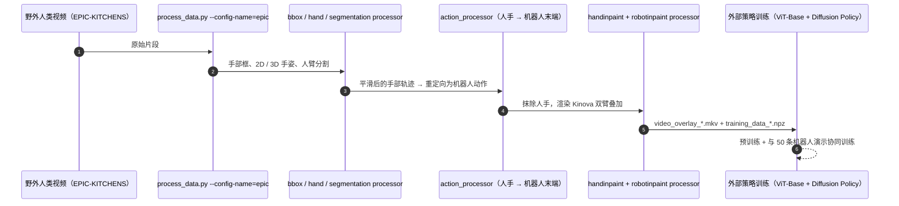

# Masquerade

**Masquerade: Learning from In-the-wild Human Videos using Data-Editing** 收录于 [Robot Learning Paper Notebooks](https://imchong.github.io/Robot_Learning_Paper_Notebooks/index.html)（分类：06_Manipulation），深读笔记已完成。本页编译自深读笔记与 arXiv 论文正文（实验数字、开源状态于 2026-09-28 核对），细节以论文 PDF 为准。

## 一句话定义

机器人操作仍数据稀缺——最大的机器人数据集也比驱动语言/视觉突破的数据小几个数量级。Masquerade 通过编辑野外第一视角人类视频来闭合人-机视觉具身差距，再用编辑后的视频学机器人策略。流程把每段人类视频变成机器人化演示：① 估计 3D 手姿；② 修复涂抹（inpaint）人臂；③ 叠加渲染的双臂机器人，使其跟踪恢复的末端轨迹。在 67.5 万帧编辑片段上预训练视觉编码器以预测未来 2D 机器人关键点，并在每任务仅 50 条机器人演示上微调扩散策略头（继续保留该辅助损失），所得策略泛化显著更好。在三个长时程双手厨房任务、各三个未见场景上，Masquerade 较基线高 5–6 倍；消融显示机器人叠加与协同训练都不可或缺，性能随编辑人类视频量对数增长。

## 英文缩写速查

| 缩写 | 含义 |
|---|---|
| Data-Editing | 数据编辑，把人类视频改造成机器人演示 |
| Inpainting | 图像修复，涂掉人臂 |
| Robot Overlay | 叠加渲染机器人 |
| Co-training | 协同训练（辅助损失 + 策略） |
| 2D Keypoints | 2D 机器人关键点 |
| Visual Embodiment Gap | 视觉具身差距 |

## 为什么重要

- **"把人类视频改造成机器人样子"是用好人类数据的关键洞见**：视觉一致才好学；
- **机器人叠加 + 协同训练缺一不可**，提示视觉对齐与辅助监督的协同；
- **少量机器人演示 + 海量编辑视频**是高性价比配方；
- 与 MimicDroid、In-N-On 等共同推进从人类视频学操作。

## 解决什么问题

机器人数据稀缺，人类视频海量但有**视觉具身差距**（看起来是人手不是机器人）： - 直接学人类视频，策略看到的视觉与机器人不一致； - 需要**闭合视觉差距**才能用好人类视频。

Masquerade 要：用**数据编辑**把人类视频"机器人化"，从而利用海量人类视频。

## 核心机制

1. **数据编辑闭合视觉具身差距**：手姿估计 + 涂臂 + 机器人叠加；
2. **预训练 + 协同训练**：67.5 万帧预测 2D 关键点，仅 50 演示/任务微调；
3. **显著泛化**：双手厨房任务较基线 5–6 倍；
4. **可扩展**：性能随编辑视频量对数增长。

方法拆解（深读笔记小节）：三步数据编辑（人类视频 → 机器人演示）；预训练 + 协同训练；结果；🧭 整体流程（mermaid）。

## 核心信息

| 字段 | 内容 |
|------|------|
| 分类 | 06_Manipulation |
| 深读笔记 | <https://imchong.github.io/Robot_Learning_Paper_Notebooks/papers/06_Manipulation/Masquerade__Learning_from_In-the-wild_Human_Videos_using_Data-Editing/Masquerade__Learning_from_In-the-wild_Human_Videos_using_Data-Editing.html> |
| arXiv | <https://arxiv.org/abs/2508.09976> |
| 源码 | **部分开源**：[MarionLepert/phantom](https://github.com/MarionLepert/phantom) 同时服务 Phantom 与 Masquerade，提供人类视频编辑流水线（手部检测 / 分割 / 3D 手姿 / 重定向 / 抹除人手 / 叠加机器人）；策略训练需自行用导出的 npz 与叠加视频接入 |
| 作者 | Marion Lepert、Jiaying Fang、Jeannette Bohg（Stanford） |
| 发表 | 2025 年 8 月 |
| 笔记阅读日期 | 2026-06-21 |

## 源码运行时序图

仓库复现到「编辑后的训练数据」为止；策略训练需按 README「Train policy」说明自行接入。

## 实验与评测

**设置**：双 Kinova 机械臂（平行夹爪）；视觉编码器 ViT-Base（ImageNet 初始化）在 1 万段 EPIC-KITCHENS 片段（67.5 万帧，已编辑成「机器人在做」）上预训练，辅助任务是预测未来 2D 机器人关键点；每任务只有 50 条单场景机器人演示，动作头为 Diffusion Policy，微调时继续保留辅助损失（协同训练）。基线：HRP（在原始人类视频上学可供性的表征）、ImageNet ViT、DINOv2，均为 ViT-Base。

- **分布外场景**：3 个长时程双手任务（叠锅、刮土豆、扫辣椒），每任务 3 个未见场景 × 10 次；Masquerade 平均 **74%**，基线约 **12%**，平均高 62 个百分点（约 5–6 倍）。
- **I.D. → O.O.D. 几乎不掉**：所有基线在换场景后大幅下降，Masquerade 保持相近水平。
- **消融**（OOD 场景 1，每柱 25 次）：去掉机器人叠加（直接用原始人类视频）或去掉协同训练（只预训练再纯策略微调），成功率都急剧下降——后者说明编码器会遗忘人类视频表征。
- **数据规模**（叠锅任务，25 次）：编辑视频用量 0% / 10% / 50% / 100% → 成功率 2% / 26% / 47% / 68%。

## 与其他工作对比

| 工作 | 人类视频用法 | 与 Masquerade 的差异 |
|------|------|------|
| HRP（论文基线） | 原始视频上学手部 / 物体 / 接触可供性 | 不闭合视觉具身差距、不做协同训练；OOD 远低于 Masquerade |
| Phantom（同作者，共用仓库） | 实验室录制人类视频 → 编辑后直接训练 | 不用机器人数据；Masquerade 面向野外视频并加少量机器人演示 |
| [DreamGen](./paper-notebook-dreamgen-unlocking-generalization-in-robot-learn.md) | 视频世界模型生成机器人视频 | 数据是生成的；Masquerade 编辑真实人类视频，成本低但依赖手姿估计 |
| [In-N-On](./paper-notebook-in-n-on-scaling-egocentric-manipulation-with-in.md) | 人体中心动作表示 + 域判别器 | 在表示 / 训练层对齐；Masquerade 在像素层对齐 |

## 结论

**Masquerade 的赌注是视觉一致性：只要把野外第一视角人类视频改造得「看起来像机器人在做」，海量人类视频就能直接充当策略的预训练语料。**

- 真正起作用的是三步数据编辑（估计 3D 手姿 → 涂抹掉人臂 → 叠加渲染双臂机器人跟踪恢复的末端轨迹）；消融显示机器人叠加与协同训练缺一不可，说明视觉对齐与辅助监督必须配套，做一半不成立。
- 配方的性价比体现在比例上：67.5 万帧编辑片段预训练视觉编码器预测未来 2D 机器人关键点，每任务仅 50 条真实机器人演示微调扩散策略头，且微调时继续保留该辅助损失。
- 可扩展性有明确形状——性能随编辑人类视频量呈对数增长，意味着继续堆数据的边际收益递减，不能按线性外推。
- 适用边界：5–6 倍增益是在三个长时程双手厨房任务、各三个未见场景这一范围内成立；整条流水线还依赖第一视角视频与可靠的 3D 手姿估计。
- 与本页提到的 MimicDroid、In-N-On 同属「从人类视频学操作」，差别在于本页把力气全部押在闭合视觉具身差距上。

## 局限与风险

- **依赖单目手姿估计**：快速运动与重度遮挡帧估计差，只能丢弃。
- **无深度信息**：无法判断机器人哪些像素应被物体遮挡，叠加后的抓取不够真实。
- **第一视角相机运动**：方法在固定底座机器人上实现，野外视频中相机移动的帧大量被过滤。
- **人手 → 平行夹爪映射不完美**：灵巧抓取被压成夹爪动作，具身差距仍在。
- **规模收益递减**：成功率随编辑视频量上升但增幅变小，不能线性外推。
- **开源边界**：仓库覆盖数据编辑，策略训练脚本未包含在 README 流程中。

## 与其他页面的关系

- 分类父节点：[paper-notebook-category-06-manipulation](../overview/paper-notebook-category-06-manipulation.md)
- 总索引：[humanoid-paper-notebooks-index.md](../overview/humanoid-paper-notebooks-index.md)
- 野外视频来源 EPIC-KITCHENS：[painode-089-epickitchens100](./painode-089-epickitchens100.md)
- 策略头 Diffusion Policy：[paper-diffusion-policy](./paper-diffusion-policy.md)
- 对比基线 DINOv2：[paper-dinov2](./paper-dinov2.md)
- 任务语境：双臂操作：[bimanual-manipulation](../tasks/bimanual-manipulation.md)
- 生成视频而非编辑真实视频的对照：[paper-notebook-dreamgen-unlocking-generalization-in-robot-learn](./paper-notebook-dreamgen-unlocking-generalization-in-robot-learn.md)

## 参考来源

- [humanoid_pnb_masquerade.md](../../sources/papers/humanoid_pnb_masquerade.md)
- 深读笔记：<https://imchong.github.io/Robot_Learning_Paper_Notebooks/papers/06_Manipulation/Masquerade__Learning_from_In-the-wild_Human_Videos_using_Data-Editing/Masquerade__Learning_from_In-the-wild_Human_Videos_using_Data-Editing.html>
- 论文：<https://arxiv.org/abs/2508.09976>
- 论文正文（结果、消融、局限节）：<https://arxiv.org/html/2508.09976>
- 官方代码（Phantom / Masquerade 共用）：<https://github.com/MarionLepert/phantom>

## 推荐继续阅读

- [机器人论文阅读笔记：Masquerade](https://imchong.github.io/Robot_Learning_Paper_Notebooks/papers/06_Manipulation/Masquerade__Learning_from_In-the-wild_Human_Videos_using_Data-Editing/Masquerade__Learning_from_In-the-wild_Human_Videos_using_Data-Editing.html)
- 项目页：<https://masquerade-robot.github.io>
- Phantom 项目页：<https://phantom-human-videos.github.io/>
