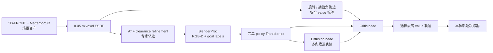
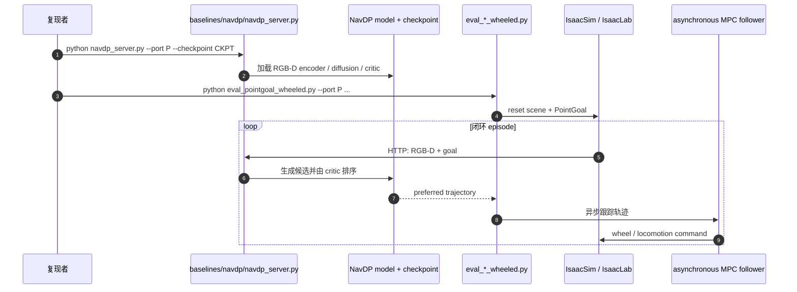

# NavDP：特权信息引导的 Sim2Real 导航扩散策略

**NavDP**（*Learning Sim-to-Real Navigation Diffusion Policy with Privileged Information Guidance*，[arXiv:2505.08712](https://arxiv.org/abs/2505.08712)，ICRA 2026）由上海人工智能实验室、清华大学、浙江大学与香港大学提出：纯仿真训练一个 RGB-D 轨迹生成器，并让 critic 用全局 ESDF 学会筛掉危险候选，部署时只需局部观测。

## 一句话定义

**NavDP 是“扩散生成多条局部轨迹 + goal-agnostic critic 选最安全一条”的端到端无图导航器：特权地图只在训练期提供专家与负样本标签，推理期跨轮式、四足和人形零样本复用。**

## 英文缩写速查

| 缩写 | 英文全称 | 简要说明 |
|------|----------|----------|
| NavDP | Navigation Diffusion Policy | 本文的导航轨迹扩散策略 |
| ESDF | Euclidean Signed Distance Field | 仿真中生成专家路径并标注轨迹安全值的特权地图 |
| RGB-D | Red-Green-Blue plus Depth | 部署期唯一局部场景观测 |
| DDPM | Denoising Diffusion Probabilistic Model | 轨迹生成 head 的扩散调度 |
| SPL | Success weighted by Path Length | PointGoal 的成功率–路径效率联合指标 |
| 3DGS | 3D Gaussian Splatting | 构建 target scene real-to-sim 数据以缩小视觉域差 |

## 为什么重要

- **生成与评估解耦但共享表示：** 扩散负责覆盖多峰路线，critic 负责安全排序，避免随机采样带来的累计碰撞。
- **把仿真特权信息用在标签而非输入：** A* / ESDF 只监督 expert trajectory 和 critic，真机无需全局地图。
- **跨本体接口清晰：** 输出 2D 局部轨迹，轮式、Go2、Galaxea R1、G1 只需各自 trajectory follower。
- **已提供可跑 benchmark：** 官方仓库包含 NavDP server、IsaacSim / IsaacLab 评测、数据资产和多任务入口。

## 核心信息

| 字段 | 内容 |
|------|------|
| 机构 | 上海人工智能实验室（Shanghai AI Laboratory）；清华大学（Tsinghua University）；浙江大学（Zhejiang University）；香港大学（The University of Hong Kong） |
| 发表 | ICRA 2026 |
| 数据 | 1244 scenes、56k trajectories、10M RGB-D images、363.2 km；约 2500 trajectories/GPU/day |
| 任务 | NoGoal、PointGoal、ImageGoal、TrajectoryGoal |
| 真机 | Unitree Go2、Galaxea R1、Unitree G1；室内外动态行人 |
| 开源 | **已开源**：[InternRobotics/NavDP](https://github.com/InternRobotics/NavDP)；代码许可证 README 标为 CC BY-NC-SA 4.0；checkpoint 通过表单申请 |

## 流程总览

## 核心机制（方法栈）

### 1. 可扩展仿真数据

场景 mesh 体素化为 0.05 m ESDF，按机器人半径截断障碍，再降采样到 0.2 m 做 A*。局部 greedy search 将 waypoint 推离障碍，三次样条平滑后由 BlenderProc 渲染 RGB-D。相机高度随机 0.25–1.25 m、pitch 随高度变化，并做纹理 / 灯光随机化。

### 2. 共享 Transformer 双头

16 个 RGB-D perception tokens、3 个 goal slots 与 1 个 trajectory slot 进入两层 Transformer。扩散阶段屏蔽 trajectory token、只打开对应 goal token；critic 阶段屏蔽所有 goal token，只根据局部观测与候选轨迹评估安全，因此 value 可跨 PointGoal / ImageGoal / NoGoal 复用。

### 3. 多任务轨迹生成

同一 expert sub-trajectory 的末端坐标作为 PointGoal、末端 RGB 作为 ImageGoal、投影轨迹作为 TrajectoryGoal；mask goal 即 NoGoal。扩散 head 学这些条件下的多峰局部 waypoint 分布。

### 4. 特权 critic

专家数据全是安全样本，无法训练判别器。NavDP 将 expert path 随机旋转，再与原轨迹按 \(\beta\in(0,1)\) 插值，利用全局 ESDF 计算各 waypoint 离障距离作为 value target。critic 同时提供 auxiliary training loss 与 test-time sample selection。

### 5. Real-to-Sim 补域

对目标实验室用 Gaussian Splatting 重建背景、Trellis 等重建障碍，沿同一管线生成约 4k in-domain trajectories。少量数据与多样仿真混合有效，比例过高反而损害泛化。

## 与其他工作对比

| 方法 | 数据 | 输入 | 候选筛选 | 目标类型 |
|------|------|------|----------|----------|
| [NoMaD](./paper-notebook-nomad-goal-masked-diffusion-policies-for-navigat.md) | 100+ h 真机 RGB | RGB history | topological planner，无 local critic | ImageGoal / NoGoal |
| ViPlanner | 仿真语义 / 几何 | RGB-D 等 | 单轨迹规划 | PointGoal |
| [EgoNav](./paper-notebook-egonav.md) | 5 h 人类 RGB-D | 360° memory + DINO | 外部滚动代价 | NoGoal prior |
| **NavDP** | **纯仿真 + 可选 3DGS** | **单帧 RGB-D + goal** | **共享 Transformer critic** | **Point / Image / Trajectory / NoGoal** |

## 工程实践与开源状态

| 项 | 官方入口 / 注意点 |
|----|-------------------|
| 模型服务 | `baselines/navdp/navdp_server.py --port ... --checkpoint ...` |
| benchmark | IsaacSim 4.2.0.2 + IsaacLab 1.2.0；HTTP API 将 planner 与异步 MPC follower 解耦 |
| 评测 | `eval_nogoal_wheeled.py`、`eval_pointgoal_wheeled.py`、`eval_imagegoal_wheeled.py` |
| 资产 | InternScene-N1 / InternData-N1 在 Hugging Face；大体积且版本依赖严格 |
| checkpoint | README 当前提供的 checkpoint 需要 Google Form 获取，故“代码已开源”不等于无门槛离线复现 |
| 许可 | 仓库 API 未声明 license 文件；README 明确称 open-sourced code 为 **CC BY-NC-SA 4.0**，商用需特别核查 |

## 源码运行时序图

最短可验证路径是先启动 `navdp_server.py`，再从 benchmark 调 `eval_*_wheeled.py`；训练论文模型的完整数据生成配方虽在论文中说明，当前 README 主入口更偏 checkpoint 推理与统一 benchmark。

## 实验与评测

- **PointGoal 仿真均值：** NavDP mSR **70.4%**、mSPL **58.6%**；高于 ViPlanner 65.6 / 55.4。
- **跨本体：** Dingo / Go2 / Galaxea R1 仿真 SR 分别 81.3 / 83.0 / 75.0%；real-to-sim 三本体 SR 66.0 / 52.6 / 64.6%。
- **真机零样本：** Go2、R1、G1 在室内外和动态行人中展示生成–筛选安全轨迹；论文主要给定性视频，未给统一真机 SR 表。
- **Real-to-Sim：** 加入少量 in-domain 数据，真场景 SR **50→80%**，reconstructed scene **45→65%**；约 27% 比例带来约 30% 相对提升。
- **速度：** RTX 5080 laptop 上推理 **>10 Hz**，机器人最高 2.0 m/s。
- **消融：** critic training loss 与 test-time selection 都有贡献；NoGoal objective 对通用 collision avoidance 最重要。

## 结论

**NavDP 的决定性设计是让扩散负责“有多少条路”，critic 负责“哪条安全”，并用仿真 ESDF 为两者提供互补监督；真正复现仍受 checkpoint 获取、重型 Isaac 版本和外部 follower 约束。**

1. **critic 不是附属 head** — 它同时改善表征训练和推理期轨迹选择。
2. **NoGoal 数据是安全先验** — 不依赖具体目标的避障训练提升所有任务。
3. **跨本体来自轨迹接口与相机随机化** — 不是模型直接输出每种机器人关节动作。
4. **少量 real-to-sim 有用但不能吞掉多样性** — in-domain 比例过大时泛化下降。
5. **开源可跑但非一键复论文** — server / benchmark 已公开，原论文 checkpoint 仍需申请。

## 局限与风险

- 不支持自然语言目标；与 [NaVILA](./paper-notebook-navila-legged-robot-vision-language-action-model.md) 等 VLA 结合仍需额外接口。
- 没有显式 embodiment token；相机能绕过障碍不代表更宽的机身不会碰撞。
- 输出 2D trajectory，仍依赖本体 follower；三维可通行空间或大台阶不能由 NavDP 单独解决。
- DepthAnything / RGB-D 域差、motion blur 与相机姿态会影响 critic 的局部安全判断。
- 仓库已演化为 InternVLA-N1 benchmark；复现论文结果时应锁定版本，不要把后续模型能力归因于原始 NavDP。

## 与其他页面的关系

- [导航纵深路线 Stage 3](../../roadmap/depth-navigation.md) — 扩散学习型导航主节点
- [Sim2Real](../concepts/sim2real.md) — 仿真规模化 + real-to-sim target adaptation
- [分层四足导航栈](../concepts/hierarchical-quadruped-navigation-stack.md) — NavDP 是局部 planner，下面仍需 MPC / locomotion follower
- [NoMaD](./paper-notebook-nomad-goal-masked-diffusion-policies-for-navigat.md) — RGB 真机数据、goal masking 与 topological memory 对照
- [NaVILA](./paper-notebook-navila-legged-robot-vision-language-action-model.md) — 可作为语言高层，NavDP 补快速系统一局部规划

## 参考来源

- [Paper Notebooks 原始归档](../../sources/papers/humanoid_pnb_navdp.md)
- [NavDP 官方项目页核查](../../sources/sites/navdp.md)
- [InternRobotics/NavDP 仓库归档](../../sources/repos/navdp.md)
- 论文：<https://arxiv.org/abs/2505.08712>

## 推荐继续阅读

- [NavDP 深读笔记](https://imchong.github.io/Humanoid_Robot_Learning_Paper_Notebooks/papers/08_Navigation/NavDP__Learning_Sim-to-Real_Navigation_Diffusion_Policy/NavDP__Learning_Sim-to-Real_Navigation_Diffusion_Policy.html)
- [InternRobotics/NavDP](https://github.com/InternRobotics/NavDP) — 以 README 当前版本为准运行 server 与 benchmark
