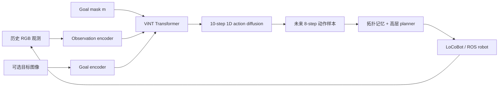
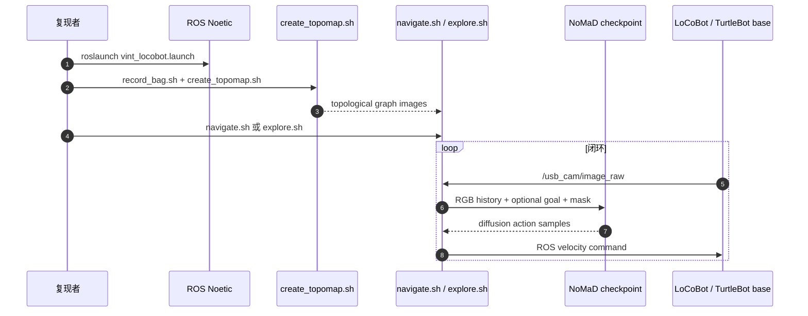

# NoMaD：目标掩码扩散导航与探索

**NoMaD**（*Goal Masked Diffusion Policies for Navigation and Exploration*，[arXiv:2310.07896](https://arxiv.org/abs/2310.07896)，ICRA 2024 Best Paper）由 UC Berkeley 提出：同一视觉 Transformer 通过 goal mask 在图像目标导航与无目标探索间切换，扩散 decoder 直接生成多峰动作序列，并以拓扑记忆支撑长程任务。

## 一句话定义

**NoMaD 用 attention goal mask 决定“看不看目标图像”，再用 10-step action diffusion 生成可多峰的局部动作：mask on 做探索，mask off 做 ImageGoal 导航，两种行为共享一个策略。**

## 英文缩写速查

| 缩写 | 英文全称 | 简要说明 |
|------|----------|----------|
| NoMaD | Navigation with Goal Masked Diffusion | 本文统一探索与目标导航的策略 |
| ViNT | Vision Transformer for Navigation | NoMaD 的视觉编码与 Transformer 基础 |
| GNM | General Navigation Model | 训练数据与跨本体视觉导航系列前作 |
| VIB | Variational Information Bottleneck | 实验中的随机探索动作基线 |
| RGB | Red-Green-Blue | 策略部署时使用的前向视觉观测 |
| ROS | Robot Operating System | 官方 LoCoBot / TurtleBot2 部署链 |

## 为什么重要

- **统一 task-specific 与 task-agnostic 行为：** 不再维护探索 policy 与目标 policy 两套模型。
- **扩散直接生成动作而非高维图像：** 相比 ViNT 的 image diffusion subgoal，模型小约 15×，可在 Jetson Orin 边缘执行。
- **多峰输出适合路口：** 无目标时左右都可能合理；goal 出现后分布收窄到目标方向。
- **是后续 [NavDP](./paper-notebook-navdp-learning-sim-to-real-navigation-diffusion.md) 与 [导航纵深](../../roadmap/depth-navigation.md) 中“扩散导航”分支的关键基线。**

## 核心信息

| 字段 | 内容 |
|------|------|
| 机构 | 加州大学伯克利分校（UC Berkeley） |
| 发表 | ICRA 2024；Best Paper Award |
| 数据 | GNM + SACSoN 等多机器人真实轨迹，100+ h；公开与未公开数据混合 |
| 模型 | EfficientNet-B0 tokens；4-layer / 4-head Transformer；15-layer 1D conditional UNet；10 denoise steps |
| 任务 | ImageGoal navigation；undirected exploration；拓扑图长程导航 |
| 开源 | **已开源**：[robodhruv/visualnav-transformer](https://github.com/robodhruv/visualnav-transformer)（MIT），含训练、checkpoint、ROS 部署 |

## 流程总览

## 核心机制（方法栈）

### 1. Attention goal masking

目标 token 由当前观测与目标图像共同编码。训练时 \(m\sim Bernoulli(0.5)\)：\(m=1\) 屏蔽目标 token，学习无条件探索；\(m=0\) 允许 attention 使用目标，学习 goal reaching。两种模式共享视觉 affordance 与 collision avoidance 表征。

### 2. Action diffusion

条件 1D UNet 从高斯噪声迭代 10 次生成 8-step 局部动作序列。训练用 square-cosine noise schedule 与 noise-prediction MSE；直接建模 \(p(a_{t:t+H}\mid c_t)\)，不生成未来图像，减少参数与延迟。

### 3. ViNT 视觉骨干

EfficientNet-B0 将 observation history 与 goal 编成 256 维 token，4 层 4 头 Transformer 融合。论文训练配置为 AdamW、lr \(10^{-4}\)、batch 256、30 epochs；开源 `nomad.yaml` 当前默认 100 epochs，复现需区分论文与仓库后续配置。

### 4. 局部策略 + 拓扑全局记忆

NoMaD 只负责短时视觉控制。系统沿探索轨迹将图像加入 topological graph；已知目标时，图搜索选择下一个 node，局部 policy 负责向该视觉 node 行驶。无目标时，高层 planner 选择 frontier / 未探索区域。

## 与其他工作对比

| 方法 | 扩散对象 | 目标切换 | 安全筛选 | 数据来源 |
|------|----------|----------|----------|----------|
| ViNT + Subgoal Diffusion | 未来 subgoal 图像 | 独立 goal policy | 高层 proposal | 真机多本体 |
| [NavDP](./paper-notebook-navdp-learning-sim-to-real-navigation-diffusion.md) | 连续轨迹 | 多 goal slots | local critic | 大规模仿真 RGB-D |
| [EgoNav](./paper-notebook-egonav.md) | 未来 6-DoF 轨迹 | 当前无 goal | rolling cost | 人类 RGB-D |
| **NoMaD** | **局部动作序列** | **attention goal mask** | **拓扑 planner，无 critic** | **100+ h 真机 RGB** |

## 工程实践与开源状态

| 项 | 官方入口 / 注意点 |
|----|-------------------|
| 训练 | `train/train.py -c train/config/nomad.yaml`；数据需转成图像序列 + `traj_data.pkl` |
| 权重 | README 提供 GNM / ViNT / NoMaD pretrained model folder |
| 拓扑图 | `deployment/src/record_bag.sh` → `create_topomap.sh` |
| 目标导航 | `deployment/src/navigate.sh --model <name> --dir <topomap>` |
| 探索 | `deployment/src/explore.sh`；README 明确只有 NoMaD 支持 |
| 环境 | ROS Noetic、Ubuntu 18.04/20.04、Python 3.7+、CUDA 10+；版本较旧 |
| 开源边界 | 代码 / checkpoint 为 MIT 且可运行；训练使用的部分 Seattle / SCAND 数据未公开，完全重训不等于只靠公开子集复论文 |

## 源码运行时序图

训练入口是 `train/train.py`；真机入口是 `navigate.sh` / `explore.sh`。checkpoint 的 `config_path`、`ckpt_path` 与 `robot.yaml` 速度上限必须一致。

## 实验与评测

- **场景：** 6 个真实室内外环境；论文主表汇总其中 5 个挑战场景的 goal discovery / known-map navigation。
- **探索：** 相对最强 Subgoal Diffusion 基线，NoMaD 在效率与碰撞规避上均提升 **25%+**，除最难场景外均成功。
- **目标导航：** 与 ViNT 等最佳 goal-conditioned baseline 相当，但模型参数约少 **15×**，可完全 edge deployment。
- **联合 vs 专用：** goal-masked unified policy 分别匹配独立 diffusion exploration policy 与 ViNT goal policy，说明两任务共享 affordance。
- **架构消融：** ViNT encoder + attention mask 优于 early/late fusion CNN 与 ViT patch mask；高容量不自动等于可优化。
- **部署：** LoCoBot 在未见室内外完成探索与视觉目标到达；策略在路口输出多峰，在 goal 条件下收窄。

## 结论

**NoMaD 的关键不是“导航也能用扩散”，而是 goal mask 让同一多峰动作先验在探索与目标到达间切换；长程能力仍来自拓扑记忆，而非局部 policy 单独完成。**

1. **动作扩散比图像 subgoal 更轻** — 参数少 15×，同时保留路口多峰。
2. **50% goal masking 是任务统一的核心监督** — 两种模式共享而不互相牺牲。
3. **局部与全局要分开读** — NoMaD policy 负责 affordance，topological graph 负责长程。
4. **RGB-only 易部署但缺显式几何安全** — 后续 NavDP 用 RGB-D critic 补上候选筛选。
5. **开源复现成熟但栈偏旧** — ROS Noetic / CUDA 10 与部分私有训练数据是现实成本。

## 局限与风险

- 目标只能用图像表达；自然语言与坐标 goal 需要额外模型或适配。
- 高层探索仍是标准 frontier / topology heuristic，没有语义价值或任务先验。
- 无局部 critic；扩散采样的错误会随闭环累积，尤其在跨本体相机高度与宽度变化时。
- 部分训练数据不公开，公开 checkpoint 可部署但严格数据可复现性有限。
- 主要验证轮式平台；被人形 roadmap 引用不等于论文已在 humanoid 上验证。

## 与其他页面的关系

- [导航纵深路线 Stage 3](../../roadmap/depth-navigation.md) — 扩散导航可复现起点
- [分层四足导航栈](../concepts/hierarchical-quadruped-navigation-stack.md) — topology / local policy / base control 的三层接口
- [NavDP](./paper-notebook-navdp-learning-sim-to-real-navigation-diffusion.md) — 仿真 RGB-D、critic 与跨轮式/足式真机的后续对照
- [RoamFlow](./paper-roamflow.md) — MeanFlow 一步 image-goal 生成导航（以 NoMaD 为 Table I 基线；未开源）
- [EgoNav](./paper-notebook-egonav.md) — 把机器人数据替换为人类数据，并预测更长 6-DoF 轨迹分布
- [NaVILA](./paper-notebook-navila-legged-robot-vision-language-action-model.md) — 自然语言目标与足式低层执行分支

## 参考来源

- [Paper Notebooks 原始归档](../../sources/papers/humanoid_pnb_nomad-goal-masked-diffusion-policies-for-navigat.md)
- [NoMaD 官方项目页核查](../../sources/sites/nomad.md)
- [visualnav-transformer 仓库归档](../../sources/repos/visualnav-transformer-nomad.md)
- 论文：<https://arxiv.org/abs/2310.07896>

## 推荐继续阅读

- [NoMaD 官方项目页](https://general-navigation-models.github.io/nomad/)
- [visualnav-transformer](https://github.com/robodhruv/visualnav-transformer) — checkpoint、训练与 ROS 部署
- [RoamFlow](./paper-roamflow.md) — MeanFlow 一步 + IL→RL 对照（arXiv:2606.29934）
