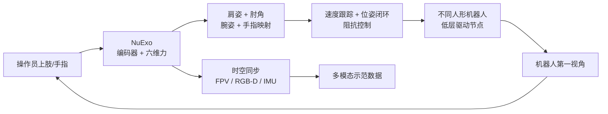

# NuExo：覆盖自然上肢活动范围的便携外骨骼

**NuExo: A Wearable Exoskeleton Covering all Upper Limb ROM for Outdoor Data Collection and Teleoperation of Humanoid Robots**（[arXiv:2503.10554](https://arxiv.org/abs/2503.10554)，IROS 2025）由国防科技大学团队提出，目标是在同一套设备中兼顾精度、舒适、跨机器人通用性与户外便携性。

## 一句话定义

**NuExo 用联动—同步带肩部机构把肩关节中心的复合位移机械耦合掉，以 5.2 kg 背包式外骨骼同步采集全上肢运动、交互力、手指、第一视角和里程计，并直接遥操作不同人形平台。**

## 英文缩写速查

| 缩写 | 英文全称 | 简要说明 |
|------|----------|----------|
| ROM | Range of Motion | 穿戴后可覆盖的人体上肢活动范围 |
| GH | Glenohumeral Joint | 肩盂肱关节；其转动中心会随肩带运动 |
| IMC | Inertial Motion Capture | 对照的便携惯性动捕方案 |
| IMU | Inertial Measurement Unit | 户外里程计与姿态感知单元 |
| AR | Augmented Reality | 回传机器人第一视角的轻量显示设备 |
| DoF | Degree of Freedom | 外骨骼、人手和机器人关节自由度 |

## 为什么重要

- **外骨骼的结构误差会直接进入示范：** 肩中心错位会限制 ROM、产生束缚力并污染长期运动数据。
- **一个接口覆盖更多模态：** 除关节角外，NuExo 同步采集六维交互力、手指、FPV、深度和里程计，适合接触操作数据。
- **从实验室走向户外：** 背包式供电和机械编码避免固定光学动捕空间及惯导长期滑移。
- **统一控制节点降低换平台成本：** 只替换机器人低层驱动节点，可复用肩、肘、腕和手指控制模块。

## 核心信息

| 项 | 内容 |
|----|------|
| 机构 | 中国人民解放军国防科技大学（National University of Defense Technology）等 |
| 重量 / 材料 | 5.2 kg；碳纤维板 + 3D 打印 PLA |
| 单臂采集 | 9 DoF 上肢、6 DoF 手、6 维交互力 |
| 额外通道 | 腰姿、第一视角 RGB-D、IMU 里程计、机器人遥操作数据 |
| 控制模块 | exoskeleton node → teleoperation controller → humanoid node → low-level driver |
| 开放状态 | **未开源**：项目页无 GitHub、CAD、BOM、数据或控制代码链接 |

## 流程总览

## 核心机制（方法栈）

### 1）肩部联动与电机重排

人体 GH 中心会随肩胛带前后、上下移动。NuExo 用同步连杆和同步带把一部分 GH 平移与上臂转动机械耦合，并将一个肩部电机移到肘部，降低头部干涉；被动联动在少一个肩侧执行器的前提下补偿肩中心。

### 2）全臂模块化映射

遥操作不只追末端：系统分别对齐肱骨姿态、肘角、腕姿态与 6 DoF 手指。控制器用 twist 速度跟踪加位姿误差闭环，并通过阻抗控制在直接映射和机器人构型约束之间折中。

### 3）采集与助力一体化

绑缚接口内的六维力传感器既记录人—外骨骼动力学，也支撑协作助力；AR 回传机器人视角，IMU 里程计给户外采集提供位姿上下文。多个同构控制节点可并发驱动多台机器人。

## 源码运行时序图

**不适用。** 截至 2026-07-28，官方项目页只提供论文、视频和系统说明，未列控制软件、固件、CAD/BOM 或可下载数据，因此无法给出与官方仓库入口对齐的运行时序。

## 工程实践与开源状态

| 项 | 建议 / 状态 |
|----|-------------|
| 穿戴标定 | 先对齐肩峰与 GH 补偿机构，再检查极限姿态下绑缚力和头部干涉 |
| 数据同步 | 统一外骨骼编码器、力、FPV/RGB-D、手指与里程计时间戳 |
| 换机器人 | 保留 teleoperation controller，仅重写低层驱动节点与关节限位 |
| 抖动抑制 | 论文定制滤波器抑制低于 0.015 rad 的人手抖动 |
| 安全 | 机械限位、软件关节限位、速度/力阈值和急停应独立实现 |
| 开源状态 | **未开源**；研究者目前只能依据论文自行重建，不具备直接复现条件 |

## 与其他工作对比

| 维度 | NuExo | IMC suit | XR / 纯视觉 |
|------|-------|----------|-------------|
| 长期姿态稳定 | 机械编码，动态后漂移小 | 绑带滑移/磁扰会累积 | 遮挡与深度抖动 |
| 交互力 | 六维力直接采集 | 通常无 | 通常无 |
| 便携性 | 5.2 kg 背包式 | 高 | 高 |
| 人体约束 | 有机械穿戴 | 较低 | 最低 |
| 开放复现 | 未开放资产 | 商业系统可购 | 多种开源栈 |

## 实验与评测

- **ROM：** 肩屈曲/伸展 **180°/60°**，内收/外展 **30°/150°**，水平屈曲/伸展 **30°/135°**，覆盖论文定义的自然上肢范围。
- **长期稳定：** 初始静态误差两系统均约 0.1 rad；10 分钟高强度跑跳后 IMC 峰值误差达 **0.41 rad**，NuExo 保持 **<0.14 rad**。
- **动态遥操作：** 高动态平均角误差 **0.015 rad**，急剧反向峰值约 0.05–0.08 rad；慢速操作平均 **0.01 rad**。
- **任务：** 未训练操作员跨多台人形完成拧瓶盖、电动螺丝刀、1.2 m 投球等定性验证；论文没有公开统一成功率或疲劳量表。

## 结论

**NuExo 证明机械对齐、力数据和便携性可以同时兼顾，但“100% ROM”与任务演示不能替代开放复现和系统化人因评测。**

1. **肩部机构是关键贡献** — 它直接决定穿戴舒适、可达范围和采集真值质量。
2. **机械编码胜在长期稳定** — 动态扰动后比绑带式 IMC 更不易漂移。
3. **多模态比单纯遥操作更有价值** — 力、手指、视觉和里程计使数据可服务接触技能学习。
4. **跨平台依赖驱动适配** — “统一”指上层节点复用，不代表无需机器人侧接口工程。
5. **复现风险目前很高** — 无代码、CAD、BOM 与数据，只能把结果当设计参考。

## 局限与风险

- 5.2 kg 仍可能造成长期疲劳；论文未给 NASA-TLX、穿戴时长或大样本人因统计。
- “100% 自然 ROM”来自关节角覆盖，不等于所有动作下都无束缚力或软组织错位。
- 定量实验对象数、跨用户差异和任务重复次数有限；多数复杂任务是视频定性证据。
- 外骨骼与机器人直接耦合时，通信故障、错误标定和力反馈失稳会把风险传给操作员。
- 官方未开放机械、电气、控制和数据资产，独立验证困难。

## 与其他页面的关系

- 任务入口：[Teleoperation](../tasks/teleoperation.md)
- 接口选型：[数据手套 vs 视觉遥操作](../comparisons/data-gloves-vs-vision-teleop.md)
- 映射基础：[Motion Retargeting](../concepts/motion-retargeting.md)
- 路线位置：[遥操作纵深 Stage 1](../../roadmap/depth-teleoperation.md)

## 参考来源

- [humanoid_pnb_nuexo.md](../../sources/papers/humanoid_pnb_nuexo.md)
- [nuexo-project.md](../../sources/sites/nuexo-project.md)
- 论文：<https://arxiv.org/abs/2503.10554>

## 推荐继续阅读

- 官方项目页：<https://nubot-nuexo.github.io/>
- 深读笔记：<https://imchong.github.io/Robot_Learning_Paper_Notebooks/papers/07_Teleoperation/NuExo__A_Wearable_Exoskeleton_Covering_all_Upper_Limb_ROM/NuExo__A_Wearable_Exoskeleton_Covering_all_Upper_Limb_ROM.html>
