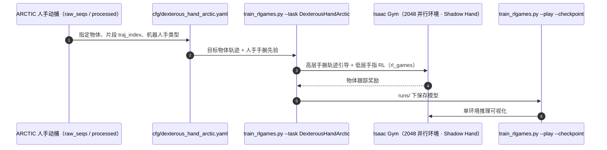

# Object-Centric Dexterous Manipulation from Human Motion Data

**Object-Centric Dexterous Manipulation from Human Motion Data** 收录于 [Robot Learning Paper Notebooks](https://imchong.github.io/Robot_Learning_Paper_Notebooks/index.html)（分类：06_Manipulation），深读笔记已完成。本页编译自深读笔记与 arXiv 论文正文（实验数字、开源状态于 2026-09-28 核对），细节以论文 PDF 为准。

## 一句话定义

把物体操控到目标状态是灵巧操作的基本而重要的技能。人手动作展现了高超操控力，是训练多指手机器人的宝贵数据。本文通过分层策略弥合人手与机器人手的具身差距：① 高层——在大规模人手动捕数据上训练的轨迹生成模型，依目标物体状态合成手腕运动；② 低层——用深度强化学习做手指操控控制器，扎根于机器人本体。在 10 个家用物体上评测，对新物体几何与新目标状态泛化，并在双臂灵巧机器人系统上完成 sim-to-real。

## 英文缩写速查

| 缩写 | 含义 |
|---|---|
| Object-Centric | 以物体（目标状态）为中心 |
| Hierarchical | 分层（高层轨迹 + 低层手指） |
| Wrist Motion | 手腕运动（高层合成） |
| Finger RL | 手指控制的深度强化学习 |
| Embodiment Gap | 人-机手具身差距 |
| Goal State | 物体目标状态 |

## 为什么重要

- **"高层人类轨迹 + 低层机器人 RL"是弥合手部具身差距的经典分层**；
- **以目标状态为中心**让任务定义清晰、便于泛化；
- 人手动捕是灵巧操作的宝贵先验（与 EgoDex、Being-H0 同源思路）；
- 对人形双手灵巧操作直接适用。

## 解决什么问题

用人手动捕学机器人灵巧操作有**具身差距**： - 人手与机器人手**形态/自由度不同**； - 要**把物体操控到目标状态**，需手腕 + 手指协同； - 要对**新物体/新目标**泛化。

论文要：**分层**地用人手动捕学**以物体为中心**的灵巧操作。

## 核心机制

1. **以物体为中心的灵巧操作**：操控物体到目标状态；
2. **分层策略弥合具身差距**：高层人手动捕轨迹 + 低层手指 RL；
3. **泛化**：新物体几何与新目标状态；
4. **双臂 sim-to-real**：10 家用物体真机验证。

方法拆解（深读笔记小节）：高层：人手动捕轨迹生成（合成手腕运动）；低层：手指操控 RL（扎根机器人本体）；评测；🧭 整体流程（mermaid）。

## 核心信息

| 字段 | 内容 |
|------|------|
| 分类 | 06_Manipulation |
| 深读笔记 | <https://imchong.github.io/Robot_Learning_Paper_Notebooks/papers/06_Manipulation/Object-Centric_Dexterous_Manipulation_from_Human_Motion_Data/Object-Centric_Dexterous_Manipulation_from_Human_Motion_Data.html> |
| arXiv | <https://arxiv.org/abs/2411.04005> |
| 源码 | **已开源**：[cypypccpy/ObjDexEnvs](https://github.com/cypypccpy/ObjDexEnvs)（Isaac Gym 训练 / 推理，基于 ARCTIC 数据；README 称含真实系统代码） |
| 作者 | Yuanpei Chen、Chen Wang、Yaodong Yang、C. Karen Liu（Stanford / 北大） |
| 发表 | 2024 年 11 月 |
| 笔记阅读日期 | 2026-06-21 |

## 源码运行时序图

## 实验与评测

**设置**：两只 Shadow Hand 分别装在两台 UR10e 上（仿真与真机同构）。训练数据为 ARCTIC 人手动捕：选 9 个物体、每物体 16 条序列训练，其余物体与序列作测试。仿真 10 个 seed，真机每项 20 次。基线：手指关节映射 / 指尖 IK 映射后端到端模仿、Vanilla RL（PPO 同时学手臂与手指），以及去掉数据增强循环（w/o DAL）、加指尖匹配奖励（w. FR）的消融。

**高层规划器**（误差，越低越好；MLP / RNN / 本文）：已见物体 TE 5.4 / 5.0 / **4.2**、OE 14.6 / 12.4 / **9.6**；未见轨迹 OE 9.4 / 9.2 / **7.2**；未见物体 TE 18.2 / 17.7 / **12.4**、OE 109.4 / 82.2 / **75.5**。

**仿真成功率（%，每物体一个策略，节选）**：

| 物体 | 指尖映射 | 关节映射 | Vanilla RL | 本文 w. FR | 本文 w/o DAL | **本文** |
|------|---:|---:|---:|---:|---:|---:|
| Box | 14.6 | 8.9 | 23.5 | 56.2 | 100 | **100** |
| Coffee Maker | 9.3 | 9.0 | 10.7 | 78.6 | 71.5 | **86.1** |
| Mixer | 21.7 | 10.7 | 42.1 | 42.2 | 44.2 | **57.6** |
| Ketchup（小物体） | 14.8 | 9.5 | 4.9 | 15.2 | 21.8 | **41.2** |
| Scissors（小物体） | 4.2 | 4.1 | 4.4 | 20.7 | 35.9 | **41.4** |

**真机成功率（%）**：Box 69.8、Microwave 100、Laptop 76.7、Coffee Maker 74.8、Mixer 82.8、Notebook 64.3；指尖映射与 Vanilla RL 多在 4–20%（Microwave 约 56–61%）。Laptop 为用 Box 策略直接迁移的跨物体泛化测试。

- 加指尖匹配奖励（强行贴近人手指尖）反而降低成功率，支持「手指交给机器人自己学」的分层切法。
- 论文另将方法应用到 4 种尺寸与自由度不同的多指手。

## 与其他工作对比

| 工作 | 人手数据用法 | 与 ObjDex 的差异 |
|------|------|------|
| 关节 / 指尖映射 + 模仿（论文基线） | 直接把人手动作映射到机器人手 | 具身差距大，仿真成功率多在 5–40% |
| Vanilla RL（PPO） | 不用人手先验 | 手臂与手指联合探索困难 |
| [Dexterity from Smart Lenses](./paper-notebook-dexterity-from-smart-lenses-multi-fingered-robot.md) | 智能眼镜采集的第一视角人手数据 | 数据源为日常佩戴设备；ObjDex 用实验室动捕数据集 ARCTIC |
| [Being-H0](./paper-notebook-being-h0-vision-language-action-pretraining-from.md) | 人手动作 token 化后 VLA 预训练 | 端到端；ObjDex 只把人手先验用于高层手腕轨迹 |

## 结论

**这篇工作用分层切开人手与机器人手的具身差距：高层沿用人类动捕合成手腕轨迹，低层的手指操控则完全交给扎根机器人本体的强化学习。**

- 分层的切点选得很关键——手腕运动可由大规模人手动捕训练的轨迹生成模型按目标物体状态直接合成；手指部分形态差异最大，只能用深度强化学习在机器人本体上重学。
- 以物体目标状态为中心，让任务定义与泛化口径同时变清晰：评测的是对新物体几何与新目标状态的泛化，而不是复现某条具体示范轨迹。
- 落地程度较实：双 Shadow Hand + UR10e 真机上 6 个物体成功率 64–100%，而指尖映射与 Vanilla RL 多在 4–20%，说明这套分层不只是仿真里的结构漂亮。
- 适用边界：高层能力受限于人手动捕先验的覆盖范围，物体集合也限于家用物体；超出该先验的物体或更极端的手内操控，风险仍未知。
- 与本页提到的 EgoDex、Being-H0 同属「人手动捕当先验」，差别在于本页只把先验用在高层轨迹，低层坚持机器人自学。

## 局限与风险

- **小物体困难**：剪刀、番茄酱等仿真成功率只有约 41%，作者建议利用人类数据中的接触信息。
- **未用触觉**：ARCTIC 中的触觉信息没有进入策略学习。
- **真机失败模式**：初始位姿与目标轨迹差距大时易失败；灵巧手遮挡物体导致位姿估计不准。
- **关节顺序需预先定义**：多转动关节物体缺乏置换不变性，依赖 URDF / ShapeNet 类别内一致的关节顺序。
- **只能类别内泛化**：高层规划器按类别条件化，跨类别只能「借用」已训类别 id；ARCTIC 仅 11 个物体，难以系统测试。
- **复现依赖**：Isaac Gym（Preview 3/4）+ ARCTIC 数据集，每条人手片段单独训练一个策略。

## 与其他页面的关系

- 分类父节点：[paper-notebook-category-06-manipulation](../overview/paper-notebook-category-06-manipulation.md)
- 总索引：[humanoid-paper-notebooks-index.md](../overview/humanoid-paper-notebooks-index.md)
- 实验用灵巧手 Shadow Hand：[shadow-hand](./shadow-hand.md)
- 分层策略：[hierarchical-reinforcement-learning](../methods/hierarchical-reinforcement-learning.md)
- 低层手指控制与 Vanilla RL 基线：[ppo](../methods/ppo.md)
- 对照的手指 / 指尖映射重定向：[motion-retargeting](../concepts/motion-retargeting.md)
- 人类数据驱动多指操作的另一路线：[paper-notebook-dexterity-from-smart-lenses-multi-fingered-robot](./paper-notebook-dexterity-from-smart-lenses-multi-fingered-robot.md)

## 参考来源

- [humanoid_pnb_object-centric-dexterous-manipulation-from-human.md](../../sources/papers/humanoid_pnb_object-centric-dexterous-manipulation-from-human.md)
- 深读笔记：<https://imchong.github.io/Robot_Learning_Paper_Notebooks/papers/06_Manipulation/Object-Centric_Dexterous_Manipulation_from_Human_Motion_Data/Object-Centric_Dexterous_Manipulation_from_Human_Motion_Data.html>
- 论文：<https://arxiv.org/abs/2411.04005>
- 论文正文（Table 1–3、局限节）：<https://arxiv.org/html/2411.04005>
- 官方代码：<https://github.com/cypypccpy/ObjDexEnvs>

## 推荐继续阅读

- [机器人论文阅读笔记：Object-Centric Dexterous Manipulation from Human Motion Data](https://imchong.github.io/Robot_Learning_Paper_Notebooks/papers/06_Manipulation/Object-Centric_Dexterous_Manipulation_from_Human_Motion_Data/Object-Centric_Dexterous_Manipulation_from_Human_Motion_Data.html)
- 项目页：<https://cypypccpy.github.io/obj-dex.github.io/>
