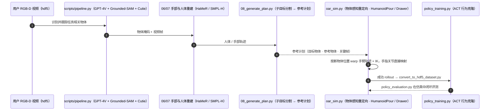

# OKAMI

**OKAMI: Teaching Humanoid Robots Manipulation Skills through Single Video Imitation** 收录于 [Robot Learning Paper Notebooks](https://imchong.github.io/Robot_Learning_Paper_Notebooks/index.html)（分类：06_Manipulation），深读笔记已完成。本页编译自深读笔记与 arXiv 论文正文（实验数字、开源状态于 2026-09-28 核对），细节以论文 PDF 为准。

## 一句话定义

研究从单段视频演示模仿来教人形机器人操作技能。OKAMI 从单段 RGB-D 视频生成操作计划并导出可执行策略。其核心是物体感知重定向（object-aware retargeting）：让人形复现视频中的人类动作，同时在部署时适应不同物体位置。OKAMI 用开放世界视觉模型识别任务相关物体，并分别重定向身体动作与手部姿态。实验表明 OKAMI 在多变视觉与空间条件下强泛化，在开放世界从观察模仿（imitation from observation）上超越 SOTA 基线。进一步地，用 OKAMI 的 rollout 轨迹训练闭环视觉运动策略，在无需费力遥操作的情况下达平均 79.2% 成功率。

## 英文缩写速查

| 缩写 | 含义 |
|---|---|
| OKAMI | 本文方法名 |
| Object-Aware Retargeting | 物体感知重定向 |
| Single Video Imitation | 单段视频模仿 |
| Open-world Vision | 开放世界视觉模型 |
| Imitation from Observation | 从观察模仿（无动作标签） |
| Closed-loop Visuomotor | 闭环视觉运动策略 |

## 为什么重要

- **"单视频 + 物体感知重定向"极大降低教学成本**：看一遍就会、还能适应物体位置；
- **身体/手部分别重定向**是处理具身差异的实用拆分；
- **用 rollout 自举训练闭环策略**免遥操作，是数据飞轮的一环；
- 与 MimicDroid、Masquerade 等"从人类视频学操作"路线互补（同 UT/Yuke Zhu 系）。

## 解决什么问题

教人形操作通常需大量演示/遥操作。能否**从单段视频**就学会？ - 单视频缺动作标签，且**物体位置会变**； - 人-机具身差异需重定向。

OKAMI 要：从**单段 RGB-D 视频**生成计划 + 策略，并能**适应不同物体位置**。

## 核心机制

1. **单视频模仿教人形操作**：从一段 RGB-D 视频生成计划 + 策略；
2. **物体感知重定向**：开放世界识别物体、分别重定向身体/手部、适应物体位置；
3. **超 SOTA 泛化**：开放世界 imitation-from-observation；
4. **闭环策略 79.2%**：用 rollout 训练、无需遥操作。

方法拆解（深读笔记小节）：单 RGB-D 视频 → 操作计划；物体感知重定向（核心）；rollout 训练闭环策略；结果；🧭 整体流程（mermaid）。

## 核心信息

| 字段 | 内容 |
|------|------|
| 分类 | 06_Manipulation |
| 深读笔记 | <https://imchong.github.io/Robot_Learning_Paper_Notebooks/papers/06_Manipulation/OKAMI__Teaching_Humanoid_Robots_Manipulation_Skills_through_Single_Video_Imitation/OKAMI__Teaching_Humanoid_Robots_Manipulation_Skills_through_Single_Video_Imitation.html> |
| arXiv | <https://arxiv.org/abs/2410.11792> |
| 源码 | **已开源**：[UT-Austin-RPL/OKAMI](https://github.com/UT-Austin-RPL/OKAMI)（计划生成 + 仿真物体感知重定向 + ACT 策略训练；README 仅覆盖 HumanoidPour / HumanoidDrawer 两个仿真环境，真机 GR1 部署未给脚本） |
| 作者 | Jinhan Li、Yifeng Zhu、Yuqi Xie、Zhenyu Jiang、Mingyo Seo、Georgios Pavlakos、Yuke Zhu（UT Austin） |
| 发表 | 2024 年 10 月 |
| 笔记阅读日期 | 2026-06-21 |

## 源码运行时序图

复现主路径：`run_plan_generation.sh` 生成计划 → `oar_sim.py --num-demo 100` 批量 rollout → `policy_training.py` 训练 ACT。

## 实验与评测

**设置**：Fourier GR1 + 两只 6-DoF Inspire 灵巧手 + 头部 RealSense D435i；关节位置控制 400 Hz（40 Hz 指令插值）。6 个桌面任务（放毛绒玩具、撒盐、关抽屉、合笔记本、放零食、装袋），每任务 12 次试验，物体位置随机；另在 RoboSuite 中复现撒盐 / 关抽屉两个仿真任务。

| 实验 | OKAMI | ORION 基线（不条件于人体姿态） |
|------|------:|------:|
| 6 任务平均成功率（真机） | **71.7%** | 比 OKAMI 低 58.3 个百分点 |
| Place-snacks-on-plate（真机） | 75.0% | 0.0% |
| Close-the-laptop（真机） | 83.3% | 41.2% |
| Sprinkle-salt（仿真） | 82.0% | 0.0% |
| Close-the-drawer（仿真） | 84.0% | 10.0% |

- **换演示者**：Close-the-laptop 无显著差异；Place-snacks-on-plate 均保持 >50%，但最差比最好低 16.7%——演示者动作快导致人体重建噪声变大。
- **rollout → 闭环策略**：用成功 rollout（撒盐 50 条、装袋 100 条）训练 ACT 视觉运动策略，平均成功率 **79.2%**，且随 rollout 数增加而提升。
- **ORION 的失败模式**：抓取方向与人不一致（侧抓零食而非自顶向下）、手腕无法充分旋转完成倾倒——说明「只按物体轨迹重定向、忽略人体动作」在人形上不够。

## 与其他工作对比

| 工作 | 输入 | 与 OKAMI 的关键差异 |
|------|------|------|
| ORION（论文基线） | 单段 RGB-D 视频 | 只按物体运动 warp 掌心轨迹，不用人体姿态；在人形上成功率大幅落后 |
| [MimicDroid](./paper-notebook-mimicdroid-in-context-learning-for-humanoid-robo.md) | 多段人类 play 视频 | 同组后续工作：不做逐任务重定向，而是训练可上下文学习的策略 |
| [HOST](./paper-host-one-shot-human-video.md) | 单条人类视频 | 同为 one-shot 人视频路线，可对照其与 OKAMI 在重定向 / 策略化上的取舍 |
| [Masquerade](./paper-notebook-masquerade-learning-from-in-the-wild-human-video.md) | 野外 RGB 人视频 | 把人手「编辑」成机器人再预训练策略，面向大规模数据而非单视频 |

## 结论

**OKAMI 把「模仿人类视频」拆成两件独立的事——复现动作与适应物体：物体感知重定向让单段 RGB-D 视频既能教会动作，又不把物体位置写死。**

- 真正起作用的是分离式重定向：开放世界视觉模型先识别任务相关物体，身体动作与手部姿态再分别重定向，部署时才容忍物体位置变化。
- 数据侧的价值在自举——用 OKAMI 的 rollout 轨迹训练闭环视觉运动策略，平均成功率 79.2%，全程无需费力遥操作，等于把单视频演示放大成可训练数据。
- 报告的强项是在多变视觉与空间条件下的泛化，并在开放世界 imitation from observation 上超越 SOTA 基线；单视频、无动作标签是它给自己设的硬约束。
- 能力边界已在实验中显形：演示动作过快会让人体重建变噪、成功率下降；ORION 对照则说明去掉人体姿态条件后，抓取方向与手腕旋转就会出错。
- 与 MimicDroid、Masquerade 同属「从人类视频学操作」路线（同 UT / Yuke Zhu 系），差别在 OKAMI 走单视频 + 物体感知重定向，而非上下文学习。

## 局限与风险

- **仅上半身、桌面场景**：只重定向手臂与手指，用关节位置控制；不含下肢与行走，扩展到 loco-manipulation 需换全身控制器（论文自述）。
- **依赖 RGB-D 与静态机位**：假设每帧都拍到人体、相机不动；无法直接用互联网 RGB 视频。
- **物体形状变化鲁棒性有限**：同类新实例可泛化，但形状差异大时重定向易失败；演示动作过快会拉低人体重建质量。
- **外部依赖**：计划生成调用 GPT-4V（需 `OPENAI_API_KEY`）、Grounded-SAM、Cutie、CoTracker、HaMeR 等多套视觉模型，环境需两个 conda env。
- **开源边界**：代码覆盖计划生成、仿真重定向与 ACT 训练 / 仿真评测；真机 GR1 部署链未在 README 中给出。

## 与其他页面的关系

- 分类父节点：[paper-notebook-category-06-manipulation](../overview/paper-notebook-category-06-manipulation.md)
- 总索引：[humanoid-paper-notebooks-index.md](../overview/humanoid-paper-notebooks-index.md)
- 生成视频对照：[RoboReact](./paper-roboreact.md) — 先验换成生成 egocentric 视频，并加标定 VLM 精炼
- 任务语境：[manipulation](../tasks/manipulation.md)
- 重定向概念：[motion-retargeting](../concepts/motion-retargeting.md)
- rollout 蒸馏所用 ACT 的动作块机制：[action-chunking](../methods/action-chunking.md)
- 同组人视频路线（上下文学习）：[paper-notebook-mimicdroid-in-context-learning-for-humanoid-robo](./paper-notebook-mimicdroid-in-context-learning-for-humanoid-robo.md)
- 单条人类视频习得操作的对照：[paper-host-one-shot-human-video](./paper-host-one-shot-human-video.md)

## 参考来源

- [humanoid_pnb_okami.md](../../sources/papers/humanoid_pnb_okami.md)
- 深读笔记：<https://imchong.github.io/Robot_Learning_Paper_Notebooks/papers/06_Manipulation/OKAMI__Teaching_Humanoid_Robots_Manipulation_Skills_through_Single_Video_Imitation/OKAMI__Teaching_Humanoid_Robots_Manipulation_Skills_through_Single_Video_Imitation.html>
- 论文：<https://arxiv.org/abs/2410.11792>
- 论文正文（实验与局限节）：<https://arxiv.org/html/2410.11792>
- 官方代码：<https://github.com/UT-Austin-RPL/OKAMI>

## 推荐继续阅读

- [机器人论文阅读笔记：OKAMI](https://imchong.github.io/Robot_Learning_Paper_Notebooks/papers/06_Manipulation/OKAMI__Teaching_Humanoid_Robots_Manipulation_Skills_through_Single_Video_Imitation/OKAMI__Teaching_Humanoid_Robots_Manipulation_Skills_through_Single_Video_Imitation.html)
- 项目页：<https://ut-austin-rpl.github.io/OKAMI/>
