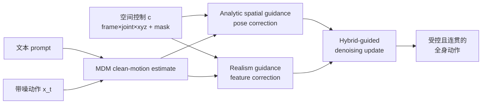
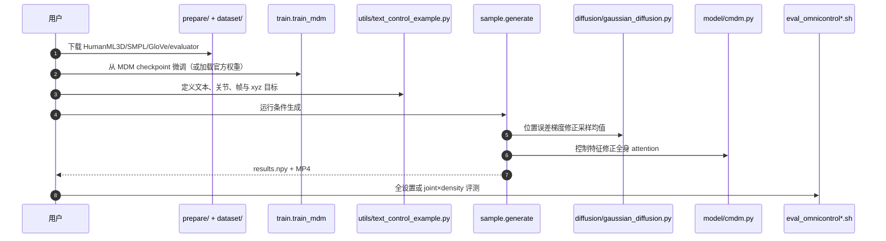

# OmniControl：Control Any Joint at Any Time

**OmniControl**（ICLR 2024，[arXiv:2310.08580](https://arxiv.org/abs/2310.08580)）由东北大学、Stability AI 与 Google Research 提出：在 MDM 式文本条件扩散上组合解析空间引导与可学习真实感引导，让一个模型接收任意关节、任意帧的稀疏或密集三维位置约束。

## 一句话定义

**空间引导负责把指定关节拉到目标 xyz，真实感引导负责让未直接受梯度约束的其余关节一起调整，从而平衡控制精度与全身自然性。**

## 英文缩写速查

| 缩写 | 英文全称 | 简要说明 |
|------|----------|----------|
| MDM | Human Motion Diffusion Model | OmniControl 微调所基于的文本到动作骨干 |
| ASG | Analytic Spatial Guidance | 按关节位置误差解析求梯度的空间引导 |
| RG | Realism Guidance | 在 Transformer 特征层修正全身一致性的分支 |
| FID | Fréchet Inception Distance | 衡量生成动作自然性/分布质量 |
| KIT-ML | KIT Motion-Language Dataset | 论文第二个语言–动作评测集 |
| SMPL | Skinned Multi-Person Linear Model | 仓库可视化导出的参数化人体表示 |

## 为什么重要

- **控制粒度从 pelvis 扩到全身：** 手腕触杯、头部避开低顶、脚触球等任务不能只靠 root trajectory 表达。
- **单模型覆盖多种 mask：** 控制信号是 \(N\times J\times3\) 的 xyz + valid mask，可在时空上任意稀疏。
- **明确精度–真实感双目标：** 只有空间梯度会扭曲未约束关节，只有真实感分支又跟不紧目标；两者互补。
- **适合做场景 affordance 的动作解码器：** 上游若能预测接触点/时刻，OmniControl 可把它们变成全身运动；论文自身不预测 affordance。

## 核心信息

| 项 | 内容 |
|----|------|
| **机构** | 美国东北大学（Northeastern University）；Stability AI；谷歌研究院（Google Research） |
| **发表** | ICLR 2024 |
| **数据** | HumanML3D（14,646 sequences）；KIT-ML（3,911 sequences） |
| **输入** | 文本 + 任意 joint/time 的全局 xyz 控制信号与 mask |
| **骨干** | MDM Transformer；预训练 MDM 上微调，加入 trainable realism branch |
| **输出** | HumanML3D/KIT-ML 人体动作序列 |
| **开源** | **已开源**（核查日 2026-07-28）：MIT；HumanML3D 训推/评测与 checkpoint 已放；KIT-ML checkpoint、跨关节组合评测仍为 TODO |

## 流程总览

## 核心机制（方法栈）

### 1）任意关节时空控制表示

控制张量 \(c\in\mathbb{R}^{N\times J\times3}\) 存放各帧各关节的世界坐标，未提供的位置置零并由 mask 区分。无需为 pelvis、head、wrist、foot 分别设计网络。

### 2）Analytic spatial guidance

扩散步先预测 clean motion，再经正向运动学得到全局 joint positions；控制位置与目标位置的误差对采样均值求梯度并迭代修正。直接在全局 xyz 上优化，避免 HumanML3D 相对 root 表示导致的歧义。

### 3）Realism guidance

空间梯度只直接作用于控制关节及相关 pelvis 位姿，容易让其余关节漂移。OmniControl 复制 MDM Transformer 分支，把控制特征和 mask 注入各 attention layer，输出 residual feature corrections，让全身姿态协同变化。

### 4）Hybrid guidance

早/晚扩散阶段使用不同迭代次数；论文选 \(T_s=10\)、较小 early iterations 与较大 late iterations，在约束误差和约 121–143 秒级采样时间之间折中。

## 工程实践

| 项 | 内容 |
|----|------|
| **开源状态** | **已开源**（截至 **2026-07-28**）：见 [OmniControl 项目页](../../sources/sites/omnicontrol-project.md) 与 [仓归档](../../sources/repos/omnicontrol.md)（MIT；部分资产仍 TODO） |
| **复现入口** | `prepare/` + `dataset/` → 训/加载 CMDM → `sample.generate`（spatial + realism guidance）；控制样例见 `utils/text_control_example.py` |
| **选型提示** | 任意关节/时刻低误差优先 OmniControl；要更快推理或条件训练一致性可对照 CondMDI |
| **源码运行时序图** | 见下一节 |

## 源码运行时序图

最短路径是下载 `model_humanml3d.pt`、在 `utils/text_control_example.py` 定义控制点后运行 `sample.generate`。

## 与其他工作对比

| 方法 | 控制范围 | 注入方式 | 关键差异 |
|------|----------|----------|----------|
| [GMD](./paper-notebook-guided-motion-diffusion-for-controllable-human-m.md) | pelvis/root xz + keypoints | 两阶段 dense guidance | 目标函数灵活但非任意关节 |
| **OmniControl** | 任意 joint/time xyz | spatial + realism hybrid | 精度高、单模型；迭代引导慢 |
| [CondMDI](./paper-notebook-flexible-motion-in-betweening-with-diffusion-mod.md) | 任意部分关键帧 | 训练时 random mask | 推理更直接；约束精度略低 |
| [PhysDiff](./paper-notebook-physdiff-physics-guided-human-motion-diffusion-m.md) | 动力学可行性 | 仿真投影 | 不提供导演式关节目标 |

## 实验与评测

- **HumanML3D pelvis：** 专用 pelvis 模型 FID **0.218**、平均误差 **0.0338**；GMD 为 **0.576 / 0.1439**，平均误差下降 **79.2%**。
- **单一全关节模型：** pelvis/双脚/head/双 wrist 平均 FID **0.310**、Top-3 R-Precision **0.693**、平均控制误差 **0.0404**。
- **KIT-ML：** 全关节模型平均 FID **0.788**、平均误差 **0.0854**；优于论文重训 GMD 的 **1.565 / 0.4070**。
- **消融：** 去掉 spatial guidance 后平均误差 **0.0385→0.4137**；去掉 realism guidance 后 FID **0.310→0.692**，验证两分支各自负责精度与自然性。
- **跨关节组合：** HumanML3D cross setting FID **0.624**、trajectory error **0.2147**，明显差于单关节平均；训练组合覆盖仍决定泛化。

## 结论

**OmniControl 证明任意关节控制需要“几何上拉得准”和“全身一起改”两条引导，而不是把 pelvis 方法机械扩维。**

1. **接触点明确时优先 joint-level 控制** — wrist/head/foot 目标比 root trajectory 更能表达交互意图。
2. **空间与真实感缺一不可** — 消融分别暴露大控制误差和高 FID。
3. **单模型并不等于组合零样本** — 未见 joint combinations 的指标明显下降。
4. **部署瓶颈是迭代采样** — 论文级采样为分钟量级，不能直接进入机器人高频闭环。
5. **仍需执行层** — 输出经重定向和 tracker 才能落到机器人；[PhyGile](./paper-phygile.md) 是 robot-native + tracker 闭环对照。

## 局限与风险

- 方法要求上游先给出控制关节、目标 xyz 与时刻；不负责从场景自动预测 affordance/contact schedule。
- 极端、不连续或互相冲突的控制点没有可行性保证，项目页“自然容忍”示例不能替代碰撞/动力学验证。
- 跨关节组合泛化弱于单关节控制，官方 README 的交叉组合评测仍未发布。
- 论文 HumanML3D/KIT-ML 输出是人体运动学序列，没有机器人关节限位、扭矩、平衡与真机评测。
- 官方 HumanML3D checkpoint 可用，但 KIT-ML checkpoint 仍在 TODO；全设置单 GPU 评测约 45 小时。

## 与其他页面的关系

- 总方法：[Diffusion-based Motion Generation](../methods/diffusion-motion-generation.md)
- 前置空间引导：[GMD](./paper-notebook-guided-motion-diffusion-for-controllable-human-m.md)
- 关键帧补全对照：[CondMDI](./paper-notebook-flexible-motion-in-betweening-with-diffusion-mod.md)
- 物理可行性：[PhysDiff](./paper-notebook-physdiff-physics-guided-human-motion-diffusion-m.md)
- 机器人原生生成：[PhyGile](./paper-phygile.md)
- 离散生成式控制：[GPC](./paper-gpc-generative-pretrained-controllers.md)
- 学习路线：[动作生成纵深](../../roadmap/depth-motion-generation.md)

## 参考来源

- [论文来源归档](../../sources/papers/humanoid_pnb_omnicontrol-control-any-joint-at-any-time-for-hu.md)
- [OmniControl 项目页归档](../../sources/sites/omnicontrol-project.md)
- [OmniControl 官方仓库归档](../../sources/repos/omnicontrol.md)
- 论文：<https://arxiv.org/abs/2310.08580>

## 推荐继续阅读

- [官方项目页](https://neu-vi.github.io/omnicontrol/)
- [ICLR 2024 OpenReview](https://openreview.net/forum?id=gd0lAEtWso)
