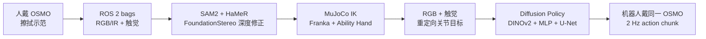
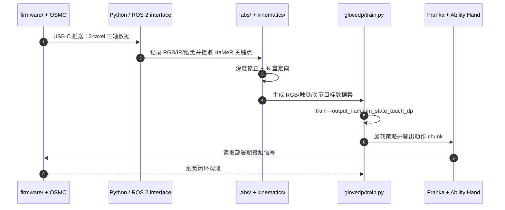

# OSMO：人机共用的开源触觉手套

**OSMO: Open-Source Tactile Glove for Human-to-Robot Skill Transfer**（[arXiv:2512.08920](https://arxiv.org/abs/2512.08920)，[项目页](https://www.jessicayin.com/osmo_tactile_glove/)）由 Meta FAIR、密歇根大学与宾夕法尼亚大学团队提出：让人类示范者和仿生机器人手穿戴同一传感外观与布局，直接迁移连续触觉信号。

## 一句话定义

**OSMO 是一副覆盖指尖与手掌的 12-taxel 三轴磁触觉手套；同一手套既在人手上采集剪切/法向力，又在机器人手上提供部署观测，从硬件侧缩小视觉与触觉的跨具身差距。**

## 英文缩写速查

| 缩写 | 英文全称 | 简要说明 |
|------|----------|----------|
| OSMO | Open Source tactile glove for huMan-to-robOt skill transfer | 本文人机共用触觉手套 |
| PCB | Printed Circuit Board | 传感器与 STM32 控制板 |
| RMS | Root Mean Square | 磁传感串扰噪声统计 |
| IK | Inverse Kinematics | 将人腕/指尖轨迹重定向到 Franka + Ability Hand |
| ROS 2 | Robot Operating System 2 | 25 Hz 示范数据记录与触觉接口 |
| DDPM | Denoising Diffusion Probabilistic Model | 擦拭策略的动作序列生成器 |

## 为什么重要

- **视频看不到力：** 相同图像可能对应压力不足、压力过大或即将滑脱；接触任务需要剪切与法向反馈。
- **共享硬件缩小双重域差：** 人与机器人画面中都出现同一手套，部署时也使用同构磁信号，减少图像修补和触觉表征转换。
- **触觉采集可走出实验室：** 手套兼容 Aria 2、Quest 3、Vision Pro、普通 RGB 与 Manus，保留自然手部自由度。
- **硬件与学习管线一起公开：** 从 PCB/固件、ROS 2 到重定向、扩散策略训练均有官方入口。

## 核心信息

| 项 | 内容 |
|----|------|
| 机构 | Meta FAIR；密歇根大学（University of Michigan）；宾夕法尼亚大学（University of Pennsylvania） |
| 触觉 | 12 个三轴磁 taxel，覆盖 5 指尖与手掌；0.3–80 N |
| 接口 | STM32 + I2C；USB-C；Python / ROS 2；可选 LiPo + microSD |
| 示范 | 140 条 / 约 2 h，RGB + 双 IR + 5 指尖触觉，25 Hz |
| 机器人 | Franka 7-DoF 臂 + Psyonic Ability Hand 6-DoF |
| 开放状态 | **源码与设计资产已公开**；仓库无顶层 LICENSE，样例数据脚本仍标 TODO |

## 流程总览

## 核心机制（方法栈）

### 1）磁触觉与密集串扰抑制

软磁弹性体受力后改变局部磁通，每个 taxel 用双磁力计差分消除共模噪声；MuMetal 屏蔽抑制邻近手指和软磁片变形引起的串扰。12 个单元通过 I2C 连接 STM32，直接输出原始 μT 三轴信号。

### 2）共享手套降低 embodiment gap

低剖面、米色外观让现成手部追踪器仍把手套识别为人手；可拉伸底层也能套在 Ability Hand 上。训练和部署图像中硬件外观一致，触觉通道也无需由人类传感器映射到另一类机器人皮肤。

### 3）人示范到机器人动作

SAM2 给手部掩码，HaMeR 恢复 3D 手姿，FoundationStereo 用双 IR 深度修正腕部全局位置；平滑后通过 MuJoCo IK 转成 13 维 Franka + Ability Hand 关节目标。策略分别编码图像、机器人状态和触觉，以 DDPM 生成 16 步动作 chunk。

## 源码运行时序图

复现需分别创建 `conda/osmo.yml` 与 `conda/osmo_kinematics.yml`；硬件与 PCB 指南在仓库 `website` 分支。README 的样例数据下载仍未完成，策略训练数据需自行采集或向作者获取。

## 工程实践与开源状态

| 项 | 建议 / 状态 |
|----|-------------|
| 传感校准 | 每个 taxel 做零偏、三轴力标定与弯指/邻接接触串扰测试 |
| 同步 | RGB、双 IR、触觉与关节目标统一到 25 Hz，保存相机内外参 |
| 数据处理 | HaMeR → stereo depth → Savitzky–Golay → MuJoCo IK |
| 策略 | 观测 horizon 1、预测 16 步、执行前 4 步、DDPM 100 denoise steps |
| 安全 | IK 中限制腕速并检查手指/腕部对地碰撞，异常帧复用上一安全姿态 |
| 开源边界 | 固件、PCB、装配、接口、策略代码公开；**许可未声明、样例数据未就绪** |

## 与其他工作对比

| 维度 | OSMO | 视觉手姿 | 普通数据手套 | 机器人触觉皮肤 |
|------|------|----------|--------------|----------------|
| 手指运动 | 与外部追踪融合 | 可估计但受遮挡 | 直接测关节 | 不测人手 |
| 法向 + 剪切 | 直接三轴 | 不可观 | 多数无/仅法向 | 机器人端可测 |
| 人机共享 | 同一手套 | 外观差距大 | 通常仅人端 | 仅机器人端 |
| 自然操作 | 较高 | 最高 | 依设备而定 | 不适用 |

## 实验与评测

- **串扰：** MuMetal + 双磁力计差分相对单磁力计平均降低约 **57%** 噪声；1 N 受力信号约 300 μT，需结合各轴噪声看信噪比。
- **擦拭策略：** 12 次、每次 90 s；proprio-only **27.12±32.38%**，vision+proprio **55.75±30.01%**，tactile+vision+proprio **71.69±27.43%**。
- **训练数据：** 140 条人类示范、约 2 h；策略未使用任何真机机器人示范。
- **失败模式：** 无触觉策略更常见压力不足/不均与海绵脱手；所有策略仍受手姿、重定向和标定累计误差影响。

## 结论

**OSMO 的关键不是“多一个触觉通道”，而是用同一可穿戴硬件把人类示范与机器人部署的触觉、外观表示对齐。**

1. **接触任务要看触觉增益** — 擦拭从 55.75% 提升到 71.69%，主要消除了压力和抓持失败。
2. **共享设备减少预处理** — 无需为人手/机器手分别做图像 inpainting 或触觉表征转换。
3. **串扰工程不可省** — 12 个磁单元密集布置时，屏蔽和差分决定信号是否可学。
4. **当前证据仍是单手单任务** — 不能据此外推双手、多指精细操作和跨环境泛化。
5. **公开不等于无许可风险** — 仓库缺 LICENSE，制造、再分发或商业使用前需确认授权。

## 局限与风险

- 仅评测单手白板擦拭，手掌 taxel 在该任务中未使用，灵巧性覆盖有限。
- 每个指尖仅一个平面 taxel，缺少环绕接触位置与更高空间分辨率。
- 视觉遮挡仍影响 HaMeR；板载 IMU 尚未用于视觉—惯性融合。
- 评测仅 12 rollouts，方差较大，且训练/部署场景和相机位置相同。
- 官方数据下载脚本仍是 TODO，仓库未给顶层许可文本。

## 与其他页面的关系

- 采集接口对比：[数据手套 vs 视觉遥操作](../comparisons/data-gloves-vs-vision-teleop.md)
- 人侧全掌压阻对照：[HumanTouch](./humantouch.md) — 稠密压阻 + 多站点质控，非人机同构硬件
- 重定向基础：[Dexterous Kinematics](../concepts/dexterous-kinematics.md)
- 学习后端：[Diffusion Policy](../methods/diffusion-policy.md)
- 任务与路线：[Teleoperation](../tasks/teleoperation.md)、[遥操作纵深 Stage 4](../../roadmap/depth-teleoperation.md)

## 参考来源

- [humanoid_pnb_osmo-open-source-tactile-glove-for-human-to-robo.md](../../sources/papers/humanoid_pnb_osmo-open-source-tactile-glove-for-human-to-robo.md)
- [osmo-tactile-glove 项目页](../../sources/sites/osmo-tactile-glove.md)
- [osmo-tactile-glove 仓库](../../sources/repos/osmo-tactile-glove.md)
- [humantouch-xsparkai.md](../../sources/sites/humantouch-xsparkai.md) — 人侧全掌压阻采集对照
- 论文：<https://arxiv.org/abs/2512.08920>

## 推荐继续阅读

- 官方项目页：<https://www.jessicayin.com/osmo_tactile_glove/>
- 官方仓库：<https://github.com/jessicayin/osmo_tactile_glove>
