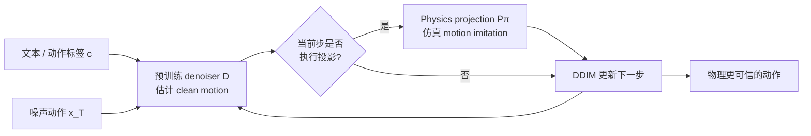

# PhysDiff：Physics-Guided Human Motion Diffusion Model

**PhysDiff**（ICCV 2023 Oral，[arXiv:2212.02500](https://arxiv.org/abs/2212.02500)）由英伟达提出：不重训 MDM/MotionDiffuse denoiser，而是在扩散采样中插入由物理仿真 motion-imitation policy 实现的投影，让后续去噪在更物理可信的轨迹附近继续。

## 一句话定义

**不是生成完再“修脚”，而是在多个后期去噪步把当前 clean-motion estimate 送入物理仿真跟踪，再用仿真输出反复拉回可行流形。**

## 英文缩写速查

| 缩写 | 英文全称 | 简要说明 |
|------|----------|----------|
| PhysDiff | Physics-Guided Human Motion Diffusion Model | 本文物理引导动作扩散框架 |
| MDM | Human Motion Diffusion Model | 论文接入的预训练文本动作 denoiser |
| DDIM | Denoising Diffusion Implicit Model | 插入物理投影的基础采样形式 |
| RL | Reinforcement Learning | 训练物理仿真 motion-imitation policy 的方法 |
| FID | Fréchet Inception Distance | 衡量生成动作分布质量 |
| Phys-Err | Physics Error | penetration、floating、skating 的组合物理误差 |

## 为什么重要

- **物理约束进入采样过程：** 接触与动力学通过仿真器投影表达，不要求可微分解析损失。
- **兼容已有 denoiser：** 物理模块只在 inference 使用，可包装 MDM、MotionDiffuse 等预训练动作扩散模型。
- **避免事后修正失败：** 最终运动若离可行流形太远，单次 post-processing 会产生突变；迭代投影让 denoiser参与折中。
- **给机器人动作生成提供历史锚点：** 后续 [PhyGile](./paper-phygile.md) 进一步把生成空间改成 robot-native 并与 tracker 共闭环。

## 核心信息

| 项 | 内容 |
|----|------|
| **机构** | 英伟达（NVIDIA） |
| **作者** | Ye Yuan、Jiaming Song、Umar Iqbal、Arash Vahdat、Jan Kautz |
| **发表** | ICCV 2023 Oral |
| **任务** | HumanML3D text-to-motion；HumanAct12/UESTC action-to-motion |
| **denoiser** | MDM、MotionDiffuse；PhysDiff 对网络架构无关 |
| **物理模块** | 仿真角色 + 大规模 motion-imitation policy |
| **开源** | **未开源**（核查日 2026-07-28）：项目页未列 GitHub；`NVlabs/PhysDiff` 不存在；仅论文、视频与可视化公开 |

## 流程总览

## 核心机制（方法栈）

### 1）Physics-based motion projection

投影 \(P_\pi\) 接收长度 \(H\) 的 denoised motion；策略 \(\pi\) 在物理仿真中控制角色模仿该轨迹，仿真 rollout 因满足动力学和接触方程而作为 projected motion。它不是欧式最近点投影，而是“该策略实际能跟出的轨迹”。

### 2）投影回写扩散

在 DDIM 更新前，将 clean estimate 与 projected motion 按噪声日程融合，再采样下一时刻。后续 denoiser 可恢复数据分布自然性，形成“生成先验 ↔ 物理执行”交替。

### 3）投影调度

物理仿真昂贵，且高噪声早期的 clean estimate 接近均值、缺少具体动作信息。论文发现后期投影优于早期投影，**连续最后 4 步**在 FID 与 Phys-Err 间取得较好折中。

### 4）Plug-and-play 边界

无需重训 denoiser，不等于无需训练：motion-imitation policy 本身依赖大规模 MoCap、物理角色和 RL 训练；骨架/形体/接触配置变化可能要求重训投影器。

## 工程实践

| 项 | 内容 |
|----|------|
| **开源状态** | **未开源**（截至 **2026-07-28**）：项目页见 [physdiff-project](../../sources/sites/physdiff-project.md)，未列可运行官方仓库 |
| **复现入口** | **不适用** — 无可对齐训练/推理脚本；算法级对照论文投影调度（连续最后约 4 步） |
| **选型提示** | 人体动力学伪影优先 PhysDiff 思路；机器人可执行闭环改看 [PhyGile](./paper-phygile.md) |
| **源码运行时序图** | **不适用**（见下一节） |

## 源码运行时序图

**不适用：截至 2026-07-28 官方项目页未列可运行代码仓库。** 论文给出算法与项目视频，但没有可对齐的训练、推理或部署入口，因此本页不伪造源码时序；上图只表达论文算法数据流。

## 与其他工作对比

| 方法 | 约束来源 | 作用时机 | 输出空间 |
|------|----------|----------|----------|
| **PhysDiff** | 物理仿真 imitation policy | 扩散采样中多次投影 | 人体运动学 |
| [GMD](./paper-notebook-guided-motion-diffusion-for-controllable-human-m.md) | 可微空间目标函数 | 每步 guidance | 人体 root + pose |
| [OmniControl](./paper-notebook-omnicontrol-control-any-joint-at-any-time-for-hu.md) | 任意关节 xyz + realism branch | 每步 hybrid guidance | 人体运动学 |
| [CondMDI](./paper-notebook-flexible-motion-in-betweening-with-diffusion-mod.md) | 训练期关键帧 mask | 条件去噪 | 人体运动学 |
| [PhyGile](./paper-phygile.md) | physics-prefix + GMT | robot-native 生成–跟踪闭环 | 机器人 262D |

PhysDiff 的“physics-guided”比脚滑滤波强，但仍是特定仿真人体的可跟踪性，不等于目标人形机器人能直接执行。

## 实验与评测

- **HumanML3D text-to-motion：** 接 MDM 后物理误差降低 **86%+**，FID 改善 **20%+**；End-4/Space-1 调度 FID **0.433**、Phys-Err **4.111**。
- **HumanAct12 action-to-motion：** Phys-Err 相对基线降低 **78%+**，同时维持竞争性 FID。
- **UESTC action-to-motion：** Phys-Err 降低 **94%+**。
- **调度消融：** 投影次数越多，Phys-Err 单调改善；FID/R-Precision 先改善后恶化，说明“更守物理”可能离数据自然动作分布更远。
- **运行代价：** 单动作生成约 **51.6 s vs MDM 19.6 s**，约慢 **2.5×**；并行 batch 可缩小比例差距，但在线控制仍不可直接承受。

## 结论

**PhysDiff 证明物理投影应参与生成迭代而非只做末端修补，但其收益以仿真器、tracker 训练和显著采样延迟为代价。**

1. **投影放后期** — 高噪声阶段没有值得物理化的具体轨迹，早投影反而伤 FID。
2. **四次投影是论文折中点** — 更多投影继续降 Phys-Err，却可能让动作不自然。
3. **plug-and-play 仅指 denoiser** — imitation policy 仍需单独训练并绑定角色动力学。
4. **物理误差与任务成功不是一回事** — 少穿地/少脚滑不保证机器人平衡、接触任务或真机鲁棒。
5. **开源是当前硬限制** — 官方无代码，完整复现难以核验 simulator、policy 与调度细节。

## 局限与风险

- 官方未开源代码、策略权重或仿真配置；无法按仓库入口验证论文全链路。
- 物理 projection 比普通 denoising 昂贵，论文单样本约慢 2.5×。
- imitation policy 的能力上限构成投影上限；训练分布外动作可能被拉成错误但“可跟踪”的轨迹。
- 评测是仿真人体动作，不是 Unitree 等机器人真机；形体、关节、质量和接触模型均不同。
- Phys-Err 是代理指标，不能替代任务成功率、能耗、扭矩裕量与真实接触安全。

## 与其他页面的关系

- 方法总览：[Diffusion-based Motion Generation](../methods/diffusion-motion-generation.md)
- 空间可控生成：[GMD](./paper-notebook-guided-motion-diffusion-for-controllable-human-m.md)、[OmniControl](./paper-notebook-omnicontrol-control-any-joint-at-any-time-for-hu.md)、[CondMDI](./paper-notebook-flexible-motion-in-betweening-with-diffusion-mod.md)
- robot-native 后继对照：[PhyGile](./paper-phygile.md)
- 物理生成式控制对照：[GPC](./paper-gpc-generative-pretrained-controllers.md)
- 跟踪管线：[Whole-Body Tracking Pipeline](../concepts/whole-body-tracking-pipeline.md)
- 学习路线：[动作生成纵深](../../roadmap/depth-motion-generation.md)

## 参考来源

- [Paper Notebooks 来源归档](../../sources/papers/humanoid_pnb_physdiff.md)
- [PhysDiff 项目页与开源核查](../../sources/sites/physdiff-project.md)
- 论文：<https://arxiv.org/abs/2212.02500>

## 推荐继续阅读

- [官方项目页](https://nvlabs.github.io/PhysDiff/)
- [机器人论文阅读笔记](https://imchong.github.io/Humanoid_Robot_Learning_Paper_Notebooks/papers/14_Human_Motion/PhysDiff__Physics-Guided_Human_Motion_Diffusion_Model/PhysDiff__Physics-Guided_Human_Motion_Diffusion_Model.html)
