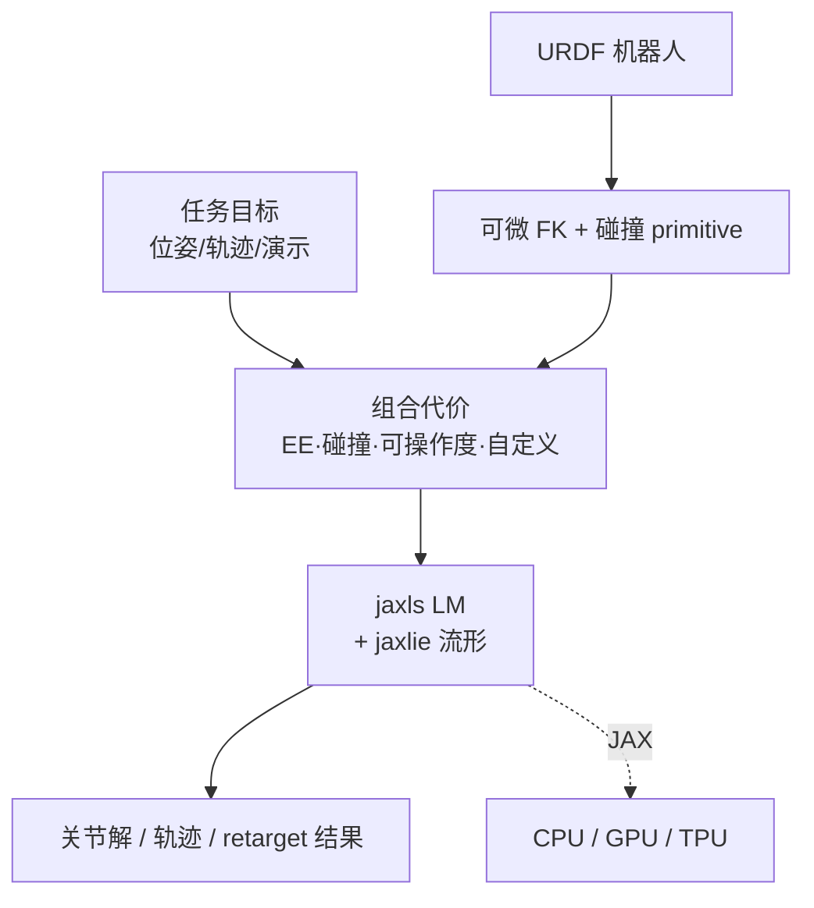
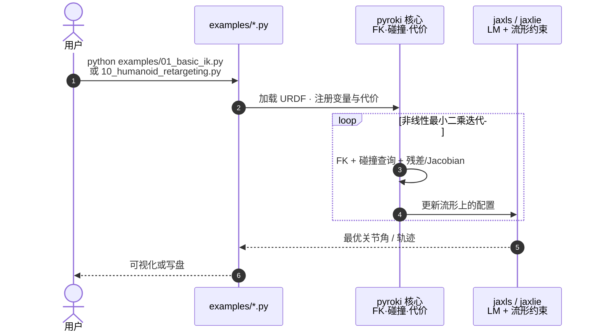

# PyRoki

**PyRoki**（*PyRoki: A Modular Toolkit for Robot Kinematic Optimization*，[arXiv:2505.03728](https://arxiv.org/abs/2505.03728)，IROS 2025，Chung Min Kim* / Brent Yi* / Hongsuk Choi / Yi Ma / Ken Goldberg / Angjoo Kanazawa · **加州大学伯克利分校（UC Berkeley）**；[项目页](https://pyroki-toolkit.github.io/)，[代码](https://github.com/chungmin99/pyroki)）是一套 **纯 Python + JAX** 的 **模块化运动学优化** 工具箱：用 **可组合运动学变量与代价** 统一描述 **逆运动学、轨迹优化、动捕重定向** 等任务，接 **非线性最小二乘**（Levenberg–Marquardt，流形与增广拉格朗日硬约束），并在 **CPU / GPU / TPU** 上原生运行。

## 一句话定义

**把「末端位姿、碰撞、可操作度、模仿演示」等异构运动目标写成同一套可组合代价 + 流形 LM 求解接口，用 JAX 在 CPU/GPU/TPU 上端到端做 IK、轨迹优化与 retarget。**

## 英文缩写速查

| 缩写 | 英文全称 | 简要说明 |
|------|----------|----------|
| IK | Inverse Kinematics | 满足末端/姿态约束的关节解算 |
| TO | Trajectory Optimization | 关节轨迹上的时序代价优化 |
| JAX | JAX (Google) | 可自动微分、可 JIT 的 NumPy 式数组框架 |
| LM | Levenberg–Marquardt | 非线性最小二乘阻尼迭代求解器 |
| FK | Forward Kinematics | 由关节角求连杆位姿 |
| URDF | Unified Robot Description Format | 机器人连杆与关节描述格式 |
| Retargeting | Motion Retargeting | 人体/动捕动作映射到目标机器人骨架 |

## 为什么重要

- **统一问题表述：** 不同任务（IK、避碰到达、模仿人演示）不再各自写一套优化器，而是 **同一变量/代价接口** 组合——降低研究原型与数据管线胶水代码成本。
- **跨加速器部署：** 相对多数 CPU 或 CUDA 专用运动学库，**JAX** 让同一套代码在 **笔记本 CPU、GPU 集群、TPU** 上切换，适合 batch retarget 与大规模 benchmark。
- **生态落点明确：** [ProtoMotions](./protomotions.md) v3 默认 **PyRoki** 批量 AMASS→机器人重定向；[KineBench](./paper-kinebench.md) 规划栈引用 **pyroki**；[cuRobo](./curobo.md) V2 论文亦与 PyRoki 做 **重定向约束满足率** 对照——值得单独建实体而非脚注。
- **与 GPU 运动生成栈互补：** README 坦诚 **碰撞密集场景可能慢于 cuRobo**；定位是 **可扩展、可微、易改代价** 的研究工具箱，而非替代工业级 MotionGen 吞吐。

## 核心信息

| 项 | 内容 |
|----|------|
| 机构 | 加州大学伯克利分校（UC Berkeley） |
| 会场 | IROS 2025 |
| 代码 | [chungmin99/pyroki](https://github.com/chungmin99/pyroki) · **已开源** |
| 文档 | [chungmin99.github.io/pyroki](https://chungmin99.github.io/pyroki/) |
| 开源核查 | **已开源**（2026-09-15，项目页 + GitHub examples/benchmark） |

## 流程总览

## 源码运行时序图

节点对齐 [`sources/repos/pyroki.md`](../../sources/repos/pyroki.md)。

- **最短路径：** `git clone` → `pip install -e .` → `python examples/01_basic_ik.py`。
- **重定向路径：** `examples/10_humanoid_retargeting.py`（与 ProtoMotions 教程对齐）。

## 核心原理

### 1）模块化变量与代价

- **FK：** 由 URDF 构建可微正运动学；自动生成 **胶囊** 等碰撞体（mesh 近似为胶囊）。
- **代价库：** 末端 **SE(3)** 误差、自碰/环境碰、**可操作度** 等；支持 **autodiff** 或手写 Jacobian。
- **扩展：** 任意自定义代价项接入同一 LM 栈，无需 fork 求解器。

### 2）求解器与约束

- 集成 [jaxls](https://github.com/brentyi/jaxls) **Levenberg–Marquardt**；[jaxlie](https://github.com/brentyi/jaxlie) 处理 **李群流形** 上的位姿变量。
- **硬约束** 经 **增广拉格朗日** 处理（关节限位、等式约束等）。

### 3）示例覆盖（`examples/`）

| 脚本 | 能力 |
|------|------|
| `01–05` | 基础 IK、双臂、移动基座、碰撞、可操作度 |
| `06–07` | 在线规划、轨迹优化 |
| `08` | mimic 关节 |
| `09–12` | 手/人形 retarget（含 fancy 变体） |
| `13–14` | 锁定关节、奇异感知 IK |

### 4）工程实践与局限

| 项 | 说明 |
|----|------|
| 开源状态 | **已开源**；MIT 许可（以仓库为准） |
| JIT | 首次运行或 **输入 shape 变化** 触发 JAX 编译；可预 pad 向量化 |
| 不支持 | 采样式规划器（RRT 等）；闭链/并联机构 |
| 关节/碰撞 | 仅 revolute/continuous/prismatic/fixed；球/胶囊/半空间/高度图 |
| 性能 | 作者自述碰撞密集场景 **可能慢于 cuRobo** 等专用 GPU 栈 |

## 实验与评测（论文级）

- **对比：** 与 **cuRobo** 等 GPU IK 库 benchmark；摘要报告 **1.4–1.7×** 加速且 **更低误差**（以论文表为准）。
- **案例：** 手部 / 人形 **motion retargeting**、规划案例展示 **模块化改代价** 的迭代效率。

## 结论

**PyRoki 把运动学优化从「每个任务一套 C++/CUDA 胶水」拉回到「可组合代价 + JAX 跨平台 LM」，适合 IK/TO/retarget 研究原型与下游数据管线（ProtoMotions、评测规划后端）快速接入。**

- 真正起作用的是 **统一变量/代价接口 + 流形 LM**，而不是单点 IK 速度记录——改任务往往只需换代价项。
- 与 **cuRobo** 分工：PyRoki 胜在 **可微、可改、纯 Python**；cuRobo 胜在 **GPU 碰撞吞吐与 MotionGen 产品化路径**。
- 部署读法：batch retarget / 研究 benchmark 优先 PyRoki；工业无碰撞 MotionGen + 深度感知闭环优先 cuRobo / Isaac 栈。
- 局限要正视：**无采样规划**、**碰撞性能未宣称全面领先**、**JAX shape 静态化** 影响交互式改参体验。

## 与其他页面的关系

- 概念：[motion-retargeting.md](../concepts/motion-retargeting.md)
- 方法：[trajectory-optimization.md](../methods/trajectory-optimization.md)
- 对照实体：[curobo.md](./curobo.md)、[protomotions.md](./protomotions.md)
- 引用方：[paper-kinebench.md](./paper-kinebench.md)
- Paper Notebooks 索引：[paper-notebook-category-04](../overview/paper-notebook-category-04-loco-manipulation-and-wbc.md)

## 参考来源

- [pyroki_arxiv_2505_03728.md](../../sources/papers/pyroki_arxiv_2505_03728.md)
- [pyroki.md](../../sources/repos/pyroki.md)
- [pyroki-toolkit.github.io](../../sources/sites/pyroki-toolkit-github-io.md)
- [humanoid_pnb_pyroki.md](../../sources/papers/humanoid_pnb_pyroki.md) — Paper Notebooks 策展索引

## 推荐继续阅读

- [PyRoki 文档](https://chungmin99.github.io/pyroki/)
- [ProtoMotions · Retargeting with PyRoki](https://protomotions.github.io/tutorials/workflows/retargeting_pyroki.html)
- [cuRobo 实体页](./curobo.md) — GPU 运动生成对照
