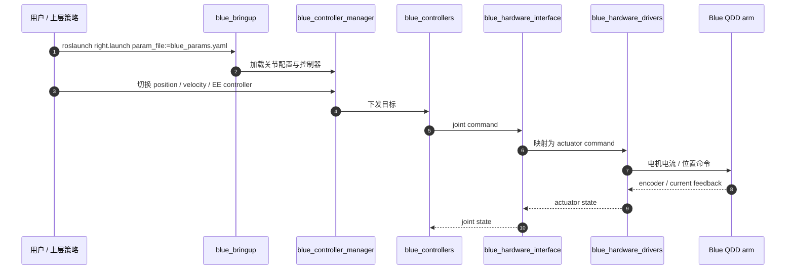

# Quasi-Direct Drive for Low-Cost Compliant Robotic Manipulation

**Quasi-Direct Drive for Low-Cost Compliant Robotic Manipulation**（[arXiv:1904.03815](https://arxiv.org/abs/1904.03815)，ICRA / RA-L 2019）由加州大学伯克利分校团队提出，原型是 7-DoF 机械臂 **Blue**。

## 一句话定义

**用低减速比外转子电机 + 单级同步带做可背驱 QDD，再以差动模块、近端质量布局和面向量产的塑料壳体，把人尺度柔顺机械臂的目标从工业精度改写为 2 kg 负载、足够带宽与低于 5,000 美元。**

## 英文缩写速查

| 缩写 | 英文全称 | 简要说明 |
|------|----------|----------|
| QDD | Quasi-Direct Drive | 小于约 10:1 的低减速比、高背驱执行器 |
| DoF | Degree of Freedom | Blue 每臂七个关节自由度 |
| VR | Virtual Reality | 遥操作与示范数据采集接口 |
| ROS | Robot Operating System | Blue 开源核心软件的运行中间件 |
| LfD | Learning from Demonstration | VR 操作轨迹的下游学习用途 |
| BoM | Bill of Materials | 量产成本估算的物料清单 |

## 为什么重要

- **改变机械臂设计目标：** 家庭/研究环境更需要碰撞柔顺、足够负载和可扩展成本，而非工业臂的极致重复精度。
- **把 QDD 从腿足迁到操作：** 低摩擦传动让电机电流可近似输出力矩，支持可选阻抗与手推示教。
- **给成本—性能取舍实物证据：** 论文同时测重复性、位置/力矩带宽、热与制造成本。
- **软件链仍可研究：** 官方 ROS 核心栈、Python 接口和 MuJoCo 仓库公开，能追踪命令到驱动的系统边界。

## 核心信息

| 项 | 内容 |
|----|------|
| **机构** | 加州大学伯克利分校（UC Berkeley） |
| **平台** | Blue：人尺度 7-DoF 单臂，2 kg 臂展端负载 |
| **传动** | 16T→114T GT3 同步带，单级 **7.125:1**；2-DoF 差动模块 |
| **性能** | 4 mm 内 home repeatability；名义位置带宽 7.5 Hz；力矩带宽 13.8 Hz |
| **成本目标** | 量产超过 1,500 臂时终端价格 <5,000 美元 |
| **开源** | **部分开源**：`blue_core` MIT；辅助软件、仿真可用，但完整硬件制造链和各仓库许可不统一 |

## 核心机制（方法与硬件栈）

### 1）低减速比与背驱

QDD 以较大气隙半径无刷外转子换取电机力矩，再用小于 10:1 的传动放大。与高减速谐波相比，反射惯量、摩擦和卡滞风险更低；代价是电机更大、铜耗和散热压力更高。

### 2）同步带差动模块

15 mm GT3 belt 提供 >95% 效率、低背隙和连续转动；两个平面传动合成 pitch/roll 差动输出并共享部分载荷。电机可沿带传动后移到肩部，使肩部重力矩和飞行惯量估算各降约 30%。

### 3）任务适配而非工业过度设计

论文把“useful”定义为人尺度、7-DoF、2 kg、柔顺、重复性 <10 mm。视觉闭环、遥操作与学习方法容忍毫米级误差，设计预算因此可以用于背驱、安全与低成本。

## 源码运行时序图

最小复现路径是克隆 `blue_core` 与 `blue_configs`，配置 ROS workspace 后从 `blue_bringup` 启动；无实机时可使用同组织 MuJoCo / simulator 仓库，但版本与许可需单独核查。

## 工程实践

| 环节 | 关键取舍 | 验收 |
|------|----------|------|
| 电机/减速 | 大直径外转子 + 7.125:1 belt | \(K_t\)、反电势、回驱力矩、热 |
| 机械布局 | 电机后移、差动共享载荷 | 肩部重力矩、飞行惯量、belt tension |
| 力矩估计 | 电流作为近似力矩传感 | 静态迟滞、摩擦、温漂 |
| 带宽 | 代表性负载下 chirp | position / torque -3 dB 与相位 |
| 热 | 按真实 pick-and-place duty 建模 | 近端三电机功耗与 time-to-derate |
| 软件 | `ros_control` 控制器动态切换 | joint↔actuator 映射与急停 |
| 成本 | 量产假设分离 prototype BoM | 模具、装配、校准和售后成本 |

## 与其他工作对比

| 架构 | 柔顺来源 | 优点 | 代价 |
|------|----------|------|------|
| Blue QDD | 低减速比固有背驱 + 电流力矩估计 | 简单、低摩擦、带宽高、低成本潜力 | 电机体积与热负担 |
| SEA | 串联弹簧 + 形变测力 | 抗冲击、输出力直接可测 | 带宽和传动复杂度 |
| 谐波 + F/T | 高减速 + 输出传感器主动柔顺 | 紧凑高静态力矩 | 摩擦、反射惯量、成本 |
| Direct Drive | 无减速 | 最佳背驱与低摩擦 | 多 DoF 臂上质量/力矩密度困难 |

## 实验与评测

- Blue 达到 **2 kg** 臂展端负载，home repeatability 在 **4 mm** 半径内，end-pose repeatability 在 **3 mm** 内。
- 名义位置控制带宽 **7.5 Hz**；锁定输出、10 N·m、0.1–60 Hz chirp 的保守力矩带宽估计为 **13.8 Hz**，高于论文引用的人体二头肌 **2.3 Hz**。
- 90% pick-and-place 功耗集中在基座与肩部前三个电机，说明热模型与散热设计应优先看近端。
- 项目展示 lead-through、VR 咖啡/清洁、螺钉拾取与遥操作；这些验证任务可用性，但不是大规模可靠性或寿命试验。

## 结论

**Blue 证明低成本柔顺操作不必复制工业臂规格：低减速 QDD 能用较低精度换来背驱、力矩带宽和安全交互，但热与量产假设必须单独验收。**

1. **减速比是系统级选择** — 7.125:1 同时影响力矩、背驱、惯量、带宽与电机尺寸。
2. **近端质量布局很值钱** — belt 允许后移电机，降低肩负担。
3. **电流估力矩有边界** — 齿槽、摩擦、温漂和 belt 迟滞仍需标定。
4. **“低于 5,000 美元”是量产目标** — 依赖 >1,500 臂，不等于单台原型采购价。
5. **公开软件不等于整机全开源** — `blue_core` 可运行，但制造资料和辅助仓库边界需逐项核查。

## 局限与风险

- QDD 的低扭矩密度与热持续能力限制高负载或高 duty 任务。
- belt 张力、塑料结构刚度与差动耦合增加标定和维护变量。
- 论文 2019 年 ROS 栈与现代 ROS 2 / 实时总线集成有迁移成本。
- 成本分析依赖大批量模具与供应链假设；论文未给完整商业交付结果。

## 与其他页面的关系

- 路线入口：[力矩控制电机设计纵深](../../roadmap/depth-torque-motor-design.md)
- 人级指标对照：[Human-Level Actuation](./paper-notebook-human-level-actuation-for-humanoids.md)
- 同代腿足 QDD：[MIT Mini Cheetah](./mit-mini-cheetah.md)、[ODRI Solo](./odri-solo-and-bolt.md)
- 控制接口：[Impedance Control](../concepts/impedance-control.md)
- 项目选型：[Open-source QDD Actuator Projects](../comparisons/open-source-qdd-actuator-projects.md)
- 系统闭环：[执行器驱动链选型闭环](../queries/actuator-drive-chain-selection-loop.md) — Blue 对应力矩指令到真实关节的硬件/固件链

## 参考来源

- [论文进度与原始资料归档](../../sources/papers/humanoid_pnb_quasi-direct-drive-for-low-cost-compliant-roboti.md)
- [Blue 官方项目页与开放状态核查](../../sources/sites/berkeley-open-arms-blue.md)
- [Blue Core ROS 仓库归档](../../sources/repos/blue-core.md)
- 论文：<https://arxiv.org/abs/1904.03815>

## 推荐继续阅读

- [Berkeley Open Arms / Blue 项目页](https://berkeleyopenarms.github.io/)
- [berkeleyopenarms/blue_core](https://github.com/berkeleyopenarms/blue_core)
- [Paper Notebooks 阅读进度](https://github.com/ImChong/Robot_Learning_Paper_Notebooks/blob/main/papers/PROGRESS.md)
