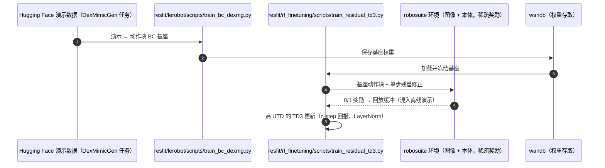

# Residual Off-Policy RL for Finetuning Behavior Cloning Policies

**Residual Off-Policy RL for Finetuning Behavior Cloning Policies** 收录于 [Robot Learning Paper Notebooks](https://imchong.github.io/Robot_Learning_Paper_Notebooks/index.html)（分类：06_Manipulation），深读笔记已完成。本页编译自深读笔记与 arXiv 论文正文（实验数字、开源状态于 2026-09-28 核对），细节以论文 PDF 为准。

## 一句话定义

行为克隆（BC）能学到不错的视觉运动策略，但受限于人类演示质量、采集人力、离线数据的边际收益递减。强化学习（RL）靠自主交互、潜力大，但直接在真机训 RL 难——样本低效、安全、稀疏奖励长时程，对高自由度（DoF）系统尤甚。本文给出一个把 BC 与 RL 优点结合的残差学习配方：把 BC 策略当黑盒基座，用样本高效的离策略 RL 学每步的轻量残差修正。方法只需稀疏二值奖励，即可在高自由度系统（仿真与真机）上改进操作策略。尤其，作者据其所知首次在带灵巧手的人形真机上成功进行 RL 训练，在多项视觉任务上取得 SOTA，指向把 RL 真正部署到现实的可行路径。

## 英文缩写速查

| 缩写 | 含义 |
|---|---|
| BC | Behavior Cloning，行为克隆 |
| Off-Policy RL | 离策略强化学习（样本高效） |
| Residual | 残差，对基座策略的逐步修正 |
| Sparse Binary Reward | 稀疏二值奖励（成功/失败） |
| High-DoF | 高自由度系统 |
| Dexterous Hands | 灵巧手 |

## 为什么重要

- **"冻结基座 + 学残差"是真机 RL 的安全样本高效范式**，呼应 ResMimic、SteadyTray 的残差思路；
- **稀疏二值奖励**降低奖励工程门槛，利于真机；
- **首次灵巧手人形真机 RL**是里程碑，证明真机 RL 可行；
- 对高 DoF 系统（人形）尤其有价值。

## 解决什么问题

BC 与 RL 各有短板： - **BC**：受演示质量限制、边际收益递减； - **真机 RL**：样本低效、安全难、稀疏奖励长时程难，高 DoF 更甚。

论文要：把二者结合，**安全样本高效**地在**真机高 DoF**（含灵巧手人形）上改进策略。

## 核心机制

1. **残差 BC+RL 配方**：BC 基座 + 离策略 RL 轻量残差，安全样本高效；
2. **仅需稀疏二值奖励**：免稠密奖励工程；
3. **首次灵巧手人形真机 RL**：据作者所知；
4. **视觉任务 SOTA**：指向真机 RL 的可行路径。

方法拆解（深读笔记小节）：残差学习：BC 基座 + RL 修正；样本高效离策略 RL + 稀疏二值奖励；真机灵巧手人形 RL（首次）；🧭 整体流程（mermaid）。

## 核心信息

| 字段 | 内容 |
|------|------|
| 分类 | 06_Manipulation |
| 深读笔记 | <https://imchong.github.io/Robot_Learning_Paper_Notebooks/papers/06_Manipulation/Residual_Off-Policy_RL_for_Finetuning_Behavior_Cloning_Policies/Residual_Off-Policy_RL_for_Finetuning_Behavior_Cloning_Policies.html> |
| arXiv | <https://arxiv.org/abs/2509.19301> |
| 源码 | **已开源（仿真部分）**：[amazon-far/residual-offpolicy-rl](https://github.com/amazon-far/residual-offpolicy-rl)（DexMimicGen 任务上的 BC 基座训练 + 残差 TD3 离策略微调，数据经 Hugging Face 获取）；真机 Vega 系统代码未在 README 中给出 |
| 作者 | Lars Ankile、Zhenyu Jiang、Rocky Duan、Guanya Shi、Pieter Abbeel、Anusha Nagabandi |
| 发表 | 2025 年 9 月 |
| 笔记阅读日期 | 2026-06-21 |

## 源码运行时序图

## 实验与评测

**仿真**：robosuite / MuJoCo，20 Hz，只用图像 + 关节状态（无特权物体状态）、稀疏二值奖励、单环境。任务：Robomimic 的 Can、Square（Franka 单臂，7 维动作）；DexMimicGen 的 BoxCleanup（双 Franka）、CanSort 与 Coffee（固定底座 GR1，双臂 + 6-DoF 手，24 维动作）。演示：单臂 300 条、双臂 1000 条。基线：Tuned RLPD（同样的离策略设计但不用基座）、IBRL、Filtered BC（成功轨迹回灌再 BC），以及用 PPO 学残差的在策略版本。

- **样本效率**：BoxCleanup 上离策略残差约 20 万步收敛，PPO 残差需 4000 万步，约 **200 倍**。
- ResFiT 在全部任务上收敛到接近满分；Can 约 7.5 万步收敛（其他方法约 15 万步）；Square 只有 ResFiT 与 Tuned RLPD 在 15 万步内超过 90%；更难的 BoxCleanup / CanSort / Coffee 上基线要么崩到 0 要么慢得多。Coffee 上所有**不用动作块**的方法都失败。
- Filtered BC 稳定但几乎不提升——主要失败模式是精度，缺少显式价值最大化难以改善。
- **超参**：稀疏奖励需 n-step > 1，过大又引入偏差；UTD > 1 明显有益，8 以上收益递减。

**真机**：Dexmate Vega 轮式人形（双 7-DoF 臂 + 双 6-DoF OyMotion 手 + 3-DoF 头部 ZED，29 维关节位置控制），ACT 为基座，只有 0/1 成功奖励；评测用盲 A/B 对照、相同初始条件。

| 任务 | 基座 ACT（演示数） | 真机 RL 数据 | ResFiT |
|------|------|------|------|
| WoollyBallPnP（最难的灰色毛线球） | 14%（约 1000 条，4 种物体） | 134 条 rollout ≈ 15 分钟 | **64%** |
| PackageHandover（双手交接软包裹） | 23%（约 900 条） | 343 条 rollout ≈ 76 分钟 | **64%** |

## 与其他工作对比

| 工作 | 微调方式 | 与 ResFiT 的差异 |
|------|------|------|
| Tuned RLPD | 离策略 RL 直接学单步策略 | 同样设计但无基座；高 DoF 长时程任务上崩溃或变慢 |
| IBRL | BC 策略提议动作 + 引导价值 | 不学残差；高 DoF 任务表现差 |
| PPO 残差 RL | 在策略学残差 | 收敛所需步数约为离策略残差的 200 倍，不适合真机 |
| [SteadyTray](./paper-notebook-steadytray.md) / [ResMimic](./paper-resmimic.md) | 冻结基座 + 残差 | 同一思路用于全身运动；ResFiT 用于视觉灵巧操作并在真机上训练 |

## 结论

**这篇工作的赌注是「不要重训基座」：把 BC 策略冻结成黑盒，只用离策略 RL 学每步的轻量残差，从而在高自由度真机上同时压下 RL 的样本代价与安全风险。**

- 起作用的是 **残差结构 + 离策略 RL** 的组合，缺一不可：前者让探索始终停留在 BC 行为附近（安全），后者让昂贵的真机交互数据可被反复复用（样本高效）。
- **只需稀疏二值奖励** 是关键工程红利——真机任务最难写的恰恰是稠密奖励，这一步被绕开了。
- 适用边界写在前提里：必须先有一个能用的 BC 基座。BC 受演示质量与采集人力限制、离线数据边际收益递减，残差修正的是「最后一段」，不是从零学会任务。
- 里程碑意义在于据作者所知 **首次在带双五指手的人形真机上完全在真机中跑通 RL**：毛线球取放 14% → 64%（约 15 分钟数据）、双手交接 23% → 64%（约 76 分钟）。
- 同簇对照：与 ResMimic、SteadyTray 共享「冻结基座 + 学残差」思路，差别在于本文把它推到了真机高 DoF 视觉操作这一最难的场景。

## 局限与风险

- **受限于基座策略**：学到的行为围绕基座展开，无法发现根本不同的策略或技能（论文自述主要局限）。
- **仍需人工参与**：真机训练需要人工复位与标注成功 / 失败，缺少自动复位与成功检测。
- **基座需足够好**：基座成功率 14–23% 时仍有效，但完全不会的任务无从修正。
- **真机任务数少**：只有 2 个任务，最终成功率 64%，离可靠部署仍有距离。
- **开源边界**：仓库覆盖仿真 BC + 残差 TD3；真机系统（安全限位、Actor–Learner 分进程）未给出。

## 与其他页面的关系

- 分类父节点：[paper-notebook-category-06-manipulation](../overview/paper-notebook-category-06-manipulation.md)
- 总索引：[humanoid-paper-notebooks-index.md](../overview/humanoid-paper-notebooks-index.md)
- 残差策略学习：[residual-policy-learning](../methods/residual-policy-learning.md)
- 真机安全 RL 微调：[safe-real-world-rl-fine-tuning](../concepts/safe-real-world-rl-fine-tuning.md)
- 基座策略 ACT / 动作块：[action-chunking](../methods/action-chunking.md)
- 同簇「冻结基座 + 残差」：[paper-notebook-steadytray](./paper-notebook-steadytray.md)
- 仿真任务与演示来源 DexMimicGen：[paper-notebook-dexmimicgen-automated-data-generation-for-bimanu](./paper-notebook-dexmimicgen-automated-data-generation-for-bimanu.md)

## 参考来源

- [humanoid_pnb_residual-off-policy-rl-for-finetuning-behavior-c.md](../../sources/papers/humanoid_pnb_residual-off-policy-rl-for-finetuning-behavior-c.md)
- 深读笔记：<https://imchong.github.io/Robot_Learning_Paper_Notebooks/papers/06_Manipulation/Residual_Off-Policy_RL_for_Finetuning_Behavior_Cloning_Policies/Residual_Off-Policy_RL_for_Finetuning_Behavior_Cloning_Policies.html>
- 论文：<https://arxiv.org/abs/2509.19301>
- 论文正文（仿真 / 真机结果与讨论节）：<https://arxiv.org/html/2509.19301>
- 官方代码：<https://github.com/amazon-far/residual-offpolicy-rl>

## 推荐继续阅读

- [机器人论文阅读笔记：Residual Off-Policy RL for Finetuning Behavior Cloning Policies](https://imchong.github.io/Robot_Learning_Paper_Notebooks/papers/06_Manipulation/Residual_Off-Policy_RL_for_Finetuning_Behavior_Cloning_Policies/Residual_Off-Policy_RL_for_Finetuning_Behavior_Cloning_Policies.html)
- 项目页：<https://residual-offpolicy-rl.github.io/>
