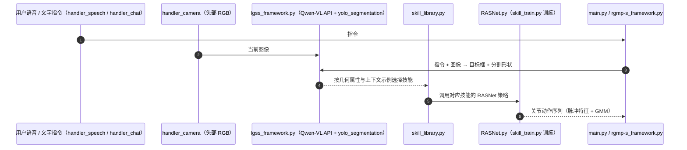

# Generalizable Geometric Prior and Recurrent Spiking Feature Learning for Humanoid Robot Manipulation

**Generalizable Geometric Prior and Recurrent Spiking Feature Learning for Humanoid Robot Manipulation** 收录于 [Robot Learning Paper Notebooks](https://imchong.github.io/Robot_Learning_Paper_Notebooks/index.html)（分类：06_Manipulation）。本页编译自深读笔记与 arXiv 论文正文（实验数字、开源状态于 2026-09-28 核对），细节以论文 PDF 为准。

## 一句话定义

RGMP-S 把"人形机器人做长程操作"拆成两段：上层让 VLM 在轻量级 2D 几何先验的帮助下"看懂场景 → 选对技能 → 拆分任务"；下层让一种递归自适应脉冲网络（RASNet）在稀疏示范下学到时间一致的动作，避免过拟合。ManiSkill2 + 3 个真机平台上验证有效。

## 英文缩写速查

| 缩写 | 英文全称 | 简要说明 |
|------|----------|----------|
| LGSS | Long-horizon Geometric-prior Skill Selector | 用 VLM + 2D 几何先验选择技能的高层模块 |
| RASNet | Recursive Adaptive Spiking Network | 递归自适应脉冲网络，负责低层动作生成 |
| SNN | Spiking Neural Network | 以脉冲时序传递信息的神经网络 |
| SDFE | Spiking Dense Feature Extraction | RASNet 中的脉冲稠密特征提取模块 |
| GMM | Gaussian Mixture Model | 用于细化动作生成的高斯混合模型 |
| VLM | Vision-Language Model | 本文用 Qwen-VL 解释指令并定位目标 |

## 为什么重要

- **把 VLM 的语义落到几何上**：VLM 能认出目标，却常选错抓法（侧抓 vs 捏取）；LGSS 用分割得到的形状类别补上这一步。
- **稀疏示范下的数据效率**：约 40 条轨迹即达到 Diffusion Policy 约 200 条的水平，适合每个技能都要单独采集的人形场景。
- **实时性**：75.2 Hz 推理，远高于 OpenVLA（3.6 Hz）与 Diffusion Policy（1.01 Hz）。
- **跨平台验证**：自研人形、桌面双臂与 Aloha 三种真机 + ManiSkill2。

## 核心机制

1. **LGSS（高层）**：Qwen-VL 按指令框出目标 → YOLOv8n-seg 分割得到形状（如「圆柱」「压扁」）→ 结合 20 个带形状标签与对应技能的上下文示例，从预定义技能库中选择技能（如侧抓、上提）。单次推理约 105 ms（RTX 4090）。
2. **RASNet（低层）**：用递归脉冲参数化机器人–物体交互以保持时空一致性；自适应脉冲神经元调节特征保留，SDFE 提取稠密时空特征，GMM 细化动作输出，以缓解稀疏示范下的过拟合。
3. **几何一致性监督**：训练中保持几何一致性约束，为长时程规划与精细交互提供空间约束。

## 核心信息

| 字段 | 内容 |
|------|------|
| 分类 | 06_Manipulation |
| 深读笔记 | <https://imchong.github.io/Robot_Learning_Paper_Notebooks/papers/06_Manipulation/RGMP-S__Generalizable_Geometric_Prior_and_Recurrent_Spiking_Feature_Learning_for_Humanoid_Manipulation/RGMP-S__Generalizable_Geometric_Prior_and_Recurrent_Spiking_Feature_Learning_for_Humanoid_Manipulation.html> |
| arXiv | <https://arxiv.org/abs/2601.09031> |
| 源码 | **已开源**：[xtli12/RGMP-S](https://github.com/xtli12/RGMP-S)（LGSS 技能选择、YOLOv8 分割、Qwen-VL API 接口、RASNet 训练脚本与语音交互主程序；需自备 Qwen API key） |

## 源码运行时序图

训练入口：`python skill_train.py --train_folder ./dataset/train/ --valid_folder ./dataset/valid/`；运行前在 `configs.yaml` 填写 Qwen API key。

## 实验与评测

**平台**：自研上半身人形（头部第一视角 RGB、躯干麦克风阵列、Orin 计算，双 6-DoF 臂 + 双 6-DoF 灵巧手）为主，另有桌面双臂机器人与 Aloha。技能库含 500 条专家轨迹；指标 Acc = 技能选择准确率 Acc_s × 执行成功率 Acc_t。共 10 个任务：ManiSkill2 仿真 5 个 + 真机 5 个（对话式吧台服务、零样本抓取、叠毛巾、倒水、料箱拣选）。

**零样本抓取**（只用 40 条「抓芬达罐」轨迹训练，每类目标 100 次，Table III）：

| 方法 | 芬达 | 可乐 | 喷壶 | 人手 | 平均 | 推理频率 |
|------|---:|---:|---:|---:|---:|---:|
| Octo | 0.65 | 0.55 | 0.58 | 0.62 | 0.60 | 13.4 Hz |
| OpenVLA | 0.68 | 0.58 | 0.61 | 0.60 | 0.62 | 3.6 Hz |
| RDT-1B | 0.70 | 0.61 | 0.60 | 0.62 | 0.64 | 6.7 Hz |
| Diffusion Policy | 0.75 | 0.65 | 0.68 | 0.72 | 0.70 | 1.01 Hz |
| Dex-VLA | 0.87 | 0.66 | 0.71 | 0.84 | 0.77 | 55.3 Hz |
| RGMP（前作） | 0.98 | 0.78 | 0.81 | 0.90 | 0.87 | 78.6 Hz |
| **RGMP-S** | 0.96 | **0.83** | **0.85** | **0.93** | **0.89** | 75.2 Hz |

- **LGSS（几何先验）**：吧台服务任务中，相比只用 Qwen-VL 做技能选择，在 Diffusion Policy 下压扁可乐罐的 Acc 由 0.40 升到 0.55，主要来自正确识别物体朝向、避免对变形物体侧抓。
- **长时程任务**：倒水比最强基线 Diffusion Policy 高约 16%；叠毛巾 0.86 vs Dex-VLA 0.68。
- **消融**：去掉脉冲稠密特征提取（SDFE），倒水成功率 0.92 → 约 0.65；RASNet + GMM 在递纸巾 / 压扁可乐任务上 Acc 0.60 / 0.69（Diffusion Policy 0.50 / 0.49）；去掉引导自注意力模块，递给人手的成功率 0.93 → 0.73。
- **数据效率**：约 40 条轨迹达到 Diffusion Policy 用约 200 条收敛后的水平（约 5 倍）。

## 与其他工作对比

| 工作 | 高层 / 低层分工 | 与 RGMP-S 的差异 |
|------|------|------|
| [RGMP](./paper-notebook-rgmp-recurrent-geometric-prior-multimodal-policy.md)（前作） | 几何先验技能选择 + 递归策略 | 零样本抓取平均 0.87；RGMP-S 加入脉冲特征学习到 0.89，推理稍慢（75.2 vs 78.6 Hz） |
| [OpenVLA](./paper-openvla.md) / [Octo](./paper-octo.md) | 端到端通才策略 | 缺少显式几何推理，新类别泛化差，推理频率低 |
| [Diffusion Policy](./paper-diffusion-policy.md) | 端到端扩散策略 | 数据需求约 5 倍，推理约 1 Hz |
| Dex-VLA | 灵巧操作 VLA | 最强基线，平均 0.77 |

## 结论

**RGMP-S 的取舍是「上层借现成模型泛化、下层省示范数据」：把场景理解与任务拆分交给 VLM 加轻量 2D 几何先验，把稀疏示范下的时序一致性交给递归脉冲网络，而不是用一个端到端大模型硬吃长程操作。**

- 上层真正起作用的不只是 VLM，而是给它补的**轻量级 2D 几何先验**——它把「看懂场景」落到可选技能与可拆分的子任务上。
- 下层 RASNet 的目标很具体：在**稀疏示范**下学到时间一致的动作并抑制过拟合，这正是长程任务里最容易崩的一段。
- 验证覆盖 ManiSkill2 仿真与 3 个真机平台：零样本抓取平均 0.89（最强基线 Dex-VLA 0.77），同时保持 75.2 Hz 推理。
- 与前作 RGMP 相比增益不大（平均 0.87 → 0.89，芬达罐略降），主要改进在新物体上；真正的边界是毫米级接触精度场景，所有方法都会失败。

## 局限与风险

- **高精度接触场景仍失败**：毛巾完全贴平桌面时夹爪插入余量只有毫米级；插充电器对准公差严于 5 mm 时，夹爪自遮挡使视觉反馈不足。作者建议引入触觉或主动视觉。
- **依赖预定义技能库**：LGSS 从技能库中选择技能，技能库外的新动作需另行采集训练。
- **依赖商用 VLM API**：视觉–语言解释调用 Qwen-VL API，需网络与 API key；LGSS 单次推理约 105 ms（4090）。
- **每个技能单独训练**：吧台服务每个技能 40 条轨迹，长时程任务每任务约 100 条。

## 与其他页面的关系

- 分类父节点：[paper-notebook-category-06-manipulation](../overview/paper-notebook-category-06-manipulation.md)
- 总索引：[humanoid-paper-notebooks-index.md](../overview/humanoid-paper-notebooks-index.md)
- 前作 RGMP：[paper-notebook-rgmp-recurrent-geometric-prior-multimodal-policy](./paper-notebook-rgmp-recurrent-geometric-prior-multimodal-policy.md)
- 仿真基准 ManiSkill2：[maniskill2](./maniskill2.md)
- 对比基线 OpenVLA：[paper-openvla](./paper-openvla.md)
- 对比基线 Octo：[paper-octo](./paper-octo.md)
- 对比基线 Diffusion Policy：[paper-diffusion-policy](./paper-diffusion-policy.md)

## 参考来源

- [humanoid_pnb_rgmp-s.md](../../sources/papers/humanoid_pnb_rgmp-s.md)
- 深读笔记：<https://imchong.github.io/Robot_Learning_Paper_Notebooks/papers/06_Manipulation/RGMP-S__Generalizable_Geometric_Prior_and_Recurrent_Spiking_Feature_Learning_for_Humanoid_Manipulation/RGMP-S__Generalizable_Geometric_Prior_and_Recurrent_Spiking_Feature_Learning_for_Humanoid_Manipulation.html>
- 论文：<https://arxiv.org/abs/2601.09031>
- 论文正文（方法、Table II–V、失败分析）：<https://arxiv.org/html/2601.09031>
- 官方代码：<https://github.com/xtli12/RGMP-S>

## 推荐继续阅读

- [机器人论文阅读笔记：Generalizable Geometric Prior and Recurrent Spiking Feature Learning for Humanoid Robot Manipulation](https://imchong.github.io/Robot_Learning_Paper_Notebooks/papers/06_Manipulation/RGMP-S__Generalizable_Geometric_Prior_and_Recurrent_Spiking_Feature_Learning_for_Humanoid_Manipulation/RGMP-S__Generalizable_Geometric_Prior_and_Recurrent_Spiking_Feature_Learning_for_Humanoid_Manipulation.html)
