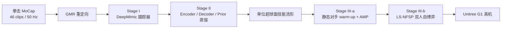

# RoboStriker：潜空间自博弈的人形拳击

**RoboStriker: Hierarchical Decision-Making for Autonomous Humanoid Boxing**（[arXiv:2601.22517](https://arxiv.org/abs/2601.22517)）由上海交通大学、上海人工智能实验室、上海创智学院、北京大学与香港科技大学（广州）联合提出。

## 一句话定义

**先把专业拳击 MoCap 变成 Unitree G1 可执行的动作流形，再让两个高层策略只在单位超球面 latent 上用 LS-NFSP 博弈，从而同时保住类人动作、平衡与对抗收敛。**

## 英文缩写速查

| 缩写 | 英文全称 | 简要说明 |
|------|----------|----------|
| MARL | Multi-Agent Reinforcement Learning | 双人拳击策略共同演化的学习框架 |
| LS-NFSP | Latent-Space Neural Fictitious Self-Play | 在技能潜空间执行神经虚拟自博弈 |
| NFSP | Neural Fictitious Self-Play | 同时学习最佳响应与历史平均策略 |
| MoCap | Motion Capture | 专业拳击动作的低层技能监督 |
| GMR | Generalized Motion Retargeting | 把人体动作重定向到 Unitree G1 |
| AMP | Adversarial Motion Priors | warm-up 阶段保持拳击风格的奖励 |

## 为什么重要

- **解耦物理执行与战略搜索：** 直接在 29-DoF 电机动作上自博弈容易摔倒和循环相克；latent 把搜索限制在已学会的物理可行动作中。
- **把行为先验用于接触对抗：** 不只是复现动作，而是让拳击技能成为可组合的战略动作空间。
- **给自主格斗一条完整训练链：** 数据、跟踪、蒸馏、warm-up、双人自博弈和真机迁移均有明确位置。

## 核心信息

| 项 | 内容 |
|----|------|
| **机构** | 上海交通大学；上海人工智能实验室；上海创智学院；北京大学；香港科技大学（广州） |
| **平台** | 29-DoF Unitree G1；双人零和马尔可夫博弈 |
| **数据** | 46 段专业拳击 Xsens MoCap，约 14 分钟、50 Hz；镜像增广后经 GMR 重定向 |
| **目标** | 进攻命中、主动交战、抗扰平衡、动作平滑与类人风格 |
| **开源** | **未开源**（截至 2026-07-28）：[项目页](https://yinkangning0124.github.io/RoboStriker/)未列代码、权重或数据下载 |

## 流程总览

## 核心机制（方法栈）

### 1）动作跟踪器

共享低层策略以本体状态、特权状态和参考姿态/速度为输入，用姿态、速度与控制正则奖励跟踪 GMR 轨迹。它先解决“站得住且打得像”，不承担战术决策。

### 2）有界潜空间蒸馏

Encoder、Decoder 与状态条件 Prior 把跟踪技能压成连续 latent。Gaussian 参数化样本被归一化到单位超球面 \(\mathbb{S}^{d-1}\)，使高层探索有界，减少落到动作分布外导致摔倒的概率。

### 3）warm-up 与 LS-NFSP

- 先让 residual latent policy 对静态站立目标学习有效击打，避免零技能冷启动；AMP discriminator 抑制动作风格退化。
- 每个选手维护 PPO 最佳响应策略、监督学习平均策略，以及分别存储 RL transition / 最佳响应行为的两个 buffer。
- 对战时在最佳响应与平均策略之间混合，历史平均策略降低朴素 self-play 的循环震荡。

## 源码运行时序图

**不适用。** 官方项目页截至 2026-07-28 没有公开训练、推理或部署仓库，无法把论文模块对齐到可验证的 README 入口。

## 工程实践

| 环节 | 实作要点 | 优先监控 |
|------|----------|----------|
| MoCap | 覆盖直拳、勾拳、防守、步法与过渡；左右镜像 | 重定向后足滑、关节限位、出拳时序 |
| Tracker | 先单人稳定跟踪，再冻结低层接口 | pose/velocity error、fall rate |
| Latent | 随机采样与球面插值做动作可行性检查 | 采样摔倒率、技能覆盖、过渡连续性 |
| Warm-up | 固定对手建立基本击打能力 | 10 N 命中阈值、交战距离 |
| Self-play | 保留历史平均策略与 opponent mixture | exploitability、循环相克、BOS |
| 真机 | 加力矩/速度限幅、拳套接触与跌倒保护 | torque smoothness、过温、急停 |

## 与其他工作对比

| 方案 | 高层动作空间 | 对抗训练 | 强项 | 主要代价 |
|------|--------------|----------|------|----------|
| RoboStriker | 单位超球面拳击 latent | LS-NFSP | 对抗稳定、动作类人 | 三阶段复杂且依赖私有 MoCap |
| 朴素 action-space SP | 29-DoF 原始动作 | PPO self-play | 接口直接 | 命中、交战、平衡和平滑均显著更差 |
| [SMPLOlympics](./smplolympics.md) | PULSE 技能 latent | 交替冻结自博弈 | 多体育任务统一 | 不是为 G1 接触真机专项设计 |
| [REK](./rek.md) | 人类 VR pilot 命令 | 不训练自主策略 | 实时真人决策 | 解决的是遥操作赛事而非自主 MARL |

## 实验与评测

- 相对 29-DoF action-space SP，latent 方案的进攻命中率由 **0.142±0.05** 升至 **0.685±0.03**，交战率由 **0.315±0.08** 升至 **0.824±0.02**。
- Base Orientation Stability 从 **0.418±0.12** 升至 **0.942±0.01**；Torque Smoothness 指标从 **7.452±1.211** 降至 **0.930±0.150**。
- 对朴素 self-play，LS-NFSP 的命中率 / 交战率为 **0.685 / 0.824**，高于 naive SP 的 **0.350 / 0.580**；去掉 warm-up 后跌到 **0.050 / 0.120**。
- 每个 cross-play 配对平均评测 20 回合；论文展示从仿真到 Unitree G1 的零样本真机拳击，但未给独立长期耐久或安全统计。

## 结论

**RoboStriker 的关键不是“奖励写得更猛”，而是把战略搜索从关节空间搬到有界技能流形，再用平均策略约束对抗演化。**

1. **先学会动，再学会打** — tracker 与 latent 的质量决定 self-play 上限。
2. **单位超球面是安全搜索约束** — 它缩小分布外动作风险，不等于自动保证真机安全。
3. **warm-up 不可省** — 无 warm-up 的进攻与交战指标接近失效。
4. **评测要同时看战术和物理** — 只报胜率会掩盖逃跑、抱团、抖动和跌倒。
5. **真机证据仍是展示级** — 缺源码、数据和耐久统计，工程复现风险高。

## 局限与风险

- 项目页无代码、权重与 MoCap；三阶段训练无法独立复现。
- 真机 boxing 涉及高冲击接触，论文指标不能替代结构耐久、温升、急停与跌倒保护验收。
- 有界 latent 会继承技能库盲区；未覆盖的闪避或组合拳无法靠高层策略凭空产生。
- 两人零和设定弱化裁判规则、局部伤害、长期能耗与多目标安全约束。

## 与其他页面的关系

- 路线入口：[人形拳击纵深](../../roadmap/depth-humanoid-boxing.md)
- 低层前置：[Whole-Body Tracking Pipeline](../concepts/whole-body-tracking-pipeline.md)、[GMR](../methods/motion-retargeting-gmr.md)、[DeepMimic](../methods/deepmimic.md)
- 对抗方法：[MARL](../methods/marl.md)
- latent 对照：[ASE](../methods/ase.md)、[SMPLOlympics](./smplolympics.md)
- 产品路线对照：[REK](./rek.md)

## 参考来源

- [RoboStriker 论文与深读笔记归档](../../sources/papers/humanoid_pnb_robostriker.md)
- [RoboStriker 项目页与开源核查](../../sources/sites/robostriker-project.md)
- 论文：<https://arxiv.org/abs/2601.22517>

## 推荐继续阅读

- [RoboStriker 官方项目页](https://yinkangning0124.github.io/RoboStriker/)
- [机器人论文阅读笔记：RoboStriker](https://imchong.github.io/Robot_Learning_Paper_Notebooks/papers/04_Loco-Manipulation_and_WBC/RoboStriker__Hierarchical_Decision-Making_for_Autonomous_Humanoid_Boxing/RoboStriker__Hierarchical_Decision-Making_for_Autonomous_Humanoid_Boxing.html)
