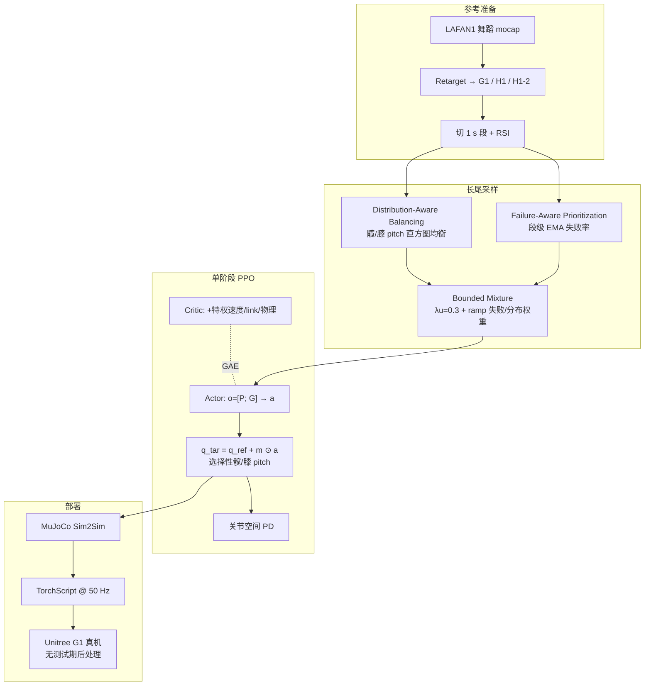

# RobotDancing（残差动作长时程人形运动追踪，2025/2026）

**RobotDancing: Residual-Action Reinforcement Learning Enables Robust Long-Horizon Humanoid Motion Tracking**（Zhenguo Sun*、Yibo Peng* 等；慕尼黑工业大学 / 北京智源 / XYZ Embodied AI / 清华大学 / 南京大学；[arXiv:2509.20717](https://arxiv.org/abs/2509.20717)，**IEEE Robotics and Automation Letters 已接收**）提出可复用的 **per-sequence** 单阶段 PPO 配方：用**参考条件残差关节目标**补偿 retarget 参考与机器人真实动力学之间的失配，使长时程高动态舞蹈在 Unitree G1 上零样本可部署。

> 本页原为 Paper Notebooks **深读索引 stub**；2026-08-05 据 arXiv **v2（RA-L 接收稿）** 升格为完整实体页（原地升级，未新建重复节点）。姊妹仓库[深读笔记](https://imchong.github.io/Humanoid_Robot_Learning_Paper_Notebooks/papers/13_Physics-Based_Animation/RobotDancing__Residual-Action_RL_Enables_Robust_Long-Horizon_Motion_Tracking/RobotDancing__Residual-Action_RL_Enables_Robust_Long-Horizon_Motion_Tracking.html)仍可作阅读辅线。

## 一句话定义

RobotDancing 不让策略重合成绝对关节轨迹，而是在 retarget 参考上预测有界残差（默认只改双侧髋/膝 pitch），再用分布均衡与失败优先混合采样覆盖长尾难段，从而在同一套训练–部署配方下把多分钟高能舞蹈零样本落到 G1。

## 英文缩写速查

| 缩写 | 英文全称 | 简要说明 |
|------|----------|----------|
| RA | Residual Action | 叠在参考关节目标上的有界修正量 $a$ |
| PPO | Proximal Policy Optimization | 单阶段策略优化算法 |
| AAC | Asymmetric Actor-Critic | actor 仅板载观测，critic 用特权状态 |
| RSI | Reference State Initialization | 从参考态起步并加小扰动的 episode 初始化 |
| DR | Domain Randomization | 质量/摩擦/PD/延迟等随机化以利零样本 |
| LAFAN1 | LAFAN1 Dance Motions | 本文 8 段长舞蹈参考数据源 |
| MPBPE | Mean Per-Body Position Error | 体段位置跟踪误差（mm） |
| MPJPE | Mean Per-Joint Position Error | 关节位置跟踪误差（mrad） |
| G1 | Unitree G1 Humanoid | 主真机与跨动作评测平台 |

## 为什么重要

- **把长时程失败归因钉死在动力学失配**：不是「舞蹈太难」，而是参考运动学可行、对机器人动力学不一致，绝对动作跟踪会把小误差滚成跌倒。
- **动作表示比堆训练阶段更划算**：相对分阶段课程或测试期后处理，残差参数化把学习目标从「重演整段 motion」收成「补偿失配」——工程上更短、更可复现。
- **选择性残差是稳定性启发式**：对所有 DoF 开残差未必更好；论文显示扩大残差权威常降局部 MPJPE，却损害完成率——掩码是鲁棒优先，不是精度最优。
- **采样课程可迁移**：长尾舞蹈上「均匀探索底 + 分布均衡 + 失败优先」的有界混合，比单一优先采样更稳，可搬到其他长序列追踪。

## 核心信息

| 字段 | 内容 |
|------|------|
| 机构 | 慕尼黑工业大学（TUM）；北京智源人工智能研究院（BAAI）；XYZ Embodied AI；清华大学；南京大学 |
| 发表 | arXiv v1 2025-09-25 → v2 2026-08-03；**IEEE RA-L 接收**（accepted 2026-08-01） |
| 平台 | Unitree G1（主）；H1 / H1-2（跨平台） |
| 数据 | 8 段完整 LAFAN1 舞蹈（retarget 到三形态） |
| 动作维 | G1 / H1-2 / H1：**23 / 21 / 19**；残差索引分别为 `[0,3,6,9]` / `[1,3,7,9]` / `[2,3,7,8]`（双侧髋/膝 pitch） |
| 控制 | 仿真 500 Hz / 策略 50 Hz；真机 Orin NX TorchScript @ 50 Hz |
| 训练 | PPO MLP `[512,256,128]`；8192 envs；RTX 4090；终策略约 20K iter |
| 开源 | **未见官方代码/项目页**（截至 2026-08-05）；附录提及配置文件但无公开 URL |
| 深读笔记 | [Paper Notebooks · RobotDancing](https://imchong.github.io/Humanoid_Robot_Learning_Paper_Notebooks/papers/13_Physics-Based_Animation/RobotDancing__Residual-Action_RL_Enables_Robust_Long-Horizon_Motion_Tracking/RobotDancing__Residual-Action_RL_Enables_Robust_Long-Horizon_Motion_Tracking.html) |

## 流程总览

## 核心原理（方法）

### 1）问题形式：跟踪即纠正

离散时间 POMDP；actor 观测 $O_t=\Psi(P_t,G_{t+1})=[P_t;G_{t+1}]$。策略输出残差后：

$$
q^{\mathrm{tar}}_{t}=q^{\mathrm{ref}}_{t+1}+a_{t},\qquad
\tau_{t}=\mathrm{PD}(q^{\mathrm{tar}}_{t},q_{t},\dot q_{t}).
$$

参考保留运动学骨架；有界残差专注驱动极限、摩擦、惯量、延迟与 retarget 误差。

### 2）选择性残差化

$$
\mathbf{q}^{\mathrm{tar}}_{t}=\mathbf{q}^{\mathrm{ref}}_{t+1}+\mathbf{m}\odot\mathbf{a}_{t}.
$$

- **入选**：双侧髋/膝 pitch（舞蹈中行程大、强影响支撑与 CoM）。
- **排除踝 pitch**：地面接触 + retarget 失配时，绕参考纠偏易失稳。
- **躯干/臂残差**：可降局部关节误差，但常损全局鲁棒——掩码按稳定性启发式取舍。

### 3）奖励与课程

$r_t=r_t^{\mathrm{track}}-s_{\mathrm{pen}}(t)\,r_t^{\mathrm{reg}}$。Tracking 覆盖 body/root/feet/keypoint/joint/velocity/contact 等高斯核项；正则含力矩、动作平滑、限位、接触力与终止惩罚。惩罚尺度与 motion-far 阈值随课程收紧；DR 覆盖 push、质量、摩擦、PD、力矩 RFI、0–2 步控制延迟。

### 4）采样：均衡 × 失败 × 均匀底

最终段概率混合均匀、分布均衡与失败先验，并做 clip + 归一化防塌缩到少数难段。终评用**确定性固定起点**，与训练采样器解耦。

## 工程实践

| 项 | 做法 |
|----|------|
| 配方粒度 | **一条参考一个策略**；观测/奖励/超参跨序列复用 |
| 残差尺度 | action scale **0.25**，clip 100；位置/速度/力矩投影到平台限位 |
| 部署路径 | 仿真训练 → MuJoCo 验证 → TorchScript → Orin NX 50 Hz；**无**测试期滤波或动作重缩放 |
| 复现锚点 | Appendix 给出奖励 σ、PPO、DR、采样 λ 与残差索引；缺公开仓时需自建 Isaac/MuJoCo 栈 |
| 源码运行时序图 | **不适用**（截至 2026-08-05 无官方可运行仓库） |

## 实验与评测

### 跨动作残差对比（Table III）

SELECTIVE 相对绝对动作基线（NONE）：$E_{g\text{-}mpbpe}$ / $E_{mpbpe}$ / $E_{mpjpe}$ 分别降 **15.7% / 18.2% / 20.5%**，且多数位置误差优于 ALL-DOF 残差；时间分箱显示末段误差堆积明显缓解。

### 同协议基线（Table V，dance1_subject2，131.5 s）

| Method | Fixed completion ↑ | Start-zero ↑ |
|--------|--------------------|--------------|
| ASAP-style（作者重实现） | 3.3% | 5.7 s |
| KungfuBot-style（作者重实现） | 4.3% | 13.5 s |
| **RobotDancing** | **97.7%** | **131.5 s** |

> 引用时须标明：ASAP / KungfuBot 行为作者同协议重实现，**不是**原论文报告值。

### 掩码与采样消融

- Table VI：SELECTIVE 完成率/存活最高；加踝或全身残差可压 MPJPE，但完成率下降——**鲁棒 ≠ 局部精度最优**。
- Table VII：Combined 采样在 30 s 阈值成功与后期存活上优于 Failure-only / Distribution-only / Uniform RSI。

### 真机与跨平台

- G1：**21/24（87.5%）** 全程成功；失败集中在接触丰富的 floor-to-stand 等难窗（与失败采样高 EMA 段对齐）。
- H1 仿真 start-zero 与 G1 同达全程；H1-2 约 34 s 因 motion-far 停——移植可行但精度隙仍在；H1/H1-2 **真机仅为定性**。

## 结论

**RobotDancing 的关键判断是：长时程高动态追踪上，「参考 + 选择性残差」比绝对动作或盲目全 DoF 残差更稳——真正吃紧的是动力学失配补偿与难段采样，而不是再堆一个训练阶段。**

1. **动作表示是一阶杠杆** — $q^{\mathrm{tar}}=q^{\mathrm{ref}}+a$ 把误差累积从「重演失败」变成「可学的小修正」；八动作聚合位置误差相对绝对基线降约 16–20%。
2. **选择性掩码服务鲁棒** — 只开髋/膝 pitch；扩大残差权威常换局部精度、丢完成率，部署应按存活率选型而非只看 MPJPE。
3. **采样要同时覆盖稀有姿态与顽固失败** — 分布均衡补长尾，失败优先啃难窗，有界混合防塌缩；Combined 在长序列消融上最强。
4. **工程可读信号强** — 单阶段、统一超参、无测试期后处理、G1 21/24 零样本；但 **per-sequence** 配方不是通用 tracker。
5. **复现边界** — 未见官方代码；H1/H1-2 硬件证据弱；失败诊断缺同步接触/力矩遥测。选型时把它当「长参考追踪配方」而非「多技能基础模型」。

## 局限与风险

- **非通用跟踪器**：多模态参考、跨动作采样干扰、相位/身份推断均未解决。
- **掩码启发式**：换平台/换动作分布需重选残差 DoF，不能当普适超参。
- **基线对比口径**：Table V 的 ASAP/KungfuBot 为重实现，不可直接与原论文表格横比。
- **开源缺口**：无项目页/GitHub；附录「released config」无 URL，外部复现成本高。

## 与其他页面的关系

- 分类父节点：[paper-notebook-category-13-physics-based-animation](../overview/paper-notebook-category-13-physics-based-animation.md)
- 总索引：[humanoid-paper-notebooks-index](../overview/humanoid-paper-notebooks-index.md)
- 残差谱系枢纽：[Residual Policy Learning](../methods/residual-policy-learning.md)
- 同栈对照：[ASAP](./paper-notebook-asap-aligning-simulation-and-real-world-physics.md)、[KungfuBot](./paper-notebook-kungfubot-physics-based-humanoid-whole-body-cont.md)
- 残差近邻：[RuN](./paper-notebook-run-residual-policy-for-natural-humanoid-locomot.md)（生成先验 + 残差走跑）、[ResMimic](./paper-resmimic.md)（GMT + 物体条件残差）
- 概念：[Motion Retargeting](../concepts/motion-retargeting.md)、[Sim2Real](../concepts/sim2real.md)、[Domain Randomization](../concepts/domain-randomization.md)
- 平台：[Unitree G1](./unitree-g1.md)

## 参考来源

- [robotdancing_arxiv_2509_20717.md](../../sources/papers/robotdancing_arxiv_2509_20717.md) — 本次 arXiv v2 / RA-L 稿主归档
- [humanoid_pnb_robotdancing.md](../../sources/papers/humanoid_pnb_robotdancing.md) — Paper Notebooks 深读锚点
- 论文：<https://arxiv.org/abs/2509.20717>（v2 HTML：<https://arxiv.org/html/2509.20717v2>）
- 深读笔记：<https://imchong.github.io/Humanoid_Robot_Learning_Paper_Notebooks/papers/13_Physics-Based_Animation/RobotDancing__Residual-Action_RL_Enables_Robust_Long-Horizon_Motion_Tracking/RobotDancing__Residual-Action_RL_Enables_Robust_Long-Horizon_Motion_Tracking.html>

## 推荐继续阅读

- Sun et al., *RobotDancing*, arXiv:2509.20717（IEEE RA-L）：<https://arxiv.org/abs/2509.20717>
- I-CTRL（有界残差追踪近邻）：<https://arxiv.org/abs/2405.08726>
- ASAP：<https://arxiv.org/abs/2502.01143>；KungfuBot：<https://arxiv.org/abs/2506.12851>
- LAFAN1 retarget（Unitree G1/H1/H1-2，Hugging Face，论文引用）：检索 `LAFAN1 Retargeting Dataset`
