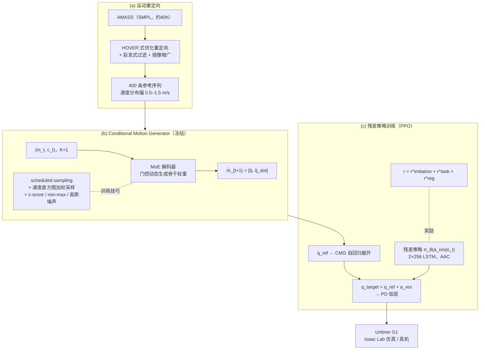

# RuN（Residual Policy for Natural Humanoid Locomotion，2025）

**RuN: Residual Policy for Natural Humanoid Locomotion**（Qingpeng Li, Chengrui Zhu, Yanming Wu, Xin Yuan, Zhen Zhang, Jian Yang, Yong Liu；浙江大学 / 中国机械装备研发院，2025，[arXiv:2509.20696](https://arxiv.org/abs/2509.20696)）提出**解耦残差学习框架**：预训练 **Conditional Motion Generator（CMG）** 自回归生成运动学自然的动作先验并**冻结**，轻量残差策略只学习叠加在 CMG 输出上的动力学修正量 $q_{\text{target}}=q_{\text{ref}}+a_{\text{res}}$，把「模仿自然性、动态稳定性、速度跟踪」三目标解耦。Unitree G1 真机实现 **0–2.5 m/s** 连续走跑与平滑步态切换。

> 本页原为 Paper Notebooks **planned 索引实体**；2026-07-28 随 Residual Policy 谱系 ingest 升格为完整实体页（原地升级，未新建重复节点）。姊妹仓库深读笔记完成后应互链。

## 英文缩写速查

| 缩写 | 英文全称 | 简要说明 |
|------|----------|----------|
| RuN | Residual Policy for Natural Humanoid Locomotion | 本文框架：CMG 先验 + 残差策略 |
| CMG | Conditional Motion Generator | 自回归运动生成器，按速度命令产生自然步态先验 |
| GMP | Generative Motion Prior | Zhang et al. 生成式运动先验基线（cVAE + 跟踪奖励） |
| AMP | Adversarial Motion Priors | 对抗判别器风格奖励基线 |
| PPO | Proximal Policy Optimization | 残差策略训练算法 |
| AAC | Asymmetric Actor-Critic | actor 只用板载观测、critic 用特权全状态 |
| MoE | Mixture-of-Experts | CMG 骨干的门控混合专家结构（源自 Motion VAE 解码器设计） |
| FID | Fréchet Inception Distance | 生成动作与参考人动作分布距离（越低越自然） |
| AMASS | Archive of Motion Capture as Surface Shapes | CMG 训练用人体动作数据集（约 40 h） |
| DR | Domain Randomization | 摩擦/质量/PD 增益/电机摩擦/控制延迟随机化 |

## 为什么重要

- **指出 direct-tracking 的三目标耦合病**：GMP 等范式让单个策略同时学「模仿运动学风格、维持动态稳定、执行速度命令」，目标互相牵制、探索空间大；RuN 用 CMG 冻结先验 + 残差把三目标**结构性解耦**——先验管自然、残差管稳定与任务。
- **Residual 谱系的现代 G1 形态**：与 [ResMimic](./paper-resmimic.md)（GMT + 任务残差）并列为「运动先验打底 + 轻量残差」在 Unitree G1 上的两个代表；RuN 的先验是**生成器**（CMG）而非跟踪策略（GMT）。
- **消融证据完整**：w/o CMG、w/o Residual、w/o AAC 与三个奖励消融逐项拆解，证明残差机制与 AAC 对「自然性 + 任务」双优缺一不可；FID 指标把「自然性」从观感变成可比数字。
- **工程可迁移性**：CMG 去 VAE 化（弃 encoder 与随机潜变量、MoE 解码器、K=1 一阶自回归），规避训练不稳与 posterior collapse，约 8 h 单卡 RTX 4090 训完残差策略——对人形运控团队是可参考的轻量管线。

## 核心原理（方法）

### 三段式框架

- **CMG**：$ \hat m_{t+1}=f_\theta(m_{t-K+1:t}, c_t)$，MSE 训练；弃用 MVAE 的 encoder/潜变量（减参数、避免 posterior collapse）；门控 MoE 按输入动态混合专家权重生成骨干层参数；K=1（关节位置+速度已含足够动力学信息）；scheduled sampling 抗自回归误差累积、速度直方图加权对抗数据分布失衡。
- **残差策略**：actor 观测 $o_t=[\omega,g,c,q,\dot q,a_{t-1}]$（仅板载+命令）；critic 加特权 $[v_t, m_t]$（基座线速度 + CMG 运动特征）；奖励 imitation（qpos $1.0\cdot e^{-0.6\|\cdot\|^2}$、qvel $0.2\cdot e^{-0.5\|\cdot\|^2}$）+ task（lin $2.0\cdot e^{-2\|\cdot\|^2}$、ang $0.5\cdot e^{-\|\cdot\|^2}$）+ 13 项正则（termination −200、姿态、能耗、action rate/smoothness、关节限位、脚滑等）。
- **训练配置**：Isaac Lab，50 Hz 控制 / 200 Hz 物理；命令 $v_x\in[0,2.5]$、$v_y\in[-0.3,0.3]$、$\omega_z\in[-0.5,0.5]$；策略/价值各 2×256 LSTM；单卡 RTX 4090 约 8 h 收敛；DR 覆盖摩擦、质量（25–35 kg）、PD 增益、电机摩擦、0–20 ms 控制延迟。

## 实验与评测

- **生成器对比（Table III）**：CMG FID **0.5283** / $\mathcal L_{rec}$ **0.1556**，优于 GMP 的 0.6637 / 0.2514。
- **策略对比（Table IV）**：RuN 在自然性（FID **0.8753**）与模仿误差（$E_{qpos}$ **3.8321**、$E_{qvel}$ **36.782**）上全面最优；Humanoid-Gym 的 $E_{vel}$ 略低（0.2732 vs 0.2873）但 FID 高达 3.8654（动作极不自然）——RuN 在任务与风格间取得最佳平衡；学习曲线显示收敛更快、终回报更高。
- **消融（Table V）**：w/o CMG → 自然性崩（FID 2.66）但速度跟踪反而略好（过优化任务）；w/o Residual（改直接跟踪，类 GMP）与 w/o AAC 全面退化；去 $r^{qpos}$ 运动质量灾难性失败（FID 4.06）；去 $r^{task}$ 任务失败（$E_{vel}$ 1.69）。
- **真机（Q3）**：Isaac Lab 训练策略**直接部署** G1，0–2.5 m/s 全程动态平衡，加减速间走↔跑平滑切换，无可见停顿/顿挫；姿态/步频/协调性接近人类。

## 源码运行时序图

**不适用**（截至 2026-07-28，arXiv 论文与 Hugging Face 论文页均未给出官方代码或项目页）。可参照的同栈实现：Isaac Lab + HOVER 式重定向 + PPO（LSTM actor-critic）管线，与 [holosoma](./holosoma.md) 等 Amazon FAR 开源栈在训练侧同构（重定向 → 仿真 PPO → G1 部署）。

## 结论

**宽速度域自然走跑上，「冻结生成式运动先验 + 轻量残差」优于让单策略直接跟踪：残差把探索空间收窄到动力学修正量级，训练更快、FID/模仿误差/任务三项同时更好；Humanoid-Gym 式裸 RL 只能在牺牲自然性的前提下换来略低的速度误差。**

1. **解耦是核心收益** — 消融显示 CMG 管自然性（去掉 FID 崩）、残差管任务-自然平衡（去掉全面退化）、AAC 管真机可迁移（去掉退化）；三者缺一即失衡。
2. **CMG 设计可抄** — 去 VAE 化 + MoE 解码器 + K=1 自回归 + scheduled sampling + 速度加权采样；规避了 cVAE 训练不稳与 posterior collapse。
3. **残差形式是关节目标级** — $q_{\text{target}}=q_{\text{ref}}+a_{\text{res}}$ 直接加在 PD 目标角上，真机物理可执行（区别于 [RFC](./paper-rfc-residual-force-control.md) 的仿真特权外力）。
4. **奖励权重锚点** — imitation:task ≈ 1:2（qpos 1.0 vs lin 2.0）；去 qpos 奖励自然性即崩，说明「自然性奖励一阶、任务奖励引导」的权重排序。
5. **部署配置锚点** — 50 Hz 控制 / 200 Hz 物理、LSTM 2×256、4090 约 8 h、DR 含 0–20 ms 延迟；是 G1 走跑任务的实用参考预算。

## 常见误区或局限

- **先验覆盖即能力上限**：CMG 只学了走/跑分布（数据集偏 0.5–1.5 m/s）；先验未覆盖的动作（不平地形、感知耦合）不在框架能力内——作者将不平地形与感知-控制耦合列为未来工作。
- **任务范围窄**：仅速度命令跟踪；无全身操作、无手臂任务（对比 [ResMimic](./paper-resmimic.md) 的物体条件残差）。
- **未开源**：截至入库日无官方代码/项目页；复现需自建 CMG + 残差管线。
- **评估协议注意**：FID/$E_{qpos}$/$E_{qvel}$ 都在「同命令下与参考分布比较」，直接跟踪基线天然吃亏；速度跟踪误差上裸 RL（Humanoid-Gym）仍略优，引用时需说明权衡而非单方面领先。

## 与其他工作对比

| 维度 | RuN | [ResMimic](./paper-resmimic.md) | GMP | AMP | Humanoid-Gym |
|------|-----|----------------------------------|-----|-----|---------------|
| base 先验 | CMG（生成器，冻结） | GMT（跟踪策略，冻结） | cVAE 生成器 | 判别器风格奖励 | 无 |
| 残差形式 | 关节目标修正 | 关节动作修正（物体条件） | 无（直接跟踪） | 无 | 无 |
| 三目标解耦 | **结构解耦** | 结构解耦 | 耦合于单策略 | 耦合于单策略 | 只做任务 |
| FID ↓ | **0.8753** | — | 1.1874 | 2.8204 | 3.8654 |
| 训练效率 | 最快 | ~1300 iter（sim-to-sim） | 中 | 中 | 慢 |
| 真机 | G1 0–2.5 m/s | G1 搬运 4.5–5.5 kg | — | — | G1（不自然） |
| 开源 | 未开源 | 已开源 | — | — | 已开源 |

## 与其他页面的关系

- 分类父节点：[paper-notebook-category-05-locomotion](../overview/paper-notebook-category-05-locomotion.md)
- 总索引：[humanoid-paper-notebooks-index.md](../overview/humanoid-paper-notebooks-index.md)
- 方法枢纽：[Residual Policy Learning](../methods/residual-policy-learning.md)
- 同谱系：[RFC](./paper-rfc-residual-force-control.md)（仿真特权力残差）、[ResMimic](./paper-resmimic.md)（GMT+物体条件残差）
- 平台：[Unitree G1](./unitree-g1.md)；任务：[Locomotion](../tasks/locomotion.md)

## 参考来源

- [humanoid_pnb_run-residual-policy-for-natural-humanoid-locomot.md](../../sources/papers/humanoid_pnb_run-residual-policy-for-natural-humanoid-locomot.md)
- [Residual Policy / Residual RL 论文精读清单摘录](../../sources/personal/residual-policy-reading-list.md)
- [Robot Learning Paper Notebooks · PROGRESS.md](https://github.com/ImChong/Robot_Learning_Paper_Notebooks/blob/main/papers/PROGRESS.md)
- Li et al., *RuN: Residual Policy for Natural Humanoid Locomotion*, arXiv:2509.20696, 2025. <https://arxiv.org/abs/2509.20696>

## 推荐继续阅读

- 论文：<https://arxiv.org/abs/2509.20696>
- GMP（基线先验）：<https://arxiv.org/abs/2503.09015>
- HOVER（重定向方法来源）：<https://arxiv.org/abs/2410.21229>
- [Paper Notebooks 阅读进度（PROGRESS.md）](https://github.com/ImChong/Robot_Learning_Paper_Notebooks/blob/main/papers/PROGRESS.md)
