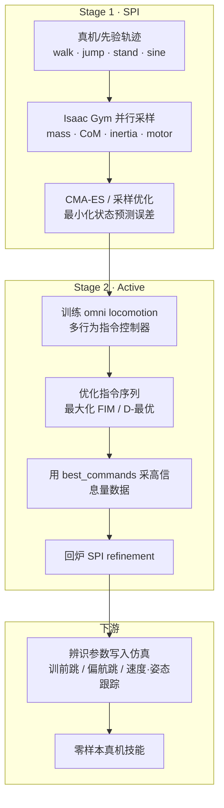
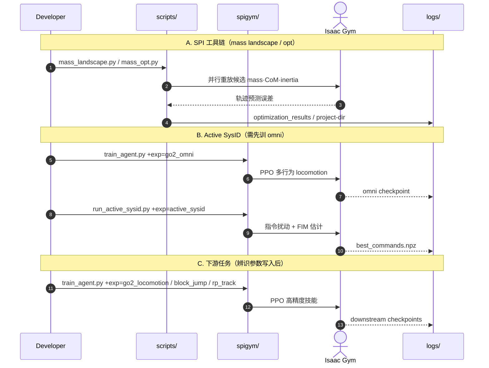

# SPI-Active（采样式 SysID + 主动探索）

**SPI-Active**（*Sampling-Based System Identification with Active Exploration for Legged Robot Sim2Real Learning*，arXiv:[2505.14266](https://arxiv.org/abs/2505.14266)，[项目页](https://lecar-lab.github.io/spi-active_/)，[代码](https://github.com/LeCAR-Lab/SPI-Active)）是 CMU / LeCAR 提出的 **两阶段腿足系统辨识** 框架（CoRL 2025 Oral）：用 GPU 大规模并行采样最小化仿真–真实轨迹误差，再优化探索策略指令以最大化 Fisher 信息，从而辨识关键物理参数并支撑高精度 locomotion 的零样本 sim2real。深读笔记见 [Paper Notebooks](https://imchong.github.io/Humanoid_Robot_Learning_Paper_Notebooks/papers/10_Sim-to-Real/SPI-Active__Sampling-Based_System_Identification_with_Active_Exploration/SPI-Active__Sampling-Based_System_Identification_with_Active_Exploration.html)。

## 一句话定义

用 **采样式参数辨识（SPI）** 反推腿足质量–惯量与电机参数，并用 **主动探索（最大化 FIM）** 专门采集「最能暴露参数」的数据，替代盲目域随机化以换取高精度技能迁移。

## 英文缩写速查

| 缩写 | 英文全称 | 简要说明 |
|------|----------|----------|
| SPI | Sampling-based Parameter Identification | 本文 Stage-1：GPU 并行采样最小化轨迹误差 |
| SysID | System Identification | 系统辨识：从数据反推物理/执行器参数 |
| FIM | Fisher Information Matrix | Fisher 信息矩阵，刻画参数可辨识程度 |
| DR | Domain Randomization | 域随机化：扩大仿真参数分布以求鲁棒 |
| CMA-ES | Covariance Matrix Adaptation Evolution Strategy | 无梯度进化优化，用于 SPI / Active |
| CoM | Center of Mass | 质心；本仓目标辨识量之一 |
| Sim2Real | Simulation to Real | 仿真训练、真机部署的迁移主线 |
| PPO | Proximal Policy Optimization | 下游 locomotion / omni controller 常用算法 |

## 为什么重要

- **高精度技能对参数极敏感：** 精准落点跳跃等任务上，差一点动力学参数就会偏几十厘米；DR 常换来保守策略，传统 SysID 又常假设可微动力学与直接力矩测量——富接触腿足上不成立。
- **把「采什么数据」一并优化：** Active 阶段以 D-最优（最大化 FIM）优化指令序列，专门激发高扭矩、高信息量步态，再回炉 refinement。
- **工程可复用入口：** 官方 [LeCAR-Lab/SPI-Active](https://github.com/LeCAR-Lab/SPI-Active) 已放出 SPI 工具、Active SysID 与下游训练脚本（Isaac Gym + Hydra）；适合作为新平台辨识流水线的起点。
- **与同实验室其他路线正交：** [FADA](./paper-fada-humanoid.md) 做执行层少样本适应；SPI-Active 做 **仿真参数先对齐**——可上下叠加。

## 流程总览

## 核心机制

### 1）Stage-1 SPI：采样式参数辨识

- **目标参数（公开仓当前口径）：** Unitree Go2 的 **base mass、CoM、惯量**，以及模块化 **电机动力学模型**（如 `act2tau_vec3_tanh`）。
- **优化：** 在 GPU 并行环境中采样候选参数，最小化仿真重放与真实轨迹的状态误差；**CMA-ES / Bayesian 采样** 天然适配不可微接触。
- **前提放松：** 不要求可微动力学、不要求关节力矩传感器——标准状态轨迹即可。
- **工具入口：** `scripts/mass_landscape.py`、`scripts/mass_opt.py`、`scripts/data/*.py`（见 [仓库归档](../../sources/repos/spi-active.md)）。

### 2）Stage-2 Active：最大化 Fisher 信息

1. 训练多行为 **omni locomotion controller**（Walk These Ways 风格，`+exp=go2_omni`）。
2. 用 `spigym/run_active_sysid.py` 优化指令序列（默认优化 `lin_vel_x`、`ang_vel_yaw`、`gait_phase`），目标为最大化 FIM。
3. 输出 `best_commands.npz`；用优化命令采集数据后，再跑 SPI refinement。
4. 配置关键：`active_sysid.yaml`（迭代数、horizon、采样模式）、`active_sysid_openloop.yaml`（`default_param`、`exploration_params`、`delta_param`）。

### 3）下游高精度技能

辨识后的参数写入仿真，再训 / 评估：

| 任务 | Hydra 入口（摘要） |
|------|-------------------|
| 速度跟踪 | `+exp=go2_locomotion` |
| 前跳 / 偏航跳 | `+exp=go2_block_jump` + 对应 rewards |
| Roll–Pitch 姿态跟踪 | `+exp=go2_rp_track` |

项目页另展示 open-loop weave pole 导航与 **G1 人形** 速度跟踪泛化。

## 核心信息

| 字段 | 内容 |
|------|------|
| 机构 | 卡内基梅隆大学（CMU）/ LeCAR Lab |
| 会议 | CoRL 2025 Oral |
| arXiv | <https://arxiv.org/abs/2505.14266> |
| PMLR | <https://proceedings.mlr.press/v305/sobanbabu25a.html> |
| 项目页 | <https://lecar-lab.github.io/spi-active_/> |
| 源码 | <https://github.com/LeCAR-Lab/SPI-Active> |
| 仿真栈 | Isaac Gym Preview 4 · Python 3.8 · uv · Hydra |
| 主平台 | Unitree Go2（含负载实验）；G1 配置/泛化线索 |
| Paper Notebooks | [10_Sim-to-Real 深读笔记](https://imchong.github.io/Humanoid_Robot_Learning_Paper_Notebooks/papers/10_Sim-to-Real/SPI-Active__Sampling-Based_System_Identification_with_Active_Exploration/SPI-Active__Sampling-Based_System_Identification_with_Active_Exploration.html) |

## 源码运行时序图

复现主路径：先装 Isaac Gym Preview 4 + `uv sync`，用 `scripts/mass_*` 或 Active 管线得到参数，再按 `downstream_tasks.md` 训下游任务。**真机部署桥与 Dataset Replay 截至入库日仍待官方发布。**

## 工程实践

| 步骤 | 入口 / 注意 |
|------|-------------|
| 环境 | Ubuntu 22.04、Python 3.8、`uv`、Isaac Gym Preview 4 |
| SPI 质量景观 / 优化 | `scripts/mass_landscape.py`、`scripts/mass_opt.py`（`--config all --horizon 5`） |
| 采数脚本 | `scripts/data/{walk,jump,stand,sine}.py`；`walk.py` 需放入 `unitree_rl_gym` |
| Omni 控制器 | `spigym/train_agent.py +exp=go2_omni`，建议约 **10k** iterations |
| Active 优化 | `spigym/run_active_sysid.py`；`num_envs≥1024`；输出 `best_commands.npz` |
| 下游训练 | 见仓库 `spigym/envs/downstream_tasks.md` |
| 电机模型扩展 | 模块化 motor model 类，继承 base env，便于换参数化 |

### 开源状态（2026-07-31 核查）

| 模块 | 状态 |
|------|------|
| SPI 辨识代码 | **已开源** |
| Active Exploration | **已开源** |
| Downstream task training | **已开源** |
| Dataset Replay and Visualize | **待发布** |
| Sim2real 部署 | **待发布** |

许可：README / `pyproject.toml` 声明 **MIT**；GitHub license 元数据为空、根目录未见 `LICENSE` 文件——引用时以仓内声明为准并锁定 commit。

## 实验与评测

- **摘要主张：** 多类 locomotion 任务上相对基线提升 **42–63%**（项目页：Forward Jump / Yaw Jump / Velocity / Attitude Tracking）。
- **笔记/工程数字（策展）：** Go2 含约 **33%** 体重负载；前跳落点误差可至 ~**3.6 cm**；并在 G1 上做速度跟踪泛化演示。
- **开源仓自带 mass-opt 示例：** GT base mass **6.921 kg** → 最优 **7.006 kg**，best cost ≈ **0.028**（`config=all`，horizon=5，50 trials）。
- 完整消融、表格与视频以 [项目页](https://lecar-lab.github.io/spi-active_/) 与 [PDF](https://arxiv.org/pdf/2505.14266) 为准。

## 结论

**高精度腿足技能不该只靠 DR「把未知量全抖一遍」——应先把关键参数辨识出来，并把「采什么数据」一起做成最优实验设计。**

1. **两阶段闭环是主贡献** — SPI 用并行采样压轨迹误差；Active 用 FIM/D-最优优化指令，再 refinement。
2. **绕开传统 SysID 硬前提** — 无需可微动力学、无需力矩传感器；CMA-ES 适配富接触不可微系统。
3. **与 DR 的取舍清楚** — DR 以保守换鲁棒；本文以辨识换精度，代价是真机采数 + 主动探索算力。
4. **参数层偏 base 惯量 + 电机模型** — 与 [PACE](./paper-pace-sim2real-legged-robots.md)（悬空关节动力学）/[BAM](./paper-bam-extended-friction-servo-actuators.md)（舵机摩擦）互补，不是同一层。
5. **复现边界：部分开源** — SPI/Active/下游训练可用；Dataset Replay 与真机 Sim2real 桥仍待发布，勿假设「一键上真机」。
6. **部署读法** — 先 SysID 定中心，再视需要叠加窄范围 DR 或 [FADA](./paper-fada-humanoid.md) 式执行适应。

## 与其他工作对比

| 路线 | 辨识/对齐对象 | 数据协议 | 典型栈 | 相对 SPI-Active |
|------|----------------|----------|--------|-----------------|
| **SPI-Active** | base mass / CoM / 惯量 + 电机模型 | 轨迹误差 + **主动指令优化（FIM）** | Isaac Gym · Go2 | 本文 |
| **[PACE](./paper-pace-sim2real-legged-robots.md)** | 关节 armature/摩擦/延迟等 | 悬空 chirp + CMA-ES | Isaac Lab · ANYmal | 参数层不同；均强调辨识优于盲目动力学 DR |
| **[BAM](./paper-bam-extended-friction-servo-actuators.md)** | 舵机扩展摩擦 M1–M6 | 摆锤台架 | MuJoCo | 传动层解析模型 |
| **[SAGE](./sage-sim2real-actuator-gap-estimator.md)** | 不直接给参数 | 成对 sim/real 重放统计 | Isaac Lab | **度量** gap，可作辨识前画像 |
| **DR-only** | 不估计中心 | 大范围随机化 | 通用 | 易保守；SPI-Active 主张先辨识再随机 |

## 局限与风险

- **部分开源：** 真机部署与 Dataset Replay 未齐；复现论文全流程仍依赖作者未公开脚本或自研桥接。
- **栈绑定：** 公开实现锚定 **Isaac Gym Preview 4 + Python 3.8**；与当前主流 Isaac Lab 2.x 栈有迁移成本。
- **Active 采数说明未完：** `active_sysid.md` 中 Step 3–4（用 best commands 采数、接 SPI pipeline）仍标 Stay tuned。
- **平台默认 Go2：** 自定义机器人/电机模型文档称将陆续放出；G1 有配置线索但非完整教程。
- **激励不足仍会失败：** 若只用弱激励轨迹，FIM 再优化也救不了不可辨识参数——这是 SysID 共性风险。

## 与其他页面的关系

- [System Identification](../concepts/system-identification.md) — 腿足采样式 + 主动探索实例
- [Sim2Real](../concepts/sim2real.md) / [Domain Randomization](../concepts/domain-randomization.md) — 辨识 vs 盲目随机化的选型语境
- [CMA-ES](../methods/cma-es.md) — SPI / Active 共用的黑箱优化器
- [关节执行器参数辨识](../methods/joint-actuator-parameter-identification.md) — 本页偏质量/电机；关节 $I_a$/摩擦见方法页
- [Sim2Real Gap 缩减](../queries/sim2real-gap-reduction.md) — 刚体/执行器 gap 工具包入口
- [PACE](./paper-pace-sim2real-legged-robots.md)、[SAGE](./sage-sim2real-actuator-gap-estimator.md)、[FADA](./paper-fada-humanoid.md) — 对照与可组合路线
- 分类父节点：[paper-notebook-category-10-sim-to-real](../overview/paper-notebook-category-10-sim-to-real.md)
- 总索引：[humanoid-paper-notebooks-index](../overview/humanoid-paper-notebooks-index.md)

## 参考来源

- [sources/papers/spi_active_arxiv_2505_14266.md](../../sources/papers/spi_active_arxiv_2505_14266.md)
- [sources/repos/spi-active.md](../../sources/repos/spi-active.md)
- [sources/sites/spi-active.md](../../sources/sites/spi-active.md)
- [sources/papers/humanoid_pnb_spi-active.md](../../sources/papers/humanoid_pnb_spi-active.md)
- 深读笔记：<https://imchong.github.io/Humanoid_Robot_Learning_Paper_Notebooks/papers/10_Sim-to-Real/SPI-Active__Sampling-Based_System_Identification_with_Active_Exploration/SPI-Active__Sampling-Based_System_Identification_with_Active_Exploration.html>
- 论文：<https://arxiv.org/abs/2505.14266>

## 推荐继续阅读

- 项目页（含真机对比视频）：<https://lecar-lab.github.io/spi-active_/>
- 官方仓库：<https://github.com/LeCAR-Lab/SPI-Active>
- PMLR 正式版：<https://proceedings.mlr.press/v305/sobanbabu25a.html>
- Active SysID 指南（仓内）：`active_sysid.md`
