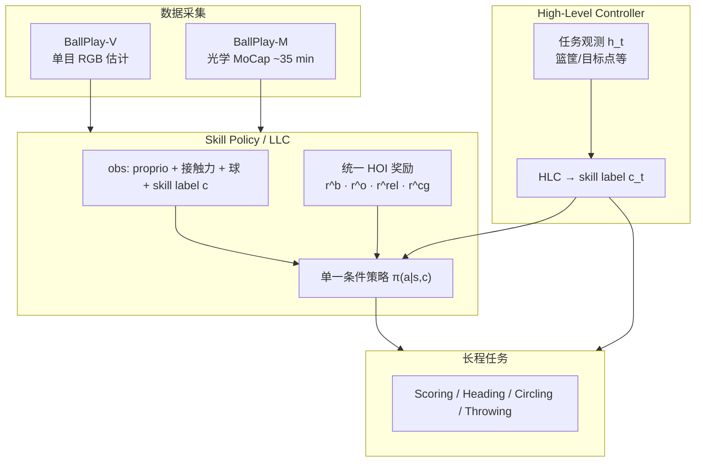
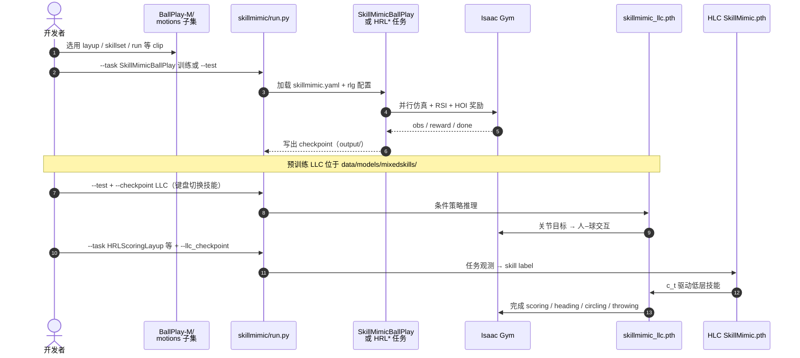

# SkillMimic（Learning Basketball Interaction Skills from Demonstrations）

**SkillMimic**（arXiv:[2408.15270](https://arxiv.org/abs/2408.15270)，**CVPR 2025 Highlight**；[项目页](https://ingrid789.github.io/SkillMimic/)，[代码](https://github.com/wyhuai/SkillMimic)）提出 **数据驱动、技能无关** 的 HOI 模仿范式：用 **统一配置** 模仿人–球状态转移，使物理仿真人形掌握运球、上篮、投篮等多样篮球技能，并由 **高层控制器（HLC）** 复用技能完成连续得分等长程任务。本页为知识库 **策展摘要**；姊妹仓库 [Humanoid Robot Learning Paper Notebooks](https://imchong.github.io/Humanoid_Robot_Learning_Paper_Notebooks/index.html) 深读笔记仍待撰写。

## 一句话定义

用 **统一 HOI 模仿奖励（含 Contact Graph）** 从演示学 **单一可切换多技能策略**，再以 **极简任务奖励的 HLC** 组合技能，避免为每个篮球交互手写专项 reward。

## 英文缩写速查

| 缩写 | 英文全称 | 简要说明 |
|------|----------|----------|
| HOI | Human–Object Interaction | 人–物（此处为人–球）交互状态与接触 |
| CG / CGR | Contact Graph / Contact Graph Reward | 接触图建模及其模仿奖励，约束精确交互接触 |
| HLC | High-Level Controller | 输出 skill label、组合低层技能完成任务 |
| LLC | Low-Level Controller | 条件化 skill policy，执行具体交互技能 |
| RSI | Reference State Initialization | 从参考轨迹状态初始化并行环境 |
| RL | Reinforcement Learning | Isaac Gym 并行 on-policy 训练技能与 HLC |
| ASE | Adversarial Skill Embeddings | 代码实现基座之一；可复用技能嵌入族 |

## 为什么重要

- **去掉逐技能手工奖励：** 传统交互 RL 为运球/上篮等分别设计 reward，难扩展；SkillMimic 用 **同一套模仿目标** 覆盖数据集内多样技能。
- **接触是交互的瓶颈：** 仅模仿身体或物体轨迹不够；**Contact Graph Reward** 消融显示对 Acc. / 物体 MPJPE / 接触误差关键。
- **技能可组合：** 单一 policy 支持 **平滑技能切换**（含参考中未出现的切换），HLC 用简单任务奖励即可做 heading / circling / scoring / throwing。
- **开源可跑：** 官方仓提供训练、评测、预训练权重与 BallPlay-M 子集，便于对照 [ASE](../methods/ase.md) / PhysHOI 族 HOI 模仿。
- **与篮球长程组合线对照：** 相对 [Learning to Ball](./paper-notebook-learning-to-ball.md) 的「多专家 + 软路由」，SkillMimic 强调 **统一模仿先学技能库，再 HLC 离散选技能**。

## 流程总览

## 核心机制（归纳）

### 技能定义与统一模仿

- **技能** = 一组参考 **HOI 状态转移**；仿真转移贴近参考即视为学会。
- **单一 policy**、**统一超参**；数据集增大则多样性与泛化提升（论文 pickup 随数据量改善的曲线）。
- 测试阶段 **可不喂参考**，依赖 RL 探索回到已学状态分布，故有一定 **出域恢复与零样本切换**。

### Contact Graph 与统一奖励

| 分量 | 含义 |
|------|------|
| \(r_t^{b}\) | 身体运动模仿 |
| \(r_t^{o}\) | 球运动模仿 |
| \(r_t^{rel}\) | 人–球相对几何 |
| \(r_t^{cg}\) | Contact Graph 接触模仿 |

- 相对「只跟身体 / 忽略接触」的模仿，CG 把 **交互与接触** 绑在一起；消融强调 **保留 CGR** 与奖励项 **乘法组合**（相对加法）对 GRAB / BallPlay-V 更关键。

### 分层复用（HLC）

- LLC 输入含 **skill label** \(c\)；HLC 读状态 \(s_t\) 与任务观测 \(h_t\)，输出 \(c_t\)。
- 任务奖励极简（相对为每个长程任务重写全身交互 reward）；项目页任务：运球到点、绕圈、上篮得分、抛球高度。

### 仿真与训练设定（工程级）

- **Isaac Gym** 大规模并行；**RSI** 每环境独立初始化；**固定最大 episode 长度** 平衡不同 clip 的奖励上界。
- 人形接近 **SMPL-X** 自由度；球半径约 12 cm，恢复系数与密度按篮球手感与训练稳定性设定。

## 源码运行时序图

官方仓 [wyhuai/SkillMimic](https://github.com/wyhuai/SkillMimic)（归档见 [sources/repos/skillmimic.md](../../sources/repos/skillmimic.md)）提供可运行训练 / 推理入口：

- **最短复现路径：** 安装 Isaac Gym → `conda` 环境 → 用仓库预训练 `skillmimic_llc.pth` 跑 `--test --task SkillMimicBallPlay` → 再带 `--llc_checkpoint` 跑某一 `HRL*` 任务。
- **大数据训练提示：** README 建议大 `--num_envs`（如 16384）并相应放大 `minibatch_size`。

## 工程实践

| 项 | 建议 |
|----|------|
| 开源边界 | **已开源** 训练/评测/预训练/BallPlay-M 子集/Blender；**完整原始数据与处理脚本仍 TODO** |
| 依赖 | 必须自行取得 **Isaac Gym Preview 4**（非 pip 默认可装） |
| 先跑通 | 先 LLC 推理与键盘切技能，再训/测 HLC |
| 对照实验 | 消融时优先动 **CGR / 奖励乘法**；换数据集时保持统一 cfg |
| 后续工作 | 稀疏噪声演示见外链 [SkillMimic-V2](https://github.com/Ingrid789/SkillMimic-V2)；动态 HOI 前作 [PhysHOI](https://github.com/wyhuai/PhysHOI) |

## 实验与评测

- **技能覆盖：** Jump Shot、Turnaround Layup、Layup、Rebound、多向 Dribble、Catch、Pass、Pickup 等（项目页）。
- **切换与鲁棒：** Layup↔Rebound、多技能链式切换；Get Up / Pick Up 恢复演示。
- **HLC：** Heading、Circling、Scoring（运球–上篮–篮板–重复）、Throwing。
- **消融（论文表级）：** 在 GRAB 与含噪声的 BallPlay-V 上，去掉 CGR 或乘法组合会明显降低 Acc.、抬高身体/物体 MPJPE 与 \(E_{cg}\)。
- **数据：** BallPlay-V 验证 **估计噪声下仍可学**；BallPlay-M 支撑统一配置的大规模技能与 HLC。

## 结论

**SkillMimic 把「可复用篮球交互技能」从逐技能奖励工程，收成统一 HOI 模仿 + 接触图 + 可选 HLC 组合；仿真动画证据充分，真机 humanoid 部署不在本文主线。**

1. **优先统一模仿，而不是为每个技能写 reward** — 技能随 BallPlay 数据扩展，配置保持一套。
2. **Contact Graph 不是装饰** — 消融显示 CGR 与奖励乘法对精确人–球接触关键。
3. **单一条件策略可切技能** — 测试可不依赖参考；切换可超出演示图结构。
4. **HLC 只选 skill label** — 长程任务用极简奖励，复杂度压在已学 LLC。
5. **复现从官方预训练走** — Isaac Gym + `run.py` + `skillmimic_llc.pth` / HLC ckpt；完整 BallPlay-M 仍待发布。
6. **选型对照** — 要「多专家拼连招」看 [Learning to Ball](./paper-notebook-learning-to-ball.md)；要「HOI 目标条件跟踪/生成」看 [InterMimic](./paper-bfm-15-intermimic.md) / [InterPrior](./paper-interprior.md)。

## 常见误区或局限

- **主证据在物理动画人形，不是 Unitree 真机篮球：** 作者含 Unitree，但论文/项目页展示为 **仿真 HOI**；勿直接当作真机部署菜谱。
- **完整数据集未齐：** 子集可训可演示；大规模复现与数据处理管线仍待官方 TODO。
- **依赖 Isaac Gym 闭源预览包：** 环境门槛高于纯 MuJoCo pip 栈。
- **HLC 技能空间受 LLC 覆盖限制：** 未在演示中出现、且 LLC 学不好的交互，高层无法「发明」出来。

## 与其他页面的关系

- 分类父节点：[paper-notebook-category-13-physics-based-animation](../overview/paper-notebook-category-13-physics-based-animation.md)
- 技能嵌入 / 代码基座：[ASE](../methods/ase.md)
- 分层控制背景：[Hierarchical Reinforcement Learning](../methods/hierarchical-reinforcement-learning.md)
- 模仿学习总览：[Imitation Learning](../methods/imitation-learning.md)
- HOI / 接触对照：[InterMimic](./paper-bfm-15-intermimic.md)、[InterPrior](./paper-interprior.md)
- 篮球长程组合对照：[Learning to Ball](./paper-notebook-learning-to-ball.md)

## 参考来源

- [skillmimic_arxiv_2408_15270.md](../../sources/papers/skillmimic_arxiv_2408_15270.md) — arXiv 一手策展摘录
- [humanoid_pnb_skillmimic-learning-basketball-interaction-skill.md](../../sources/papers/humanoid_pnb_skillmimic-learning-basketball-interaction-skill.md) — Paper Notebooks 进度锚点
- [skillmimic.md](../../sources/repos/skillmimic.md) — GitHub 仓库归档
- [ingrid789-skillmimic-github-io.md](../../sources/sites/ingrid789-skillmimic-github-io.md) — 项目页归档
- Wang et al., CVPR 2025. <https://arxiv.org/abs/2408.15270>

## 推荐继续阅读

- 项目页：<https://ingrid789.github.io/SkillMimic/>
- GitHub：<https://github.com/wyhuai/SkillMimic>
- PhysHOI：<https://github.com/wyhuai/PhysHOI>
- SkillMimic-V2：<https://github.com/Ingrid789/SkillMimic-V2>
- [ASE](../methods/ase.md) — 实现基座与技能嵌入背景
- [Paper Notebooks 13 分类](../overview/paper-notebook-category-13-physics-based-animation.md)
