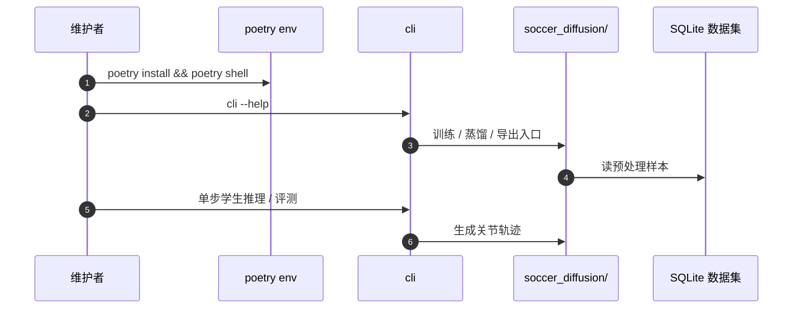

# SoccerDiffusion：从比赛录像学端到端人形足球

**SoccerDiffusion**（*Toward Learning End-to-End Humanoid Robot Soccer from Gameplay Recordings*，[arXiv:2504.20808](https://arxiv.org/abs/2504.20808)，[代码](https://github.com/bit-bots/SoccerDiffusion)）由 **汉堡大学 · Hamburg Bit-Bots** 提出：用 RoboCup Kid-Size 真机比赛 **ROS bag 录像** 训练 **transformer 扩散模型**，从视觉 / 本体 / 比赛状态直接生成关节命令轨迹，并用蒸馏压成 **单步推理** 以适配嵌入式机载。收录于 Paper Notebooks 分类 **05_Locomotion**（原 progress 待深读条目已在本库升格为完整实体）。

## 一句话定义

**不要先手写分层栈再学技能——直接从真实比赛录像用扩散模型克隆多模态控制分布，再蒸馏成可在 Wolfgang-OP 上实时跑的单步策略，作为后续 RL/偏好优化的基座。**

## 英文缩写速查

| 缩写 | 英文全称 | 简要说明 |
|------|----------|----------|
| DM | Diffusion Model | 学习多模态关节命令分布的生成模型 |
| DDIM | Denoising Diffusion Implicit Models | 采样算法；教师多步、学生单步 |
| BC | Behavioral Cloning | 从示范学策略；本文用扩散缓解均值坍缩 |
| IL | Imitation Learning | 无环境奖励的示范学习总类 |
| ResNet | Residual Network | 图像编码器骨干（ResNet-18） |
| APU | Accelerated Processing Unit | Wolfgang-OP 机载 Ryzen 7 5700U 推理目标 |
| ROS 2 | Robot Operating System 2 | 原始 mcap 比赛录像格式 |

## 为什么重要

- **端到端路线的数据侧入口：** 相对 PAiD / RoboNaldo 的仿真 RL 技能，本文吃的是 **真实联赛日志**，回答「现有栈产生的数据能否冒出可用行为」。
- **多模态动作分布：** 扩散相对点估计 BC，更适合比赛中的多解动作；蒸馏解决机载实时性。
- **开放资产完整：** 代码 MIT、数据集与预训练权重随项目发布（见项目页 / README）。
- **定位诚实：** 作者明确 **不追求超越** 现有手写栈，而是为 RL/PO 提供可微调基座；高层战术仍弱。

## 核心信息

| 项 | 内容 |
|----|------|
| **机构** | 汉堡大学（University of Hamburg）；汉堡比特机器人队（Hamburg Bit-Bots） |
| **平台** | Wolfgang-OP（Kid-Size）；Webots 仿真评测 |
| **数据** | RoboCup 2024 + German Open 2025 等 **88** 段录像，约 **15 h** / **908 min**；预处理后约 **340 GB** |
| **开源** | **已开源**（截至 **2026-07-28**）：[bit-bots/SoccerDiffusion](https://github.com/bit-bots/SoccerDiffusion)（MIT）；项目页 [bit-bots.github.io/SoccerDiffusion](https://bit-bots.github.io/SoccerDiffusion/) |

## 流程总览

## 核心机制（方法栈）

### 1）数据

- 关节/IMU 类 **50 Hz**，图像 **10 Hz** → **480×480**（训练时 ResNet 输入 **224×224**）。
- 比赛状态简化为允许移动 / 禁止 / 未知；2024 部分 IMU 从中间表示重建（仅 roll/pitch）。

### 2）架构

- 晚融合：关节、历史命令、姿态、图像各编码器 → 共享 latent；解码器预测噪声残差生成未来关节轨迹。
- 训练扩散步 **1000**，采样 **30** 步 DDIM；**不用** classifier-free guidance（跟 Pearce 等建议）。

### 3）蒸馏与执行

- 教师 30 步轨迹作目标，学生 **1 步** MSE；蒸馏时 **冻编码器、只训解码器**。
- 执行侧按推理耗时裁掉轨迹头部过期点，重叠滚动生成，近似训练时「瞬时推理」假设。

## 源码运行时序图

复现路径：Ubuntu 22.04/24.04 → `poetry install` → `cli`；可选 ROS 2 工具做 `recording2mcap`。项目仍标注 ongoing research。

## 与其他工作对比

| 维度 | SoccerDiffusion | PAiD / RoboNaldo | ARTEMIS |
|------|-----------------|------------------|---------|
| **监督** | 真机比赛 IL + 扩散 | 仿真 RL + MoCap/参考 | 分层模型 + 集中战术 |
| **目标** | 基座行为克隆 | 高精度踢球技能 | 联赛夺冠全栈 |
| **战术** | 弱 / 未涌现 | 单机技能 | 强（行为管理器） |
| **数据** | 公开比赛 bag | 自采 MoCap / 参考 | 工程系统 |

## 实验与评测

- **跌倒恢复：** 四方向各 10 次；真机总体 **95%**、仿真 **100%**（基线手写栈 100%）；详 Table 3。
- **行走/踢球：** 以定性为主（仿真与真机）；作者强调子系统难单独量化。
- **域偏移：** 训练无 Webots，但仿真行为仍可用，说明对域移有一定容忍。

## 结论

**SoccerDiffusion 证明：真实 RoboCup 日志足以支撑可部署的端到端运动基座，但还不能替代分层战术栈。**

1. **定位是基座不是冠军系统** — 用 IL 冒出行走/踢球/起身，再交给 RL/PO。
2. **扩散解决多模态，蒸馏解决实时** — 多步教师 + 单步学生是机载关键工程。
3. **数据同步与因果重采样决定上限** — 图像 1 Hz 的旧日志被剔除；预处理细节影响可复现性。
4. **读评测时看跌倒数字** — 目前最硬的量化是 stand-up；踢球/战术仍偏定性。
5. **与纵深路线 Stage 5 对齐** — 作为「端到端/生成式」分支入口，而非 Stage 3 踢球主线替代品。

## 局限与风险

- 高层战术与对抗决策 **有限**；不能当作完整球队软件。
- 部分 2024 IMU 不完整；跨队数据因时间未并入评测。
- 仓库标注 ongoing；接口与权重可能继续变动。

## 与其他页面的关系

- 任务：[Humanoid Soccer](../tasks/humanoid-soccer.md)
- 对照全栈：[ARTEMIS](./paper-notebook-a-hierarchical-model-based-system-for-high-perfo.md)
- 技能 RL 主线：[PAiD](./paper-notebook-learning-soccer-skills-for-humanoid-robots.md)
- 分类父节点：[paper-notebook-category-05-locomotion](../overview/paper-notebook-category-05-locomotion.md)
- 纵深：[人形足球 Stage 5](../../roadmap/depth-humanoid-soccer.md)

## 参考来源

- [humanoid_pnb_soccerdiffusion-toward-learning-end-to-end-human.md](../../sources/papers/humanoid_pnb_soccerdiffusion-toward-learning-end-to-end-human.md)
- [bit-bots-soccerdiffusion.md](../../sources/sites/bit-bots-soccerdiffusion.md)
- [soccerdiffusion.md](../../sources/repos/soccerdiffusion.md)
- 论文：<https://arxiv.org/abs/2504.20808>

## 推荐继续阅读

- 项目页：<https://bit-bots.github.io/SoccerDiffusion/>
- [Paper Notebooks PROGRESS（历史进度锚点）](https://github.com/ImChong/Robot_Learning_Paper_Notebooks/blob/main/papers/PROGRESS.md)
