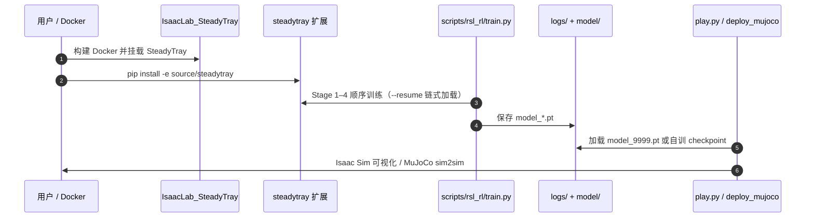

# SteadyTray：人形托盘运输中的残差 RL 物体平衡

**SteadyTray**（*Learning Object Balancing Tasks in Humanoid Tray Transport via Residual Reinforcement Learning*，[arXiv:2603.10306](https://arxiv.org/abs/2603.10306)，[项目页](https://steadytray.github.io/)）由 **加州大学圣地亚哥分校（UCSD）** 提出 **ReST-RL**：把 **双足行走** 与 **托盘载荷稳定** 显式解耦——稳健 **base locomotion policy** 负责移动，**残差模块**（Residual Action Adapter / Residual FiLM Adapter）主动抵消步态引起的末端抖动。在 **Unitree G1** 上经四阶段课程训练，仿真达 **96.9%** 变速跟踪成功率与 **74.5%** 外力扰动鲁棒性，并 **零样本 sim-to-real** 搬运多种物体。[代码](https://github.com/AllenHuangGit/steadytray) · [IsaacLab fork](https://github.com/AllenHuangGit/IsaacLab_SteadyTray)

## 一句话定义

**端托盘走路时，别用单体端到端硬学——在稳健行走策略上挂残差模块，专门抵消步态传到托盘的抖动，再用四阶段课程把特权教师蒸馏成可部署学生。**

## 英文缩写速查

| 缩写 | 英文全称 | 简要说明 |
|------|----------|----------|
| ReST-RL | Residual RL for Steady Tray | 本文分层残差强化学习框架 |
| RL | Reinforcement Learning | 策略梯度训练范式 |
| PPO | Proximal Policy Optimization | RSL-RL 训练算法 |
| FiLM | Feature-wise Linear Modulation | 残差 FiLM Adapter 调制方式 |
| G1 | Unitree G1 | 论文仿真与真机平台 |
| Sim2Real | Simulation to Real | 策略零样本真机迁移 |

## 为什么重要

- **托盘运输是 loco-manipulation 的高耦合特例：** 载荷未固定，步态振荡直接传到托盘；单体端到端 RL 易牺牲行走稳定性或托盘水平度。
- **残差解耦与 ResMimic 等同族但任务更窄：** 不重训全身，只在 **已有行走策略** 上补偿末端扰动，工程上更安全、更易蒸馏。
- **真机证据完整：** 项目页展示液体防洒、玻璃杯防倒、多物体泛化与外力恢复；仿真指标与真机视频一致口径。
- **全栈已开源：** 四阶段训练脚本、预训练 checkpoint、`MuJoCo` sim2sim 与 IsaacLab 定制 fork 均可复现。

## 核心信息

| 项 | 内容 |
|----|------|
| **机构** | 加州大学圣地亚哥分校（UCSD） |
| **作者** | Anlun Huang、Zhenyu Wu、Soofiyan Atar、Yuheng Zhi、Michael Yip |
| **平台** | Unitree G1；IsaacLab（定制 fork）+ MuJoCo sim2sim |
| **开源** | **已开源** — [steadytray](https://github.com/AllenHuangGit/steadytray) + [IsaacLab_SteadyTray](https://github.com/AllenHuangGit/IsaacLab_SteadyTray)；`model/model_9999.pt` 预训练学生 |
| **深读笔记** | [Robot Learning Paper Notebooks](https://imchong.github.io/Robot_Learning_Paper_Notebooks/papers/04_Loco-Manipulation_and_WBC/SteadyTray__Learning_Object_Balancing_Tasks_in_Humanoid_Tray_Transport_via_Resid/SteadyTray__Learning_Object_Balancing_Tasks_in_Humanoid_Tray_Transport_via_Resid.html) |

## 核心原理

### 分层残差架构

| 组件 | 作用 |
|------|------|
| **Base locomotion policy** | 预训练稳健全身行走，维持双足稳定 |
| **Residual encoder** | 编码特权 robot + payload 相关观测 |
| **Residual adapter** | 输出修正动作（Action Adapter 或 FiLM Adapter） |
| **合成控制** | base 动作 + 残差修正 → 托盘保持水平 |

推理时学生策略仅依赖可部署观测；教师阶段使用特权信息训练残差，再通过 **仅蒸馏 encoder**（adapter 冻结）落地。

### 四阶段训练课程

| Stage | IsaacLab Task | 目标 |
|-------|---------------|------|
| 1 | `G1-Steady-Tray-Pre-Locomotion` | 上身冻结的快速 base 行走 |
| 2 | `G1-Steady-Tray` | 端盘姿态/接触奖励微调 |
| 3 | `G1-Steady-Object` | 特权残差教师稳定托盘物体 |
| 4 | `G1-Steady-Object-Distillation` | 蒸馏可部署学生策略 |

## 源码运行时序图

关键复现路径：`train.py` 四阶段顺序执行 → `play.py` 或 `deploy/deploy_mujoco/deploy_mujoco.py` 验证策略。

## 工程实践

| 项 | 建议 |
|----|------|
| 环境 | 先 clone **IsaacLab_SteadyTray** fork，Docker 挂载主仓；容器内 `pip install -e source/steadytray` |
| 训练 | 每阶段 `--resume --load_run <prev>` 链式加载；支持 `--distributed` 多卡 |
| 快速验证 | 直接用仓库 `model/model_9999.pt` + `G1-Steady-Object-Distillation` 任务 `play.py` |
| Sim2sim | `deploy/deploy_mujoco/` 独立 conda 环境，无需 Isaac Sim |
| 与 ResMimic 对照 | 同为残差范式；SteadyTray 聚焦 **托盘平衡**，ResMimic 聚焦 **物体条件全身搬运** |

## 实验与评测

| 指标 | 数值 | 说明 |
|------|------|------|
| 变速跟踪成功率 | **96.9%** | 仿真 variable velocity tracking |
| 外力扰动鲁棒性 | **74.5%** | 仿真 external force disturbance |
| 真机迁移 | **零样本 sim-to-real** | 多物体、多扰动，项目页视频 |
| 对照 | 端到端基线 | 残差设计步态更平滑、托盘朝向更准 |

## 结论

**托盘平衡不必重学全身行走——在稳健 base policy 上挂残差补偿步态扰动，再用四阶段课程蒸馏成可部署策略，是 G1 端盘运输的可复现路线。**

1. **解耦是关键** — locomotion 与 payload stabilization 分层，避免单体策略两头不靠。
2. **残差优于端到端** — 仿真中 gait smoothness 与 orientation accuracy 显著领先基线。
3. **四阶段课程可链式复现** — README 给出明确 task 名与 `--resume` 流程；仓库含 `model_9999.pt`。
4. **真机零样本** — 多物体质量分布与几何无需再微调即可搬运。
5. **开源完整度高** — 训练、IsaacLab fork、MuJoCo 部署均已发布。

## 与其他工作对比

| 对照 | 差异读法 |
|------|----------|
| 端到端单体 RL（本文基线） | 同时学行走+平衡，步态与托盘精度均劣于 ReST-RL |
| [ResMimic](./paper-resmimic.md) | 同为 GMT/基座+残差；ResMimic 面向 **物体跟踪搬运**，SteadyTray 面向 **托盘载荷振荡补偿** |
| [GLoRI](./paper-glori-humanoid-loco-manipulation.md) | 闭环全身跟踪+外定位；SteadyTray 无 VIVE，靠残差 RL |
| [VisualMimic](./paper-notebook-visualmimic.md) | 视觉 teacher–student loco-manipulation；任务与感知栈不同 |

## 局限与风险

- **任务域窄** — 主要针对托盘/端物运输，未覆盖双手操作或大范围导航操作。
- **依赖 IsaacLab 定制 fork** — 复现需 Docker + 特定 Isaac Sim 版本，门槛高于纯 MuJoCo 项目。
- **真机部署文档偏简** — README 重点在训练与 sim2sim；真机细节以论文与项目页为准。

## 关联页面

- [Humanoid Loco-Manipulation](../tasks/loco-manipulation.md)
- [ResMimic](./paper-resmimic.md)
- [Unitree G1](./unitree-g1.md)
- [分类父节点](../overview/paper-notebook-category-04-loco-manipulation-and-wbc.md)

## 参考来源

- [steadytray_arxiv_2603_10306](../../sources/papers/steadytray_arxiv_2603_10306.md)
- [SteadyTray 项目页归档](../../sources/sites/steadytray.md)
- [steadytray 官方仓库](../../sources/repos/steadytray.md)
- [IsaacLab_SteadyTray fork](../../sources/repos/isaaclab-steadytray.md)
- [Paper Notebooks 深读笔记](../../sources/papers/humanoid_pnb_steadytray.md)

## 推荐继续阅读

- [arXiv:2603.10306](https://arxiv.org/abs/2603.10306)
- [项目页](https://steadytray.github.io/)
- [GitHub 仓库](https://github.com/AllenHuangGit/steadytray)
- [演示视频](https://youtu.be/hBYnM1GcxbU)
