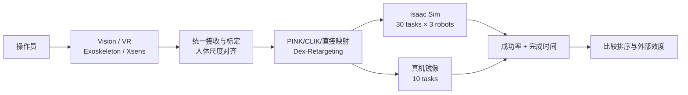
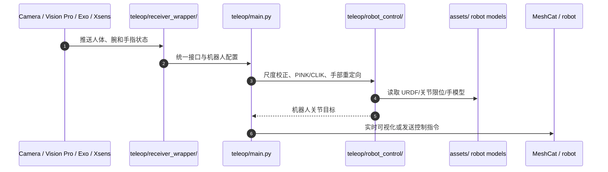

# TeleOpBench：仿真中心的双臂灵巧遥操作基准

**TeleOpBench: A Simulator-Centric Benchmark for Dual-Arm Dexterous Teleoperation**（[arXiv:2505.12748](https://arxiv.org/abs/2505.12748)，[代码](https://github.com/cyjdlhy/TeleOpBench)）由上海人工智能实验室等机构提出，用同一仿真、机器人和指标比较视觉、VR、外骨骼与惯性动捕接口，并在真机镜像任务上验证排序。

## 一句话定义

**TeleOpBench 固定 Isaac Sim 场景和机器人具身，以 30 个分层双臂任务、成功率与完成时间统一比较四种遥操作模态，再用 10 个真机任务检验仿真结论是否外推。**

## 英文缩写速查

| 缩写 | 英文全称 | 简要说明 |
|------|----------|----------|
| MoCap | Motion Capture | Xsens suit + Manus glove 的惯性动捕接口 |
| VR | Virtual Reality | Apple Vision Pro 手腕/头部与手指追踪接口 |
| IK | Inverse Kinematics | 将人体关键点与腕位姿映射到人形关节 |
| SMPL | Skinned Multi-Person Linear Model | 视觉接口的人体形状与姿态表示 |
| CLIK | Closed-Loop Inverse Kinematics | MoCap 管线的闭环逆运动学 |
| DoF | Degree of Freedom | 臂、腕和灵巧手的控制自由度 |

## 为什么重要

- **把接口比较从“各做各的 demo”变成同场测量：** 机器人、任务与成功判据固定后，接口差异才可归因。
- **覆盖不同难度：** 从推方块到双手递物、揭锅盖和长时序转移，避免简单任务天花板或困难任务全失败。
- **仿真结果有真机锚点：** 同一批任务在物理双臂平台复现，至少验证接口相对排序而非只看视觉逼真。
- **能指导采购：** Xsens 精度/速度高但最贵；VR 与外骨骼居中；单目视觉便宜但受帧率和遮挡限制。

## 核心信息

| 项 | 内容 |
|----|------|
| 机构 | 上海人工智能实验室（Shanghai AI Lab）、浙江大学、香港中文大学、香港科技大学（广州）等 |
| 仿真 | NVIDIA Isaac Sim / PhysX |
| 任务 | 30 个双臂任务；10 个代表任务用于用户研究和真机镜像 |
| 机器人 | Unitree H1-2、Fourier GR1-T2、Unitree G1 |
| 模态 | 单目视觉、Vision Pro VR、同构外骨骼、Xsens + Manus |
| 指标 | 任务成功率、成功任务完成时间 |
| 开放状态 | **部分开源**：Apache-2.0 资产与 `teleop/` 可运行；完整 30 任务 benchmark runner 未闭合 |

## 流程总览

## 核心机制（方法栈）

### 1）分层任务与统一判据

任务按双手协调、接触难度和时序长度分层，每个场景配置明确完成条件、物体质量和摩擦。统一记录成功与完成时间，保证低精度接口在简单任务仍可测、高精度接口在复杂任务能拉开差距。

### 2）四类接口适配

- **Vision：** T-pose 一次优化 SMPL 体型与机器人 link scale；SMPLer-X + MediaPipe 估计人体/手，PINK 和 Dex-Retargeting 求关节。
- **VR：** Vision Pro 提供头与双腕，PINK 求上肢，OpenTeleVision 风格向量优化求手指。
- **Exoskeleton：** 为不同人形定制同构机构，关节直接映射，15 DoF/手 Hall 手套控制灵巧手。
- **MoCap：** Xsens 23 段 6D 姿态 + Manus 20 DoF/手，经尺度校正与 CLIK 映射。

### 3）仿真—真机镜像验证

四类接口在 10 个代表任务上由 4 名参与者执行，并在真机复制场景。论文主要依据成功率和时间曲线的相对一致性判断外部效度，而非宣称绝对数值完全一致。

## 源码运行时序图

README 给出的最小入口是配置相机/VR 采集端后，在 `teleop/` 运行 `./run.sh`。仓库可验证接口重定向，但未给论文 30 个 Isaac Sim 任务的一键重置、成功判定和批量汇总命令。

## 工程实践与开源状态

| 项 | 建议 / 状态 |
|----|-------------|
| 公平比较 | 固定机器人、任务参数、操作者训练时长、超时与失败定义 |
| 校准 | Vision/MoCap 每位操作者做 T-pose 与 link scale；VR 确认 OpenXR 坐标 |
| 指标 | 同时报告 success 和成功条件下 time，避免失败样本让时间偏置 |
| 复现入口 | `environment.yml` / `requirements.txt` → 传感端 → `teleop/run.sh` |
| 资产 | `assets/` 含 GR1/G1/H1 与灵巧手模型 |
| 开源边界 | **部分开源**；遥操作代码可运行，完整 30-task benchmark orchestration 未明确开放 |

## 与其他工作对比

| 模态 | 优点 | 主要失败 | 成本/约束 |
|------|------|----------|-----------|
| 单目视觉 | 无穿戴、部署快 | 低帧率、腕姿粗、遮挡 | 最低 |
| Vision Pro | 腕/手追踪准确、沉浸 | 手—手遮挡导致任务 7 失败 | 中等 |
| 同构外骨骼 | 直接关节映射、平滑 | 横向肘活动受机构限制 | 定制成本高 |
| Xsens + Manus | 最快且最精确 | 商业设备昂贵 | 最高 |

## 实验与评测

- **设置：** 4 名参与者、10 个代表任务；仿真和真机均报告四模态 success/time。
- **仿真：** Xsens 在 10 个任务中 9 个为 100%（另一个 90%），多为最短时间；视觉在复杂任务 7/10 为 0%。
- **真机：** Xsens 在列出的多数任务为 100%，视觉在任务 10 为 0%；VR 与外骨骼整体位于两者之间。
- **外部效度：** 两域的完成时间排序一致：vision 最慢、Xsens 最快、VR/exoskeleton 居中；论文只给“strong positive correlation”，未报告 Pearson/Spearman 系数。
- **边界：** 现有任务以上肢桌面操作为主，未覆盖腿部移动与触觉反馈。

## 结论

**TeleOpBench 最有用的结论是接口相对排序可在仿真中预筛，而不是“仿真数值等于真机”。**

1. **复杂任务才能区分接口** — 单目视觉在简单抓取可用，但双手遮挡和长时序迅速暴露上限。
2. **Xsens 是性能上界而非默认选型** — 最快最稳，但设备成本最高。
3. **VR 与外骨骼是务实中间档** — 前者易部署，后者直接映射但需按机器人定制。
4. **外部效度看排序，不看绝对复制** — 论文没有给相关系数或置信区间。
5. **开源复现仍有缺口** — 当前仓库更像可运行 teleop 工具箱，尚非一键完整 benchmark。

## 局限与风险

- 30 任务主要是上肢桌面操作，不能代表全身 loco-manipulation。
- 四种模态都没有触觉/力反馈，无法评估精细力控与双边稳定性。
- 用户研究只有 4 人；熟练度、疲劳和学习效应可能影响排序。
- 论文未报告明确相关系数、显著性或跨平台分层统计，“强相关”证据粒度有限。
- 开源仓库缺少完整任务运行/评测说明，复现论文全表仍需作者补充。

## 与其他页面的关系

- 任务入口：[Teleoperation](../tasks/teleoperation.md)
- 基准纵深：[具身大模型评测基准](../overview/depth-embodied-eval-benchmark.md)
- 接口取舍：[数据手套 vs 视觉遥操作](../comparisons/data-gloves-vs-vision-teleop.md)
- 映射基础：[Motion Retargeting](../concepts/motion-retargeting.md)
- 路线位置：[遥操作纵深 Stage 5](../../roadmap/depth-teleoperation.md)

## 参考来源

- [humanoid_pnb_teleopbench.md](../../sources/papers/humanoid_pnb_teleopbench.md)
- [teleopbench-project.md](../../sources/sites/teleopbench-project.md)
- [teleopbench.md](../../sources/repos/teleopbench.md)
- 论文：<https://arxiv.org/abs/2505.12748>

## 推荐继续阅读

- 官方项目页：<https://gorgeous2002.github.io/TeleOpBench/>
- 官方仓库：<https://github.com/cyjdlhy/TeleOpBench>
