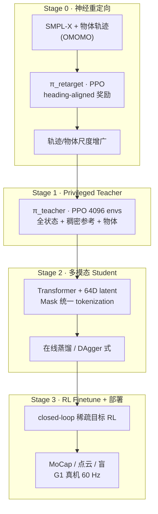
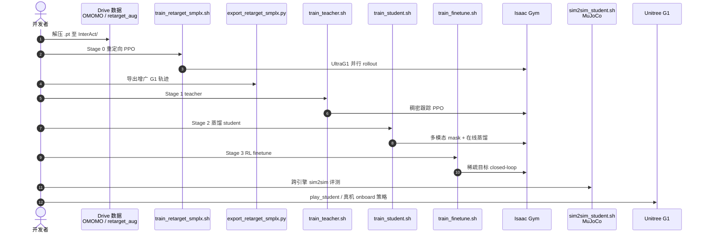

# ULTRA：统一多模态人形全身 loco-manipulation

**ULTRA**（*Unified Multimodal Control for Autonomous Humanoid Whole-Body Loco-Manipulation*，[arXiv:2603.03279](https://arxiv.org/abs/2603.03279)，[项目页](https://ultra-humanoid.github.io/)，[代码](https://github.com/Sirui-Xu/ULTRA)）由 **伊利诺伊大学厄巴纳-香槟分校（UIUC）** 提出：用 **一套权重** 同时支持 **稠密 MoCap 参考跟踪**、**稀疏键盘/点击目标** 与 **第一人称深度点云** 下的长时域全身移动操作，并在 **Unitree G1** 真机与 **MuJoCo sim2sim** 上验证。

## 一句话定义

**先把大规模人–物 MoCap 用单条 RL 重定向策略压成物理可行的 G1 轨迹库，再蒸馏成带 skill latent 的多模态 student——有参考就跟踪，没参考就从 onboard 感知与稀疏意图闭环完成 loco-manipulation。**

## 英文缩写速查

| 缩写 | 英文全称 | 简要说明 |
|------|----------|----------|
| ULTRA | Unified muLTimodal contRoller for Autonomous humanoid control | 本文统一多模态控制器命名 |
| MoCap | Motion Capture | 动捕参考或状态估计来源 |
| PPO | Proximal Policy Optimization | Teacher / 重定向 / finetune 主算法 |
| RL | Reinforcement Learning | 重定向、跟踪与 finetune 阶段 |
| VAE | Variational Autoencoder | Student 的 prior–encoder–decoder 技能瓶颈 |
| OOD | Out-of-Distribution | 未见物体尺度、随机目标偏移等 |
| Sim2Real | Simulation to Real | Isaac Gym 训练 → G1 真机部署 |
| G1 | Unitree G1 Humanoid | 论文与开源栈目标平台 |
| PD | Proportional–Derivative | 底层关节目标跟踪（真机 60 Hz 策略 → 1 kHz PD） |
| HOI | Human–Object Interaction | 人–物接触-rich 交互场景 |
| FiLM | Feature-wise Linear Modulation | 用潜变量调制 Transformer 特征 |

## 为什么重要

- **打破「跟踪 vs 自主」分裂：** 多数全身控制器只为 **参考 replay** 设计；ULTRA 用 **availability masking** 让 **缺失参考/模态** 时仍走同一策略，适合真实传感降级。
- **数据瓶颈可扩展：** **神经重定向** 单策略覆盖全库并可 **轨迹+物体增广**，缓解 kinematic retarget 在接触任务上的物理不可行。
- **工程可复现：** 官方 [Sirui-Xu/ULTRA](https://github.com/Sirui-Xu/ULTRA) 给出五阶段脚本、预置 teacher 权重与 sim2sim/真机入口；与 [InterMimic](./paper-bfm-15-intermimic.md) / [InterPrior](./paper-interprior.md) 同属 UIUC **Inter-line** 交互控制谱系。

## 核心信息

| 项 | 内容 |
|----|------|
| **机构** | 伊利诺伊大学厄巴纳-香槟分校（University of Illinois Urbana-Champaign） |
| **平台** | Unitree G1；仿真 **Isaac Gym** 训练、**MuJoCo** 评测 |
| **数据** | OMOMO 人–物交互动捕（经 InterMimic 格式与 ULTRA 重定向增广）；teacher 推理权重另含 AMASS/BONES-SEED（仓库说明） |
| **开源** | **已开源**（Apache-2.0；InterMimic 栈 MIT）— 见 [sources/repos/ultra-humanoid.md](../../sources/repos/ultra-humanoid.md) |
| **荣誉** | IROS 2026 **Mobile Manipulation Best Paper Award Finalist**（项目页 / arXiv 评论） |

## 流程总览

## 核心机制（归纳）

### 物理驱动神经重定向

- 将 retargeting 表述为 **仿真约束下的 RL 轨迹优化**（非逐 clip IK）；奖励强调 **脚/掌末端、物体 pose、掌–面 offset、接触事件** 与能耗。
- **单策略** 处理全数据集；支持 **各向异性坐标缩放** 与 **物体 mesh 尺度** 增广而 **无需重训**。
- 重定向阶段用 **理想高频 PD**、**无 DR**——优先数据吞吐与质量，鲁棒性留给 student + finetune。

### 统一多模态 Student

- **Teacher** 使用特权全状态 + 稠密参考；**Student** 在 **MoCap 物体位姿 / egocentric 点云 / 盲** 与 **稠密参考 vs 稀疏 root–object 目标** 间用 **mask token** 切换。
- **64 维变分 skill latent + FiLM** 消化稀疏目标歧义；稠密局部跟踪可走 **residual shortcut**（不强制经随机 latent）。
- **RL finetune** 在 student 观测下优化 **终端目标到达**，扩大 **OOD 随机目标偏移** 下的交互状态覆盖（Table 3）。

## 源码运行时序图

官方仓库 [Sirui-Xu/ULTRA](https://github.com/Sirui-Xu/ULTRA)（归档 [ultra-humanoid.md](../../sources/repos/ultra-humanoid.md)）典型复现路径：

- **最短体验：** 使用仓库内 `teacher_ultra_inference.pth` → `ultra/run_teacher_inference.py` 或 README 中 `play_student.sh`（需 student 权重）。
- **数据依赖：** InterMimic 准备的 OMOMO 与 ULTRA 增广包（Google Drive；见 README）。

## 工程实践

| 项 | 建议 |
|----|------|
| 环境 | Python 3.8 + Isaac Gym Preview 4 + `requirements.txt`；sim2sim 另装 MuJoCo |
| 管线顺序 | 严格 **重定向 → teacher → student → finetune**；可跳过自训 teacher 先用发布权重做蒸馏/推理 |
| 观测模式 | 部署前在仿真明确 **full_track / sparse_track / object_obs** 与 mask 配置（`g1_student_vae.yaml`） |
| 感知 | 真机 egocentric：深度 → ROI → 去地面 → 主簇 → 固定点数（论文 §5.5）；深度噪声是主要失败源 |
| 与 Inter-line 关系 | 重定向/数据格式与 [InterMimic](./paper-bfm-15-intermimic.md) 一致；稀疏 HOI 生成控制对照 [InterPrior](./paper-interprior.md) |
| 局限 | 物体集为 **box/suitcase 类**；真机稀疏 egocentric 成功率 **50–60%**；无触觉，滑移与摩擦域差仍明显 |

## 实验与评测

- **Retargeting 质量（Table 2）：** largebox / suitcase 上 **穿透时长、滑步、漂浮** 低于 PHC、GMR、OmniRetarget 等同设定重实现。
- **联合跟踪（Table 1）：** ULTRA student **显著高于** HDMI、OmniRetarget（OOD 物体尺度尤甚）；**蒸馏 >> 直接在 student 观测下 RL**；privileged teacher 为上限，student 有时 **jitter 更低**（蒸馏正则效应）。
- **Goal following sim2sim（Table 3，20 条/设定）：** finetune 后 ID **19/20（点云）**；OOD 点云 **9/20 vs 5/20**，OOD 位置 **12/20 vs 4/20**。
- **真机（Table 4，OMOMO 子集）：** 稠密参考 **73% (19/26)**；稀疏 MoCap 纵向/横向 **80%/90%**；稀疏 egocentric **50%/60%**（各 10 次试验）。

## 结论

**ULTRA 把「可扩展物理 retargeting」与「可部署的多模态单一策略」接成一条线，使 G1 在有无 MoCap 参考、有无 onboard 深度时都能做全身 loco-manipulation，而不是两套控制器硬切换。**

1. **重定向用 RL 单策略 + 增广** — 比逐轨迹优化更易规模化，Table 2 显示接触质量优于常见 kinematic / 他方重实现。
2. **Student 必须蒸馏** — 在 partial 观测下直接 RL 跟踪易崩；teacher 全状态学接触再迁移。
3. **统一 all-task 训练** — 略牺牲 ID 跟踪精度，换更 trajectory-invariant 的 **motion prior**，OOD 跟踪更稳。
4. **RL finetune 主要赚 OOD 稀疏目标** — MuJoCo 上 OOD 成功率可接近翻倍（Table 3）。
5. **真机已验证双模式** — 稠密参考与无参考稀疏目标均可跑；egocentric 仍弱于 MoCap 状态，深度管线是瓶颈。
6. **开源可跑通五阶段** — 权重/数据部分预发布；teacher 权重含论文后额外数据训练（README 说明与原文 OMOMO 设定差异）。
7. **选型读法** — 要 **同一策略跟踪+goal following** 且能接受 G1+Isaac Gym 栈 → 优先评估 ULTRA；要 **纯 HOI 生成先验** → 对照 InterPrior；要 **极限 GMT 跟踪** → 对照 SONIC/YAHMP 等。

## 与其他页面的关系

- 任务语境：[Loco-Manipulation](../tasks/loco-manipulation.md)、[ultra-survey](../tasks/ultra-survey.md)（早期 survey 摘要，机制以本页为准）
- 方法栈：[Imitation Learning](../methods/imitation-learning.md)、[Reinforcement Learning](../methods/reinforcement-learning.md)、[DAgger](../methods/dagger.md)
- 同机构线：[InterPrior](./paper-interprior.md)、[InterMimic（BFM-15）](./paper-bfm-15-intermimic.md)
- Paper Notebooks 索引：[04_Loco-Manipulation_and_WBC](../overview/paper-notebook-category-04-loco-manipulation-and-wbc.md)

## 参考来源

- [ultra_arxiv_2603_03279.md](../../sources/papers/ultra_arxiv_2603_03279.md)
- [ultra-humanoid-github-io.md](../../sources/sites/ultra-humanoid-github-io.md)
- [ultra-humanoid.md](../../sources/repos/ultra-humanoid.md)
- [humanoid_pnb_ultra-unified-multimodal-control-for-autonomous.md](../../sources/papers/humanoid_pnb_ultra-unified-multimodal-control-for-autonomous.md)

## 推荐继续阅读

- 项目页交互 demo（浏览器 MuJoCo）：<https://ultra-humanoid.github.io/>
- 官方代码 README 与 `docs/install.md`：<https://github.com/Sirui-Xu/ULTRA>
- 深读笔记（Paper Notebooks）：<https://imchong.github.io/Robot_Learning_Paper_Notebooks/papers/04_Loco-Manipulation_and_WBC/ULTRA_Unified_Multimodal_Control_for_Autonomous_Humanoid_Whole-Body_Loco-Manipulation/ULTRA_Unified_Multimodal_Control_for_Autonomous_Humanoid_Whole-Body_Loco-Manipulation.html>
