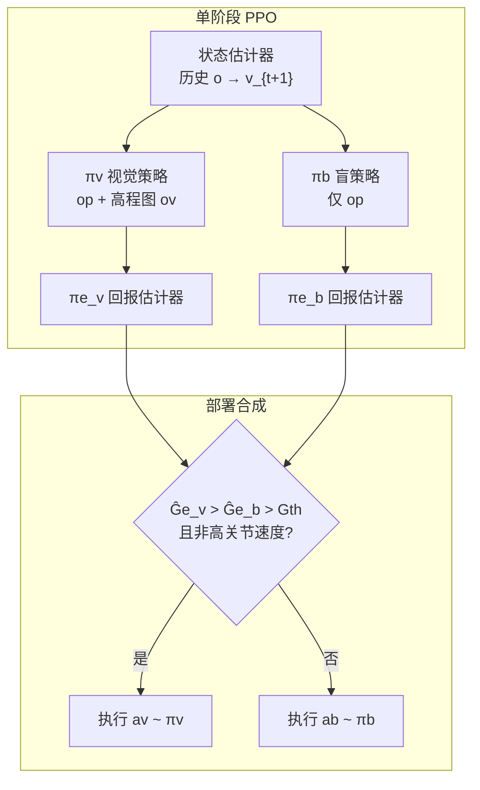

# VB-Com（Vision-Blind Composite Humanoid Locomotion）

**VB-Com**（*Learning Vision-Blind Composite Humanoid Locomotion Against Deficient Perception*，Junli Ren 等，上海人工智能实验室 × 香港大学 × 上海交通大学 × 浙江大学 × 香港中文大学，[ICRA 2026](https://renjunli99.github.io/vbcom.github.io/)，[arXiv:2502.14814](https://arxiv.org/abs/2502.14814)）提出 **视觉–盲策略复合框架**：分别训练可前瞻的感知策略 πv 与仅本体的盲策略 πb，再用 **只看历史本体** 的回报估计器决定何时信高程图、何时丢掉失效外感知切到盲走。真机在 **Unitree G1 / H1** 上展示动态障碍、感知缺失跨栏与缺口漏踩恢复。

> 本页原为 Paper Notebooks **planned 索引实体**；2026-08-28 随论文 ingest **原地升格**（未新建重复节点）。姊妹仓库深读笔记完成后应互链。

## 一句话定义

**不要把噪声高程图硬塞进一条策略：用本体回报估计判断「视觉还靠不靠谱」，不靠谱就立刻把控制权交给盲策略做接触恢复。**

## 英文缩写速查

| 缩写 | 英文全称 | 简要说明 |
|------|----------|----------|
| VB-Com | Vision-Blind Composite | 本文：视觉策略与盲策略按回报估计合成 |
| PPO | Proximal Policy Optimization | 两条 locomotion 子策略的训练算法 |
| GAE | Generalized Advantage Estimation | 用 Â+V 构造回报估计器的监督信号 |
| POMDP | Partially Observable Markov Decision Process | 外感知 ov 可能失效的部分可观测控制设定 |
| IMU | Inertial Measurement Unit | 本体观测中的角速度与重力方向来源 |
| LiDAR | Light Detection and Ranging | 头戴激光，积分成机器人中心高程图 |
| Sim2Real | Simulation to Real | 高程噪声/延迟随机化后直接上 G1/H1 |
| G1 / H1 | Unitree G1 / H1 | 实验平台；G1 20 维、H1 19 维全身动作 |

## 为什么重要

- **把「感知缺失」写成可切换的控制问题，而不是再加训练噪声。** 单条 Noisy Perceptive 策略见过评测噪声后仍更像盲走（碰撞升、课程爬升慢）；缺口这种「晚一步就摔」的场景需要另一套已学会接触恢复的策略。
- **回报估计器可上真机：** 输入只有历史本体，不被失效高程图二次误导；这与「把外感知和本体编进同一个 belief」的四足稳健感知路线不同。
- **G1 / H1 双机证据：** 静态障碍走视觉前瞻，高速迎面行人高程图来不及 → 碰撞后切盲策略躲开；零高程输入下连续栏与漏踩缺口靠盲策略大步恢复。
- **观测设计课：** 对应 [人形运控观测输入](../concepts/humanoid-policy-observation-inputs.md) 的 D 类（高程图）不可靠时，不要默认继续信 D，而应有一条只用 A 类的退路。

## 核心信息

| 项 | 内容 |
|----|------|
| **机构** | 上海人工智能实验室（Shanghai AI Lab）；香港大学（HKU）；上海交通大学（SJTU）；浙江大学（ZJU）；香港中文大学（CUHK） |
| **会议 / 预印本** | ICRA 2026；arXiv:2502.14814（v2 2025-06-01） |
| **平台** | Unitree G1（20 维动作）、Unitree H1（19 维动作）；头戴 LiDAR → 高程图 |
| **任务** | 缺口 / 栏 / 障碍 goal-reaching；动态障碍与感知缺失恢复 |
| **开源** | **宣称将开源 / 截至 2026-08-28 项目页未列 GitHub**（*Code (coming soon)*，空链接） |

## 核心原理

### 流程总览

- **两条子策略共享 (S, A, R)。** πv 吃本体 op + 机器人中心高程图 ov；πb 训练时不给 ov。命令是 goal-reaching：`ct = [d1, d2, vc]`（接下来两个航点方向 + 线速度），而不是纯速度跟踪。
- **非对称 critic：** 特权准确线速度；critic 高程图 **1.6 m × 1.0 m**，actor **1.2 m × 0.7 m**；critic 侧观测不加噪声。
- **轻量状态估计：** 用历史观测回归下一时刻速度 `vt+1`，单阶段即可部署，避免再开 teacher–student 第二阶段。
- **Q-informed 合成：** 对候选动作 `{av, ab}` 用估计回报构造选择。估计器只看 `op,t−H:t`。引入切换周期 T，用 λ-return 估未来 T 步；监督来自 GAE 的 `G = Â + V`。
- **切换规则：** 仅当平滑后的视觉回报 **高于** 盲回报 **且二者都高于** `Gth` 时走 πv，否则走 πb。`Gth` = 近 5 步盲回报均值 − α。高关节速度禁止切换，避免剧烈动作中硬切。

感知正常时 `Ĝe_v` 稳定高于 `Ĝe_b`（视觉有更全的环境信息）。100% 噪声下机器人撞上未见地形后两条估计骤降，盲策略对失稳更敏感，触发切到 πb；运动重新稳住后再把控制权还给 πv。

## 源码运行时序图

**不适用**（截至 2026-08-28，项目页 *Code (coming soon)* 且无 GitHub URL；无可辨识的训练 / 推理入口）。复现需自建：Isaac/LiDAR 高程图 + 双 PPO + 本体回报估计器 + 真机切换逻辑。

## 工程实践

| 项 | 建议 |
|----|------|
| 命令 | 高动态越障用 **goal-reaching**（双航点方向 + 线速度），不要只跟 ω |
| 高程图尺寸 | actor 用较小窗口（文中 1.2×0.7 m），critic 用更大窗口加速课程 |
| 碰撞几何 | 不要开全身碰撞；G1 **开手碰撞** 让盲策略在失效时伸手探障 |
| 训练噪声 | πv 用轻度噪声（文中 10% Gaussian + ≤0.5 s 延迟）即可上真机；**不要**指望把评测级 100% 噪声直接塞进单策略 |
| 回报估计输入 | **禁止**把 ov / 特权量喂给估计器，否则失效感知会污染切换 |
| 切换超参 | 保留 `Gth`（去掉后目标完成约 48%）；α 宜 **< 1**（文中 α=0.5 约 85.8%） |
| 切换周期 T | 过短（1/5 step）会打断跨越轨迹；文中 **T=50** 优于 T=1/5/100 与 MC 回归 |
| 安全 | 高关节速度时 **禁止切换**；视觉回报做短窗平滑，抑制单步异常估计 |
| 感知栈 | 头戴 LiDAR 高程图有积分窗口，**动态障碍默认当感知缺失** 来处理 |
| 奖励 | 为让回报估计可迁移，奖励侧重本体状态而非环境交互项 |

## 实验与评测

仿真：三种地形拉到最大课程（缺口宽至 **0.8 m**，栏高 **0.2–0.4 m**）；每方法 10×3 回合、每回合 8 目标。评测噪声含 Gaussian、前/侧向 shifting、竖直 floating，课程到 100%。

| 设定 | 目标完成 | 读法 |
|------|----------|------|
| 0% 噪声 VB-Com / Vision | **84.05%** / 73.57% | 最大课程下纯视觉也会因高程图视野只比缺口宽约 0.05 m 而摔（Vision 终止率 >40%） |
| 100% 噪声 VB-Com / Vision / Blind / Noisy Perc. | **84.81%** / 48.71% / 83.76% / 80.52% | 合成在「全瞎」时接近盲走成功率，但碰撞步低于 Blind；Noisy Perceptive 见过评测噪声仍更多碰撞（3.49% vs 2.60%） |
| 分地形 | 缺口 VB-Com 更好；栏上 Noisy Perceptive 更好 | 漏踩缺口要 **更快恢复**，单策略来不及 |
| 无 `Gth` | 目标完成 **48.48%** | 阈值是抑制误切的关键，不是装饰超参 |
| 回报估计 | TD + T=50 优于 MC 与 T=1/5 | 短周期让两策略互相打断跨越动作 |

真机（G1 / H1）：

- 静态人：高程图能看见 → 视觉前瞻绕开，`Ĝe_v` 保持高于 `Ĝe_b`。
- 高速迎面：图来不及更新 → 碰撞后两条估计骤降，切 πb 躲开。
- 连续动态障碍：先无碰绕开已建图障碍，再在突然出现的障碍上碰一下后恢复。
- **零高程输入：** 连续栏碰撞后切盲策略跨过；漏踩缺口时盲策略做更大前迈步恢复（仿真里学过的接触策略）。

## 结论

**人形感知行走的上限往往不在「把高程图训得更噪」，而在「知道何时扔掉高程图」。VB-Com 用本体回报估计做这条退路，缺口/动态障碍上比单策略更扛摔；代价是切换延迟带来的额外接触，以及能力仍被仿真里见过的恢复动作卡住。**

1. **两条专长策略 + 可部署估计器** 优于一条「什么噪声都见过」的感知策略：后者课程爬升慢，缺口上来不及。
2. **估计器只吃本体** 才防二次误导；把 ov 编进切换网络会把失效感知又送回去。
3. **`Gth` 不能省** — 去掉后完成率腰斩；α 过小过大都不如约 0.5。
4. **T 要覆盖一个恢复动作** — 1–5 步切换会把跨越轨迹切碎。
5. **真机主场景是动态障碍与建图延迟**，不是静态楼梯；LiDAR 高程图积分窗口本身就是「感知缺失」源。
6. **Blind 不是废物基线** — 全瞎时成功率已经高，合成的价值是 **少撞** 且感知好时走视觉。
7. **复现现状：无官方代码**；先读项目页视频，再自建双策略切换，不要等空按钮。

## 与其他工作对比

| 对照 | 差异读法 |
|------|----------|
| 单条 Vision / Blind | Vision 前瞻但怕噪声；Blind 扛噪声但先碰后改。VB-Com 按估计回报切换，而不是平均两条动作 |
| Noisy Perceptive（训练即见评测噪声） | 完成率接近，但碰撞更高、课程更慢；栏上可更好，**缺口恢复不如合成** |
| [RPL](./paper-rpl-robust-humanoid-perceptive-locomotion.md) | RPL 用特权高程专家蒸馏多视角深度，假设深度仍可用；VB-Com 处理的是 **外感知整段不可信** |
| [Now You See That](./paper-now-you-see-that-humanoid-vision-locomotion.md) | 立体深度 + 特权蒸馏做长楼梯/跑酷；不强调动态障碍下的盲策略接管 |
| [Extreme Parkour](./extreme-parkour.md) | 四足深度跑酷；命令航点设计被 VB-Com 沿用，但合成对象是人形双策略而非 scandots→深度蒸馏 |
| 四足 belief encoder（视觉+本体） | 把失效视觉编进同一隐状态；VB-Com 选择 **丢掉视觉、整段切盲** |
| [PIM](./paper-notebook-learning-humanoid-locomotion-with-perceptive-int.md) | 同组高程图表征/硬件实现来源；VB-Com 在其上加切换，PIM 笔记页仍待深读 |

## 局限与风险

- **能力上限 = 仿真里盲策略见过的恢复动作。** 漏踩缺口时若前方没有可踏地形，大步恢复会失败；作者把「再加子策略」列为后续。
- **切换不是瞬时无碰：** 噪声升高时 reach steps 增加，因为要等估计下降再切；100% 噪声下碰撞步向 Blind 靠拢。
- **高程图积分窗口** 使动态场景天然滞后，不能把 VB-Com 读成「LiDAR 已经够用」。
- **开源未落地：** 截至入库日无可运行代码/权重；项目页仍残留模板站点的无关 BibTeX，引用请用 arXiv:2502.14814。
- **不要把本页当成姊妹仓库深读笔记：** 笔记站仍为待撰写；机制编译以本页与 `sources/papers/vb_com_arxiv_2502_14814.md` 为准。

## 关联页面

- [楼梯与障碍 Locomotion](../tasks/stair-obstacle-perceptive-locomotion.md) — 感知/盲走挂接枢纽
- [Humanoid Locomotion](../tasks/humanoid-locomotion.md) — 人形行走任务
- [人形运控策略的观测输入](../concepts/humanoid-policy-observation-inputs.md) — D 类高程图失效时的退路
- [Terrain Adaptation](../concepts/terrain-adaptation.md) — 地形感知闭环
- [Privileged Training](../concepts/privileged-training.md) — 本文用特权 critic，不是经典 teacher–student
- [RPL](./paper-rpl-robust-humanoid-perceptive-locomotion.md) — 深度仍可用时的感知行走对照
- [Now You See That](./paper-now-you-see-that-humanoid-vision-locomotion.md) — 立体深度 sim2real 对照
- [PIM](./paper-notebook-learning-humanoid-locomotion-with-perceptive-int.md) — 同组高程图/感知内部模型（待深读）
- [Unitree G1](./unitree-g1.md) — 主实验平台
- 分类父节点：[paper-notebook-category-05-locomotion](../overview/paper-notebook-category-05-locomotion.md)

## 参考来源

- [vb_com_arxiv_2502_14814.md](../../sources/papers/vb_com_arxiv_2502_14814.md) — 论文摘录与开源核查
- [vbcom-github-io.md](../../sources/sites/vbcom-github-io.md) — 项目页归档（Code coming soon）
- [humanoid_pnb_vb-com-learning-vision-blind-composite-humanoid.md](../../sources/papers/humanoid_pnb_vb-com-learning-vision-blind-composite-humanoid.md) — Paper Notebooks 进度锚点
- [arXiv:2502.14814](https://arxiv.org/abs/2502.14814) — 原文（v2 2025-06-01）
- [项目页](https://renjunli99.github.io/vbcom.github.io/)

## 推荐继续阅读

- [项目页与真机视频](https://renjunli99.github.io/vbcom.github.io/)
- [YouTube 演示](https://youtu.be/f9iUE3v7I-8)
- Long et al., *Learning Humanoid Locomotion with Perceptive Internal Model*，[arXiv:2411.14386](https://arxiv.org/abs/2411.14386) — 高程图硬件实现
- Cheng et al., *Extreme Parkour with Legged Robots*（ICRA 2024）— 航点命令来源
- [Paper Notebooks 阅读进度（PROGRESS.md）](https://github.com/ImChong/Robot_Learning_Paper_Notebooks/blob/main/papers/PROGRESS.md)
