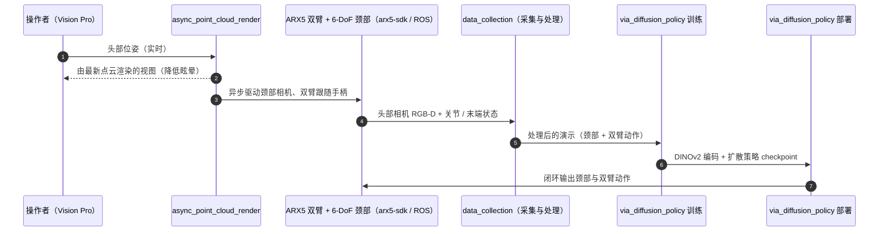

# Vision in Action

**Vision in Action: Learning Active Perception from Human Demonstrations** 收录于 [Robot Learning Paper Notebooks](https://imchong.github.io/Robot_Learning_Paper_Notebooks/index.html)（分类：06_Manipulation），深读笔记已完成。本页编译自深读笔记与 arXiv 论文正文（实验数字、开源状态于 2026-09-28 核对），细节以论文 PDF 为准。

## 一句话定义

Vision in Action（ViA）是面向双臂机器人操作的主动感知系统，直接从人类演示学任务相关的主动感知策略（如搜索、跟踪、聚焦）。硬件上，ViA 用一个简单有效的 6 自由度机器人颈实现灵活、拟人的头部运动。为捕捉人类主动感知策略，设计了基于 VR 的遥操作接口，在机器人与操作者之间建立共享观测空间。为缓解机器人物理运动延迟导致的VR 眩晕，接口用中间 3D 场景表征，在操作者端实时渲染视角、并异步用机器人最新观测更新场景。这些设计共同支撑了在三个含视觉遮挡的复杂多阶段双臂操作任务上学到鲁棒视觉运动策略，显著优于基线。

## 英文缩写速查

| 缩写 | 含义 |
|---|---|
| ViA | Vision in Action，主动感知系统 |
| Active Perception | 主动感知（搜索/跟踪/聚焦） |
| 6-DoF Neck | 6 自由度机器人颈 |
| Shared Observation Space | 人机共享观测空间 |
| 3D Scene Representation | 中间 3D 场景表征（缓解延迟/眩晕） |
| Asynchronous Update | 异步更新 |

## 为什么重要

- **主动感知（会动的头）对遮挡任务是刚需**，固定相机看不全；
- **共享观测空间 + 3D 表征**是高质量遥操作采集的关键工程；
- **缓解 VR 眩晕**直接影响数据质量与采集时长；
- 与 EgoMI（头手协调）共同强调"主动视觉"对操作的价值。

## 解决什么问题

双臂操作中**视觉遮挡**常见，需**主动调整视角**： - 固定相机看不全，需**主动搜索/跟踪/聚焦**； - 想**从人类演示学**主动感知，但遥操作有**延迟**致**VR 眩晕**； - 缺**拟人头部硬件**与**共享观测**接口。

ViA 要：硬件（6-DoF 颈）+ 接口（VR 共享观测 + 3D 表征缓延迟）+ 从人类演示学主动感知。

## 核心机制

1. **主动感知系统 ViA**：从人类演示学搜索/跟踪/聚焦；
2. **6-DoF 机器人颈**：灵活拟人头部运动；
3. **VR 共享观测 + 3D 表征**：采集主动感知并缓解延迟/眩晕；
4. **遮挡任务显著领先**：三个多阶段双臂任务优于基线。

方法拆解（深读笔记小节）：6 自由度机器人颈（拟人头动）；VR 遥操作 + 共享观测空间；3D 场景表征缓解延迟/眩晕；结果；🧭 整体流程（mermaid）。

## 核心信息

| 字段 | 内容 |
|------|------|
| 分类 | 06_Manipulation |
| 深读笔记 | <https://imchong.github.io/Robot_Learning_Paper_Notebooks/papers/06_Manipulation/Vision_in_Action__Learning_Active_Perception_from_Human_Demonstrations/Vision_in_Action__Learning_Active_Perception_from_Human_Demonstrations.html> |
| arXiv | <https://arxiv.org/abs/2506.15666> |
| 源码 | **已开源**：[haoyu-x/vision-in-action](https://github.com/haoyu-x/vision-in-action)（硬件指南、异步点云渲染 VR 遥操作、数据采集处理、`via_diffusion_policy` 训练与真机部署；机械臂驱动基于 ARX5 SDK） |
| 作者 | Haoyu Xiong、Xiaomeng Xu、Jimmy Wu、Yifan Hou、Jeannette Bohg、Shuran Song（Stanford） |
| 发表 | 2025 年 6 月 |
| 笔记阅读日期 | 2026-06-21 |

## 源码运行时序图

复现主路径：先按 Quick Start 跑通异步点云渲染与 ARX 单臂测试，再按 Hardware Guide 组装颈部，最后走采集 → 训练 → 部署。

## 实验与评测

**设置**：双 ARX5 机械臂 + 以现成 6-DoF 机械臂充当「颈部」的主动头部相机；操作者戴 VR 头显，看到的是由单帧 RGB-D 点云按其最新头部位姿实时渲染的视图，机器人头部异步跟随。3 个含遮挡的多阶段任务，按阶段累计计成功：

| 任务 | 训练演示 | 评测 |
|------|------|------|
| Bag：打开袋子 → 探头查看 → 取出物体 | 150 条（5 种物体） | 2 种未见物体 × 5 次 |
| Cup：从货架深处取杯 → 右手交左手 → 放到另一货架下的杯碟 | 125 条 | 10 种配置 × 2 次 |
| Lime & Pot：找青柠放入锅 → 双手抬锅 → 对准锅垫 | 260 条 | 10 种配置 × 2 次 |

- **相机配置对比**（同一批演示、DINOv2 编码）：只用主动头部相机的 ViA 在三项任务上都最好；额外加腕部相机反而平均 **下降 18.33%**；相对常见的「胸部 + 腕部」固定相机配置，平均 **提升 45%**（腕部相机被货架遮挡、胸部相机看不到目标）。
- **视觉表征对比**：DINOv2 的 ViA 最终阶段成功率最高；ResNet-DP 次之；从零训练的 DP3 常出现「幻觉」（把手伸向空货架），Bag 任务开袋阶段完全失败。
- **遥操作接口用户研究**（8 人）：点云渲染比立体 RGB 流采集稍慢，但眩晕显著降低，6/8 更偏好 ViA。

## 与其他工作对比

| 工作 | 主动视觉如何获得 | 与 ViA 的差异 |
|------|------|------|
| 胸部 + 腕部固定相机（论文基线） | 不做主动感知 | 遮挡时缺少任务相关视野，平均落后 45% |
| [EgoMI](./paper-notebook-egomi-learning-active-vision-and-whole-body-mani.md) | 人戴 VR 采集、无需机器人 | 同样模仿头动，另加关键帧记忆；ViA 需要机器人在环遥操作 |
| [Learning to Look Around](./paper-notebook-learning-to-look-around-enhancing-teleoperation.md) | 遥操作时让机器人头部跟随操作者 | 聚焦遥操作体验；ViA 进一步把头部动作作为策略输出来学习 |
| [DP3](./painode-209-3ddiffusionpolicydp3.md) | 点云扩散策略 | 缺少预训练语义先验，搜索类任务易误判目标位置 |

## 结论

**ViA 的立场是：主动感知应当被当作一种可以从人类演示中学出来的动作，而不是靠更多固定相机去补视野；为此它把硬件（6-DoF 机器人颈）和采集接口（VR 共享观测）一并补齐。**

- 真正起作用的是 **采集端的工程**：VR 共享观测空间让操作者与机器人看到同一场景，中间 3D 场景表征 + 异步更新则把物理运动延迟从操作者的视觉回路里摘出去——没有这一步，演示数据会因眩晕而变短、变差，主动感知策略也就学不出来。
- 6-DoF 机器人颈是必要条件而非附属：搜索/跟踪/聚焦这些策略要有可执行的头部自由度才谈得上被模仿。
- 适用边界：收益集中在 **含视觉遮挡的多阶段双臂任务**；对视野本就完整、单视角够用的任务，主动感知带来的额外复杂度不划算。
- 复现门槛偏高：需要同时具备拟人颈部硬件、VR 遥操接口与实时 3D 场景渲染管线，不是纯算法改动。
- 与 EgoMI 的头手协调路线同属"主动视觉对操作有价值"的判断，区别在于 ViA 把重点放在 **感知动作本身的学习与采集接口**。

## 局限与风险

- **遥操作画质**：单帧 RGB-D 点云渲染受深度噪声与重建不完整影响，保真度低于 RGB 视频流，操作者需练习，精细操作困难。
- **硬件简化**：6-DoF 机械臂当颈部无法复现人类全身配合，当前为桌面平台，未扩展到移动操作。
- **策略设计**：多相机特征只是拼接；不支持语言条件；没有记忆，搜索任务中可能重复查看已搜过区域（EgoMI 的 SPARKS 正针对此点）。
- **复现门槛**：需 ARX5 机械臂、颈部机械臂、Vision Pro / iPhone 相机、ROS Noetic 与 ARX SDK 编译。

## 与其他页面的关系

- 分类父节点：[paper-notebook-category-06-manipulation](../overview/paper-notebook-category-06-manipulation.md)
- 总索引：[humanoid-paper-notebooks-index.md](../overview/humanoid-paper-notebooks-index.md)
- 任务语境：双臂操作：[bimanual-manipulation](../tasks/bimanual-manipulation.md)
- VR 遥操作接口：[teleoperation](../tasks/teleoperation.md)
- 策略骨架 Diffusion Policy：[paper-diffusion-policy](./paper-diffusion-policy.md)
- 对比基线 DP3：[painode-209-3ddiffusionpolicydp3](./painode-209-3ddiffusionpolicydp3.md)
- 无机器人采集的主动视觉路线：[paper-notebook-egomi-learning-active-vision-and-whole-body-mani](./paper-notebook-egomi-learning-active-vision-and-whole-body-mani.md)
- [机器人视觉感知栈选型闭环](../queries/robot-perception-stack-selection-loop.md) — 主动感知数据采集在感知栈选型中的位置

## 参考来源

- [humanoid_pnb_vision-in-action.md](../../sources/papers/humanoid_pnb_vision-in-action.md)
- 深读笔记：<https://imchong.github.io/Robot_Learning_Paper_Notebooks/papers/06_Manipulation/Vision_in_Action__Learning_Active_Perception_from_Human_Demonstrations/Vision_in_Action__Learning_Active_Perception_from_Human_Demonstrations.html>
- 论文：<https://arxiv.org/abs/2506.15666>
- 论文正文（评测与局限节）：<https://arxiv.org/html/2506.15666>
- 官方代码：<https://github.com/haoyu-x/vision-in-action>

## 推荐继续阅读

- [机器人论文阅读笔记：Vision in Action](https://imchong.github.io/Robot_Learning_Paper_Notebooks/papers/06_Manipulation/Vision_in_Action__Learning_Active_Perception_from_Human_Demonstrations/Vision_in_Action__Learning_Active_Perception_from_Human_Demonstrations.html)
- 项目页：<https://vision-in-action.github.io>
