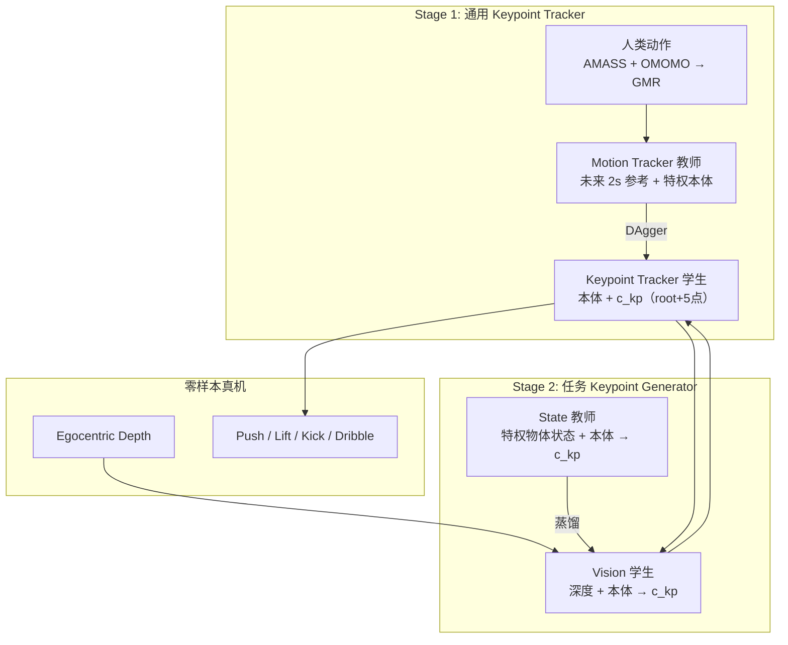

---

type: entity
tags: [paper, humanoid, loco-manipulation, visual-rl, sim2real, hierarchical-control, teacher-student, dagger, ppo, keypoint-tracking, depth, humanoid-paper-notebooks, stanford]
status: complete
updated: 2026-06-12
arxiv: "2509.20322"
venue: "2025 · arXiv"
code: https://github.com/visualmimic/VisualMimic
related:
  - ../overview/paper-notebook-category-04-loco-manipulation-and-wbc.md
  - ../overview/humanoid-paper-notebooks-index.md
  - ../tasks/loco-manipulation.md
  - ../concepts/sim2real.md
  - ../concepts/privileged-training.md
  - ../methods/reinforcement-learning.md
  - ./paper-twist.md
  - ./videomimic.md
  - ./paper-resmimic.md
  - ./paper-viral-humanoid-visual-sim2real.md
sources:
  - ../../sources/papers/visualmimic_arxiv_2509_20322.md
  - ../../sources/papers/humanoid_pnb_visualmimic.md
  - ../../sources/repos/visualmimic.md
  - ../../sources/sites/visualmimic-github-io.md
summary: "VisualMimic（arXiv:2509.20322，Stanford）用分层 teacher–student 把 egocentric 深度 visuomotor 与全身关键点跟踪结合，真机零样本完成 push/lift/kick/dribble 等 loco-manipulation 并泛化户外。"
---

# VisualMimic（Visual Humanoid Loco-Manipulation via Motion Tracking and Generation）

**VisualMimic**（arXiv:[2509.20322](https://arxiv.org/abs/2509.20322)，Stanford，[项目页](https://visualmimic.github.io/)，[代码](https://github.com/visualmimic/VisualMimic)）提出 **视觉 sim-to-real 分层框架**：**任务无关低层关键点跟踪器**（从人类动作蒸馏）+ **任务专用高层 visuomotor 关键点生成器**（从特权状态教师蒸馏），在真机 **零样本** 完成 **push / lift / kick / dribble** 等全身 loco-manipulation，并展示 **户外** 时空泛化。本页为知识库 **策展摘要**；姊妹仓库 [Humanoid Robot Learning Paper Notebooks](https://imchong.github.io/Humanoid_Robot_Learning_Paper_Notebooks/index.html) 深读笔记仍待撰写。

## 一句话定义

把 **egocentric 深度视觉** 与 **人类动作先验的全身关键点跟踪** 用 **双 teacher–student 蒸馏** 串成可部署的分层 visuomotor 栈，使 sim 中训出的策略 **无需外置 MoCap** 即可在真机做 **全身–物体** 交互。

## 英文缩写速查

| 缩写 | 英文全称 | 简要说明 |
|------|----------|----------|
| RL | Reinforcement Learning | 教师策略用 PPO 在仿真中优化任务/跟踪奖励 |
| WBC | Whole-Body Control | 低层 tracker 承担全身平衡与协调执行 |
| Sim2Real | Simulation to Real | 深度 masking + 零样本真机部署 |
| HMS | Human Motion Space | 人类动作数据集统计空间；用于 clip 高层动作 |
| DAgger | Dataset Aggregation | 低层 motion→keypoint 与高层 state→vision 蒸馏 |
| PPO | Proximal Policy Optimization | 低/高层教师策略的 on-policy 训练算法 |
| GMR | General Motion Retargeting | AMASS/OMOMO 人体动作 → 人形参考 |
| Loco-Manip | Loco-Manipulation | 行走与操作动力学耦合的全身任务 |

## 为什么重要

- **三维能力同时成立：** 论文 Table I 强调相对 TWIST（无视觉）、VideoMimic（无 loco-manip/全身 dex）、Hitter（无视觉/全身 dex）等，VisualMimic 同时覆盖 **Whole-Body Dexterity + Loco-Manipulation + Visual Policy**。
- **接口设计可复用：** 高层只生成 **root + 5 关键点**（头/双手/双足）命令，低层共享一次训练、多任务复用——降低每条任务的 RL 探索维度。
- **无需配对人–物 MoCap：** 任务奖励仅需 approach / forward progress 等轻量 shaping，与 [ResMimic](./paper-resmimic.md) 等依赖 OptiTrack 人–物轨迹的路线形成对照。
- **真机证据完整：** 含 **大箱全身 push（3.8 kg）**、**足球盘带**、**失败恢复** 与 **户外光照/地面变化**；项目页展示跨时段、跨地点 push 泛化。
- **同作者技术线：** Yanjie Ze 等延续 [TWIST](./paper-twist.md) 运动跟踪奖励与 GMR 数据链，把「全身模仿先验」推进到 **视觉 loco-manipulation**。

## 流程总览

## 核心机制（归纳）

### 低层：Motion → Keypoint 蒸馏

- **教师 motion tracker：** 输入 **未来 2 s** 全身参考 + 足端接触力等特权信息；PPO + [TWIST](./paper-twist.md) 同族 $r_{\mathrm{motion}}$（跟踪 + 抖动/滑步惩罚）；世界系 body 位置与 root 速度跟踪。
- **学生 keypoint tracker：** 仅 **本体 + 即时关键点命令** $c^{\mathrm{kp}}_t$；**DAgger** 从教师 rollout 学习。
- **命令形式：** root 位置误差 + 5 个关键点相对 root 的误差（头、双手、双足）—— compact 但可表达 push-with-feet / shoulder 等全身策略。
- **消融：** 无蒸馏时 tracker 可跟点但 **不够类人**；仅 3 关键点接口表达力不足（项目页对比）。

### 高层：State → Depth Visuomotor 蒸馏

- **教师：** 拼接 **物体状态** 与本体，PPO 优化任务奖励（如 $R_{\mathrm{approach}}=\exp(-0.1d)$、$R_{\mathrm{forward}}$ 奖励物体前进）。
- **学生：** **egocentric depth + proprioception**；仿真中对 depth **heavy masking** 逼近真机传感器噪声（Fig. 8 visual gap）。
- **动机：** 直接 visual RL 探索慢、信息部分可观测；特权教师先解任务再蒸馏视觉。

### 训练稳定器

| 技巧 | 作用 |
|------|------|
| 低层训时 **命令噪声** | 适应高层 RL 探索产生的非理想 keypoint |
| 高层动作 **HMS clip** | 防止命令超出人类动作统计、低层不可跟踪 |
| 深度 **masking DR** | 缩小 visual sim2real gap |

## 实验与评测

### 真机任务（论文 / 项目页）

| 任务 | 要点 |
|------|------|
| **Lift Box** | 0.5 kg 抬至约 1 m；含失败恢复 |
| **Push Box** | 3.8 kg 大箱；手/肩/脚/双手多种接触 |
| **Kick / Dribble Ball** | 足球盘带与踢球；gentle kick、碰撞恢复 |
| **户外泛化** | 光照、地面、地点变化下 push 仍稳定 |

### 方法对比（Table I 归纳）

| 方法 | 全身 dex | Loco-manip | 视觉策略 |
|------|:--------:|:----------:|:--------:|
| TWIST | ✓ | ✓ | ✗ |
| VideoMimic | ✗ | ✗ | ✓ |
| Hitter | ✗ | ✓ | ✗ |
| **VisualMimic** | ✓ | ✓ | ✓ |

### 开源状态（GitHub）

- **已发布：** Sim2Sim 管线、真机任务 checkpoints（`sim2sim.py --task kick_ball|kick_box|push_box|lift_box`）。
- **待发布：** 低/高层训练代码、Sim2Real 全流程（README：论文接收后全面开源）。

## 常见误区或局限

- **深度而非 RGB：** 学生策略依赖 **depth**；更换传感模态需重新做 visual gap 处理，与 [VIRAL](./paper-viral-humanoid-visual-sim2real.md) 的 RGB 大规模蒸馏路线不同。
- **低层先验边界：** HMS clip 假设高层探索应留在人类动作统计内；极端非人形接触策略可能被抑制。
- **代码未全开源：** 截至入库日仅 Sim2Sim + checkpoint；复现完整训练链需等待后续发布。

## 与其他页面的关系

- 分类父节点：[paper-notebook-category-04-loco-manipulation-and-wbc](../overview/paper-notebook-category-04-loco-manipulation-and-wbc.md)
- 任务语境：[loco-manipulation.md](../tasks/loco-manipulation.md)
- 运动跟踪同族：[paper-twist.md](./paper-twist.md)
- 视觉环境交互对照：[videomimic.md](./videomimic.md)
- GMT/残差 loco-manip 对照：[paper-resmimic.md](./paper-resmimic.md)
- 规模化 RGB sim2real 对照：[paper-viral-humanoid-visual-sim2real.md](./paper-viral-humanoid-visual-sim2real.md)
- Sim2Real 概念：[sim2real.md](../concepts/sim2real.md)

## 参考来源

- [visualmimic_arxiv_2509_20322.md](../../sources/papers/visualmimic_arxiv_2509_20322.md) — arXiv 一手策展摘录
- [humanoid_pnb_visualmimic.md](../../sources/papers/humanoid_pnb_visualmimic.md) — Paper Notebooks progress 锚点
- [visualmimic.md](../../sources/repos/visualmimic.md) — GitHub 仓库归档
- [visualmimic-github-io.md](../../sources/sites/visualmimic-github-io.md) — 项目页归档
- 论文：<https://arxiv.org/abs/2509.20322>

## 推荐继续阅读

- 项目页：<https://visualmimic.github.io/>
- GitHub：<https://github.com/visualmimic/VisualMimic>
- [TWIST](./paper-twist.md) — 同作者全身运动跟踪与 GMR 数据链
- [ResMimic](./paper-resmimic.md) — GMT+残差 loco-manipulation 对照轴
- [Paper Notebooks 04 分类](../overview/paper-notebook-category-04-loco-manipulation-and-wbc.md)
