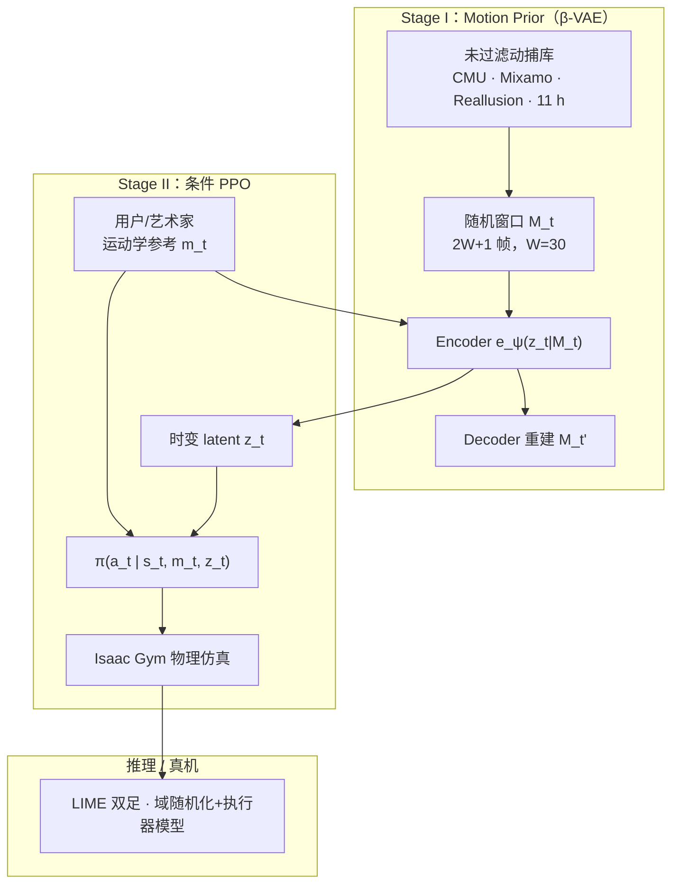

# VMP（Versatile Motion Priors）

**VMP**（*Versatile Motion Priors for Robustly Tracking Motion on Physical Characters*，ETH Zürich · Disney Research，SCA 2024）提出 **两阶段解耦** 的物理角色控制：**Stage I** 用 **β-VAE** 在短运动窗口上自监督提取 kinematic latent；**Stage II** 用 **PPO** 学条件策略，输入为 **当前参考帧 + 时变 latent**，输出动力学一致的执行器指令。论文在 **11 小时未过滤** 人形动捕上训练 **单一策略**，支持未见用户指定运动、艺术家空间组合/编辑，并在 **LIME** 双足真机上演示高动态跟踪。

## 一句话定义

VMP 用「**预训练运动潜空间 + 显式跟踪奖励**」替代端到端对抗 latent 或单 clip 专家，使一个 RL 策略在多样、未见运动学参考上保持高精度全身跟踪，并可直接对接动画工作流与真机双足平台。

## 英文缩写速查

| 缩写 | 英文全称 | 简要说明 |
|------|----------|----------|
| VMP | Versatile Motion Priors | 本文：从动捕学通用运动潜表征并条件下游跟踪 |
| VAE | Variational Autoencoder | Stage I：β-VAE 重建短窗口运动并产出 $z_t$ |
| PPO | Proximal Policy Optimization | Stage II：Isaac Gym 并行仿真中的 on-policy 训练 |
| RL | Reinforcement Learning | 第二阶段用跟踪+正则奖励学条件控制策略 |
| WBT | Whole-Body Tracking | 全身参考运动跟踪，与 DeepMimic 谱系同族 |
| Sim2Real | Simulation to Real | 域随机化+执行器模型后迁移 LIME 真机 |

## 为什么重要

- **解耦表征与控制：** 相对 CALM/ASE 等 **端到端 latent+policy**，VMP 先用自监督 VAE 学 structured latent，再用 **显式 imitation reward** 训策略——论文报告更高 latent 可分性（LDA **0.854 vs 0.687**），并减轻对抗训练的 **mode collapse** 与长训成本（RTX 4090 **<3 天** vs CALM A100 **~2 周**）。
- **单一策略 + 大库泛化：** 在 **CMU + Mixamo + Reallusion** 共 **11 h** **未过滤** 数据上，一个 MLP 策略跟踪 Idle/Walk/Attack/Dance 及未见序列；全数据训练后未见动作关节 MAE 约 **5°**。
- **动画—机器人桥梁：** 控制接口是 **全身运动学参考序列**（非高层任务指令），支持 **空间组合、任意剪辑排序、风格化编辑**；与 Disney **BDX/LIME** 角色机器人线一致，证明图形学 motion prior 可落地物理双足。
- **LM 条件缺一不可：** 消融显示仅当前帧（M）或仅 latent（L）均弱于 **$c_t=(m_t,z_t)$**；Dance 跟踪误差相对 M-only 约 **减半**。

## 流程总览

## 核心机制（归纳）

### Stage I：短窗口 β-VAE

| 要素 | 说明 |
|------|------|
| 状态 $m_t$ | 根高 $h_t$、6D 朝向 $\theta_t$、根/关节速度、关节角、手足相对根位置 $p_t$ |
| 窗口 | $M_t=\{m_{t-30},\ldots,m_{t+30}\}$，约 **1 s** 上下文 |
| 归一化 | 中心帧 heading 局部系 + 数据集均值方差（朝向除外） |
| 表征 | $d_z=64$；**每帧独立 latent 序列**（非整段单码），支持突变响应与空间组合 |
| 训练 | β=0.002，batch 512，RTX 4090 **~10 h** |

### Stage II：条件跟踪策略

- **观测/条件：** 策略状态含本体传感 + 前两步动作；条件 $c_t=(m_t,z_t)$，$m_t$ 提供瞬时跟踪目标，$z_t$ 编码近过去/未来上下文。
- **奖励：** 根位姿/速度、关节、末端跟踪 MSE + 存活项 + 动作平滑与力矩正则。
- **终止：** 末端偏差持续超阈则终止（允许非足端着地），优于仅足接触终止的脆弱性。
- **执行器：** PD 电机 + Coulomb 摩擦 + 速度相关力矩限；仿真与 LIME 使用 **Unitree-A1 / Dynamixel** 参数表。
- **训练：** PPO，8192 并行 env，**~48 h** / RTX 4090。

### 艺术家导向接口

- **空间组合：** 上身与下身可来自不同 clip（论文 Fig.6）。
- **运动编辑：** 先拼接片段得初始序列，再精调关键事件位置/时机或风格化。
- **交互推理：** encoder+policy 可在线运行，动画师可在非物理工具中编参考、即时得物理反馈（去脚滑等）。

### 真机（LIME）

- 20-DoF、0.84 m、16.2 kg；机载 IMU + 执行器编码器状态估计；动捕辅助标定。
- 硬件缺踝 roll 时，策略用 **脚尖触地** 等自适应姿态逼近参考并保持平衡。
- 动态踢腿、舞蹈类动作在物理力矩极限内仍保持风格跟踪。

## 实验与评测（索引级）

| 设置 | 要点 |
|------|------|
| 角色 | 标准 **36-DoF** 人形；**LIME** 20-DoF 双足真机 |
| 数据 | Reallusion 0.5 h + CMU 8.5 h + Mixamo 2 h，**未过滤** |
| 消融 LM vs M/L | Dance 关节 MAE：**5.80°**（LM）vs **12.79°**（M）vs **10.45°**（L） |
| 泛化 | 全库训练后未见序列 **~5°** MAE；对不可行参考尽量跟踪且不倒 |
| vs CALM | 运动质量相当、artifact 更少；latent–参考耦合更强、重复动作更少 |
| 局限 | 长视野特技（后空翻）需带记忆结构；生成式 latent 遍历未演示 |

> 完整数值与视频以 [PDF](https://la.disneyresearch.com/wp-content/uploads/VMP_paper.pdf) 为准。

## 常见误区或局限

- **不是对抗 motion prior：** VMP 走 **显式跟踪 + 预训练 kinematic latent**，与 [AMP](../methods/amp-reward.md)/[ASE](../methods/ase.md) 的判别器路线目标不同——前者偏 **参考贴合**，后者偏 **风格分布**。
- **≠ 通用 scaling tracker：** 相对 [SONIC](../methods/sonic-motion-tracking.md)/BeyondMimic 等人形 scaling 线，VMP 更强在 **动画工作流接口 + Disney 角色真机**，而非 AMASS 级人形工程栈。
- **单 MLP 的记忆上限：** 论文承认需 hidden state 才能覆盖长飞行相特技；当前架构对 **即时跟踪** 足够，对 **长承诺特技** 不足。
- **数据噪声未滤：** 刻意用未过滤 CMU 证明鲁棒性，但极端不可行动作仍会失败或近似跟踪。

## 与其他页面的关系

- [Whole-Body Tracking Pipeline](../concepts/whole-body-tracking-pipeline.md) — VMP 代表「**大库动捕 → latent prior → 显式跟踪 RL → 角色真机**」的动画侧 WBT 路径。
- [DeepMimic](../methods/deepmimic.md) — 共享多 term 跟踪奖励与 RSI 式随机初始化；VMP 扩展为 **跨 clip 单一策略 + latent 条件**。
- [Character Animation vs Robotics](../concepts/character-animation-vs-robotics.md) — 与 Disney Olaf/BDX 同属 **表演导向物理角色** 研究线。
- [Robot Motion Diffusion Model](./paper-loco-manip-161-102-robot-motion-diffusion-model.md) — 同 Disney 系 **运动生成 + 物理角色** 互补（生成 vs 跟踪执行）。
- [人形运动跟踪方法选型](../queries/humanoid-motion-tracking-method-selection.md) — 「需要 **latent 上下文 + 显式跟踪**、动画接口」时参考 VMP。
- 分类父节点：[paper-notebook-category-04-loco-manipulation-and-wbc](../overview/paper-notebook-category-04-loco-manipulation-and-wbc.md)

## 参考来源

- [humanoid_pnb_vmp.md](../../sources/papers/humanoid_pnb_vmp.md) — PDF 策展摘录（主来源）
- [VMP PDF](https://la.disneyresearch.com/wp-content/uploads/VMP_paper.pdf)
- [DOI 10.1111/cgf.15175](https://doi.org/10.1111/cgf.15175)
- [Humanoid Robot Learning Paper Notebooks · progress.json](https://github.com/ImChong/Humanoid_Robot_Learning_Paper_Notebooks/blob/main/progress.json) — 04_Loco-Manipulation 待深读锚点

## 推荐继续阅读

- [ETH CGL 论文页](https://cgl.ethz.ch/publications/papers/paperSer24a.php)
- [DeepMimic 方法页](../methods/deepmimic.md) — 显式跟踪奖励范式起点
- [ASE](../methods/ase.md) — 端到端对抗 skill embedding 对照
- [Disney Olaf 角色机器人](../methods/disney-olaf-character-robot.md) — 同机构娱乐型双足实机线
